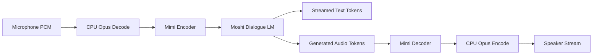
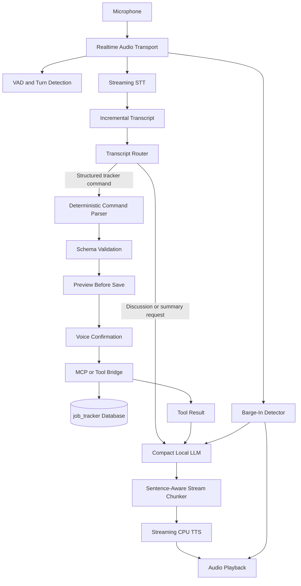

# Engineering Session Report

## 1. Session Objective

This session investigated whether Kyutai Labs’ Moshi voice-to-voice pipeline could serve as the runtime foundation for the local-first voice interface of `job_tracker`.

The initial motivation was product-driven rather than purely technical: Moshi’s interaction model appeared substantially more natural than a conventional stitched pipeline of:

```text
Speech-to-text → text LLM → text-to-speech
```

The session therefore explored **Direction 1**:

> Retain Moshi’s original full-duplex voice-to-voice architecture as faithfully as possible, then determine whether quantization, CPU offloading or selective model residency could make it practical on the available laptop hardware.

The work progressed through three stages:

1. Define a repository-level audit prompt for Codex.
    
2. Review the resulting audit findings.
    
3. Validate the critical hardware assumptions directly on the local Pop!_OS machine.
    

After Direction 1 was ruled out for the current hardware, the discussion shifted to a preliminary brainstorm for **Direction 2**:

> Use Moshi as an interaction-quality benchmark while evaluating an Unmute-inspired modular runtime that is more compatible with low-VRAM deployment and `job_tracker` tool integration.

---

## 2. Starting Context

### Existing project direction

`job_tracker` was already being designed as a local-first, voice-driven assistant for managing job applications conversationally.

The broader product goal was not merely dictation. The desired experience included:

- natural spoken commands,
    
- conversational interaction,
    
- low perceived latency,
    
- application creation and updates through voice,
    
- preview-before-save behaviour,
    
- confirmation before mutations,
    
- integration with job-tracking tools or an MCP-style server,
    
- local execution where practical,
    
- no automatic job applications or uncontrolled write actions.
    

Earlier work had already established a working speech-recognition baseline using faster-whisper. Existing measurements discussed in the session included:

```text
Model: faster-whisper medium
Device: CUDA
Dtype: float16
Beam size: 5
VAD: off
Initial prompt: enabled
Total evaluated audio: approximately 604.9 seconds
Total transcription time: approximately 33.7 seconds
Overall RTF: approximately 0.0557
Mean transcription time per file: approximately 1.09 seconds
```

The project therefore did not need to start from zero. It already had a usable ASR path and a deterministic command-oriented backend direction.

### Trigger for the session

The user expressed a strong preference for Moshi’s full voice-to-voice pipeline.

The appeal was that Moshi did not appear to behave like a visibly assembled sequence of independent services. Its tightly integrated conversational architecture offered a more native speech experience, including:

- incremental processing,
    
- streamed audio generation,
    
- natural conversational pacing,
    
- interruption-friendly interaction,
    
- full-duplex behaviour,
    
- reduced “voice chatbot” feel.
    

### Initial assumptions carried forward

Several possible assumptions needed verification:

1. Moshi might be usable locally after quantization.
    
2. CPU offloading might reduce GPU memory sufficiently.
    
3. Model loading and unloading between phases might allow the pipeline to fit into 4 GB VRAM.
    
4. Mimi codec offloading might materially reduce GPU pressure.
    
5. A smaller official Moshi checkpoint might exist.
    
6. Moshi could potentially expose a text stream suitable for external MCP integration.
    
7. NotebookLM-style or third-party claims about “Moshi working in 8 GB VRAM” might imply a path for a 4 GB laptop GPU.
    

The session deliberately avoided accepting these assumptions without repository-level evidence.

---

## 3. User Goal Behind the Work

The user’s goal was not simply to run an interesting speech model.

The larger product objective was to create a local-first conversational interface for `job_tracker` that feels natural enough for regular daily use.

A mechanical pipeline could technically support spoken commands, but it might feel like this:

```text
User finishes speaking
→ visible pause
→ transcription completes
→ LLM processes text
→ TTS begins
→ assistant speaks
```

The desired experience was closer to a realtime assistant:

```text
User speaks naturally
→ processing begins incrementally
→ assistant responds with low delay
→ user can interrupt
→ tool actions remain controlled and confirmable
```

This matters specifically for a job-tracking assistant because the expected interactions are frequent, lightweight and conversational:

```text
“Add Bootcoding as an AI Engineer internship application.”

“Mark Analytics Vidhya as low priority.”

“Show me which applications have stalled.”

“Add a note that I should ask for a referral before applying.”
```

For such commands, interaction friction matters. If each update feels slow or rigid, the assistant becomes less useful than manually editing a table.

The session therefore asked an important architectural question:

> Can Moshi’s native interaction model be preserved on the current hardware, or should its UX properties be recreated using modular components?

---

## 4. Obstacles Encountered

### Obstacle 1: Stock Moshi appeared attractive, but its true hardware cost was initially uncertain

**Symptom observed**

Moshi looked like a strong architectural fit for the desired voice UX, but it was unclear whether it could be deployed on the local RTX 3050 laptop GPU.

**Initially suspected**

It was plausible that quantization, CPU offloading or careful model residency management could make Moshi usable on limited hardware.

**Actual root cause**

The primary blocker was the dialogue LM weight residency requirement.

The Codex audit reported that:

- the Moshi dialogue model is a 7B temporal transformer,
    
- the Rust/CUDA q8 LM checkpoint is approximately 8.17 GB,
    
- the PyTorch bf16 checkpoint is approximately 15.2 GB,
    
- the official PyTorch guidance is approximately 24 GB GPU memory,
    
- the q8 dialogue LM alone exceeds the total capacity of a 4 GB GPU before accounting for Mimi, KV cache, activations, CUDA workspace and runtime overhead.
    

**Why the issue was non-obvious**

The pipeline contains several components, including Mimi, depformer, tokenizer logic, streaming caches and websocket/audio infrastructure. Without inspection, it was easy to assume the codec or runtime buffers might be the main source of pressure.

The audit instead showed that the dominant problem existed before detailed runtime tuning became relevant:

```text
GPU capacity: 4 GB
q8 LM checkpoint alone: approximately 8.17 GB
```

**Boundary involved**

Model performance and infrastructure.

**Resolution**

The native full-duplex Moshi deployment path was ruled out for the current 4 GB machine.

---

### Obstacle 2: CPU offloading seemed promising but did not solve the dominant bottleneck

**Symptom observed**

The Rust stack exposes a `use_cpu_for_mimi` option, making codec offloading appear to be a possible low-VRAM strategy.

**Initially suspected**

Moving Mimi encoding and decoding to CPU might free enough VRAM to keep Moshi’s LM resident.

**Actual root cause**

Mimi is not the dominant memory consumer. The dialogue LM remains too large.

Even after Mimi is moved to CPU:

```text
LM q8 weights alone > total GPU VRAM
```

**Why the issue was non-obvious**

CPU offloading is often useful in modular ML pipelines. However, it only helps when the offloaded component accounts for a meaningful portion of the memory budget.

Here, the repo-supported offload boundary exists, but the remaining GPU-resident model is still too large.

**Boundary involved**

Speech pipeline and infrastructure.

**Resolution**

Mimi CPU offloading was retained as a potentially useful optimization for larger GPUs, but rejected as a solution for the current machine.

---

### Obstacle 3: Model swapping conflicted with Moshi’s defining behaviour

**Symptom observed**

One possible optimization was to load and unload different components between listening and speaking phases.

**Initially suspected**

A turn-based swap strategy might allow the GPU to host only the currently active model.

**Actual root cause**

Moshi’s core design is not phase-separated in the same way as a traditional pipeline.

Its runtime is incremental and interleaved:

```text
Microphone PCM
→ Opus decode
→ Mimi encode
→ Moshi LM step
→ text token and audio-codebook prediction
→ Mimi decode
→ PCM playback stream
```

The full-duplex architecture expects encoder, LM, depformer and decoder availability during the live loop.

**Why the issue was non-obvious**

Model swapping is reasonable in a conventional architecture:

```text
Listen → STT → LLM → TTS → playback
```

However, Moshi’s appeal comes specifically from avoiding this discrete phase separation.

Aggressive swapping would gradually turn Moshi into a half-duplex system and remove much of the reason for selecting it.

**Boundary involved**

Speech pipeline and UX.

**Resolution**

Turn-boundary swapping was rejected as a faithful Moshi-preservation strategy. A custom degraded half-duplex adaptation remained theoretically possible but was considered low-value.

---

### Obstacle 4: Quantization support existed, but not all quantized paths were equally usable

**Symptom observed**

The repo contained quantization-related code and assets, which created uncertainty about whether a practical 4 GB configuration might exist.

**Initially suspected**

Any available q8 or int8 path might potentially allow local deployment.

**Actual root cause**

Quantization support differed by runtime:

|Runtime|Quantization status|Relevance to current machine|
|---|---|---|
|PyTorch bf16|Official standard path|Too large|
|PyTorch int8|Code exists, but appears experimental|Not a dependable low-VRAM path|
|Rust/Candle q8|Cleanest quantized Linux CUDA path|Still too large for 4 GB|
|MLX q4/q8|Relevant to Apple hardware|Not applicable to Pop!_OS with NVIDIA GPU|

**Why the issue was non-obvious**

A quantized checkpoint existing somewhere in a project does not imply:

- Linux CUDA support,
    
- stable deployment support,
    
- sufficient memory reduction,
    
- preservation of full-duplex operation,
    
- practical runtime performance.
    

**Boundary involved**

Infrastructure and model runtime compatibility.

**Resolution**

Rust/Candle q8 was identified as the only meaningful native experiment path, but the confirmed 4 GB VRAM capacity made even this path unsuitable.

---

### Obstacle 5: The exact GPU SKU needed direct verification

**Symptom observed**

The feasibility conclusion depended heavily on whether the RTX 3050 laptop GPU had 4 GB, 6 GB or 8 GB VRAM.

**Initially suspected**

The laptop likely had 4 GB VRAM, but the decision should not rely on memory.

**Actual root cause**

The local command confirmed:

```text
NVIDIA GeForce RTX 3050 Laptop GPU, 4096 MiB total VRAM, 3757 MiB free
```

**Why the issue was non-obvious**

Different laptop GPU variants exist, and a change from 4 GB to 8 GB would materially affect whether a Rust q8 experiment was worthwhile.

**Boundary involved**

Infrastructure.

**Resolution**

The GPU was verified directly using `nvidia-smi`. The 4 GB result closed the native Moshi deployment path.

---

### Obstacle 6: Available RAM also constrained CPU-heavy fallback ideas

**Symptom observed**

A possible fallback was to run the LM on CPU or depend more heavily on offloading.

**Initially suspected**

The machine’s 15 GiB RAM and 15 GiB swap might offer enough headroom.

**Actual root cause**

The actual memory state was:

```text
Total RAM: 15 GiB
Used RAM: 9.2 GiB
Available RAM: 6.1 GiB
Swap: 15 GiB, mostly unused
```

A q8 model in the 8 GB class would already consume more than the currently available RAM before accounting for the OS, browser, audio stack, backend, frontend and other runtime components.

Swap could increase capacity but not provide realtime inference quality.

**Why the issue was non-obvious**

RAM capacity and realtime usability are separate questions. A model may technically load through aggressive swapping while still being unusable for interactive voice processing.

**Boundary involved**

Infrastructure and UX.

**Resolution**

CPU LM execution was classified as theoretically possible to investigate but likely unsuitable for regular realtime use.

---

### Obstacle 7: Cached model assets were not present locally

**Symptom observed**

The safe profiling commands checked whether q8 weights or tokenizer assets were already cached.

**Initially suspected**

If the weights already existed locally, a lightweight load experiment might be justified.

**Actual root cause**

The command produced no output:

```bash
ls -lh "$HOME"/tmp/*moshiko* "$HOME"/tmp/*tokenizer* 2>/dev/null
```

No relevant cached files were found under the checked paths.

**Why the issue mattered**

Downloading large checkpoints merely to reproduce an expected out-of-memory failure would waste bandwidth and effort.

**Boundary involved**

Infrastructure.

**Resolution**

The session decided not to download large model assets solely to prove a mismatch already established by checkpoint size versus VRAM capacity.

---

### Obstacle 8: MCP integration was not native to Moshi

**Symptom observed**

The future voice assistant must invoke controlled `job_tracker` actions, but Moshi did not expose an existing MCP or function-calling framework.

**Initially suspected**

Tool integration might require intrusive modifications to the audio-generation loop.

**Actual root cause**

Moshi emits text tokens alongside audio output. This provides a possible external orchestration boundary.

A least-invasive design could be:

```text
Moshi streamed text tokens
→ external transcript accumulator
→ intent detection and validation
→ confirmation-before-save
→ MCP or equivalent job-tracker tool call
```

**Why the issue was non-obvious**

Speech generation and tool execution have different latency and blocking characteristics. Tool calls must not freeze or corrupt the realtime audio loop.

**Boundary involved**

Tool-calling contract, backend and speech pipeline.

**Resolution**

MCP integration was considered feasible through an external controller, but it did not affect the hardware feasibility conclusion.

---

### Obstacle 9: Unmute was also not a stock drop-in solution for 4 GB VRAM

**Symptom observed**

After ruling out Moshi, Unmute appeared to be a promising alternative because it uses modular speech components.

**Initially suspected**

Unmute might run directly on the laptop and provide a close approximation of Moshi.

**Actual root cause**

The discussed official deployment expectations indicated that stock Unmute also targets substantially larger GPU resources, including at least 16 GB VRAM for its default CUDA-oriented deployment.

**Why the issue was non-obvious**

“Modular” does not automatically mean “lightweight.”

The key value of Unmute is not that the full stock stack fits the current hardware. Its value is that the architecture can be decomposed and adapted.

**Boundary involved**

Infrastructure and architecture.

**Resolution**

Unmute was reframed as an architectural reference and audit target, not a directly deployable package.

---

## 5. Approaches Considered

### Approach 1: Run stock Moshi full-duplex locally

**What it was**

Use the original Moshi pipeline with minimal changes.

**Why it initially seemed reasonable**

It best matched the desired UX:

- native speech-to-speech interaction,
    
- low latency,
    
- full duplex,
    
- natural interruption behaviour,
    
- tightly integrated speech generation.
    

**Advantages**

- Highest fidelity to the desired interaction model.
    
- Minimal conceptual compromise.
    
- Avoids manually reconstructing conversational behaviour using separate components.
    

**Drawbacks**

- LM residency requirement exceeds the available GPU memory.
    
- PyTorch path is far beyond the 4 GB budget.
    
- q8 Rust path still exceeds the 4 GB budget before runtime overhead.
    

**Decision**

Rejected for the current laptop.

**Reason**

The memory mismatch is fundamental, not a minor optimization gap.

---

### Approach 2: Use Rust/Candle q8 Moshi

**What it was**

Use the cleanest quantized Linux CUDA path identified in the repository.

**Why it initially seemed reasonable**

The Rust q8 stack offered the most credible low-memory native Moshi configuration.

**Advantages**

- More appropriate than PyTorch bf16.
    
- Explicit quantized loading path.
    
- Potentially compatible with CPU Mimi offloading.
    

**Drawbacks**

- The q8 LM checkpoint alone is approximately 8.17 GB.
    
- GPU total capacity is 4096 MiB.
    
- Additional runtime memory would still be required.
    

**Decision**

Rejected for the confirmed 4 GB machine.

**Reason**

The LM cannot fit even before activation and cache costs are considered.

---

### Approach 3: Offload Mimi to CPU

**What it was**

Use the Rust stack’s `use_cpu_for_mimi` option.

**Why it initially seemed reasonable**

Mimi is an independent codec component used for streaming speech tokenization and decoding.

**Advantages**

- Native repo-supported offload boundary.
    
- Could reduce GPU pressure.
    
- Might help on a GPU close to the minimum required capacity.
    

**Drawbacks**

- Does not solve LM weight residency.
    
- CPU latency must still be measured.
    
- Insufficient for a 4 GB GPU.
    

**Decision**

Rejected as a solution for the current machine, retained as a useful optimization concept for larger hardware.

---

### Approach 4: Run the LM on CPU

**What it was**

Preserve the architecture while placing the main LM in CPU RAM.

**Why it initially seemed reasonable**

It might bypass the VRAM limit entirely.

**Advantages**

- Theoretically preserves more of the Moshi pipeline.
    
- Avoids requiring a larger GPU.
    

**Drawbacks**

- System RAM headroom is limited.
    
- The q8 LM remains large relative to available RAM.
    
- Swap would degrade realtime behaviour.
    
- CPU inference latency would likely undermine the daily assistant UX.
    

**Decision**

Deferred as a low-priority experiment, not adopted as the product path.

**Reason**

Technical loadability would not necessarily produce practical conversational responsiveness.

---

### Approach 5: Swap components between turns

**What it was**

Use GPU residency only for the currently active stage.

**Why it initially seemed reasonable**

This is a common technique in phase-separated ML workflows.

**Advantages**

- Potentially supports larger components on small GPUs.
    
- Could reduce steady-state VRAM usage.
    

**Drawbacks**

- Conflicts with Moshi’s interleaved full-duplex loop.
    
- Adds loading and transfer delays.
    
- Weakens interruption support.
    
- Produces a degraded half-duplex experience.
    
- Requires meaningful custom refactoring.
    

**Decision**

Rejected as a faithful Moshi strategy.

**Reason**

It sacrifices the exact property that made Moshi attractive.

---

### Approach 6: Build a custom half-duplex Moshi adaptation

**What it was**

Retain Moshi components but accept a turn-based listen-then-speak workflow.

**Why it initially seemed reasonable**

It could preserve some model assets while reducing simultaneous residency pressure.

**Advantages**

- Potentially salvages parts of the native stack.
    
- Could support more aggressive offloading or swapping.
    

**Drawbacks**

- Significant engineering work.
    
- Reduced interaction quality.
    
- Less maintainable than a purpose-built modular pipeline.
    
- Still resource-constrained.
    
- No longer a faithful expression of Moshi’s native UX.
    

**Decision**

Rejected as low-value for now.

**Reason**

The effort-to-benefit ratio was weaker than building a clean modular architecture.

---

### Approach 7: Treat Moshi as an interaction benchmark rather than a deployable runtime

**What it was**

Use Moshi to define the desired UX properties while selecting different runtime components.

**Why it seemed reasonable**

The hardware audit ruled out direct deployment, but the product requirements remained valid.

**Advantages**

- Retains the useful design target.
    
- Separates product goals from implementation constraints.
    
- Enables low-VRAM optimization.
    
- Supports MCP integration more cleanly.
    

**Drawbacks**

- Requires orchestration work.
    
- Exact native full duplex is unlikely.
    
- Quality depends on careful component selection and latency tuning.
    

**Decision**

Adopted.

**Reason**

It preserves the product intent while respecting hardware limits.

---

### Approach 8: Deploy stock Unmute

**What it was**

Use Kyutai’s Unmute pipeline directly as a Moshi-like modular alternative.

**Why it initially seemed reasonable**

Unmute exposes a modular flow:

```text
Streaming STT
→ text LLM
→ streaming TTS
```

**Advantages**

- Components can be independently replaced and profiled.
    
- Tool integration is easier than with a tightly fused speech model.
    
- Streaming orchestration is aligned with the desired UX.
    

**Drawbacks**

- Stock deployment still targets larger hardware.
    
- It is not an exact Moshi substitute.
    
- Default components may be too heavy for the laptop.
    
- It still requires adaptation for `job_tracker`.
    

**Decision**

Modified.

**Reason**

Unmute should be used as an architecture reference and audit target, not as a stock runtime.

---

### Approach 9: Build an Unmute-inspired `job_tracker` voice runtime

**What it was**

Adopt modular realtime orchestration while selecting lightweight components suited to the laptop.

Proposed shape:

```text
Realtime transport
+ turn detection
+ streaming STT
+ deterministic job-tracker parser
+ compact local LLM
+ streaming CPU TTS
+ MCP bridge
+ preview-before-save
```

**Why it seemed reasonable**

The current system already has useful foundations:

- tested faster-whisper baseline,
    
- narrow-domain command structure,
    
- deterministic action logic,
    
- controlled write semantics,
    
- local-first preference.
    

**Advantages**

- Compatible with low-VRAM experimentation.
    
- Each component can be benchmarked separately.
    
- Deterministic commands can bypass the LLM.
    
- MCP integration becomes cleaner.
    
- GPU budget can be allocated strategically.
    
- TTS can potentially move fully to CPU.
    

**Drawbacks**

- Requires architectural integration work.
    
- Exact Moshi full duplex will not be reproduced automatically.
    
- Turn detection, barge-in and TTS chunking need explicit design.
    
- Local LLM latency remains an open question.
    

**Decision**

Adopted as the direction for further design exploration.

---

## 6. Decisions Made

### Decision 1: Close the stock Moshi deployment path for the current machine

**Final decision**

Do not invest further effort in running native full-duplex Moshi on the RTX 3050 4 GB laptop GPU.

**Reasoning**

The q8 LM checkpoint alone exceeds total VRAM. Additional runtime memory would also be required.

**Rejected alternatives**

- PyTorch bf16,
    
- PyTorch experimental int8,
    
- Rust bf16,
    
- Rust q8,
    
- Mimi-only CPU offload,
    
- model swapping as a faithful full-duplex solution.
    

**Stability**

Stable unless hardware changes materially.

---

### Decision 2: Do not download large Moshi checkpoints solely to reproduce a predictable failure

**Final decision**

Avoid downloading q8 assets merely to prove that the model will not fit.

**Reasoning**

The checkpoint-size-to-VRAM mismatch is already decisive.

**Rejected alternative**

Run an expensive failure-to-load experiment.

**Stability**

Stable for the current 4 GB GPU.

---

### Decision 3: Retain Moshi as an interaction-quality benchmark

**Final decision**

Use Moshi as the UX reference, not the deployment target.

**Reasoning**

Its desirable properties remain relevant:

- incremental processing,
    
- streamed audio,
    
- low perceived latency,
    
- natural pacing,
    
- interruption support,
    
- reduced mechanical feel.
    

**Rejected alternative**

Discard Moshi entirely because it cannot run locally.

**Stability**

Likely stable architectural principle.

---

### Decision 4: Evaluate an Unmute-inspired modular pipeline

**Final decision**

Shift the next design phase toward a lean modular runtime inspired by Unmute.

**Reasoning**

A modular system allows independent selection, replacement, quantization, profiling and offloading of STT, LLM and TTS components.

**Rejected alternative**

Deploy stock Unmute unchanged.

**Stability**

Provisional direction, pending repo audit and benchmarks.

---

### Decision 5: Preserve deterministic handling for `job_tracker` mutations

**Final decision**

Do not route all user commands through a general-purpose LLM.

Use a deterministic fast path for structured job-tracker operations.

**Reasoning**

Many commands are narrow and schema-oriented:

```text
Add application
Update status
Change priority
Add note
Retrieve filtered applications
Trigger resume-tailoring workflow
```

These can be parsed, validated, previewed and confirmed before execution.

**Rejected alternative**

Generic LLM tool calling for every request.

**Stability**

Likely stable product and safety principle.

---

### Decision 6: Treat MCP as an external controlled execution boundary

**Final decision**

Use an external controller or bridge for MCP-style tool execution.

**Reasoning**

Tool calls should not block realtime audio processing. Write actions should pass through validation and confirmation.

**Rejected alternative**

Embed unconstrained synchronous tool calls directly inside the speech-generation loop.

**Stability**

Likely stable architectural principle.

---

### Decision 7: Prioritize a CPU TTS experiment

**Final decision**

The first component-level experiment after the Unmute brainstorm should compare the existing Coqui baseline against Kyutai Pocket TTS or another lightweight streaming CPU TTS option.

**Reasoning**

If TTS can run responsively on CPU, the entire 4 GB VRAM budget remains available for STT and possibly a compact local LLM.

**Rejected alternative**

Start with a heavyweight server-oriented TTS model.

**Stability**

Temporary experiment priority.

---

## 7. Architecture Evolution

### Previous design under consideration: native Moshi runtime

The initial desired architecture was tightly integrated:



This architecture was attractive because encoding, generation and decoding remain coupled in a live full-duplex loop.

### Limitation in the previous design

The main dialogue LM could not fit into the available GPU memory.

The problem was not merely tuning:

```text
Available hardware: 4096 MiB total VRAM
q8 LM checkpoint alone: approximately 8.17 GB
```

Mimi CPU offloading could not change this conclusion.

### Updated design direction: Moshi-inspired modular runtime

The revised direction separates interaction-quality goals from model-runtime implementation.



### New boundaries introduced

#### 1. Transcript router

Separates:

```text
deterministic tracker mutations
```

from:

```text
open-ended conversational reasoning
```

#### 2. Preview-before-save boundary

Structured write actions remain visible and confirmable before execution.

#### 3. MCP or tool bridge

Tool execution is treated as a controlled external boundary rather than a hidden side effect of speech generation.

#### 4. CPU TTS boundary

TTS is a candidate for complete GPU offloading.

#### 5. Barge-in controller

Interruption support becomes an explicit orchestration feature rather than an emergent property of a fused model.

---

## 8. Implementation Progress

### Completed during this session

No production code was changed.

No backend, frontend, parser, MCP server or speech runtime implementation was added or modified.

The concrete work completed was architectural investigation and local validation.

### Audit prompt created

A detailed Codex prompt was written to inspect:

- Moshi inference entry points,
    
- end-to-end runtime flow,
    
- model inventory,
    
- simultaneous VRAM residency,
    
- quantization support,
    
- CPU offloading feasibility,
    
- model swapping,
    
- smaller official variants,
    
- cache behaviour,
    
- MCP integration boundaries,
    
- profiling commands,
    
- final decision matrix.
    

### Codex audit reviewed

The audit identified:

- the dialogue LM as the primary VRAM bottleneck,
    
- Rust/Candle q8 as the cleanest quantized Linux CUDA path,
    
- `use_cpu_for_mimi` as the most realistic built-in offload option,
    
- bounded cache behaviour,
    
- lack of native MCP support,
    
- emitted text tokens as a possible integration boundary,
    
- lack of a smaller official drop-in full-duplex Moshi checkpoint.
    

### Local hardware verified

The user ran:

```bash
nvidia-smi --query-gpu=name,memory.total,memory.free,driver_version --format=csv,noheader
free -h
git -C /home/aditya/dev-work/moshi rev-parse HEAD
ls -lh "$HOME"/tmp/*moshiko* "$HOME"/tmp/*tokenizer* 2>/dev/null
```

### Planned, not implemented

The following remain future work:

- audit Unmute repo architecture in detail,
    
- benchmark CPU TTS options,
    
- compare Coqui against Pocket TTS,
    
- profile compact local LLM options,
    
- evaluate LiveKit versus adapting Unmute’s own realtime transport,
    
- test barge-in cancellation behaviour,
    
- benchmark Kyutai streaming STT against faster-whisper,
    
- define the MCP bridge contract,
    
- implement transcript routing,
    
- preserve preview-before-save semantics in the voice workflow.
    

---

## 9. Validation and Evidence

### Codex audit evidence

The audit was performed against:

```text
Repository: Kyutai Labs Moshi
Branch: main
Commit: e6a55d2722a65870ef52a6c9f6ecfc0e90f38362
```

The audit reported:

```text
Main LM configuration:
- 32 layers
- width 4096
- context 3000

Dialogue model:
- described as 7B temporal transformer

Published checkpoint sizes:
- Rust/Candle q8 LM: approximately 8.17 GB
- PyTorch bf16 LM: approximately 15.2 GB

PyTorch GPU guidance:
- approximately 24 GB GPU memory
```

### Local hardware evidence

Observed output:

```text
NVIDIA GeForce RTX 3050 Laptop GPU, 4096 MiB, 3757 MiB, 580.159.03
```

Interpretation:

```text
Total GPU VRAM: 4096 MiB
Free GPU VRAM at measurement time: 3757 MiB
```

Observed system RAM output:

```text
Mem:
total: 15 GiB
used: 9.2 GiB
free: 734 MiB
buff/cache: 7.7 GiB
available: 6.1 GiB

Swap:
total: 15 GiB
used: 68 KiB
free: 15 GiB
```

Observed repo commit:

```text
e6a55d2722a65870ef52a6c9f6ecfc0e90f38362
```

This matched the audited commit.

Observed cache check:

```bash
ls -lh "$HOME"/tmp/*moshiko* "$HOME"/tmp/*tokenizer* 2>/dev/null
```

The command produced no output.

Interpretation:

```text
No matching cached q8 weights or tokenizer assets were found in the checked paths.
```

### Decision evidence

The key comparison was:

```text
GPU total capacity: 4096 MiB
q8 LM checkpoint alone: approximately 8.17 GB
```

This was sufficient to rule out stock Rust/CUDA q8 Moshi on the current GPU before considering:

- Mimi weights,
    
- depformer,
    
- KV cache,
    
- activations,
    
- CUDA allocator overhead,
    
- temporary buffers.
    

### Existing ASR evidence carried into the brainstorming

The previously measured faster-whisper medium baseline remained relevant:

```text
Total audio: approximately 604.9 seconds
Transcription time: approximately 33.7 seconds
Overall RTF: approximately 0.0557
```

This supported the conclusion that the next phase does not need to discard the existing ASR work.

### Remaining validation gaps

The following were not measured in this session:

- Moshi live CUDA memory usage,
    
- Rust q8 allocation failure behaviour,
    
- CPU LM inference latency,
    
- Mimi CPU-offload latency,
    
- Pocket TTS time-to-first-audio,
    
- Coqui versus Pocket TTS comparison,
    
- Unmute stock runtime profiling,
    
- compact local LLM latency,
    
- combined STT and LLM GPU residency,
    
- semantic turn-detection quality,
    
- barge-in responsiveness.
    

These remain open experiments.

---

## 10. Lessons Learned

### 1. Attractive UX does not imply deployable runtime compatibility

Moshi aligned strongly with the desired user experience, but its hardware requirements were incompatible with the local-first constraint.

A good architecture decision must account for both:

```text
interaction quality
and
deployment reality
```

### 2. Quantization claims must be interpreted carefully

The existence of q8 support does not mean the model fits every low-memory device.

The correct sequence is:

```text
checkpoint size
→ runtime compatibility
→ static weight residency
→ cache and activation cost
→ actual profiling
```

### 3. Weight residency can invalidate an optimization direction before runtime tuning begins

There was no need to spend time tuning cache size, audio buffers or Mimi placement once the q8 LM alone exceeded GPU capacity by a wide margin.

### 4. CPU offloading only helps when the offloaded component is significant

Mimi CPU offloading is a legitimate optimization, but it targets the wrong part of the memory budget for a 4 GB GPU.

### 5. Architecture and product experience must be separated

The project does not need Moshi itself to pursue Moshi-like qualities.

The useful abstraction is:

```text
interaction-quality benchmark
≠ deployable implementation
```

### 6. Full duplex is not a free property in modular pipelines

If the project moves toward an Unmute-inspired stack, interruption handling, turn detection and incremental synthesis must become explicit architectural concerns.

### 7. A narrow-domain assistant should not force every action through an LLM

`job_tracker` benefits from deterministic parsing and validation.

This reduces:

- hallucination risk,
    
- latency,
    
- model dependency,
    
- tool-calling complexity,
    
- accidental writes.
    

### 8. Realtime audio loops and tool execution should remain loosely coupled

Tool calls can be slow or stateful. They should not block audio streaming.

An external controller is a cleaner boundary.

### 9. Local validation commands can close large design branches cheaply

The decisive commands were simple:

```bash
nvidia-smi
free -h
git rev-parse HEAD
ls -lh ...
```

Running them prevented unnecessary checkpoint downloads and implementation experiments.

### 10. “Modular” does not mean “runs on a small GPU”

Unmute remains valuable even if stock deployment is too heavy.

Its value lies in decomposability, not immediate compatibility.

---

## 11. Open Questions and Deferred Work

### Required next steps

#### 1. Audit Unmute repo architecture

Determine:

- component boundaries,
    
- default STT model,
    
- default TTS model,
    
- local LLM integration points,
    
- websocket flow,
    
- end-of-turn detection,
    
- response streaming,
    
- frontend/backend assumptions,
    
- VRAM residency,
    
- CPU fallback support,
    
- cancellation and interruption support,
    
- tool-call integration opportunities.
    

#### 2. Benchmark CPU TTS options

Compare at least:

```text
Existing Coqui baseline
versus
Pocket TTS candidate
```

Measure:

- time-to-first-audio,
    
- realtime factor,
    
- CPU usage,
    
- RAM usage,
    
- streaming behaviour,
    
- voice quality,
    
- chunk boundary smoothness,
    
- interruption cancellation latency.
    

#### 3. Define the lean runtime architecture

Decide whether the first prototype should use:

```text
LiveKit transport
+ faster-whisper
+ deterministic router
+ compact local LLM
+ CPU streaming TTS
+ MCP bridge
```

or whether useful parts of Unmute’s orchestration layer should be forked directly.

#### 4. Formalize MCP bridge semantics

Define:

- transcript-to-command routing,
    
- schema validation,
    
- preview generation,
    
- confirmation state,
    
- write execution,
    
- read-only queries,
    
- cancellation,
    
- error handling,
    
- tool result verbalization.
    

### Optional enhancements

#### 1. Benchmark Kyutai streaming STT

Treat it as a challenger to faster-whisper, not an automatic replacement.

Measure:

- WER,
    
- CER,
    
- short-command accuracy,
    
- company-name accuracy,
    
- partial transcript stability,
    
- pause handling,
    
- latency,
    
- VRAM usage.
    

#### 2. Explore GPU sharing

Possible future layout:

```text
GPU:
lighter STT
+ compact quantized local LLM

CPU:
streaming TTS
```

This requires careful residency and contention profiling.

#### 3. Add semantic turn detection

Avoid responding too early when the user pauses mid-command.

Example:

```text
“Add Analytics Vidhya as...”
[pause]
“...a low-priority application.”
```

#### 4. Add barge-in support

Target behaviour:

```text
User begins speaking while assistant is talking
→ stop audio playback
→ cancel current LLM generation
→ begin transcribing new utterance
```

### Explicitly rejected for now

#### 1. Stock full-duplex Moshi on RTX 3050 4 GB

Rejected due to fundamental LM residency mismatch.

#### 2. Downloading large q8 Moshi weights solely to demonstrate failure

Rejected as unnecessary.

#### 3. Aggressive model swapping as a way to preserve native Moshi behaviour

Rejected because it undermines the full-duplex architecture.

#### 4. Heavyweight TTS-first deployment

Rejected until lightweight CPU TTS options are profiled.

#### 5. Sending every operational command through a general-purpose LLM

Rejected in favour of deterministic parsing and validation.

### Questions requiring further investigation

1. Can Pocket TTS deliver sufficiently natural low-latency output on the laptop CPU?
    
2. Is faster-whisper medium still the best ASR baseline for a realtime system, or should a smaller model be used?
    
3. Can a compact local LLM run acceptably on CPU while STT occupies the GPU?
    
4. Can a lightweight STT and compact LLM coexist within 4 GB VRAM?
    
5. Should LiveKit remain the transport layer, or should Unmute’s websocket orchestration be adapted?
    
6. How close can a modular pipeline get to Moshi-like interruption behaviour?
    
7. What is the simplest reliable semantic turn detector for the project’s command patterns?
    
8. How should tool results be streamed back into speech without introducing awkward pauses?
    
9. Should open-ended reasoning and deterministic tool execution use separate LLM prompts or separate runtime paths?
    
10. What latency budget is acceptable for daily-use `job_tracker` interactions?
    

---

## 12. Significance in the Overall Project Journey

This session was primarily:

```text
an experiment that ruled out an approach
+
a foundational architecture-selection session
```

It prevented the project from spending significant time attempting to force an unsuitable model onto constrained hardware.

The outcome was not merely:

```text
“Moshi does not fit.”
```

The more useful conclusion was:

```text
Moshi should define the desired interaction quality,
but not the local runtime implementation.
```

This moved the project toward a clearer architecture:

- local-first,
    
- low-VRAM aware,
    
- modular,
    
- deterministic for write actions,
    
- MCP-compatible,
    
- stream-oriented,
    
- explicitly designed for barge-in and turn detection.
    

The session also established an engineering pattern that should be reused:

> Before implementing a sophisticated optimization strategy, identify the dominant resource constraint and validate it against the actual machine.

---

## 13. Compact Timeline Entry

**Milestone:** Evaluated Moshi as the native voice-to-voice runtime and established the next architecture direction.

**Problem:** The project needed a natural, low-latency conversational speech interface, and Moshi appeared substantially better aligned with that UX than a conventional STT → LLM → TTS pipeline.

**Key obstacle:** The confirmed RTX 3050 laptop GPU has only 4096 MiB VRAM, while the Rust/CUDA q8 Moshi dialogue LM checkpoint alone is approximately 8.17 GB before codec weights, caches, activations and CUDA overhead.

**Decision:** Reject stock full-duplex Moshi deployment on the current laptop. Retain Moshi as the interaction-quality benchmark. Begin evaluating an Unmute-inspired modular runtime with streaming STT, deterministic command routing, compact local reasoning, CPU streaming TTS and an external MCP bridge.

**Outcome:** A costly implementation path was ruled out through repository-level audit and local hardware verification. The project gained a clearer low-VRAM voice architecture direction.

**Next step:** Audit Unmute’s orchestration design and benchmark lightweight CPU TTS options, starting with a Coqui-versus-Pocket-TTS comparison.