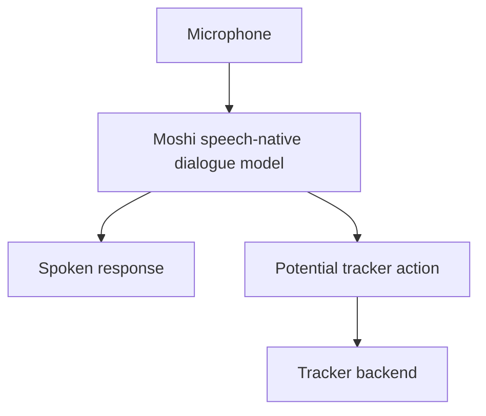
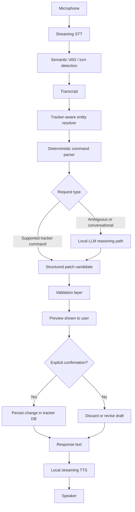

# Engineering Session Report

## 1. Session Objective

This session evaluated whether a speech-native model such as **Moshi** could become the conversational voice layer for the local-first `job_tracker` assistant.

The discussion began with a hardware feasibility question: Moshi appeared to require approximately 24 GB of VRAM in its standard form, while the available development machine had a laptop RTX 3050 with 4 GB VRAM. The session then expanded into a broader architectural investigation:

- whether optimized or quantized Moshi runtimes could reduce the hardware requirement;
    
- whether Moshi could run locally without materially reducing conversational quality;
    
- whether a modular alternative such as `kyutai-labs/unmute` would better fit the project;
    
- whether fine-tuning would meaningfully improve a job-tracking assistant;
    
- which parts of the speech pipeline should remain generic and which parts should become domain-aware.
    

The final direction was not to abandon Moshi, but to separate two goals:

1. **Product track:** build a reliable local voice assistant using a modular pipeline that fits the current machine.
    
2. **Research track:** continue investigating optimized Moshi deployment as an experimental path for more natural full-duplex interaction.
    

---

## 2. Starting Context

### Existing project direction

The `job_tracker` project was already intended to become a local-first, conversational assistant for managing job applications through voice. Its broader architecture had already evolved around safe, deterministic tracker updates rather than unrestricted LLM behavior.

The assistant was expected to support interactions such as:

```text
"Add an application for Bootcoding Private Limited."
"Mark Supportsoft Technologies as rejected."
"Set the priority of the Rockwell application to high."
```

The project already had a strong backend principle:

```text
Parse request
→ generate structured patch
→ show preview
→ require explicit confirmation
→ save to tracker database
```

The tracker table remained the source of truth. The voice layer was not supposed to silently mutate application data.

### Existing speech evaluation context

A prior Faster-Whisper evaluation had already shown that raw transcription speed was not the primary bottleneck:

```text
Total audio duration:        ~604.9 seconds
Total transcription time:    ~33.7 seconds
Overall real-time factor:    ~0.056
```

However, entity recognition remained imperfect. Examples discussed earlier in the project included errors such as:

```text
Expected:
Bootcoding Private Limited

Observed transcript:
boot code in private limit
```

and:

```text
Expected:
AI Engineer role

Observed transcript:
engineer room
```

This created interest in more advanced speech-native systems and streaming voice-agent architectures.

### Trigger for this session

The user was considering using Moshi AI but identified an apparent hardware barrier:

```text
Standard Moshi inference:
~24 GB VRAM requirement

Possible quantized Moshi inference:
claimed ~8 GB VRAM requirement

Available machine:
RTX 3050 laptop GPU with 4 GB VRAM
```

There was uncertainty around whether the 8 GB claim was reliable and whether any optimized route existed that preserved quality.

### Initial assumptions carried forward

At the beginning of the session, several assumptions were implicitly in play:

1. Moshi might be desirable because it could provide a more natural speech-to-speech experience than a cascaded pipeline.
    
2. Quantization might reduce Moshi to a consumer-GPU-compatible footprint.
    
3. A narrow job-tracking domain might make fine-tuning attractive.
    
4. The current modular pipeline might be a fallback rather than the preferred long-term design.
    

The session refined all four assumptions.

---

## 3. User Goal Behind the Work

The user did not want to stop at a conservative conclusion such as:

> “Your GPU is too small, so Moshi is impossible.”

The deeper goal was to explore whether a practical engineering workaround existed.

This mattered because the intended product experience was not merely a command parser with a microphone. The ambition was to create a natural, low-friction assistant that could:

- listen continuously or semi-continuously;
    
- understand pauses correctly;
    
- handle interruptions;
    
- respond with low perceived latency;
    
- update job applications safely;
    
- remain local-first;
    
- avoid recurring cloud inference costs;
    
- run on consumer hardware where possible.
    

The user explicitly pushed back against treating current hardware limitations as a final answer. This shifted the session from basic feasibility checking toward architectural problem-solving.

---

## 4. Obstacles Encountered

## 4.1 Moshi inference footprint exceeded available VRAM

### Symptom observed

The available machine had only 4 GB VRAM, while Moshi appeared to require much more memory:

```text
Standard BF16 Moshi:
approximately 24 GB VRAM

Quantized Moshi claims:
approximately 8 GB or more
```

### Initially suspected

The initial suspicion was that quantized versions might make Moshi usable on the current machine.

### Actual root cause

The issue was broader than checkpoint size.

The total inference-time memory footprint includes:

```text
model weights
+ runtime buffers
+ activations
+ CUDA allocations
+ conversational state
+ KV cache or equivalent temporal state
+ Mimi codec state
+ auxiliary model components
```

A quantized checkpoint fitting within a certain file size does not guarantee that the complete runtime fits within the same amount of GPU memory.

### Why the issue was non-obvious

A simple estimate such as:

```text
7B parameters × 4 bits ≈ 3.5 GB
```

makes a 4 GB GPU appear nearly sufficient.

However, this ignores the memory required by the active inference graph and streaming speech components. Moshi is not only a text LLM. It processes and generates audio continuously.

### Boundary involved

**Model performance / infrastructure**

### Resolution or postponement

The issue was not resolved on the current hardware. It was reframed precisely as:

> **Inference-time VRAM bottleneck:** the Moshi runtime footprint exceeds the available GPU memory capacity.

The session identified optimized paths worth testing on higher-memory hardware but did not establish a validated 4 GB full-Moshi deployment.

---

## 4.2 Confusion between checkpoint quantization and deployable VRAM requirement

### Symptom observed

A claim had been encountered that quantized Moshi might require only 8 GB VRAM.

### Initially suspected

It was initially tempting to treat the 8 GB number as a dependable deployment requirement.

### Actual root cause

The 8 GB claim appeared to refer to optimized or community-supported inference paths rather than a universal guarantee. The session distinguished:

```text
checkpoint memory footprint
≠
peak runtime VRAM usage
≠
sustained real-time feasibility
```

### Why the issue was non-obvious

Model distribution pages, community ports and runtime benchmarks may describe different conditions:

- Q8 versus Q4 quantization;
    
- official versus unofficial backends;
    
- laptop GPU versus desktop GPU;
    
- model load success versus sustained real-time generation;
    
- CPU offload versus GPU-only inference;
    
- shortened context versus full conversational quality.
    

### Boundary involved

**Model performance / infrastructure**

### Resolution or postponement

The session rejected the simplistic claim that “8 GB VRAM is enough” as a guaranteed answer.

A more cautious conclusion was adopted:

- official BF16 Moshi should be treated as a 24 GB-class deployment;
    
- official Q8 paths reduce memory but remain too large for 4 GB;
    
- community Q4 paths may work around the 8 GB range on some GPUs;
    
- 4 GB full Moshi remains unvalidated.
    

---

## 4.3 Runtime optimization and model compression were initially conflated

### Symptom observed

The discussion asked whether an “optimized setup” could solve the VRAM issue without compromising quality.

### Initially suspected

It was possible to interpret optimization as a single category where faster inference, lower memory use and unchanged model quality could all be achieved simultaneously.

### Actual root cause

The session separated two classes of optimization.

#### Quality-preserving runtime optimization

Examples:

```text
compiled C++ execution
optimized CUDA kernels
reused attention-mask lookups
reduced redundant computation
faster model loading
backend-specific memory management
```

These can improve efficiency without intentionally altering model weights.

#### Model compression

Examples:

```text
Q8 quantization
Q4 quantization
Q3 or Q2 quantization
context reduction
component removal
```

These reduce memory pressure but may alter output quality or long-conversation behavior.

### Why the issue was non-obvious

Both categories are often described loosely as “optimization,” even though their product implications differ substantially.

### Boundary involved

**Model performance / infrastructure**

### Resolution or postponement

The distinction became an explicit architectural principle:

> Quality-preserving runtime optimizations should be pursued first. Compression should be evaluated separately with perceptual and workflow-level benchmarks.

---

## 4.4 Full Moshi was not automatically the best fit for a tracker assistant

### Symptom observed

Moshi appeared attractive because it offered speech-native interaction and natural conversational behavior.

### Initially suspected

A speech-native model could potentially replace the entire voice-agent pipeline.

### Actual root cause

The assistant’s core responsibility was not open-ended conversation. It was safe job-tracker manipulation.

The project required:

```text
structured intent extraction
schema-aware updates
preview-before-save
explicit confirmation
database consistency
deterministic behavior
```

A speech-native model alone would not remove the need for a trusted backend tool boundary.

### Why the issue was non-obvious

A more capable conversational model can feel like an architectural simplification. However, the product’s reliability requirements demand separation between:

```text
natural voice interaction
and
authorized tracker mutation
```

### Boundary involved

**Speech pipeline / backend / tool-calling contract / UX**

### Resolution or postponement

Moshi was repositioned as a possible conversational shell rather than the sole reasoning and execution layer.

---

## 4.5 `unmute` was useful architecturally but too heavy as a complete deployment

### Symptom observed

The `kyutai-labs/unmute` repository appeared highly relevant because it implemented a streaming conversational voice pipeline.

### Initially suspected

The full repository might be directly deployable as the project’s voice assistant.

### Actual root cause

`unmute` was modular but still expected a relatively large GPU for its default local stack.

The discussed approximate component footprint was:

|Component|Approximate VRAM|
|---|--:|
|Kyutai streaming STT|~2.5 GB|
|Kyutai streaming TTS|~5.3 GB|
|Local LLM service|~6.1 GB|
|Combined stack|~13.9 GB plus overhead|

### Why the issue was non-obvious

A modular system feels lighter than a monolithic speech model, but running all components concurrently on one GPU still creates significant memory pressure.

### Boundary involved

**Infrastructure / speech pipeline**

### Resolution or postponement

The full `unmute` stack was not adopted as-is.

Instead, it was treated as:

```text
reference implementation
+
component source
+
interaction-design reference
```

Useful parts could be selectively adopted.

---

## 4.6 The speech pipeline needed dynamic domain awareness, not only static fine-tuning

### Symptom observed

Company names and job roles could be misrecognized by generic ASR.

### Initially suspected

Fine-tuning the speech model might be the primary solution.

### Actual root cause

The domain contains both recurring and continuously changing entities:

```text
existing tracked companies
new startup names
role titles
application stages
custom notes
```

Static fine-tuning can improve recurring acoustic patterns but cannot anticipate every future company name.

### Why the issue was non-obvious

The application domain is narrow, but its entity vocabulary is dynamic. The domain is constrained semantically while remaining open-ended lexically.

### Boundary involved

**Speech pipeline / backend / database**

### Resolution or postponement

The preferred sequence became:

```text
ASR prompt vocabulary
→ tracker-aware entity correction
→ confidence-based clarification
→ workflow-level evaluation
→ fine-tuning only for recurring residual errors
```

---

## 4.7 Fine-tuning the wrong layer could create unnecessary cost

### Symptom observed

The user asked whether fine-tuning would be beneficial because the assistant’s main job was job tracking.

### Initially suspected

A narrow use case might justify fine-tuning the complete model stack.

### Actual root cause

The pipeline contained multiple independently optimizable layers:

```text
speech recognition
intent extraction
tracker operation validation
dialogue generation
speech synthesis
```

Each layer had different error modes and different expected benefits from fine-tuning.

### Why the issue was non-obvious

“Fine-tune the assistant” sounds like a single task, but it obscures where the actual errors originate.

### Boundary involved

**Speech pipeline / LLM prompt / backend / model performance**

### Resolution or postponement

The session concluded:

- **ASR adaptation** may be useful after simpler interventions.
    
- **Intent-parser fine-tuning** is not currently necessary.
    
- **Moshi fine-tuning** is premature and impractical under current hardware constraints.
    
- **TTS fine-tuning** is optional polish, not a core product priority.
    

---

## 5. Approaches Considered

## 5.1 Run standard Moshi locally on the RTX 3050

### What the approach was

Run the official Moshi implementation directly on the laptop GPU.

### Why it initially seemed reasonable

The assistant would gain a speech-native interaction model with natural conversational flow.

### Advantages

- unified speech-to-speech model;
    
- potentially natural interruption handling;
    
- lower conceptual pipeline complexity;
    
- interesting research value.
    

### Drawbacks or risks

- BF16 inference appeared to require approximately 24 GB VRAM;
    
- current GPU had only 4 GB VRAM;
    
- real-time audio generation imposes stricter performance requirements than text generation;
    
- even model loading was unlikely to succeed.
    

### Decision

**Rejected for current hardware.**

### Reason

The gap between available and required VRAM was too large.

---

## 5.2 Run official Rust/Candle Q8 Moshi

### What the approach was

Use the optimized official Rust/Candle backend with quantized Q8 checkpoints.

### Why it initially seemed reasonable

Q8 reduces memory use while aiming to preserve most model quality.

### Advantages

- official implementation path;
    
- production-oriented runtime;
    
- lower memory than BF16;
    
- likely safer quality tier than Q4 or lower-bit compression.
    

### Drawbacks or risks

- still too large for 4 GB VRAM;
    
- runtime overhead remains significant;
    
- “8 GB checkpoint” does not imply “8 GB GPU deployment”;
    
- exact minimum practical VRAM remained uncertain.
    

### Decision

**Deferred as a benchmark for higher-memory hardware.**

### Reason

Useful as a research baseline, but not a solution for the current laptop.

---

## 5.3 Use official MLX Q4 Moshi

### What the approach was

Use an official four-bit Moshi release through Apple MLX.

### Why it initially seemed reasonable

An official Q4 release suggests that aggressive quantization may still preserve acceptable user experience.

### Advantages

- official lower-bit model;
    
- practical evidence that Q4 Moshi is a meaningful deployment direction;
    
- lower memory footprint than BF16 or Q8.
    

### Drawbacks or risks

- MLX is intended for Apple Silicon;
    
- current machine is Linux with an Nvidia GPU;
    
- Apple unified memory behavior does not map directly to dedicated 4 GB laptop VRAM.
    

### Decision

**Rejected for the current machine.**

### Reason

The backend and hardware platform did not match.

---

## 5.4 Use `moshi.cpp` Q4_K

### What the approach was

Use an unofficial C++ and GGML-based Moshi port with Q4_K quantization.

### Why it initially seemed reasonable

This was the first identified path specifically aimed at lower-memory consumer hardware.

### Advantages

- Linux and Nvidia relevance;
    
- C++ and GGML-style runtime optimization;
    
- Q4_K quantization;
    
- potential full speech-to-speech operation around the 8 GB VRAM class;
    
- potentially reusable runtime optimizations;
    
- strong experimentation value.
    

### Drawbacks or risks

- unofficial community runtime;
    
- 4 GB operation remained unvalidated;
    
- Q4 quantization may affect model quality;
    
- long-conversation quality and stability require benchmarking;
    
- product integration maturity was uncertain.
    

### Decision

**Adopted as a research spike, not as the production baseline.**

### Reason

It was the most promising Moshi optimization direction but did not yet solve the 4 GB constraint.

---

## 5.5 CPU-only Moshi execution

### What the approach was

Run Moshi using CPU system memory rather than GPU VRAM.

### Why it initially seemed reasonable

System RAM could potentially hold the model even when GPU VRAM could not.

### Advantages

- fully local;
    
- avoids CUDA OOM;
    
- potentially useful for verifying model loading and inspecting behavior.
    

### Drawbacks or risks

- real-time generation likely degrades severely;
    
- conversational audio lag may accumulate;
    
- distorted or unusable interaction is possible;
    
- success at loading does not imply usable speech interaction.
    

### Decision

**Deferred as a diagnostic experiment only.**

### Reason

The product requires real-time conversational behavior.

---

## 5.6 CPU-GPU hybrid offloading

### What the approach was

Store some model layers or state in system RAM while offloading selected computation to the GPU.

### Why it initially seemed reasonable

This pattern works for text LLMs on memory-constrained consumer systems.

### Advantages

- potentially preserves higher-bit weights;
    
- may reduce GPU memory pressure;
    
- could enable local inference on smaller GPUs;
    
- interesting engineering investigation.
    

### Drawbacks or risks

- no validated ready-made Moshi setup was identified;
    
- transfer latency may break real-time speech generation;
    
- full-duplex audio generation is less tolerant of delay than text chat;
    
- implementation complexity may be substantial.
    

### Decision

**Deferred for investigation.**

### Reason

Technically plausible but not yet a dependable deployment path.

---

## 5.7 Acquire or use a local higher-memory GPU server

### What the approach was

Run Moshi on a separate LAN-connected machine with a 24 GB-class GPU while using the laptop as the client.

### Why it initially seemed reasonable

This preserves local-first privacy and avoids recurring cloud cost while meeting the model’s memory needs.

### Advantages

- BF16-quality model possible;
    
- local network deployment;
    
- laptop remains lightweight;
    
- no dependency on cloud inference;
    
- preserves Moshi as a full speech-native system.
    

### Drawbacks or risks

- additional hardware cost;
    
- separate machine maintenance;
    
- network latency, although likely manageable on LAN;
    
- not an immediate solution using existing hardware.
    

### Decision

**Accepted as the clearest zero-model-quality-compromise route.**

### Reason

The current laptop cannot provide the required VRAM. Hardware separation is the cleanest solution if original Moshi quality is mandatory.

---

## 5.8 Use `unmute` as the production architecture

### What the approach was

Adopt `kyutai-labs/unmute`, which follows a modular voice-agent design:

```text
Streaming STT
→ text LLM
→ streaming TTS
```

### Why it initially seemed reasonable

It aligned strongly with the project’s reliability requirements and provided working references for streaming, interruptions and semantic pause handling.

### Advantages

- interchangeable components;
    
- transcript visibility;
    
- easier debugging;
    
- tool-calling wrapper can be added;
    
- deterministic parser remains in control;
    
- streaming-first design;
    
- semantic VAD support;
    
- interruption-handling reference;
    
- easier adaptation to current hardware.
    

### Drawbacks or risks

- full default deployment still too large for 4 GB VRAM;
    
- local LLM, STT and TTS cannot all run concurrently on the laptop GPU as configured;
    
- not a drop-in application for `job_tracker`;
    
- tool calling is not built in;
    
- some components need replacement.
    

### Decision

**Adopted as an architectural reference, not as a full dependency.**

### Reason

Its modular boundaries match the product better than a monolithic model, but the default stack must be selectively adapted.

---

## 5.9 Use Kyutai streaming STT independently

### What the approach was

Run only the Kyutai STT component from the Unmute ecosystem on the GPU.

### Why it initially seemed reasonable

Its approximate VRAM requirement appeared compatible with the 4 GB laptop GPU.

### Advantages

- streaming-first behavior;
    
- semantic VAD;
    
- approximately 0.5-second algorithmic delay as discussed;
    
- potential interruption detection;
    
- likely fit around a ~2.5 GB VRAM footprint;
    
- suitable for direct benchmarking against Faster-Whisper.
    

### Drawbacks or risks

- actual entity accuracy on job-tracker vocabulary remained untested;
    
- English and French support were emphasized, while Marathi or Hinglish behavior remained uncertain;
    
- dynamic vocabulary injection still required custom work.
    

### Decision

**Adopted as the most useful immediate experiment.**

### Reason

It could improve voice-agent UX without requiring a full architecture replacement.

---

## 5.10 Use a local CPU-friendly TTS alternative

### What the approach was

Use Coqui TTS or Pocket TTS instead of the heavier Kyutai streaming TTS model.

### Why it initially seemed reasonable

The GPU should be reserved for the most valuable latency-sensitive component, likely STT.

### Advantages

- lower VRAM pressure;
    
- fully local deployment;
    
- modular replacement;
    
- compatible with the Unmute-inspired architecture.
    

### Drawbacks or risks

- voice quality and time-to-first-audio require measurement;
    
- interruption cancellation must be implemented correctly;
    
- speech streaming behavior may differ.
    

### Decision

**Adopted as the practical product direction.**

### Reason

The default Kyutai TTS footprint was too large for the current GPU.

---

## 5.11 Fine-tune the full Moshi model for job tracking

### What the approach was

Specialize Moshi into a job-tracking assistant.

### Why it initially seemed reasonable

The task domain is narrow and repetitive.

### Advantages

- potentially more domain-aware responses;
    
- interesting research direction;
    
- could specialize conversational behavior.
    

### Drawbacks or risks

- inference itself was already blocked by VRAM;
    
- training requires more compute and memory;
    
- tool safety still requires backend validation;
    
- dynamic company vocabulary changes over time;
    
- full-model fine-tuning does not remove the need for deterministic tracker operations.
    

### Decision

**Rejected for the current phase.**

### Reason

It targets the wrong layer too early.

---

## 5.12 Fine-tune or adapt ASR after simpler corrections

### What the approach was

Use speech-model adaptation to reduce repeated transcription failures for job-specific vocabulary.

### Why it initially seemed reasonable

ASR entity errors were a known practical problem.

### Advantages

- directly targets observed failures;
    
- may improve recurring acoustic patterns;
    
- useful for domain-specific role and company terminology;
    
- can be evaluated quantitatively.
    

### Drawbacks or risks

- training dataset was currently too small;
    
- future company names remain open-ended;
    
- static adaptation cannot replace runtime entity resolution;
    
- fine-tuning should not be attempted before error patterns are measured.
    

### Decision

**Accepted as a later escalation step.**

### Reason

It is valuable only after prompting, dynamic correction and evaluation reveal persistent systematic errors.

---

## 6. Decisions Made

## 6.1 Define the current problem as an inference-time VRAM bottleneck

### Final decision

Use precise terminology:

> **The Moshi runtime footprint exceeds the available GPU memory during inference.**

Alternative shorter terms:

```text
VRAM constraint
GPU memory bottleneck
inference-time CUDA OOM risk
memory-bound deployment constraint
```

### Reasoning

The issue is not primarily raw compute. The first blocker is memory capacity.

### Rejected alternatives

Avoid describing the problem merely as:

```text
"Moshi is too slow"
or
"The laptop is weak"
```

Those descriptions are incomplete.

### Stability

**Stable architectural framing.**

---

## 6.2 Do not force full Moshi onto the 4 GB laptop GPU

### Final decision

Treat full local Moshi deployment on the current GPU as unvalidated and currently impractical.

### Reasoning

Even Q4 raw-weight estimates leave insufficient headroom for runtime state and streaming components.

### Rejected alternatives

- blind expectation that 4-bit weights alone solve the problem;
    
- disk swap as a practical solution;
    
- assuming successful loading equals usable real-time interaction.
    

### Stability

**Stable for the current hardware.**

---

## 6.3 Preserve Moshi as a research track

### Final decision

Do not abandon Moshi. Investigate `moshi.cpp`, official Q8 paths and higher-memory local deployment separately.

### Reasoning

Moshi still offers valuable full-duplex conversational qualities:

```text
natural pauses
overlapping speech handling
interruptibility
streaming-first interaction
low perceived latency
```

### Rejected alternatives

- discarding Moshi entirely;
    
- making Moshi the immediate production dependency.
    

### Stability

**Temporary dual-track decision.**

---

## 6.4 Use an Unmute-inspired modular pipeline for the product

### Final decision

Build the production assistant around modular components:

```text
Streaming STT
→ turn detection / semantic VAD
→ domain-aware parser
→ safe tracker tools
→ local LLM only when needed
→ local TTS
```

### Reasoning

This preserves reliability, debuggability and hardware flexibility.

### Rejected alternatives

- monolithic end-to-end speech model as the only control layer;
    
- full Unmute stack deployed unchanged;
    
- GPU-heavy local LLM and TTS running concurrently with STT on 4 GB VRAM.
    

### Stability

**Intended stable architectural principle.**

---

## 6.5 Separate natural conversation from trusted tracker mutation

### Final decision

Voice interaction and database updates remain different layers.

### Reasoning

The system must never silently treat generated dialogue as an authorized state mutation.

### Rejected alternatives

- allowing a speech model to mutate tracker data directly;
    
- relying only on open-ended LLM reasoning for structured updates.
    

### Stability

**Stable product safety principle.**

---

## 6.6 Prioritize dynamic entity resolution before ASR fine-tuning

### Final decision

Implement an inference-time tracker-aware entity layer first.

Preferred flow:

```text
ASR transcript
→ exact normalization
→ tracker database lookup
→ fuzzy or phonetic candidate generation
→ confidence threshold
→ confirmation if uncertain
```

### Reasoning

The domain contains new company names continuously. Static fine-tuning cannot encode every future entity.

### Rejected alternatives

- fine-tune first;
    
- rigid autocorrection without confirmation;
    
- assume generic ASR must always produce the exact company spelling.
    

### Stability

**Intended stable architectural principle.**

---

## 6.7 Fine-tune selectively, not globally

### Final decision

Treat fine-tuning as a layer-specific escalation strategy.

Priority:

```text
1. ASR adaptation if repeated residual acoustic errors remain
2. Dialogue-model tuning only if prompt/tool schemas prove insufficient
3. TTS customization only as later polish
4. Full Moshi fine-tuning deferred
```

### Reasoning

Fine-tuning is valuable only when it targets an observed bottleneck.

### Rejected alternatives

- fine-tuning the entire assistant merely because the domain is narrow;
    
- tuning TTS before correctness is solved;
    
- tuning Moshi before inference feasibility is established.
    

### Stability

**Stable optimization principle.**

---

## 7. Architecture Evolution

## 7.1 Previous design under consideration

The session initially explored a Moshi-centric architecture:



### Limitation

This architecture was attractive for voice naturalness but raised two problems:

1. full Moshi could not fit on the current 4 GB GPU;
    
2. tracker mutations still required a deterministic safety boundary.
    

---

## 7.2 Updated architecture direction

The production architecture shifted toward an Unmute-inspired modular pipeline:



---

## 7.3 Data flow before and after

### Earlier conceptual flow

```text
Speech
→ Moshi
→ spoken response
→ possible tracker behavior
```

### Updated production flow

```text
Speech
→ streaming ASR
→ semantic pause detection
→ dynamic entity resolution
→ deterministic tracker command parser
→ structured preview
→ confirmation
→ database save
→ streamed spoken response
```

### Updated research flow

```text
Laptop client
→ Moshi runtime experiment
→ compare BF16 / Q8 / Q4_K
→ measure VRAM, latency, stability and conversational quality
```

---

## 7.4 New boundaries introduced or clarified

### Voice interaction boundary

Responsible for:

```text
audio capture
streaming
turn detection
interruptions
spoken output
```

### Domain intelligence boundary

Responsible for:

```text
company-name normalization
role-title normalization
tracker context lookup
ambiguity handling
confidence-based confirmation
```

### Tracker mutation boundary

Responsible for:

```text
allowed operations
schema validation
draft patch generation
preview-before-save
explicit confirmation
database write
```

### Optional LLM boundary

Responsible for:

```text
ambiguity resolution
natural-language explanation
summarization
higher-level reasoning
```

It should not automatically bypass the tracker mutation contract.

---

## 8. Implementation Progress

## Completed during this session

No source-code changes were made during this discussion.

No repository files, APIs, schemas, tests or frontend components were modified.

The session was an architectural evaluation and planning session.

### Completed conceptual work

The following design work was completed:

- identified the hardware limitation as an inference-time VRAM bottleneck;
    
- separated model footprint from checkpoint file size;
    
- distinguished quality-preserving runtime optimization from lossy compression;
    
- identified `moshi.cpp` as a promising Moshi research runtime;
    
- audited `kyutai-labs/unmute` for the `job_tracker` use case;
    
- concluded that full Unmute deployment was too heavy for the current GPU;
    
- identified Kyutai streaming STT as the most relevant independently testable component;
    
- established that tool safety remains a backend responsibility;
    
- prioritized tracker-aware entity resolution ahead of fine-tuning;
    
- defined a dual product-track and research-track strategy.
    

---

## Planned implementation

### Product-track experiments

1. Benchmark Kyutai streaming STT independently on the RTX 3050.
    
2. Compare it against the existing Faster-Whisper baseline.
    
3. Add semantic VAD or equivalent turn-completion logic.
    
4. Implement tracker-aware company and role entity resolution.
    
5. Add confidence-based confirmation when entity matching is uncertain.
    
6. Benchmark CPU-friendly TTS alternatives such as Coqui or Pocket TTS.
    
7. Preserve preview-before-save behavior through the voice workflow.
    

### Research-track experiments

1. Install and benchmark `moshi.cpp`.
    
2. Test Q4_K model loading on accessible hardware.
    
3. Record peak VRAM and system RAM.
    
4. Measure sustained speech-to-speech FPS.
    
5. Test long-conversation stability.
    
6. Compare perceptual speech quality against higher-precision runtimes.
    
7. Investigate whether CPU-GPU hybrid offloading is possible without destroying real-time behavior.
    
8. Evaluate a local LAN GPU-server architecture if full Moshi quality becomes a priority.
    

---

## 9. Validation and Evidence

## Existing evidence referenced during the session

### Faster-Whisper baseline

Previously measured:

```text
Audio duration:              ~604.9 seconds
Transcription time:          ~33.7 seconds
Overall RTF:                 ~0.056
```

Interpretation:

```text
Raw ASR throughput is already adequate.
Entity accuracy and conversational turn handling remain more important.
```

### Known ASR failure examples

```text
Expected:
Bootcoding Private Limited

Observed:
boot code in private limit
```

```text
Expected:
AI Engineer role

Observed:
engineer room
```

These supported the conclusion that the next optimization target should not be generic model speed alone.

---

## Proposed validation matrix

|Run|ASR backend|Turn detection|Domain prompting|Entity resolver|
|---|---|---|---|---|
|Baseline|Faster-Whisper Medium|Existing behavior|Vocabulary prompt|No|
|Experiment A|Kyutai streaming STT|Semantic VAD|Off|No|
|Experiment B|Kyutai streaming STT|Semantic VAD|Vocabulary prompt|No|
|Experiment C|Best ASR candidate|Semantic VAD|Vocabulary prompt|Yes|
|Optional|Faster-Whisper Medium|External VAD|Vocabulary prompt|Yes|

### Metrics to capture

```text
model load time
peak VRAM
peak RAM
time to first transcript token
final transcription latency
real-time factor
WER
CER
company-name exact-match rate
role-title exact-match rate
entity recovery rate
false correction rate
command execution accuracy
false turn-completion rate
missed turn-completion rate
interruption handling quality
time to first spoken response audio
```

### Most important workflow metric

```text
Workflow success rate
=
correct structured tracker action
after ASR
+ entity resolution
+ parsing
+ confirmation flow
```

---

## Moshi research validation matrix

|Backend|Precision|Hardware target|Primary question|
|---|---|---|---|
|Official PyTorch|BF16|24 GB-class GPU|Reference quality|
|Official Rust/Candle|Q8|Higher-memory consumer GPU|Memory reduction with limited degradation|
|`moshi.cpp`|Q4_K|Approximately 8 GB-class GPU or above|Lowest practical local speech-to-speech footprint|
|CPU-only|Q8 or Q4|System RAM|Diagnostic feasibility only|
|Hybrid offload|Uncertain|4 GB GPU + RAM|Investigation required|

### Uncertainty note

The discussion did not produce a validated benchmark on the user’s own machine for Moshi or Kyutai STT. All Moshi deployment conclusions remain planning assumptions until measured locally or on accessible higher-memory hardware.

---

## 10. Lessons Learned

## 10.1 Model loading is not the same as usable deployment

A speech model can technically fit in memory and still fail the product requirement.

For Moshi, real-time conversational quality depends on sustained frame generation. A system that loads successfully but accumulates audio delay is not a usable voice assistant.

---

## 10.2 VRAM is the first-class deployment constraint

The critical limitation was not simply compute throughput.

The correct framing is:

```text
memory-bound deployment
before
compute-bound optimization
```

This affects which experiments are worth attempting.

---

## 10.3 “Optimized” must be decomposed into separate claims

Optimization can mean:

```text
same model, faster runtime
same model, lower redundant computation
lower precision weights
shorter context
partial offload
component replacement
```

Each has different effects on product quality.

Future evaluations should state clearly which kind of optimization is being measured.

---

## 10.4 Narrow domain does not imply static vocabulary

The `job_tracker` domain is constrained in intent space but dynamic in entity space.

The allowed operations are predictable:

```text
add application
update status
change priority
add note
save draft
```

But the company names and job titles evolve continuously.

Therefore:

```text
deterministic intent parser
+
dynamic entity resolver
```

is more valuable than hardcoding all domain knowledge into a fine-tuned model.

---

## 10.5 Fine-tuning should follow error analysis

The correct order is:

```text
measure failures
→ add prompting
→ add dynamic correction
→ add confirmation fallback
→ collect residual errors
→ fine-tune only if patterns remain
```

Fine-tuning without this sequence risks spending compute on the wrong problem.

---

## 10.6 Voice naturalness and data safety should remain decoupled

A natural conversational model should not become the only authority over tracker updates.

The system should preserve:

```text
natural voice UX
without sacrificing
structured backend safety
```

This is a durable architectural principle.

---

## 10.7 Modular architecture is not merely a compromise

An Unmute-inspired pipeline may appear less advanced than an end-to-end speech-native model, but it is a better fit for the current product constraints:

- smaller GPU;
    
- local-first deployment;
    
- inspectable transcripts;
    
- reliable database operations;
    
- replaceable components;
    
- easier benchmarking;
    
- progressive enhancement.
    

For `job_tracker`, modularity is a product advantage, not only a fallback.

---

## 11. Open Questions and Deferred Work

## Required next steps

### 1. Benchmark Kyutai streaming STT on the current machine

Questions:

- Does it fit within the available 4 GB VRAM?
    
- What is the actual peak VRAM?
    
- Is latency better than Faster-Whisper in streaming mode?
    
- Does semantic VAD reduce premature turn completion?
    
- How accurately does it recognize job-specific company names?
    

### 2. Implement tracker-aware entity correction

Required behavior:

```text
Existing company update:
use DB-backed normalization and candidate matching

New company creation:
do not silently replace transcript
show preview and require confirmation
```

### 3. Define confidence thresholds

Questions:

- At what similarity level should a company match be auto-suggested?
    
- When must the assistant ask for confirmation?
    
- How should multiple similar tracker entries be handled?
    

### 4. Benchmark local TTS alternatives

Compare:

```text
Coqui TTS
Pocket TTS
optional Kyutai TTS later
```

Measure:

```text
time to first audio
CPU usage
RAM usage
voice quality
streaming stability
interruption cancellation
```

---

## Optional enhancements

### Moshi research spike

- test `moshi.cpp` Q4_K;
    
- compare Q4_K with official Q8;
    
- inspect perceptual degradation;
    
- test contextual memory behavior;
    
- measure real-time FPS;
    
- inspect CPU-GPU hybrid possibilities.
    

### Local GPU-server setup

Investigate a LAN-connected GPU server if full Moshi becomes important.

Potential motivation:

```text
full BF16 quality
+
local-first privacy
+
no recurring cloud inference bill
```

### ASR adaptation

Fine-tune or adapt the ASR model only after sufficient data has been collected.

Dataset should include:

```text
company names
role titles
different phrasing
natural pauses
background noise
mic-position variation
accent variation
known and unseen companies
```

---

## Ideas explicitly rejected for now

- full Moshi deployment directly on the 4 GB RTX 3050;
    
- using swap as a real-time speech deployment solution;
    
- assuming Q4 raw-weight size guarantees runtime fit;
    
- full Moshi fine-tuning before inference feasibility is solved;
    
- LLM fine-tuning for deterministic tracker commands;
    
- TTS customization before correctness and latency are stable;
    
- adopting the full Unmute stack unchanged.
    

---

## Questions requiring further investigation

1. Can `moshi.cpp` support practical CPU-GPU hybrid offload?
    
2. Can Moshi context length be constrained for short tracker interactions without materially harming conversational quality?
    
3. Does Q4_K create noticeable speech artifacts or reasoning degradation?
    
4. Is Kyutai STT robust enough for Indian English and job-specific vocabulary?
    
5. How well does Kyutai STT handle Marathi-English or Hinglish utterances?
    
6. Can semantic VAD be reused independently of the complete Unmute stack?
    
7. Should the project use a direct localhost WebSocket transport first and defer LiveKit?
    
8. How much training data would be required before ASR fine-tuning becomes worthwhile?
    
9. Can a lightweight local LLM remain on CPU while STT owns the limited GPU memory?
    
10. Which product interactions genuinely need LLM reasoning rather than deterministic parsing?
    

---

## 12. Significance in the Overall Project Journey

This session was primarily a **foundational architecture and feasibility evaluation**.

It did not produce an implementation milestone, but it prevented a potentially expensive wrong turn.

The main contribution was reframing the problem:

```text
Not:
"How do we somehow force Moshi onto this laptop?"

But:
"Which parts of a speech-native assistant create product value,
which parts fit the available hardware,
and where should optimization effort be invested?"
```

The session established a disciplined dual-track strategy:

### Product track

```text
Unmute-inspired modular pipeline
+
streaming STT benchmark
+
semantic turn handling
+
tracker-aware entity resolver
+
deterministic preview-before-save backend
+
local CPU-friendly TTS
```

### Research track

```text
Moshi optimization experiments
+
moshi.cpp Q4_K
+
official Q8 comparison
+
higher-memory local deployment
+
possible offload investigation
```

This moved the project forward by ensuring that voice UX experimentation would not compromise the reliable tracker architecture already developed.

---

## 13. Compact Timeline Entry

**Milestone:** Evaluated Moshi and Unmute as voice architectures for the local-first `job_tracker` assistant.

**Problem:** Full Moshi inference exceeded the laptop RTX 3050’s 4 GB VRAM, and it was unclear whether quantization or fine-tuning could make it practical without sacrificing quality.

**Key obstacle:** Checkpoint size, runtime VRAM usage and real-time conversational performance were initially easy to conflate. A narrow job-tracking domain also appeared to justify global fine-tuning, but the actual issue was dynamic entity recognition.

**Decision:** Keep Moshi as a research track, investigate `moshi.cpp` Q4_K separately, and use an Unmute-inspired modular architecture for the product. Prioritize streaming STT, semantic VAD, tracker-aware entity resolution and safe preview-before-save backend logic. Fine-tune ASR only after simpler corrections and evaluation reveal persistent residual errors.

**Outcome:** The project gained a clearer voice architecture: natural conversational handling remains modular and replaceable, while tracker mutations remain deterministic and validated. No code changes were made in this session.

**Next step:** Benchmark Kyutai streaming STT against the existing Faster-Whisper baseline on the current 4 GB GPU, then implement DB-backed entity normalization with confidence-based confirmation.