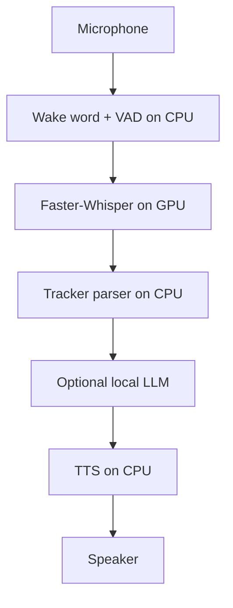
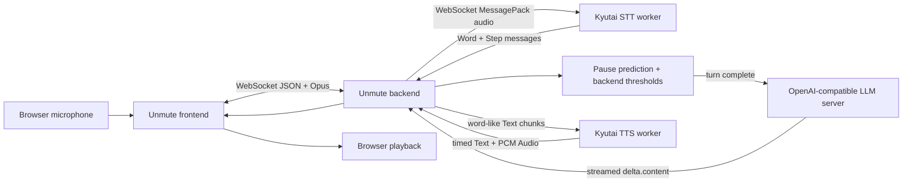
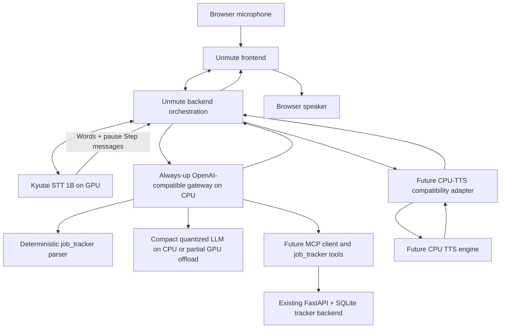

# Engineering Session Report

## 1. Session Objective

This session investigated whether Kyutai’s `unmute` repository could serve as the realtime voice runtime for the local-first `job_tracker` assistant on constrained hardware, specifically an NVIDIA RTX 3050 Laptop GPU with 4 GB VRAM.

The work was not an implementation task yet. It was an architecture-audit and feasibility-analysis session intended to replace vague assumptions with code-grounded evidence.

The central questions were:

1. Should the project use Moshi, Unmute, or a custom pipeline built from Faster-Whisper, an LLM, and TTS services?
    
2. Can stock Unmute be adapted so that only the latency-critical STT component remains GPU-resident?
    
3. Can the text LLM run on CPU or use partial GPU offloading?
    
4. Can the stock GPU-heavy TTS component be replaced by a CPU-friendly TTS engine without destroying Unmute’s realtime UX?
    
5. Where should future MCP and `job_tracker` tool integration live?
    
6. Which assumptions required repo inspection and which required runtime benchmarks?
    

The session progressively narrowed the target architecture toward:

```text
GPU:
- Kyutai STT only, if runtime probes prove it fits within 4 GB VRAM

CPU:
- Unmute backend orchestration
- wake-word detector, to be added later
- turn-decision logic already present in backend
- always-up OpenAI-compatible LLM gateway
- compact quantized LLM, CPU-only or partially GPU-offloaded
- existing deterministic job_tracker parser/API
- CPU TTS replacement, engine still undecided
```

The TTS decision was intentionally deferred after auditing Pocket TTS and Coqui. The next immediate investigation was defined as STT-only runtime feasibility.

---

## 2. Starting Context

### Existing project context

The broader `job_tracker` project was already being designed as a local-first, conversational assistant for tracking job applications through voice commands.

Relevant existing capabilities and design principles carried into this session included:

- A FastAPI backend with SQLite as the initial database.
    
- A deterministic transcript parser for structured tracker operations.
    
- Preview-before-save behavior rather than direct automatic writes.
    
- A desire to use voice commands for adding and updating applications.
    
- A strong preference for local execution where practical.
    
- A constrained laptop GPU: RTX 3050 with 4 GB VRAM.
    
- Previous experiments with Faster-Whisper and speech pipelines.
    
- Interest in future MCP integration for tool access.
    

The existing deterministic parser was clarified during the session as a lightweight CPU-side layer that converts transcript text into validated tracker commands.

Example:

```text
Transcript:
"Mark Analytics Vidhya as rejected"
```

```json
{
  "action": "update_application",
  "company": "Analytics Vidhya",
  "patch": {
    "status": "rejected"
  }
}
```

The parser was distinguished from the API:

```text
Tracker parser:
transcript → structured command

Tracker API:
structured command → database operation
```

### Triggering limitation

The immediate issue was whether a high-quality realtime speech interface could be built without exceeding the laptop’s VRAM.

The discussion initially revisited an earlier strategy used in another project involving Aryabhata: lazy model loading and model switching. The rough idea was:

```text
Load the currently needed model
→ run inference
→ unload it
→ load the next model
```

The question was whether a similar approach could make Unmute feasible on a 4 GB GPU.

### Initial assumptions carried forward

Several assumptions existed at the start, but many were only approximations:

- STT, LLM, and TTS could potentially be swapped in and out of GPU memory.
    
- The text LLM could likely be replaced by a smaller distilled or quantized model.
    
- CPU offloading might solve a large part of the VRAM problem.
    
- TTS might be moved to CPU using Pocket TTS or another engine.
    
- Wake-word detection and VAD could potentially run on CPU.
    
- Unmute might be preferable to a custom Whisper pipeline because it already solved realtime orchestration.
    
- MCP integration might fit naturally at the LLM boundary.
    

A major goal of the session was to stop relying on these approximations and audit the actual repository.

---

## 3. User Goal Behind the Work

The user was not merely trying to run a speech demo. The goal was to build a usable conversational interface for `job_tracker`.

The desired product experience includes commands such as:

```text
"Mark Analytics Vidhya as rejected."
"Set Rockwell Automation priority to high."
"Add a note that I contacted an employee for a referral."
"Which applications should I focus on?"
```

For short tracker updates, the desired interaction is:

```text
User speaks
→ assistant understands the tracker action
→ assistant previews the intended modification
→ user confirms
→ database is updated
→ assistant responds verbally
```

For more complex queries, the assistant should reason over tracker records without inventing information.

The voice runtime matters because a simple record-then-process pipeline can feel slow and robotic:

```text
record complete audio
→ transcribe fully
→ generate full LLM response
→ synthesize full audio
→ begin playback
```

A more natural assistant should overlap stages where possible:

```text
stream audio
→ incrementally transcribe
→ detect conversational pause
→ stream LLM output
→ stream TTS audio
→ begin playback early
```

The engineering challenge was therefore not only model selection. It was preserving a natural voice experience while respecting a strict hardware budget.

---

## 4. Obstacles Encountered

## 4.1 Moshi was attractive but not practical for the hardware constraint

### Symptom observed

Moshi appeared attractive because it offered natural full-duplex speech-to-speech interaction, low latency, interruption handling, and integrated audio reasoning.

### Initially suspected

It initially seemed possible that quantized or optimized variants might make Moshi suitable for the laptop.

### Actual root cause

Moshi is a tightly integrated speech-text foundation model rather than a modular cascade. Its major components cannot be independently replaced or offloaded as cleanly as separate STT, LLM, and TTS services.

The direct deployment blocker for this project was its heavyweight inference requirement relative to the 4 GB GPU.

### Why the issue was non-obvious

Moshi’s architecture is appealing precisely because its integration improves natural conversation. That same tight integration makes low-VRAM adaptation difficult.

### Boundary involved

- Speech pipeline
    
- Model performance
    
- Infrastructure
    

### Resolution

Moshi was not selected as the primary implementation base. It remained useful as an architectural reference for speech-native interaction, but Unmute became the more promising adaptation candidate due to service modularity.

---

## 4.2 Confusion over whether to use Unmute or build a custom pipeline

### Symptom observed

The conversation briefly moved toward a fully custom stack:

```text
Mic
→ wake word
→ VAD
→ Faster-Whisper
→ deterministic parser
→ optional LLM
→ Coqui TTS
```

The user then clarified that Unmute should be used.

### Initially suspected

A custom stack appeared simpler because the project already had Faster-Whisper experience and a deterministic tracker parser.

### Actual root cause

Two different goals were being conflated:

1. Building the fastest possible lightweight MVP.
    
2. Building a natural realtime conversational runtime.
    

A custom stack is attractive for the first goal. Unmute is attractive for the second.

### Why the issue was non-obvious

Both architectures contain similar high-level boxes:

```text
STT → LLM → TTS
```

The difference lies in orchestration quality: streaming, interruption handling, browser buffering, pause prediction, service health, and timing alignment.

### Boundary involved

- System architecture
    
- UX
    
- Speech pipeline
    

### Resolution

The session adopted a dual understanding:

```text
Custom Faster-Whisper pipeline:
simpler MVP baseline

Adapted Unmute:
stronger long-term realtime UX foundation
```

For the ongoing audit, Unmute remained the target runtime.

---

## 4.3 Model switching was initially treated too broadly

### Symptom observed

The first idea was to unload and reload STT, LLM, and TTS sequentially:

```text
load STT
→ transcribe
→ unload STT
→ load LLM
→ generate
→ unload LLM
→ load TTS
→ synthesize
→ unload TTS
```

### Initially suspected

This seemed like a straightforward way to reduce peak VRAM because only one model would be resident at a time.

### Actual root cause

Model switching solves memory capacity but introduces latency and removes stage overlap.

For voice interaction, strict swapping can break or weaken:

- streaming overlap,
    
- interruption handling,
    
- immediate pause detection,
    
- responsive audio playback,
    
- natural conversation flow.
    

### Why the issue was non-obvious

The strategy was valid in the earlier Aryabhata-style sequential workload, where only one specialist model needed to answer at a time. It was less suitable for a realtime speech pipeline where components overlap.

### Boundary involved

- Infrastructure
    
- Model lifecycle
    
- UX latency
    

### Resolution

Strict full-pipeline model swapping was deferred as an experimental fallback, not adopted as the primary architecture.

The refined approach became selective residency:

```text
STT:
keep resident on GPU during an active session

LLM:
move to CPU or partial offload behind a gateway

TTS:
evaluate CPU replacement separately
```

---

## 4.4 VAD was initially oversimplified as a separate CPU component

### Symptom observed

An early target architecture stated:

```text
Wake word + VAD → CPU
```

### Initially suspected

It appeared that both wake-word detection and VAD could simply be lightweight CPU-side services.

### Actual root cause

The Unmute repo audit showed that stock turn detection is not implemented as an independent VAD service.

Instead:

```text
STT service
→ Step messages
→ pause_prediction from prs[2]
→ backend smoothing and threshold logic
```

The backend applies an exponential moving average and uses pause thresholds to decide end-of-turn and interruption behavior.

### Why the issue was non-obvious

Some logic is CPU-side, but the semantic pause signal originates from the STT stream. Therefore “move VAD to CPU” is not a simple placement change.

### Boundary involved

- Speech pipeline
    
- Backend orchestration
    
- UX turn-taking
    

### Resolution

The architecture wording was refined:

```text
Wake-word gate:
future custom CPU layer

Turn-decision smoothing:
CPU backend logic

Semantic pause signal:
STT model output

STT:
must remain active during the conversational session
```

A separate lightweight CPU VAD may still be useful as a gate, but it must not be assumed to replace stock semantic pause behavior.

---

## 4.5 WebSocket lifecycle was initially confused with model residency

### Symptom observed

Because the backend opens TTS WebSocket connections on demand, it was tempting to assume that the TTS model itself is loaded only on demand and unloaded after a response.

### Initially suspected

The architecture appeared to allow natural lazy-loading:

```text
open TTS WS
→ load model
→ synthesize
→ close WS
→ release VRAM
```

### Actual root cause

The repo does not contain the internal model-loading implementation for STT or TTS. Both services invoke an externally installed executable:

```text
moshi-server@0.6.4
```

The repository exposes service startup and connection lifecycle, but not the actual model residency lifecycle.

### Why the issue was non-obvious

Three separate events had been conflated:

```text
service process startup
backend opening a WebSocket
model weights entering or leaving memory
```

They are not equivalent.

### Boundary involved

- Infrastructure
    
- External executable boundary
    
- GPU memory lifecycle
    

### Resolution

The session explicitly separated these lifecycle events.

Verified repository-level conclusion:

```text
WebSocket close
≠ proven model unload
```

The only repository-visible guaranteed release mechanism is:

```text
stop or restart the STT/TTS process or container
```

Runtime probes were deferred to verify actual residency behavior.

---

## 4.6 LLM CPU offloading was plausible but needed contract verification

### Symptom observed

The user wanted to know whether distilled models and CPU offloading could reduce LLM VRAM usage.

### Initially suspected

It was assumed that Unmute would support external LLM replacement because the LLM was modular.

### Actual root cause

The assumption was correct, but only after auditing the exact interface.

The backend expects an OpenAI-compatible server with:

```text
GET  /v1/models
POST /v1/chat/completions
stream=True
```

The backend consumes:

```text
choices[0].delta.content
```

It does not inspect tool-call payloads.

### Why the issue was non-obvious

It was not enough for a replacement runtime to support generation. It also had to satisfy the stock health gate and streaming chunk format.

### Boundary involved

- Backend
    
- LLM service contract
    
- Infrastructure networking
    

### Resolution

The LLM was identified as the cleanest optimization target.

Verified architectural boundary:

```text
Unmute backend:
OpenAI-compatible text-stream client only

External LLM runtime:
responsible for CPU execution,
quantization,
partial GPU layer placement,
cold/warm lifecycle
```

No Unmute backend changes are required if the replacement server satisfies the contract.

---

## 4.7 Pure lazy-loading of the LLM conflicts with the stock health gate

### Symptom observed

A proposed optimization was:

```text
Only start the LLM when a complex query arrives.
```

### Initially suspected

This seemed efficient because many tracker commands could bypass a general-purpose LLM.

### Actual root cause

Stock Unmute checks LLM health before the realtime session starts:

```text
GET {LLM_SERVER}/v1/models
```

If no LLM endpoint is available, frontend/backend health fails and the normal conversation session does not start.

Additionally, the backend has no explicit generation-time LLM retry or wait-for-readiness loop.

### Why the issue was non-obvious

The LLM is invoked per response, but health availability is required before the response phase.

### Boundary involved

- Backend health contract
    
- LLM gateway
    
- UX startup behavior
    

### Resolution

The session introduced an always-up lightweight gateway:

```text
Unmute backend
→ always-up OpenAI-compatible gateway
   ├── /v1/models health response
   ├── simple tracker command → deterministic path
   └── complex query → compact local LLM runtime
```

The gateway can hide cold starts and satisfy stock health checks.

---

## 4.8 Tool-calling and MCP are not native stock-Unmute features

### Symptom observed

The user asked where MCP integration should live in Moshi and Unmute.

### Initially suspected

It was possible that Unmute already included native MCP integration or native tool calling.

### Actual root cause

The audited backend consumes only text deltas from the LLM stream. It does not inspect tool-call or function-call structures.

MCP integration is therefore not built into the current stock backend.

### Why the issue was non-obvious

Unmute’s OpenAI-compatible LLM boundary makes tool integration feel native, but actual tool logic still needs to be implemented.

### Boundary involved

- LLM gateway
    
- MCP client
    
- Tool-calling contract
    
- Backend maintainability
    

### Resolution

The recommended future integration point became a separate gateway rather than a deep upstream fork:

```text
Unmute backend
→ OpenAI-compatible gateway
   ├── deterministic tracker parser
   ├── compact LLM fallback
   ├── MCP client
   └── preview-before-save state
→ job_tracker MCP server
→ existing FastAPI + SQLite backend
```

This keeps Unmute mostly unchanged and isolates business logic from voice orchestration.

---

## 4.9 Stock TTS is GPU-oriented and lacks visible low-VRAM knobs

### Symptom observed

The target architecture wanted:

```text
TTS → CPU
```

### Initially suspected

It seemed possible that the stock TTS worker might have a CPU switch or smaller checkpoint setting.

### Actual root cause

The inspected repository configures TTS in a GPU-oriented way:

```text
CUDA base image
cargo install --features cuda
Docker Compose NVIDIA device reservation
```

The repo did not expose:

```text
CPU switch
mixed CPU/GPU mode
quantization option
smaller TTS checkpoint
lazy-loading option
unload option
```

### Why the issue was non-obvious

The external `moshi-server@0.6.4` executable may have upstream capabilities not visible in the cloned repo, but the inspected configuration does not expose them.

### Boundary involved

- TTS service config
    
- Infrastructure
    
- External implementation boundary
    

### Resolution

The session postponed stock-TTS optimization and began evaluating CPU TTS replacements.

---

## 4.10 Pocket TTS streams audio but not incremental text input

### Symptom observed

Pocket TTS looked like a strong replacement candidate because it is lightweight and CPU-oriented.

### Initially suspected

Its audio streaming support initially appeared likely to preserve Unmute’s low-latency behavior.

### Actual root cause

Pocket TTS accepts a complete text string first:

```text
generate_audio_stream(model_state, text_to_generate: str)
```

It then yields audio chunks progressively.

It does not provide a verified API for:

```text
append Text(chunk_1)
→ synthesize
append Text(chunk_2)
→ continue the same synthesis session
```

### Why the issue was non-obvious

Two different capabilities were easy to conflate:

```text
audio-output streaming
vs
incremental-text-input streaming
```

Pocket TTS supports the first, not the second.

### Boundary involved

- TTS adapter
    
- Latency
    
- UX synchronization
    

### Resolution

Pocket TTS was classified as:

```text
Class C — Buffered adapter
```

Required flow:

```text
receive Unmute Text chunks
→ buffer until Eos
→ synthesize complete text with Pocket TTS
→ stream PCM audio chunks back
```

Pocket TTS remained a viable low-resource fallback, especially for short tracker replies, but not a full-fidelity drop-in replacement.

---

## 4.11 Pocket TTS lacks stock-Unmute text timing output

### Symptom observed

Stock Unmute TTS emits timed text packets:

```text
Text {
  text,
  start_s,
  stop_s
}
```

Pocket TTS did not expose equivalent alignment output.

### Initially suspected

Audio streaming alone appeared sufficient.

### Actual root cause

Timed text packets support subtitle synchronization, progressive UI text display, and alignment between spoken audio and visible assistant text.

### Why the issue was non-obvious

Audio playback can work without timing metadata, but UX fidelity degrades.

### Boundary involved

- TTS adapter
    
- Frontend UX
    
- Playback synchronization
    

### Resolution

Two options were retained for a future adapter:

```text
Simplest:
omit timed text packets initially

Improved:
approximate timings from audio chunk durations and segmentation
```

Exact stock behavior would not be preserved without additional work.

---

## 4.12 Coqui container existed but was initially missed

### Symptom observed

The TTS screening report initially marked Coqui as not locally available.

The user clarified that a Coqui container existed.

### Initially suspected

The container name was stated as:

```text
coquio-gpu
```

### Actual root cause

The actual local container name was:

```text
coqui-gpu
```

The initial shallow audit had only checked package/source visibility and missed the container.

### Why the issue was non-obvious

The Coqui runtime was not installed as a host Python package or visible source tree. It existed inside a Docker container.

### Boundary involved

- Local infrastructure
    
- Docker inspection
    
- TTS candidate audit methodology
    

### Resolution

A dedicated Coqui-container audit was performed.

This reinforced an important methodological rule:

```text
Candidate not found as a host package
≠ candidate absent from local environment
```

---

## 4.13 Coqui container was not a ready TTS service

### Symptom observed

The `coqui-gpu` container exposed port `5002`, suggesting a possible running service.

### Initially suspected

It appeared that a Coqui API might already be available locally.

### Actual root cause

The container entrypoint was:

```text
/bin/bash
```

The container was an interactive shell, not an always-on TTS server.

The mounted model cache:

```text
/home/aditya/coqui-models
```

was empty.

### Why the issue was non-obvious

A published port and GPU-enabled image can look like an operational service, even when no inference process is running.

### Boundary involved

- Docker infrastructure
    
- TTS runtime
    
- Model cache
    

### Resolution

The audit identified the exact container state and avoided downloading new models during the read-only audit.

---

## 4.14 Coqui XTTS had the same semantic limitation as Pocket TTS

### Symptom observed

XTTS contains:

```text
inference_stream(...)
```

which yields waveform chunks progressively.

### Initially suspected

This appeared promising as a better Unmute replacement than Pocket TTS.

### Actual root cause

XTTS still takes complete input text before generation begins.

Its supported pattern is:

```text
provide complete text
→ yield audio chunks progressively
```

not:

```text
append live text chunks into one active synthesis session
```

### Why the issue was non-obvious

The function name `inference_stream` could easily be interpreted as full bidirectional streaming semantics.

### Boundary involved

- TTS Python API
    
- Adapter design
    
- Latency
    

### Resolution

Coqui was also classified as:

```text
Class C — Buffered adapter
```

It was not selected as a better first adapter target than Pocket TTS.

---

## 5. Approaches Considered

## 5.1 Use Moshi directly

### Approach

Run Moshi as the primary speech-to-speech runtime.

### Why it seemed reasonable

Moshi offers natural, integrated realtime dialogue with speech-native behavior.

### Advantages

- Full-duplex conversational design.
    
- Low-latency interaction.
    
- Better preservation of speech-native cues.
    
- Natural interruption handling.
    

### Drawbacks

- Heavy deployment requirements.
    
- Tightly coupled architecture.
    
- Harder to independently optimize STT, LLM, and TTS.
    
- Poor fit for 4 GB VRAM.
    
- MCP and structured tool workflows would be more invasive.
    

### Decision

Rejected as the primary deployment base.

### Reason

The project needs low-VRAM adaptability and tool integration more than a monolithic speech-native model.

---

## 5.2 Build a custom Faster-Whisper pipeline

### Approach

Use:

```text
wake word
→ VAD
→ Faster-Whisper
→ deterministic parser
→ optional local LLM
→ Coqui or another TTS
```

### Why it seemed reasonable

The project already had Faster-Whisper experience and a deterministic parser. It would likely be simpler and more compatible with the laptop.

### Advantages

- Lower engineering complexity for a basic MVP.
    
- Better control over memory usage.
    
- Easier CPU/GPU placement.
    
- Faster path to usable tracker commands.
    

### Drawbacks

The project would need to implement or tune:

- realtime browser audio streaming,
    
- Opus handling,
    
- playback buffering,
    
- backpressure,
    
- pause detection,
    
- interruption cancellation,
    
- stage overlap,
    
- service health,
    
- retries,
    
- synchronization.
    

### Decision

Not rejected. Retained as a fallback or baseline architecture.

### Reason

A custom pipeline is the safer MVP path, but adapted Unmute has a higher long-term UX ceiling.

---

## 5.3 Use Unmute as the base runtime

### Approach

Retain Unmute frontend/backend orchestration while replacing or adapting resource-heavy services.

### Why it seemed reasonable

Repo inspection confirmed that Unmute already implements difficult realtime orchestration:

```text
browser WebSocket streaming
→ STT streaming
→ pause signal handling
→ LLM token streaming
→ word rechunking
→ TTS streaming
→ browser playback buffering
→ interruption handling
```

### Advantages

- Reuses mature realtime infrastructure.
    
- LLM is externally replaceable.
    
- STT and TTS are separate services.
    
- Browser mic and playback handling already exist.
    
- Turn detection and interruption logic already exist.
    
- Preserves future path toward natural conversational UX.
    

### Drawbacks

- Stock deployment remains too heavy for 4 GB VRAM.
    
- Stock TTS CPU path is not exposed.
    
- STT/TTS lifecycle internals cross an external executable boundary.
    
- Low-VRAM adaptation requires careful audits and runtime probes.
    

### Decision

Adopted as the primary research and adaptation track.

### Reason

It offers the best balance between reusable realtime orchestration and modular optimization boundaries.

---

## 5.4 Strict model swapping

### Approach

Load and unload STT, LLM, and TTS sequentially.

### Advantages

- Low simultaneous VRAM footprint.
    
- Conceptually simple memory control.
    

### Drawbacks

- Cold-start latency.
    
- No stage overlap.
    
- Weaker natural conversation.
    
- Potentially degraded interruption handling.
    
- Requires process/container orchestration because unload APIs are not visible.
    

### Decision

Deferred as an experimental fallback.

### Reason

It solves memory at the cost of the realtime UX that motivated using Unmute.

---

## 5.5 Selective residency

### Approach

Keep only the most latency-critical model resident on GPU.

```text
STT:
GPU-resident

LLM:
CPU or partial offload

TTS:
CPU replacement
```

### Advantages

- Preserves STT streaming and pause signal.
    
- Frees VRAM from LLM.
    
- Potentially removes TTS GPU dependency.
    
- Better UX than strict swapping.
    

### Drawbacks

- STT actual VRAM fit remains unverified.
    
- CPU TTS replacement may weaken token-to-speech overlap.
    
- Gateway and adapter components need implementation.
    

### Decision

Adopted as the target architecture candidate.

### Reason

It is the most promising low-VRAM adaptation strategy found so far.

---

## 5.6 Replace the LLM with a compact quantized CPU model

### Approach

Remove the default GPU vLLM deployment and point Unmute to an OpenAI-compatible external runtime.

Possible runtime categories discussed:

```text
Ollama
llama.cpp server
custom OpenAI-compatible gateway
```

### Advantages

- Removes LLM VRAM dependency.
    
- Allows quantization.
    
- Allows partial GPU layer offloading externally.
    
- Keeps backend unchanged.
    
- Supports future deterministic bypass and MCP integration.
    

### Drawbacks

- CPU latency must be benchmarked.
    
- Gateway health behavior must satisfy `/v1/models`.
    
- Pure cold-start lazy loading requires readiness handling.
    

### Decision

Adopted as a stable architectural principle.

### Reason

The replacement boundary was verified directly from code.

---

## 5.7 Use an always-up LLM gateway

### Approach

Place a lightweight gateway between Unmute and the actual compact LLM runtime.

```text
Unmute backend
→ always-up gateway
   ├── health endpoint
   ├── deterministic tracker responses
   └── optional LLM proxy
```

### Advantages

- Satisfies stock health gate.
    
- Lets simple tracker commands bypass LLM inference.
    
- Can hide compact-model cold starts.
    
- Natural place for MCP.
    
- Natural place for preview-before-save workflow state.
    
- Minimizes upstream Unmute modifications.
    

### Drawbacks

- New component to build.
    
- Must implement OpenAI-compatible streaming.
    
- Must handle readiness and errors carefully.
    

### Decision

Adopted as the preferred integration boundary for future implementation.

### Reason

It separates voice orchestration from business logic and model lifecycle concerns.

---

## 5.8 Use Pocket TTS as CPU replacement

### Approach

Add a compatibility adapter in front of Pocket TTS.

### Advantages

- CPU-first execution.
    
- INT8 quantization exposed.
    
- 24 kHz mono float PCM compatible at the audio-data level.
    
- Voice support.
    
- Progressive audio output after synthesis starts.
    
- Good fit for short confirmations.
    

### Drawbacks

- Not a direct protocol replacement.
    
- No active-session incremental text append.
    
- Full text must be buffered until `Eos`.
    
- Exact text timing absent.
    
- First-audio latency increases for longer responses.
    
- Interruption responsiveness may degrade.
    

### Decision

Retained as the preferred first TTS adapter prototype candidate, but implementation deferred.

### Reason

It is currently the cleanest verified CPU-friendly fallback.

---

## 5.9 Use Coqui XTTS as CPU replacement

### Approach

Use the installed Coqui runtime, likely XTTS, through an adapter.

### Advantages

- CPU execution possible in principle.
    
- Voice cloning support.
    
- Progressive audio output through XTTS `inference_stream`.
    
- Existing local Docker image available.
    

### Drawbacks

- Existing container is GPU-oriented.
    
- No model downloaded locally.
    
- Container is an interactive shell, not a ready service.
    
- No live incremental text append.
    
- Still requires buffered adapter.
    
- Actual sample rate, latency, and memory depend on chosen model.
    

### Decision

Deferred.

### Reason

It was not better than Pocket TTS for the first adapter prototype.

---

## 5.10 Audit more TTS engines immediately

### Approach

Continue deep audits for Kokoro, Piper, RealtimeTTS, and other engines.

### Advantages

- Might find a true incremental-text-input CPU TTS.
    
- Could preserve more of Unmute’s latency behavior.
    

### Drawbacks

- Risks spending too much time before validating the larger architecture.
    
- The remaining main blocker is STT 4 GB feasibility.
    
- TTS can be revisited later.
    

### Decision

Deferred.

### Reason

The user explicitly decided to inspect other architectural components first and return to TTS later.

---

## 5.11 Distillation

### Approach

Train smaller task-specific models rather than relying on general-purpose models.

### Discussed targets

#### LLM

```text
natural-language tracker command
→ validated structured JSON tool call
```

This was identified as the best future distillation target.

#### STT

Possible later teacher-student adaptation for job-tracker speech and company names.

#### TTS

Likely lower priority because lightweight CPU engines may already solve enough of the problem.

### Advantages

- Smaller runtime.
    
- Lower latency.
    
- Better narrow-domain reliability.
    
- Lower dependence on general-purpose LLM inference.
    

### Drawbacks

- Requires datasets.
    
- Requires real failure examples.
    
- Adds training complexity.
    
- Premature before MVP benchmarks.
    

### Decision

Deferred until after MVP and runtime data collection.

### Reason

Distillation should address measured bottlenecks, not assumed ones.

---

## 6. Decisions Made

## 6.1 Use Unmute as the main realtime adaptation base

### Final decision

Continue auditing and adapting Unmute rather than immediately building the final voice runtime from scratch.

### Reasoning

Unmute already solves difficult realtime orchestration problems that a custom stack would otherwise need to reproduce.

### Rejected alternatives

- Moshi as primary runtime.
    
- Immediate full custom pipeline as the only path.
    

### Stability

Stable architectural direction for the advanced conversational runtime.

A custom Faster-Whisper pipeline remains a valid fallback baseline.

---

## 6.2 Do not use strict full-pipeline model swapping as the primary architecture

### Final decision

Treat model swapping as an experimental fallback only.

### Reasoning

Strict swapping reduces VRAM but destroys much of the value gained from Unmute’s overlapping realtime pipeline.

### Rejected alternative

Sequentially swapping STT, LLM, and TTS every turn.

### Stability

Stable principle unless runtime measurements leave no other viable option.

---

## 6.3 Move LLM execution outside GPU by default

### Final decision

Use an external compact quantized LLM runtime on CPU or with partial GPU offloading.

### Reasoning

The Unmute backend only depends on the OpenAI-compatible streaming API contract.

### Rejected alternative

Keep default GPU vLLM deployment as a mandatory component.

### Stability

Stable architectural principle.

---

## 6.4 Introduce an always-up OpenAI-compatible gateway

### Final decision

Use a gateway as the future integration point for:

```text
/v1/models
/v1/chat/completions
deterministic tracker command routing
compact LLM proxying
future MCP client
preview-before-save state
```

### Reasoning

The gateway satisfies stock health checks while allowing LLM bypass and lazy backend model usage.

### Rejected alternative

Put MCP and tracker logic directly into the Unmute backend.

### Stability

Strong candidate for a stable integration boundary.

---

## 6.5 Keep semantic pause handling tied to STT until proven otherwise

### Final decision

Do not assume VAD can be fully replaced by a separate CPU service.

### Reasoning

Stock turn detection relies on pause predictions arriving from STT `Step` messages.

### Rejected alternative

Treat VAD as a standalone replaceable box without preserving semantic pause behavior.

### Stability

Stable until a benchmarked replacement exists.

---

## 6.6 Defer final TTS selection

### Final decision

Do not implement Pocket TTS or Coqui adapter yet.

### Reasoning

Both audited alternatives require buffered adapters and degrade token-to-speech overlap. The next larger blocker is STT GPU-only feasibility.

### Rejected alternative

Spend the next phase auditing every possible TTS engine.

### Stability

Temporary decision.

---

## 6.7 Prioritize STT-only runtime probing next

### Final decision

Audit whether Kyutai STT 1B can run independently as the only GPU-resident model on the RTX 3050.

### Reasoning

The target architecture depends on STT fitting within the 4 GB VRAM limit while preserving pause signals.

### Stability

Immediate next required step.

---

## 7. Architecture Evolution

## Previous high-level idea

The discussion initially considered a generic low-VRAM custom stack:



This architecture was lightweight and practical but did not automatically preserve Unmute’s realtime orchestration advantages.

## Audited stock Unmute design

Codex inspection established this stock runtime:



## Updated low-VRAM candidate



## New abstractions introduced

### OpenAI-compatible LLM gateway

Purpose:

```text
- satisfy /v1/models health contract
- stream /v1/chat/completions responses
- bypass LLM for simple tracker commands
- proxy complex requests to compact model
- host future MCP client
- maintain preview-before-save state
```

### TTS compatibility adapter

Potential future purpose:

```text
- expose /api/tts_streaming WebSocket
- decode Unmute MessagePack Text and Eos
- invoke CPU TTS engine
- convert generated chunks to Audio{pcm}
- emit Ready and Error messages
- approximate or omit timed text
```

### Selective residency model

Purpose:

```text
- reserve scarce GPU VRAM for STT
- move LLM compute to CPU or partial offload
- move TTS to CPU if viable
```

---

## 8. Implementation Progress

## Completed during this session

No production runtime code was modified.

No adapters, gateway, MCP server, or STT deployment changes were implemented.

The concrete outputs were read-only audit documents and refined architecture decisions.

### Audit documents produced

The following audit phases were completed:

```text
01_STOCK_RUNTIME_ARCHITECTURE.md
02_MODEL_RESIDENCY_AND_SERVICE_LOADING.md
03_LLM_CPU_AND_PARTIAL_GPU_OFFLOAD.md
04A_STOCK_TTS_CONTRACT_AND_CPU_CAPABILITIES.md
04B_POCKET_TTS_COMPATIBILITY.md
04C_TTS_CANDIDATE_SCREENING.md
04D_COQUI_CONTAINER_COMPATIBILITY.md
```

### Repository and container inspection completed

The audit identified:

- Unmute runtime files and service graph.
    
- STT/TTS WebSocket and MessagePack protocols.
    
- LLM OpenAI-compatible streaming boundary.
    
- Health-gate behavior.
    
- External `moshi-server@0.6.4` lifecycle boundary.
    
- Pocket TTS Python API shape.
    
- Existing `coqui-gpu` container state.
    
- Installed Coqui runtime version.
    
- Missing Coqui model cache.
    
- XTTS `inference_stream` semantics.
    

## Planned but not implemented

- STT-only GPU runtime probe.
    
- Wake-word and VAD-separation audit.
    
- MCP and `job_tracker` gateway design audit.
    
- LLM gateway implementation.
    
- Compact CPU LLM benchmark.
    
- Pocket TTS adapter prototype.
    
- Coqui model benchmark.
    
- Runtime latency and memory measurement matrix.
    
- Final low-VRAM architecture selection.
    

---

## 9. Validation and Evidence

## 9.1 Stock Unmute architecture validated by code inspection

Audited commit:

```text
84aa28d3b4c58efafb2e22f3217001330608b980
```

The runtime flow was mapped from:

```text
frontend/src/app/Unmute.tsx
frontend/src/app/useMicrophoneAccess.ts
frontend/src/app/useAudioProcessor.ts
unmute/main_websocket.py
unmute/unmute_handler.py
unmute/stt/speech_to_text.py
unmute/tts/text_to_speech.py
unmute/llm/llm_utils.py
docker-compose.yml
services/moshi-server/configs/stt.toml
services/moshi-server/configs/tts.toml
```

Verified protocols:

```text
Browser ↔ backend:
WebSocket JSON events with Opus audio payloads

Backend ↔ STT:
WebSocket + MessagePack

Backend ↔ LLM:
OpenAI-compatible HTTP streaming

Backend ↔ TTS:
WebSocket + MessagePack
```

## 9.2 Model residency boundaries validated by code inspection

STT and TTS workers use:

```text
moshi-server@0.6.4
```

The repo exposes startup commands and client lifecycle but does not expose internal model residency behavior.

Verified conclusion:

```text
No repository-visible unload endpoint or unload flag
```

Unresolved until runtime probe:

```text
Does closing a WebSocket release VRAM?
Are weights loaded at worker startup or first request?
```

## 9.3 LLM replacement contract validated

Verified backend requirements:

```text
GET /v1/models
POST /v1/chat/completions
stream=True
choices[0].delta.content
```

Verified behavior:

- Default LLM is `google/gemma-3-1b-it`.
    
- Default service is `vllm/vllm-openai:v0.11.0`.
    
- Backend does not need to know model placement.
    
- CPU execution and GPU layer offloading can be delegated to an external runtime.
    
- Tool-call deltas are not consumed by stock backend.
    
- Stock health gate requires a live `/v1/models` endpoint.
    

## 9.4 Pocket TTS compatibility validated

Audited Pocket TTS commit:

```text
15a6c1817b360f9b37691aef9734435a85610c68
```

Verified:

```text
CPU execution
INT8 quantization
24 kHz mono output
float PCM tensor chunks
audio-output streaming
complete-text input requirement
no verified incremental-text append
no stock-Unmute WebSocket + MessagePack protocol
no verified text timing output
```

## 9.5 Coqui container validated

Actual container name:

```text
coqui-gpu
```

Image:

```text
ghcr.io/coqui-ai/tts
```

Installed runtime:

```text
TTS 0.22.0
```

Container state:

```text
Entrypoint: /bin/bash
No always-on TTS server
Published port: 5002
Mounted model cache: /home/aditya/coqui-models
Model cache: empty
```

Verified XTTS behavior:

```text
complete input text
→ inference_stream(...)
→ progressive waveform chunks
```

Not verified:

```text
live incremental text append
actual CPU latency
actual model memory
actual sample rate for chosen model
cancellation quality
```

## 9.6 Runtime performance measurements still missing

No final runtime memory measurements were captured for:

```text
Kyutai STT idle VRAM
Kyutai STT active VRAM
stock TTS idle VRAM
stock TTS active VRAM
CPU LLM latency
Pocket TTS adapter latency
Coqui selected-model latency
```

This absence was intentional. The session focused on narrowing the architecture before running heavy probes or downloading models.

---

## 10. Lessons Learned

## 10.1 Modular diagrams are not enough; contracts matter

It is easy to say:

```text
STT → LLM → TTS
```

but the real engineering value lies in exact contracts:

```text
WebSocket or HTTP?
MessagePack or JSON?
full text or incremental chunks?
timed text or audio only?
health endpoint required?
retry behavior?
```

The LLM was easy to replace because its contract is small and standardized.

The TTS was harder to replace because its contract includes incremental text input, PCM audio streaming, timings, handshake behavior, and cancellation assumptions.

---

## 10.2 Streaming audio output is not the same as streaming text input

This was one of the most important discoveries.

Pocket TTS and Coqui XTTS both support:

```text
full text
→ progressive audio chunks
```

They do not provide verified support for:

```text
append live text chunks
→ continue one synthesis session
```

The distinction directly affects first-audio latency.

---

## 10.3 WebSocket lifecycle is not model lifecycle

Opening or closing a connection does not prove GPU memory allocation or release.

Correct reasoning requires separating:

```text
process startup
connection startup
model loading
request execution
connection shutdown
process shutdown
```

Runtime probes must validate the memory behavior.

---

## 10.4 External implementation boundaries must be explicitly marked

The cloned Unmute repository does not contain all speech worker internals.

STT and TTS loading behavior crosses into:

```text
moshi-server@0.6.4
```

This means some questions cannot be resolved through repo reading alone.

---

## 10.5 The cleanest adaptation point is often a compatibility gateway

The OpenAI-compatible gateway reduces coupling:

```text
Unmute:
realtime speech orchestration

Gateway:
tool routing, LLM selection, MCP, health, preview state

job_tracker backend:
domain logic and database
```

This is preferable to inserting domain-specific logic directly into upstream Unmute internals.

---

## 10.6 Local package checks alone are insufficient

The Coqui container was initially missed because it existed in Docker rather than as a host Python package or source tree.

Future local audits should inspect:

```text
source trees
Python environments
Docker images
Docker containers
mounted model caches
running services
```

---

## 10.7 Distillation should follow evidence, not precede it

Task-specific distillation may eventually be valuable, especially for:

```text
tracker transcript
→ structured action JSON
```

But training should begin only after:

```text
real transcripts
parser failures
LLM fallback examples
latency measurements
accuracy bottlenecks
```

are collected.

---

## 10.8 A custom pipeline remains a valuable fallback

Unmute offers higher realtime UX potential, but it should not block the product.

If low-VRAM adaptation fails, the project can still ship a useful voice workflow with:

```text
Faster-Whisper
→ deterministic parser
→ tracker API
→ lightweight TTS
```

The advanced runtime and the reliable MVP should be treated as separate risk tracks.

---

## 11. Open Questions and Deferred Work

## Required next steps

### 11.1 Run STT-only GPU feasibility audit

Determine whether:

```text
kyutai/stt-1b-en_fr-candle
```

can run independently as the only GPU-resident model within 4 GB VRAM.

Measure:

```text
baseline VRAM
worker healthy idle VRAM
WebSocket connected idle VRAM
active short-transcription peak VRAM
memory after disconnect
memory after worker stop
Word messages
Step messages
pause prediction
stability
```

### 11.2 Audit wake-word and VAD separation

Clarify:

```text
where a CPU wake-word gate should sit
whether a lightweight CPU VAD should be added
which stock semantic pause behaviors must remain STT-backed
```

### 11.3 Audit MCP and `job_tracker` integration boundary

Define the gateway contract for:

```text
deterministic parser
preview-before-save
MCP client
job_tracker MCP server
compact LLM fallback
streamed text responses
```

### 11.4 Create runtime benchmark plan

Measure actual rather than estimated:

```text
VRAM
RAM
CPU
cold start
warm latency
first token
first audio
realtime factor
interruption cancellation latency
```

---

## Optional enhancements

### 11.5 Prototype Pocket TTS adapter

Deferred until after STT feasibility.

Possible initial scope:

```text
/api/build_info
WS /api/tts_streaming
Ready
Text buffer
Eos trigger
Pocket TTS generate_audio_stream
Audio{pcm}
Error mapping
```

### 11.6 Add sentence-level buffering

Instead of waiting for an entire LLM response:

```text
buffer until sentence boundary
→ synthesize clause
→ continue buffering next clause
```

This would not reproduce stock token-level streaming but could reduce delay.

### 11.7 Benchmark Coqui later

Select and download a specific model only when justified.

Measure:

```text
CPU latency
RAM
GPU VRAM if applicable
quality
sample rate
interruption behavior
```

### 11.8 Inspect additional TTS engines later

Candidates mentioned:

```text
Kokoro
Piper
RealtimeTTS wrapper
other CPU-local engines
```

These were intentionally postponed.

### 11.9 Distill a task-specific intent model later

Potential target:

```text
natural-language tracker command
→ validated structured tool call
```

Requires real failure data first.

---

## Ideas explicitly rejected for now

### Full Moshi deployment

Rejected as the primary path due to deployment weight and limited modularity for this hardware.

### Strict model swapping as the default architecture

Rejected as the main approach because it sacrifices realtime overlap and conversation quality.

### Immediate TTS-adapter implementation

Deferred because STT feasibility is the more important unresolved blocker.

### Immediate custom distillation

Deferred until real usage data exists.

### Embedding MCP directly inside Unmute backend

Not preferred because a separate gateway is cleaner and easier to maintain.

---

## Questions requiring investigation

```text
Can Kyutai STT 1B fit and remain stable within 4 GB VRAM?

Does STT load weights at worker startup or first connection?

Does WebSocket disconnect release STT VRAM?

Does stock TTS expose hidden CPU capabilities upstream in moshi-server?

Which CPU TTS engine best balances quality, RAM, and first-audio latency?

Can sentence-level buffering recover enough latency without true incremental-text input?

What compact LLM gives acceptable CPU latency?

How should the gateway preserve streaming while also supporting parser bypass and MCP?

Should wake-word gating occur before STT service activation or only before session activation?

How much of the stock interruption UX survives a buffered TTS adapter?
```

---

## 12. Significance in the Overall Project Journey

This was primarily a foundational architecture and feasibility-audit session.

It did not implement the voice runtime, but it materially reduced uncertainty.

The session ruled out several oversimplifications:

```text
"Just swap every model"
"Just move VAD to CPU"
"Audio streaming means token-level TTS streaming"
"Closing the WebSocket unloads the model"
"Coqui container means Coqui service is ready"
"Lazy LLM loading works automatically"
```

It also established several high-value architecture boundaries:

```text
Unmute orchestration is reusable.

LLM GPU dependency can be removed cleanly.

An always-up gateway is the right home for parser routing,
future MCP integration, and health compatibility.

TTS replacement is possible but will likely trade fidelity
for lower resource usage.

STT-only GPU feasibility is the next decisive experiment.
```

This session therefore unlocked a disciplined low-VRAM adaptation roadmap instead of an approximation-driven rewrite.

---

## 13. Compact Timeline Entry

**Milestone:** Audited Unmute for a low-VRAM `job_tracker` voice runtime.

**Problem:** Stock Unmute is too resource-heavy for an RTX 3050 Laptop GPU with 4 GB VRAM, but a custom pipeline would require rebuilding complex realtime orchestration.

**Key obstacle:** The project needed to preserve streaming, pause detection, interruption handling, and browser playback while moving expensive models away from GPU. STT/TTS residency behavior also crossed an external `moshi-server@0.6.4` boundary, so repo inspection alone could not answer every memory question.

**Decision:** Use Unmute as the advanced realtime base; move LLM execution behind an always-up OpenAI-compatible gateway with CPU or partial GPU offload; keep semantic pause handling tied to STT; defer TTS selection after Pocket TTS and Coqui were both classified as buffered-adapter candidates; run STT-only 4 GB VRAM feasibility probes next.

**Outcome:** LLM optimization path was verified, TTS trade-offs were clarified, strict model swapping was rejected as the primary architecture, and the remaining decisive blocker was narrowed to Kyutai STT 1B runtime feasibility.

**Next step:** Run the STT-only lifecycle and VRAM audit, then inspect wake-word/VAD placement and MCP gateway integration.