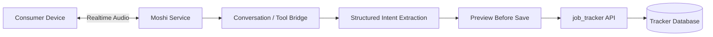
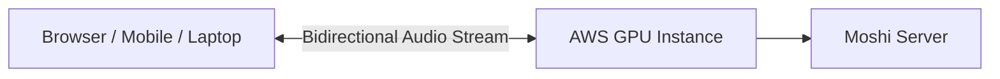
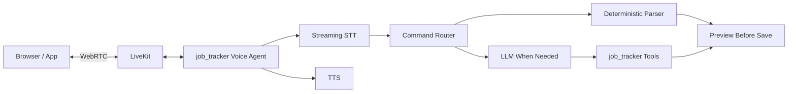
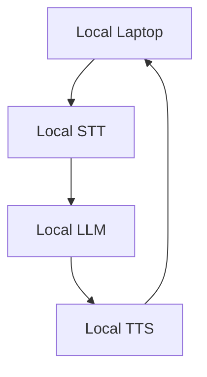
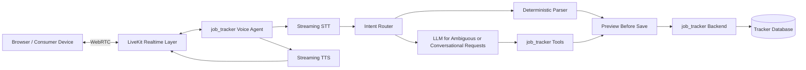
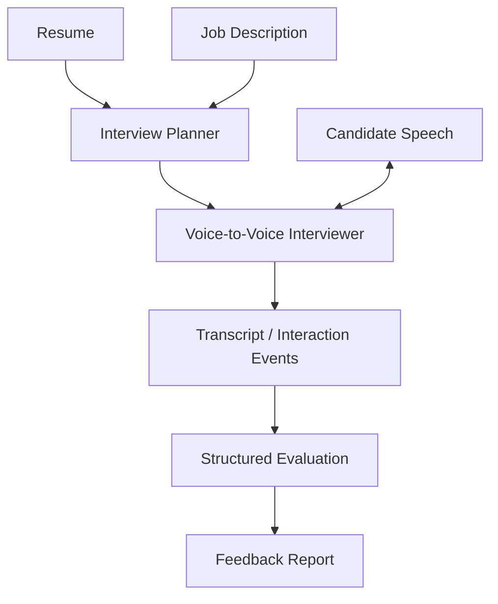

# Engineering Session Report

## 1. Session Objective

This session focused on reassessing the voice-assistant architecture for the `job_tracker` project after earlier exploration of a heavily optimized local deployment.

The original question was whether Unmute should be used directly, adapted layer by layer, or treated only as an architectural reference. The discussion then expanded into:

- Understanding what Unmute actually provides.
    
- Understanding why Moshi is different from conventional voice-agent pipelines.
    
- Evaluating whether Moshi could be deployed remotely as a service.
    
- Comparing self-hosted inference against LiveKit Agents and managed providers.
    
- Identifying whether the earlier effort to replace individual Unmute components was premature optimization.
    
- Planning a lightweight Moshi feasibility experiment on Kaggle.
    
- Identifying the most VRAM-efficient Moshi execution path.
    
- Capturing a separate product idea: a voice-to-voice mock-interview assistant powered experimentally by Moshi.
    

The most important outcome was not an implementation change. It was a clarification of the product boundary:

> The `job_tracker` should prioritize reliable workflow execution and user-facing value before attempting to solve constrained local inference infrastructure.

---

## 2. Starting Context

### Existing project direction

The broader project was already moving toward a local-first, conversational job-tracking assistant. Its intended user experience includes spoken commands such as:

```text
“Mark Analytics Vidhya as high priority.”
“Add a note to the Aiden AI application.”
“Show me the applications where I still need to engage with employees.”
```

The existing product principles carried forward into this session were:

- The tracker remains the source of truth.
    
- Voice is an interface to structured workflows, not a replacement for reliable application state.
    
- Database updates should remain auditable.
    
- Structured actions should be previewed before saving.
    
- Simple commands should be handled deterministically where possible.
    
- LLM involvement should be limited when a deterministic path is sufficient.
    

### Earlier infrastructure concern

A major limitation was the user’s local hardware:

```text
GPU: RTX 3050 Laptop GPU
VRAM: 4 GB
```

Earlier discussion had explored whether Unmute could be modified into a lighter local stack by replacing or optimizing individual layers:

```text
Streaming STT
+ turn detection
+ local LLM
+ streaming TTS
```

This led to questions such as:

- Can a lighter STT model replace the original one?
    
- Can TTS be swapped for a smaller model?
    
- Should models be dynamically loaded and unloaded?
    
- Should some models run on CPU?
    
- Can the whole pipeline fit within 4 GB VRAM?
    

### Trigger for this session

The user questioned whether this effort was overengineered.

The key concern was:

> Enterprises may be willing to pay for inference infrastructure. Instead of manually optimizing every Unmute layer for a constrained laptop, would it be more practical to use hosted inference or LiveKit Agents?

This forced a reassessment of the earlier assumption that the full final solution had to run locally on the laptop.

---

## 3. User Goal Behind the Work

The user’s real objective is not to build a generic low-level audio stack.

The goal is to build a useful conversational interface for managing a job search:

```text
spoken intent
→ reliable structured interpretation
→ preview
→ confirmed tracker update
```

The voice interface matters because job tracking is repetitive and context-heavy. A conversational assistant could reduce the friction of maintaining application records while the user is actively applying, networking, tailoring resumes and preparing for interviews.

The product value comes primarily from:

- Reliable interpretation of job-related commands.
    
- Correct extraction of company names, roles and tracker updates.
    
- Safe mutation of application state.
    
- Support for conversational queries over the tracker.
    
- Integration with resume tailoring and broader job-search workflows.
    
- A natural interaction model that does not require manually editing table rows.
    

The session clarified that low-VRAM inference optimization is secondary unless it directly improves the user experience or becomes a measured cost or privacy bottleneck.

---

## 4. Obstacles Encountered

### Obstacle 1: Unclear understanding of what Unmute represents

#### Symptom

The initial discussion treated Unmute almost like a single deployable model that might need to be optimized until it fit locally.

#### Initially suspected

The problem appeared to be:

```text
Unmute is too heavy
→ replace individual components
→ make the full stack fit into 4 GB VRAM
```

#### Actual root cause

The conceptual model was incomplete.

Unmute is better understood as a modular realtime voice-agent system or reference architecture:

```text
Streaming STT
→ semantic turn detection
→ text LLM
→ streaming TTS
```

It is not equivalent to a single end-to-end model such as Moshi.

#### Why the issue was non-obvious

Both Unmute and Moshi are associated with Kyutai and realtime spoken interaction. It was easy to group them together as variants of the same solution.

However, their boundaries are fundamentally different:

- Unmute wraps a text LLM with speech input and output.
    
- Moshi is speech-native and models spoken interaction more directly.
    

#### System boundary involved

```text
speech pipeline
architecture
model selection
infrastructure
```

#### Resolution

Unmute was reframed as:

- A reference architecture.
    
- A source of reusable orchestration ideas.
    
- A possible source of individual components.
    
- Not necessarily the final deployed stack.
    

---

### Obstacle 2: Confusing Moshi with a lighter version of Unmute

#### Symptom

There was a need to clarify how Moshi differs from existing voice assistants.

#### Initially suspected

A possible assumption was:

```text
Moshi = another STT + LLM + TTS implementation
```

or:

```text
Moshi = a more optimized Unmute-like pipeline
```

#### Actual root cause

Moshi uses a different architectural model.

Traditional voice stack:

```text
Speech
→ speech-to-text
→ text LLM
→ text-to-speech
→ Speech
```

Moshi:

```text
Speech/audio tokens
→ speech-native model
→ Speech/audio tokens
```

Moshi is designed for spoken dialogue and can support full-duplex behavior more naturally.

#### Why the issue was non-obvious

Moshi can expose transcripts, which may make it appear as though it follows the same STT-first pipeline. However, the transcript is not necessarily the mandatory middle representation used to generate speech.

#### System boundary involved

```text
speech pipeline
model architecture
UX
```

#### Resolution

A clear mental model was established:

```text
Unmute = give a text LLM ears and a mouth.

Moshi = spoken conversation is native to the model.
```

---

### Obstacle 3: Local hardware constraints distorted architecture decisions

#### Symptom

The earlier design effort focused heavily on model swapping, quantization, CPU fallback and model load/unload strategies.

#### Initially suspected

It appeared necessary to optimize every layer because the final assistant was assumed to run fully on the user’s laptop.

#### Actual root cause

The architectural scope had prematurely inherited a hard deployment constraint:

```text
Everything must fit on a 4 GB local GPU.
```

That constraint was useful for exploring local-first possibilities, but it had not been proven necessary for the MVP.

#### Why the issue was non-obvious

The broader product direction is local-first. It was natural to treat local inference as a requirement rather than a preference or long-term direction.

However:

```text
local-first product design
≠
all models must run locally from the first MVP
```

#### System boundary involved

```text
infrastructure
deployment
product scope
performance optimization
```

#### Resolution

The session separated product validation from infrastructure optimization.

Updated principle:

> Build the useful workflow first. Optimize or self-host individual inference layers only when cost, privacy, latency or reliability measurements justify it.

---

### Obstacle 4: Hosted Moshi solves compute availability but not workflow integration

#### Symptom

Deploying Moshi on AWS initially appeared to be a way to bypass local VRAM limitations entirely.

#### Initially suspected

The apparent solution was:

```text
Deploy Moshi on AWS GPU
→ stream audio from consumer device
→ local hardware problem solved
→ voice assistant solved
```

#### Actual root cause

Remote GPU hosting solves only the inference placement problem.

It does not solve:

- Reliable tool calling.
    
- Structured job-tracker mutations.
    
- Preview-before-save.
    
- Deterministic parsing.
    
- Tracker query workflows.
    
- Resume tailoring integration.
    
- Session-level workflow orchestration.
    

#### Why the issue was non-obvious

Moshi can deliver a compelling spoken interaction experience. It is easy to overestimate how much of the final application it provides.

#### System boundary involved

```text
speech pipeline
backend
tool-calling contract
UX
infrastructure
```

#### Resolution

Moshi was repositioned as a possible voice backend rather than the full assistant.

Potential integration boundary:



---

### Obstacle 5: Self-hosting and LiveKit Agents were initially treated as competing complete solutions

#### Symptom

The discussion raised a valid question:

> If inference is no longer forced to run locally, why self-host Moshi rather than use LiveKit Agents?

#### Initially suspected

The comparison initially looked like:

```text
Self-host Moshi
vs
Use LiveKit Agents
```

#### Actual root cause

These tools solve different layers.

LiveKit Agents primarily handles realtime agent orchestration and media transport. It is not itself a model.

Moshi is a speech-native inference backend.

They can be combined, although a Moshi integration may require a custom bridge.

#### Why the issue was non-obvious

Both can appear to be “voice-agent solutions,” but they sit at different layers:

```text
LiveKit Agents → realtime transport and orchestration
Moshi          → speech-native conversational inference
```

#### System boundary involved

```text
realtime transport
speech pipeline
infrastructure
agent orchestration
```

#### Resolution

The session explicitly separated three decisions:

|Decision|Core question|
|---|---|
|Voice-agent framework|Who manages media transport, sessions and interruptions?|
|Model architecture|Cascaded STT → LLM → TTS or speech-to-speech?|
|Deployment|Local models, managed APIs or self-hosted cloud GPU?|

---

### Obstacle 6: Kaggle T4×2 VRAM was initially oversimplified

#### Symptom

Kaggle T4×2 was identified as having 32 GB VRAM.

#### Initially suspected

It might appear that Kaggle provides enough memory to run a model requiring approximately 24 GB VRAM.

#### Actual root cause

The memory is split:

```text
GPU 0: 16 GB
GPU 1: 16 GB
Total: 32 GB
```

This is not equivalent to:

```text
One GPU: 32 GB
```

A model requiring approximately 24 GB on one GPU does not automatically fit across two T4 GPUs.

#### Why the issue was non-obvious

Cloud notebook interfaces often summarize accelerator capacity at the notebook level. However, model execution depends on whether the backend explicitly supports sharding, tensor parallelism or pipeline parallelism.

#### System boundary involved

```text
infrastructure
GPU memory management
model runtime
```

#### Resolution

The plan was corrected:

- Do not assume PyTorch BF16 Moshi can use both T4 GPUs automatically.
    
- Avoid custom multi-GPU sharding during the first experiment.
    
- Use the Rust/Candle q8 backend on a single T4 first.
    
- Treat the second T4 as unused unless explicit multi-GPU support is later verified.
    

---

### Obstacle 7: q8 fit on a 16 GB T4 remains uncertain

#### Symptom

A more VRAM-efficient q8 backend was identified, but no actual run had occurred yet.

#### Initially suspected

Quantization might be sufficient to make the model fit within a 16 GB Kaggle T4.

#### Actual root cause

Quantized model weight size is only one part of VRAM consumption.

Additional memory is required for:

```text
weights
+ runtime buffers
+ CUDA allocations
+ streaming state
+ attention state
+ audio codec state
```

#### Why the issue was non-obvious

A q8 checkpoint can appear small enough on disk, but runtime memory may still exceed the available VRAM.

#### System boundary involved

```text
model runtime
GPU memory
infrastructure
```

#### Resolution

This remained an unresolved experiment.

Planned validation:

```bash
nvidia-smi
```

and:

```bash
nvidia-smi --query-compute-apps=pid,process_name,used_memory --format=csv
```

after launching the Rust/Candle q8 backend.

---

### Obstacle 8: A potentially useful side project risked expanding the main project scope

#### Symptom

While evaluating Moshi, the user identified a separate product idea:

```text
voice-to-voice mock interviewing LLM
```

#### Initially suspected

It could potentially become another extension of the `job_tracker`.

#### Actual root cause

The idea is adjacent to the job-search domain but has a distinct product boundary:

```text
job_tracker
= manage applications and job-search workflow

voice mock interviewer
= conduct realistic interview practice and feedback
```

#### Why the issue was non-obvious

Both projects could share:

- Resume context.
    
- Job-description context.
    
- Voice infrastructure.
    
- Career-preparation workflows.
    

#### System boundary involved

```text
product scope
UX
architecture
```

#### Resolution

The mock-interview idea was separated into a new ChatGPT project for independent brainstorming.

A concise initial problem statement was created:

```text
Build an AI-powered voice-to-voice mock interviewer that asks questions,
listens to spoken answers, probes technical depth and resume claims,
asks adaptive follow-ups, simulates interview pressure and generates
structured feedback.

Use Moshi initially as an experimental open-source speech-native backend.
```

---

## 5. Approaches Considered

### Approach 1: Fully optimize Unmute for the local 4 GB GPU

#### What it was

Manually replace or optimize individual layers:

```text
STT
turn detection
LLM
TTS
model lifecycle
CPU fallback
GPU load/unload strategy
```

#### Why it seemed reasonable

The project direction is local-first. A fully local assistant would provide:

- Privacy.
    
- Low recurring cost.
    
- Offline usability.
    
- Independence from managed APIs.
    
- Strong portfolio value as a constrained-systems project.
    

#### Advantages

- Maximum control.
    
- Strong privacy story.
    
- No cloud dependency.
    
- Deep systems-learning value.
    
- Potentially low operating cost after optimization.
    

#### Drawbacks

- Large engineering scope.
    
- Many independent bottlenecks.
    
- Risk of poor UX despite significant effort.
    
- Premature optimization before product validation.
    
- The user’s 4 GB VRAM constraint is severe.
    
- May distract from the actual `job_tracker` workflow.
    

#### Decision

**Deferred as the default implementation strategy.**

The exploration was not considered wasted. It clarified constraints and architectural boundaries. However, forcing the complete pipeline into 4 GB VRAM is no longer the immediate priority.

---

### Approach 2: Use Unmute as a reference architecture

#### What it was

Treat Unmute as a blueprint rather than a mandatory deployable stack.

Relevant ideas to reuse:

```text
streaming STT
semantic turn detection
streaming TTS
realtime orchestration
replaceable components
```

#### Why it seemed reasonable

Unmute already demonstrates how realtime voice systems should be decomposed.

#### Advantages

- Avoids rebuilding conceptual architecture from zero.
    
- Preserves modularity.
    
- Keeps model providers replaceable.
    
- Allows local, cloud and hybrid deployment options.
    

#### Drawbacks

- Does not provide a ready-made final `job_tracker` architecture.
    
- Still requires integration with product-specific tools.
    
- Some original components may be too heavy for local execution.
    

#### Decision

**Adopted as an architectural reference.**

---

### Approach 3: Use Moshi as the primary voice backend

#### What it was

Use Moshi as a speech-native full-duplex backend instead of a cascaded STT → LLM → TTS pipeline.

#### Why it seemed reasonable

Moshi offers capabilities that are difficult to reproduce manually:

- More natural spoken interaction.
    
- Continuous listening and speaking.
    
- Better interruption handling.
    
- Reduced dependence on explicit endpointing.
    
- Potentially richer handling of tone and pauses.
    

#### Advantages

- Strong conversational UX potential.
    
- Interesting systems-engineering experiment.
    
- Open-source speech-native model.
    
- Useful for scenarios such as realistic mock interviews.
    

#### Drawbacks

- Heavy GPU requirement.
    
- Cloud deployment complexity.
    
- Tool integration remains difficult.
    
- Structured JSON-style workflow execution is not its natural strength.
    
- May be overkill for deterministic tracker updates.
    
- Not verified on available Kaggle GPUs.
    

#### Decision

**Deferred as an experimental backend, not adopted as the default `job_tracker` backend.**

---

### Approach 4: Host Moshi remotely on AWS

#### What it was

Run Moshi inference on a GPU EC2 instance and stream realtime audio from a browser, laptop or mobile device.

High-level architecture:



#### Why it seemed reasonable

This removes the local 4 GB VRAM limitation.

#### Advantages

- Consumer device remains lightweight.
    
- Enables realistic Moshi testing.
    
- Avoids laptop VRAM limits.
    
- Supports future multi-device consumption.
    

#### Drawbacks

- GPU cost.
    
- Idle server cost.
    
- Model cold-start delay.
    
- Need for TLS, authentication, logs and health checks.
    
- Persistent realtime transport required.
    
- Does not solve tool-calling reliability.
    
- Adds infrastructure before product value is validated.
    

#### Decision

**Deferred.**

AWS remains a valid later-stage hosting path, especially if Kaggle is insufficient or if Moshi proves valuable enough to justify dedicated infrastructure.

---

### Approach 5: Use LiveKit Agents with managed inference providers

#### What it was

Use LiveKit Agents for realtime media transport and orchestration, while initially relying on managed STT, LLM and TTS providers.

Potential architecture:



#### Why it seemed reasonable

This avoids rebuilding generic realtime infrastructure and keeps focus on product-specific value.

#### Advantages

- Faster MVP development.
    
- Handles WebRTC transport and realtime sessions.
    
- Supports interruptions and streaming workflows.
    
- Provider-agnostic.
    
- Models can be swapped later.
    
- Allows hybrid deployment.
    
- Preserves the option to self-host selected layers later.
    

#### Drawbacks

- Managed inference incurs operating cost.
    
- Less local-first initially.
    
- External provider dependencies.
    
- Moshi may require a custom integration if added later.
    

#### Decision

**Recommended as the practical MVP direction.**

---

### Approach 6: Use deterministic routing for simple tracker commands

#### What it was

Do not send every utterance through a general-purpose LLM.

Example:

```text
“Mark Aiden AI as high priority.”
→ deterministic parser
→ preview
→ confirmed update
```

Complex request:

```text
“Which applications should I focus on this week?”
→ LLM + tracker query tools
→ spoken summary
```

#### Why it seemed reasonable

The tracker contains many commands that can be mapped reliably to structured actions.

#### Advantages

- Lower latency.
    
- Lower inference cost.
    
- Reduced hallucination risk.
    
- Easier debugging.
    
- More auditable behavior.
    

#### Drawbacks

- Parser coverage must be maintained.
    
- Ambiguous or narrative inputs still need an LLM.
    
- Routing rules require careful design.
    

#### Decision

**Retained as a stable architectural principle.**

---

### Approach 7: Test Moshi on Kaggle using the PyTorch BF16 implementation

#### What it was

Run the standard PyTorch Moshi model inside a Kaggle notebook.

#### Why it seemed reasonable

Kaggle T4×2 provides 32 GB aggregate VRAM.

#### Advantages

- Low-cost feasibility experiment.
    
- Easy notebook environment.
    
- Avoids immediate cloud rental.
    

#### Drawbacks

- 32 GB is split across two 16 GB GPUs.
    
- The standard model reportedly requires approximately 24 GB VRAM on one GPU.
    
- Multi-GPU sharding was not verified as a documented plug-and-play feature.
    
- Custom sharding would distract from the experiment goal.
    

#### Decision

**Rejected for the initial test.**

---

### Approach 8: Test Moshi on Kaggle using Rust/Candle q8

#### What it was

Use the quantized Rust/Candle backend with:

```text
rust/moshi-backend/config-q8.json
```

on a single 16 GB T4.

#### Why it seemed reasonable

Quantization reduces weight memory and the Rust backend includes an explicit q8 configuration.

#### Advantages

- Most VRAM-efficient CUDA path discussed.
    
- Avoids manual model sharding.
    
- Suitable for a first feasibility spike.
    
- Keeps the experiment narrow.
    

#### Drawbacks

- Fit on 16 GB remains unverified.
    
- Runtime buffers may still cause OOM.
    
- Kaggle is unsuitable as a production host.
    
- Rust/CUDA build may introduce environment issues.
    

#### Decision

**Adopted as the next experiment.**

---

### Approach 9: Use CPU offloading

#### What it was

Offload parts of inference from GPU to CPU to reduce VRAM pressure.

#### Why it seemed reasonable

CPU offloading can make large models run on smaller GPUs in some systems.

#### Advantages

- Potentially lowers GPU memory requirement.
    
- Could enable limited local or notebook execution.
    

#### Drawbacks

- CPU-GPU transfers may increase latency.
    
- Moshi’s key value is low-latency realtime interaction.
    
- No simple documented offload flag was identified during the discussion.
    
- Could defeat the purpose of evaluating a realtime speech-native model.
    

#### Decision

**Deferred and not recommended for the first experiment.**

---

## 6. Decisions Made

### Decision 1: Stop treating full local inference as an MVP requirement

#### Final decision

The MVP should not be blocked by the requirement to fit every model into the local RTX 3050 4 GB GPU.

#### Reasoning

The product’s differentiating value is the conversational job-tracking workflow, not low-level model compression.

#### Rejected alternative

Continue manually replacing and optimizing every Unmute component before validating the user experience.

#### Stability

**Stable product-development principle**, although a fully local mode remains a future direction.

---

### Decision 2: Treat Unmute as a modular reference architecture

#### Final decision

Reuse the architectural lessons from Unmute without committing to the stock deployment.

#### Reasoning

Its decomposition remains valuable:

```text
audio streaming
turn detection
LLM interaction
TTS streaming
service boundaries
```

#### Rejected alternative

Fork or replicate the full stack immediately.

#### Stability

**Stable architectural principle.**

---

### Decision 3: Keep `job_tracker` voice execution tool-oriented and deterministic where possible

#### Final decision

Simple state mutations should bypass a general-purpose LLM where feasible.

#### Reasoning

Tracker updates require reliability, auditability and preview-before-save.

#### Rejected alternative

Send every spoken utterance directly to a conversational model.

#### Stability

**Stable architectural principle.**

---

### Decision 4: Prefer LiveKit Agents for the practical MVP path

#### Final decision

Use a realtime orchestration framework such as LiveKit Agents rather than manually rebuilding generic streaming infrastructure.

#### Reasoning

The project should focus engineering effort on:

```text
tracker actions
entity handling
structured parsing
preview-before-save
resume tailoring integration
job-search UX
```

rather than generic WebRTC and media plumbing.

#### Rejected alternative

Build a complete custom realtime stack solely from Unmute-inspired components before validating the product.

#### Stability

**Recommended near-term direction**, but not yet implemented.

---

### Decision 5: Treat Moshi as an experimental voice backend

#### Final decision

Moshi should be explored as an optional speech-native backend, not assumed to be the default production backend.

#### Reasoning

Its natural conversational behavior is interesting, but it does not inherently solve structured tracker workflows.

#### Rejected alternative

Make Moshi the central architecture of the `job_tracker`.

#### Stability

**Temporary experimental direction.**

---

### Decision 6: Use Kaggle only for feasibility testing

#### Final decision

Kaggle should be used to answer:

```text
Can Moshi run?
How much VRAM does it use?
Is its conversational behavior worth further investment?
```

It should not be treated as production hosting.

#### Reasoning

Kaggle notebooks are ephemeral and unsuitable for stable realtime services.

#### Rejected alternative

Design a long-term hosted service around Kaggle.

#### Stability

**Stable experiment-scoping decision.**

---

### Decision 7: Use Rust/Candle q8 as the first Kaggle Moshi attempt

#### Final decision

Run the q8 quantized Rust/Candle backend on one T4 GPU.

#### Reasoning

This is the most VRAM-efficient CUDA-compatible route identified in the discussion.

#### Rejected alternatives

- PyTorch BF16 on a single T4.
    
- Assuming T4×2 automatically provides a 32 GB model memory pool.
    
- Implementing custom multi-GPU sharding immediately.
    
- CPU offloading as the first path.
    

#### Stability

**Experiment-specific decision.**

---

### Decision 8: Split the mock-interview idea into a separate project

#### Final decision

Create a separate project for a voice-to-voice mock-interview assistant.

#### Reasoning

It shares infrastructure themes with `job_tracker` but has a distinct product objective.

#### Rejected alternative

Absorb the mock-interview scope into the current `job_tracker` implementation effort.

#### Stability

**Stable project-boundary decision.**

---

## 7. Architecture Evolution

### Previous mental model

Earlier reasoning implicitly assumed:



Constraint:

```text
Everything must fit into 4 GB local VRAM.
```

This drove low-level optimization effort:

```text
component replacement
model quantization
CPU fallback
GPU load/unload
VRAM budgeting
```

### Limitation in the previous design

The design optimized infrastructure before validating the product.

It conflated:

```text
local-first direction
with
fully local MVP execution
```

It also underestimated the value of using a dedicated realtime orchestration layer.

---

### Updated practical MVP design



### Core architectural improvement

The updated design introduces clearer boundaries:

|Boundary|Responsibility|
|---|---|
|LiveKit realtime layer|Audio transport, session management, streaming|
|STT|Convert voice input to text when using cascaded mode|
|Intent router|Decide deterministic parser vs LLM path|
|Deterministic parser|Reliable handling of known tracker commands|
|LLM|Ambiguous language, conversational requests, tool selection|
|Preview layer|Human confirmation before mutation|
|`job_tracker` backend|Authoritative application state|
|TTS|Spoken response generation|

---

### Optional Moshi experiment path


This path introduces an unresolved problem:

> How should a speech-native conversational model reliably emit tool-oriented structured actions without weakening auditability?

---

### New project boundary: mock-interview assistant

The Moshi investigation produced a separate architecture idea:



Moshi is potentially better aligned with this side project because natural conversation quality is central to the product value.

---

## 8. Implementation Progress

### Completed during the session

No source code, backend modules, frontend files, database schemas or tests were modified during this session.

No Moshi backend was actually launched.

No Kaggle notebook cells were executed.

No AWS infrastructure was provisioned.

### Completed design work

The following conceptual work was completed:

- Clarified the difference between Unmute and Moshi.
    
- Reframed Unmute as a reference architecture rather than a mandatory deployment.
    
- Identified LiveKit Agents as a practical orchestration framework for the MVP.
    
- Separated the framework, model and deployment decisions.
    
- Defined an optional cloud-hosted Moshi architecture.
    
- Defined a Kaggle feasibility experiment.
    
- Corrected the assumption that T4×2 automatically behaves like a 32 GB GPU.
    
- Selected Rust/Candle q8 as the first VRAM-efficient Moshi path.
    
- Deferred PyTorch BF16, CPU offloading and custom multi-GPU sharding.
    
- Created a separate concise problem statement for a mock-interview project.
    

### Planned Kaggle setup

The proposed experiment path was:

```text
Kaggle Notebook
→ GPU T4×2 selected
→ use GPU 0 initially
→ clone Moshi repository
→ build Rust/Candle backend
→ use config-q8.json
→ launch standalone server
→ inspect VRAM
→ tunnel browser access
→ test realtime conversation
```

Proposed command:

```bash
cd moshi/rust

cargo run \
  --features cuda \
  --bin moshi-backend \
  -r -- \
  --config moshi-backend/config-q8.json \
  standalone
```

### Planned VRAM inspection

```bash
nvidia-smi --query-gpu=index,name,memory.total,memory.used,memory.free,utilization.gpu --format=csv
```

and:

```bash
nvidia-smi --query-compute-apps=pid,process_name,used_memory --format=csv
```

---

## 9. Validation and Evidence

### Validation completed during the session

This was primarily an architecture and experiment-planning session.

No runtime validation was completed.

No empirical performance measurement was collected.

No transcript accuracy result was collected.

No model load time was recorded.

No VRAM consumption number was observed from an actual Moshi process.

### Reasoning evidence used

The discussion relied on the following technical constraints:

```text
Local laptop GPU:
RTX 3050 Laptop GPU
4 GB VRAM
```

```text
Kaggle T4×2:
GPU 0 = approximately 16 GB
GPU 1 = approximately 16 GB
Aggregate = approximately 32 GB
```

The important corrected conclusion was:

```text
2 × 16 GB
≠
one contiguous 32 GB device
```

### Experiment acceptance criteria

The Kaggle test should answer:

1. Does the Rust/Candle q8 backend compile successfully?
    
2. Does the model load on a single 16 GB T4?
    
3. What is actual VRAM consumption?
    
4. Does the process fail with CUDA OOM?
    
5. Can the browser client connect?
    
6. Does realtime conversation work?
    
7. Is latency acceptable for a mock-interview use case?
    
8. Can the user interrupt the assistant naturally?
    
9. Do long pauses trigger premature responses?
    
10. Does audio lag accumulate during a longer conversation?
    

### Remaining uncertainty

The most important unresolved technical uncertainty is:

> Whether the Rust/Candle q8 backend fits and performs acceptably on a single Kaggle T4 with 16 GB VRAM.

This must be measured rather than assumed.

---

## 10. Lessons Learned

### Lesson 1: Separate product requirements from infrastructure preferences

A local-first vision does not mean every MVP model must execute locally.

A better sequence is:

```text
validate user value
→ measure bottlenecks
→ optimize the expensive or sensitive layers
→ self-host only where justified
```

---

### Lesson 2: Do not rebuild commodity infrastructure unnecessarily

Realtime voice products require:

```text
audio transport
streaming
interruptions
session lifecycle
jitter handling
media coordination
```

These are substantial engineering problems.

Using a framework such as LiveKit allows the project to focus on differentiated behavior rather than generic media infrastructure.

---

### Lesson 3: Speech-native models and tool-oriented agents optimize for different goals

Moshi is attractive for:

```text
natural conversation
interruptions
timing
prosody
speech-native interaction
```

The `job_tracker` requires:

```text
reliable commands
structured output
preview-before-save
auditable mutations
database integration
```

A model can be impressive conversationally and still be the wrong default tool-execution backend.

---

### Lesson 4: VRAM totals must be interpreted at the device boundary

Aggregate GPU memory is not automatically usable by one model.

Always distinguish:

```text
single-device VRAM
vs
aggregate VRAM across multiple GPUs
```

and verify whether the runtime supports:

```text
tensor parallelism
pipeline parallelism
model sharding
```

---

### Lesson 5: Quantized checkpoint size is not runtime VRAM usage

Runtime memory includes more than weights:

```text
weights
+ buffers
+ attention state
+ streaming state
+ audio codec state
+ CUDA overhead
```

A model that appears to fit on disk may still fail at runtime.

---

### Lesson 6: First experiments should answer one question at a time

The immediate question is:

```text
Can Moshi q8 run acceptably on Kaggle?
```

It is not:

```text
Can we invent a custom multi-GPU Moshi serving architecture?
```

Avoiding custom sharding keeps the feasibility spike focused.

---

### Lesson 7: Adjacent product ideas should be split before they expand scope

The mock-interview assistant is valuable, but it is not the same product as the `job_tracker`.

Separating it preserves focus while allowing reuse of architectural learning later.

---

## 11. Open Questions and Deferred Work

### Required next steps

#### 1. Run the Kaggle Moshi q8 feasibility experiment

Use:

```text
Rust/Candle backend
+ q8 config
+ one T4 GPU
```

Measure:

```text
compile success
model load success
VRAM consumption
startup time
conversation latency
audio stability
interruption handling
```

#### 2. Decide the `job_tracker` MVP voice stack

Evaluate a practical LiveKit-based route:

```text
LiveKit Agents
+ streaming STT
+ deterministic parser
+ LLM tools where needed
+ streaming TTS
```

#### 3. Define the voice-backend interface

The project should keep inference replaceable.

Potential abstraction:

```text
VoiceBackend
├── CascadedBackend
├── ManagedRealtimeBackend
├── MoshiBackend
└── FutureLocalBackend
```

---

### Optional enhancements

- Compare managed STT providers against local faster-whisper.
    
- Test semantic turn detection for long pauses.
    
- Benchmark entity accuracy for company names and roles.
    
- Add provider fallback logic.
    
- Evaluate self-hosted STT only if managed STT cost or accuracy becomes a problem.
    
- Explore AWS GPU hosting only if Kaggle testing proves Moshi useful.
    
- Investigate a custom LiveKit-to-Moshi bridge.
    
- Measure cost per active interview or voice session.
    
- Build a separate voice mock-interview MVP.
    

---

### Ideas explicitly rejected for now

- Forcing the complete Unmute-style stack into 4 GB VRAM before MVP validation.
    
- Treating Kaggle as permanent production hosting.
    
- Assuming T4×2 automatically solves a 24 GB single-GPU requirement.
    
- Implementing custom multi-GPU sharding as the first experiment.
    
- Using CPU offloading as the first Moshi optimization.
    
- Making Moshi the default `job_tracker` backend before measuring its value.
    
- Folding the mock-interview product directly into the `job_tracker` scope.
    

---

### Questions requiring investigation

1. Does Rust/Candle q8 Moshi fit into 16 GB VRAM?
    
2. What is actual realtime latency on Kaggle?
    
3. Is Kaggle network latency too high to evaluate full-duplex behavior fairly?
    
4. How stable is the Rust/Candle build in Kaggle’s CUDA environment?
    
5. Does Moshi provide a meaningful UX improvement over a LiveKit cascaded pipeline?
    
6. Can Moshi expose a reliable enough tool-calling interface for `job_tracker` mutations?
    
7. Would a custom bridge be required between LiveKit and Moshi?
    
8. Which managed STT and TTS providers would be appropriate for the first MVP?
    
9. Should the `job_tracker` retain an offline deterministic command mode even if richer voice conversations use managed infrastructure?
    
10. Is Moshi more valuable for the separate mock-interview product than for the `job_tracker` itself?
    

---

## 12. Significance in the Overall Project Journey

This session was primarily a **foundational architecture correction** and a **scope-management milestone**.

It did not add code, but it prevented the project from continuing down an unnecessarily expensive engineering path.

Before this session, the project risked becoming:

```text
a constrained local voice-inference optimization project
```

instead of:

```text
a useful conversational job-tracking assistant
```

The session established a more mature engineering strategy:

```text
Use existing realtime infrastructure for the MVP.
Keep voice backends replaceable.
Retain deterministic workflow execution.
Measure before optimizing.
Explore Moshi separately where speech-native interaction creates real value.
```

It also produced a separate promising project direction: an adaptive voice-to-voice mock-interview assistant, where Moshi’s strengths may be more directly relevant.

---

## 13. Compact Timeline Entry

**Milestone:** Reassessed the realtime voice architecture and defined a Moshi feasibility experiment.

**Problem:** The project was at risk of overengineering a fully local Unmute-inspired stack to fit a 4 GB laptop GPU before validating the actual `job_tracker` voice workflow.

**Key obstacle:** Unmute, Moshi, LiveKit Agents and deployment choices were initially mixed together as if they solved the same layer. Kaggle T4×2 memory was also initially treated as a usable 32 GB pool rather than two separate 16 GB GPUs.

**Decision:** Treat Unmute as a reference architecture, prefer a LiveKit-based modular MVP, retain deterministic routing for simple tracker commands, keep Moshi as an experimental backend and test Rust/Candle q8 on one Kaggle T4.

**Outcome:** The architecture was simplified conceptually, premature local-inference optimization was deferred, and the next experiment became narrowly defined. A separate Moshi-inspired voice mock-interview project idea was also split out for independent brainstorming.

**Next step:** Run the Kaggle Rust/Candle q8 experiment, record actual VRAM usage and realtime behavior, then finalize the first practical `job_tracker` voice MVP stack.