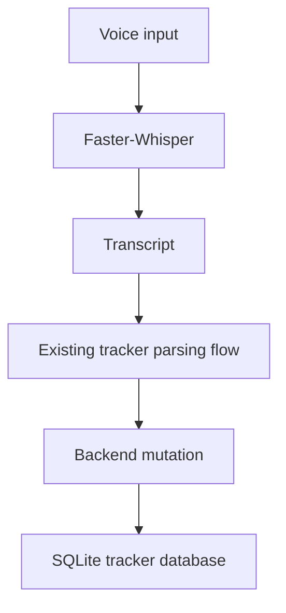
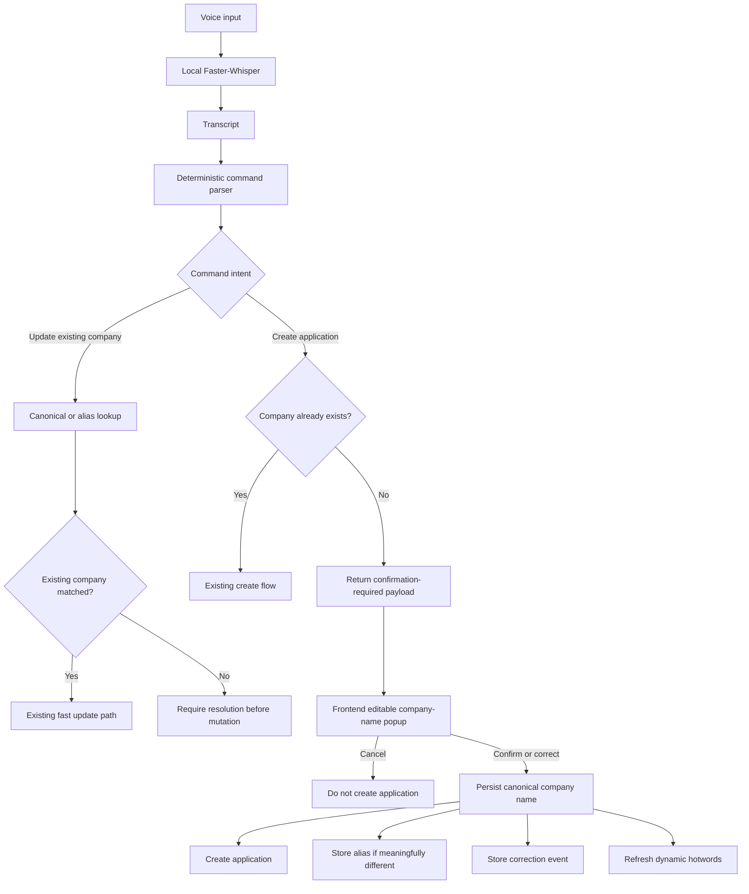
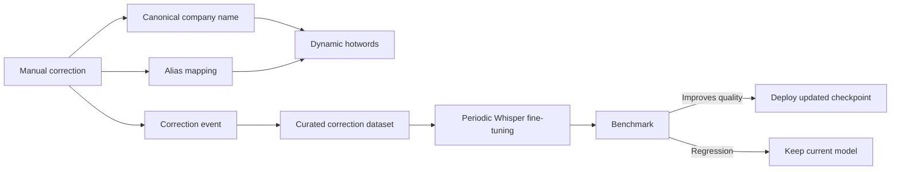
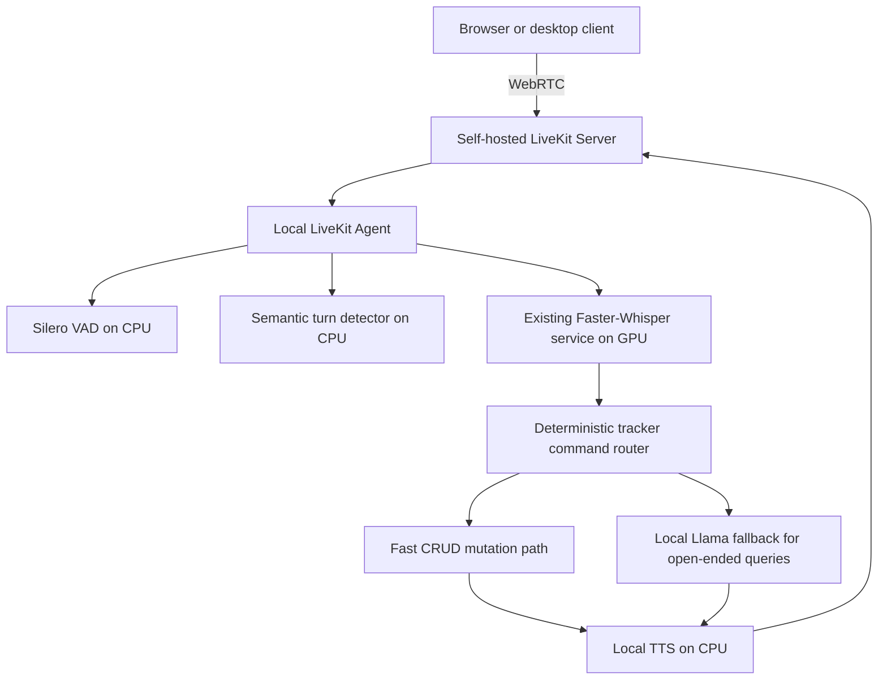

# Engineering Session Report

## 1. Session Objective

This session defined the next architecture phase for the `job_tracker` project’s local voice interface.

The main objective was to determine whether the existing local speech stack should evolve into a LiveKit-based realtime assistant and, more specifically, how to combine:

```text
Self-hosted LiveKit
+ local Faster-Whisper STT
+ local Llama-family model
+ local TTS
+ existing deterministic tracker workflows
```

The discussion then narrowed into a concrete UX and implementation problem:

> How should the system handle newly spoken company names that Whisper may transcribe incorrectly, without adding excessive friction to every tracker interaction?

The resulting design introduced a new-company-only manual confirmation popup, immediate hotword and alias adaptation, and a future periodic Whisper fine-tuning loop.

The session ended by creating phased Codex prompts for implementing the design inside the existing `job_tracker_assistant` monorepo.

---

## 2. Starting Context

### Existing project state

The project already had a functional local-first job-tracking foundation:

```text
job_tracker_assistant/
├── AGENTS.md
├── applicationops-extension/
├── data/
├── docker/
├── evaluation/
├── jobtracker-BE/
├── jobtracker-FE/
├── README.md
└── whisper-service/
```

The user clarified that active development should continue inside:

```text
/home/aditya/dev-work/job_tracker_assistant
```

The existing Faster-Whisper service was already available under:

```text
/home/aditya/dev-work/job_tracker_assistant/whisper-service
```

It had its own `.venv`, existing application code, Dockerfile, README and tests.

The monorepo also already contained:

- `jobtracker-BE/`: backend application and SQLite database
    
- `jobtracker-FE/`: frontend
    
- `applicationops-extension/`: browser extension
    
- `evaluation/`: Faster-Whisper benchmark and evaluation tooling
    
- `docker/`: Faster-Whisper container definition
    
- `data/`: raw audio datasets
    

Previous work had already established that Faster-Whisper medium FP16 could run successfully on the user’s local machine.

### Trigger for the discussion

The user was evaluating the realtime voice architecture and asked whether the following core stack was appropriate:

```text
Whisper for STT
+ LiveKit for realtime voice handling
+ Llama as the assistant brain
```

The discussion initially contained an incorrect project assumption: the response treated the voice stack as if it were intended for a mock-interviewer project. The user corrected this explicitly:

> This is for the job tracking project. The interviewer project will be discussed separately.

That clarification changed the architectural focus. The goal was not open-ended interview conversation. It was a local-first conversational interface for structured job-tracker operations.

### Assumptions carried forward

At the beginning, several assumptions were explored:

1. LiveKit might provide TTS directly.
    
2. Every voice command might need an LLM.
    
3. Every database mutation might require a spoken confirmation.
    
4. Unknown company names might force the system into either brittle rule-based parsing or LLM-based extraction.
    
5. Periodic fine-tuning might be the only way to improve company-name recognition.
    

Each of these assumptions was refined during the session.

---

## 3. User Goal Behind the Work

The user wants the `job_tracker` project to behave like a local-first conversational assistant rather than a conventional CRUD dashboard.

The intended experience is:

```text
User speaks naturally
        ↓
System transcribes locally
        ↓
Tracker update is interpreted
        ↓
User sees the resulting application change
        ↓
System improves over time from corrections
```

The user specifically wants to avoid a voice interface that feels rigid or annoying.

The assistant must support commands such as:

```text
“Mark Analytics Vidhya as rejected.”
“Set Rockwell priority to high.”
“Add Krutrim Labs for an AI Engineer role.”
```

The product experience should satisfy four competing goals:

- **Low latency:** simple tracker commands should not wait for an LLM.
    
- **Reliability:** company names should not be silently corrupted by STT mistakes.
    
- **Low friction:** users should not have to verbally confirm every update.
    
- **Incremental learning:** confirmed corrections should make future recognition better and eventually support periodic fine-tuning.
    

This work mattered because the voice layer must feel trustworthy enough for day-to-day use. A system that silently stores incorrect company names would degrade the tracker’s source-of-truth quality. A system that asks too many questions would make voice interaction slower than manual editing.

---

## 4. Obstacles Encountered

### Obstacle 1: Project scope was initially misclassified

#### Symptom

The first architecture recommendation was framed around a mock-interviewer use case rather than the `job_tracker` project.

#### Initially suspected

The conversation context appeared to suggest a broader voice-agent architecture discussion.

#### Actual root cause

The response carried forward an incorrect project association. The user explicitly clarified that the interviewer project must remain separate.

#### Why it was non-obvious

Both projects could plausibly use a realtime speech stack:

```text
STT → LLM → TTS
```

However, their requirements differ significantly.

A mock interviewer benefits from long-form reasoning and natural dialogue. The `job_tracker` assistant primarily needs safe structured mutations, fast updates and selective reasoning.

#### Boundary involved

- Product scope
    
- Architecture
    
- LLM routing
    
- UX
    

#### Resolution

The architecture was reoriented around the tracker use case only.

The new principle became:

```text
Structured tracker commands
→ deterministic fast path

Open-ended tracker questions
→ local Llama fallback
```

The mock-interviewer project was explicitly excluded from this project’s scope.

---

### Obstacle 2: Ambiguity around “LiveKit TTS”

#### Symptom

The user asked whether they could use:

```text
Whisper for STT
+ LiveKit for TTS
+ Llama as brain
```

#### Initially suspected

LiveKit might directly provide a local TTS engine as part of its stack.

#### Actual root cause

LiveKit is primarily an orchestration and realtime media layer. It can connect to hosted inference services or provider plugins, but it is not itself a standalone local TTS model.

#### Why it was non-obvious

From a product-level perspective, LiveKit can expose TTS functionality through integrations. This can make it appear as if LiveKit itself is the speech synthesis engine.

#### Boundary involved

- Infrastructure
    
- Speech pipeline
    
- Third-party services
    

#### Resolution

The precise architecture was clarified:

```text
LiveKit Agents
+ local Faster-Whisper STT
+ local Llama-family LLM
+ TTS engine integrated through LiveKit
```

For the local-first version, local TTS was recommended instead of a hosted LiveKit inference service.

---

### Obstacle 3: Distinguishing free self-hosted LiveKit features from paid cloud services

#### Symptom

The user wanted to know what could run locally for free and what would require payment.

#### Initially suspected

Using LiveKit might introduce unavoidable cloud costs.

#### Actual root cause

LiveKit has both:

```text
Open-source self-hosted components
and
optional managed cloud services
```

The realtime media server and agent framework can run locally. Hosted inference, cloud transport, advanced cloud observability and certain managed enhancements may require payment.

#### Why it was non-obvious

The LiveKit ecosystem combines open-source infrastructure with hosted conveniences. Without separating these layers, cost planning becomes unclear.

#### Boundary involved

- Infrastructure
    
- Deployment
    
- Cost constraints
    

#### Resolution

The local MVP was scoped to free self-hosted components:

```text
Self-hosted LiveKit Server
LiveKit Agents SDK
WebRTC audio transport
Silero VAD
Semantic turn detection
Basic interruption handling
Local Faster-Whisper
Local Llama
Local TTS
Custom metrics
```

Optional paid or deferred services included:

```text
LiveKit Cloud transport
Hosted LiveKit Inference
Hosted STT / LLM / TTS
Enhanced cloud noise cancellation
Adaptive cloud interruption handling
Cloud observability dashboard
SIP telephony
Ingress
Egress
```

---

### Obstacle 4: Local GPU capacity is insufficient for placing every model on GPU

#### Symptom

The user asked how much VRAM the full local stack would require.

#### Initially suspected

A compact Whisper, Llama and TTS stack might all fit concurrently into the available GPU memory.

#### Actual root cause

The machine has an RTX 3050 Laptop GPU with approximately 4 GB VRAM. Running Whisper medium, a quantized Llama model and a GPU TTS model simultaneously would likely exceed available VRAM.

#### Why it was non-obvious

Each model may appear individually feasible. The problem emerges when model weights, runtime buffers, CUDA overhead, desktop compositor usage and KV cache are combined.

#### Boundary involved

- Infrastructure
    
- Model performance
    
- Runtime resource allocation
    

#### Resolution

A CPU/GPU hybrid design was selected:

```text
GPU:
- Faster-Whisper only

CPU:
- LiveKit Server
- LiveKit Agents
- Silero VAD
- semantic turn detector
- local quantized Llama
- local TTS
- FastAPI backend
- SQLite database
```

Estimated local VRAM target:

```text
~2.2–3.5 GB
```

The LLM and TTS should remain on CPU initially. End-to-end benchmarking is still required.

---

### Obstacle 5: Confusion about the role of a deterministic parser

#### Symptom

The proposed architecture included a deterministic parser. The user asked what that meant.

#### Initially suspected

A rule-based parser might be too brittle for natural voice input.

#### Actual root cause

The term needed clarification. The deterministic parser was not intended as a simplistic regex-only system. It was intended as a layered fast path for structured tracker commands.

#### Why it was non-obvious

“Deterministic parser” can imply rigid command syntax. In this design, it includes normalization, known-value validation, entity matching, aliases and optional fuzzy matching.

#### Boundary involved

- Backend
    
- Speech pipeline
    
- Command interpretation
    
- UX
    

#### Resolution

The deterministic parser was defined as:

```text
Whisper transcript
        ↓
Normalize text
        ↓
Detect structured intent
        ↓
Extract fields
        ↓
Validate allowed values
        ↓
Generate tracker patch
```

Example:

```text
Input:
“Set the priority of Rockwell Automation to high.”

Output:
{
  intent: "update_application",
  company: "Rockwell Automation",
  field: "priority",
  value: "HIGH"
}
```

The parser handles predictable CRUD commands without requiring Llama.

---

### Obstacle 6: New company names cannot rely only on existing-company lookup

#### Symptom

The user asked what would happen when a company name had never appeared in the tracker before.

#### Initially suspected

A deterministic parser might fail because the company dictionary would not contain the new name.

#### Actual root cause

Create and update workflows require different entity-resolution rules.

For updates, the system should be strict because an unknown name may be an ASR mistake.

For creates, an unknown company is expected and valid.

#### Why it was non-obvious

The same spoken entity can require opposite behaviour depending on the command intent.

Example:

```text
“Add Krutrim Labs for AI Engineer.”
```

Unknown company is valid.

But:

```text
“Mark Krutrim Labs as rejected.”
```

Unknown company may indicate a mistaken transcription or a missing record.

#### Boundary involved

- Backend
    
- Database
    
- Speech pipeline
    
- UX
    

#### Resolution

The create and update paths were separated.

```text
Create command + unknown company
→ allow candidate creation flow

Update command + unknown company
→ do not silently mutate
→ require resolution
```

---

### Obstacle 7: Confirmation before every mutation would create too much friction

#### Symptom

The initial discussion suggested preview and confirmation before saving changes. The user questioned whether this would create excessive friction.

#### Initially suspected

Confirmation might be necessary for reliability.

#### Actual root cause

A universal confirmation step is too expensive for a conversational tracker. Most operations are low-risk and should remain fast.

#### Why it was non-obvious

Reliability and low friction are both important. A safe design can easily become annoying if every successful parse causes another voice round-trip.

#### Boundary involved

- UX
    
- Frontend
    
- Backend workflow
    

#### Resolution

The initial recommendation evolved into risk-based confirmation:

```text
High-confidence low-risk command
→ save directly + show Undo

Ambiguous entity
→ ask for confirmation

Destructive action
→ explicit confirmation
```

The user then refined this further.

Final chosen UX:

```text
Only new-company creation
→ frontend popup asking user to confirm or edit company name manually

Existing-company updates
→ no popup
```

Voice-based confirmation was explicitly rejected for the current phase.

---

### Obstacle 8: Spoken confirmation was rejected in favour of a manual popup

#### Symptom

The user accepted the need for confirmation but did not want voice confirmation.

#### Initially suspected

A spoken “Did you mean X?” interaction might be natural in a voice assistant.

#### Actual root cause

For company names, verbal correction can be cumbersome and error-prone. Manual text editing is more reliable when STT has already failed.

#### Why it was non-obvious

Voice confirmation appears consistent with a conversational interface. However, proper nouns are precisely where voice interaction is least reliable.

#### Boundary involved

- Frontend
    
- UX
    
- Speech pipeline
    

#### Resolution

The user selected a popup-based confirmation flow only for new company names.

Example:

```text
Confirm company name

[ Crew Trim Labs              ]

Role: AI Engineer

[Cancel]   [Confirm and Add]
```

The user can manually change:

```text
Crew Trim Labs
```

to:

```text
Krutrim Labs
```

before saving.

---

### Obstacle 9: Fine-tuning is not the correct immediate memory mechanism

#### Symptom

The user wanted the model to remember company names and avoid making the same mistake in future.

#### Initially suspected

The model might need to be fine-tuned whenever new company names are added.

#### Actual root cause

Fine-tuning is a batch adaptation mechanism, not a per-company immediate memory mechanism.

#### Why it was non-obvious

From a product perspective, both hotwords and fine-tuning look like “teaching the model.” Internally, they serve different purposes and operate on different timescales.

#### Boundary involved

- Model performance
    
- Speech pipeline
    
- Dataset design
    

#### Resolution

The user clarified that periodic fine-tuning was intended.

The final adaptation strategy became:

```text
Immediate adaptation:
confirmed company names
→ dynamic hotwords
→ alias table
→ benefit from subsequent requests

Periodic adaptation:
corrected audio-transcript pairs
→ curated dataset
→ batch Whisper fine-tuning
→ benchmark
→ deploy only if improved
```

---

### Obstacle 10: Existing service path was initially stated imprecisely

#### Symptom

The user said Faster-Whisper was already available at:

```text
/home/aditya/dev-work/job_tracker_assistant/whisper-service/.dockerignore
```

#### Initially suspected

`.dockerignore` might be the relevant Faster-Whisper service location.

#### Actual root cause

`.dockerignore` is a file path. The actual service directory is:

```text
/home/aditya/dev-work/job_tracker_assistant/whisper-service
```

#### Why it was non-obvious

The user was pointing to an existing service location informally. Hidden files were not visible in the supplied `tree -L 2` output.

#### Boundary involved

- Infrastructure
    
- Repository structure
    

#### Resolution

The service directory was identified correctly. The implementation plan explicitly avoided creating a duplicate service or duplicate virtual environment.

---

## 5. Approaches Considered

### Approach 1: Use LiveKit Cloud and hosted inference services

#### Description

Use managed LiveKit infrastructure and hosted STT, LLM or TTS services.

#### Why it seemed reasonable

This would simplify deployment and reduce local integration work.

#### Advantages

- Faster initial prototype
    
- Less local compute pressure
    
- Managed scaling
    
- Built-in hosted inference integrations
    
- Cloud observability options
    

#### Drawbacks

- Recurring cost
    
- Cloud dependency
    
- Less aligned with local-first goals
    
- Potential privacy concerns
    
- Less useful as a fully local portfolio system
    

#### Decision

Deferred for MVP.

The project should begin with self-hosted LiveKit and local inference.

---

### Approach 2: Run Whisper, Llama and TTS simultaneously on GPU

#### Description

Place the full speech pipeline on the RTX 3050 Laptop GPU.

#### Why it seemed reasonable

GPU acceleration could improve end-to-end response latency.

#### Advantages

- Faster model inference
    
- Lower CPU load
    
- Potentially smoother realtime responses
    

#### Drawbacks

- 4 GB VRAM is insufficient for all three models simultaneously
    
- Increased risk of out-of-memory failures
    
- Less predictable system behaviour
    
- Desktop and CUDA overhead reduce usable VRAM
    
- Concurrent workloads would complicate debugging
    

#### Decision

Rejected for the initial implementation.

The selected hybrid allocation keeps Faster-Whisper on GPU and Llama plus TTS on CPU.

---

### Approach 3: Send every transcript through Llama

#### Description

Use a local Llama model to interpret every voice command.

#### Why it seemed reasonable

An LLM can understand flexible natural language and reduce parser complexity.

#### Advantages

- High linguistic flexibility
    
- Less dependence on fixed command patterns
    
- Easier support for conversational phrasing
    

#### Drawbacks

- Additional latency for basic CRUD updates
    
- CPU-based Llama would slow routine commands
    
- Hallucination risk
    
- Inconsistent structured output
    
- Unnecessary compute usage
    
- More difficult validation
    

#### Decision

Rejected as the default path.

Llama should be reserved for open-ended reasoning or ambiguous fallback scenarios.

---

### Approach 4: Use a deterministic parser for structured tracker commands

#### Description

Handle known CRUD operations through rules, normalization, validation and entity lookup.

#### Why it seemed reasonable

Most tracker updates are predictable and map naturally to structured patches.

#### Advantages

- Fast
    
- Low compute cost
    
- Predictable
    
- Easy to validate
    
- Safer for database mutations
    
- Compatible with existing tracker workflows
    

#### Drawbacks

- Requires carefully designed intent boundaries
    
- Unknown company names need special handling
    
- Loose or highly conversational input may require fallback logic
    
- Alias and entity normalization become important
    

#### Decision

Adopted as a stable architectural principle.

---

### Approach 5: Require confirmation before every tracker mutation

#### Description

Show or speak a confirmation step before saving any update.

#### Why it seemed reasonable

This would reduce the risk of incorrect database mutations.

#### Advantages

- Strong safety
    
- Easy recovery before persistence
    
- Clear user control
    

#### Drawbacks

- High interaction friction
    
- Slower than manual editing
    
- Annoying for repetitive status or priority updates
    
- Poor conversational experience
    

#### Decision

Rejected.

The system should confirm only when risk or ambiguity justifies it.

---

### Approach 6: Use voice-based confirmation for uncertain company names

#### Description

When Whisper detects an unknown company name, ask the user verbally whether the name is correct.

#### Why it seemed reasonable

It preserves a fully conversational experience.

#### Advantages

- Hands-free interaction
    
- Natural voice-agent behaviour
    
- No frontend interaction required
    

#### Drawbacks

- Proper nouns are difficult to correct verbally
    
- Repeating the company name may still produce another STT error
    
- Longer voice loop
    
- More frustrating than manual correction
    
- Harder to inspect exact spelling
    

#### Decision

Rejected for the current phase.

A manual editable popup was preferred.

---

### Approach 7: Show a popup for every company-related command

#### Description

Require manual company verification for all create and update commands.

#### Why it seemed reasonable

It would guarantee the selected company record is visible before modification.

#### Advantages

- Strong protection against entity mismatch
    
- Easy inspection
    
- Simple conceptual model
    

#### Drawbacks

- Excessive friction for known companies
    
- Repetitive manual clicking
    
- Voice interface loses its efficiency advantage
    

#### Decision

Rejected.

The popup should appear only when creating a genuinely new company.

---

### Approach 8: Fine-tune Whisper every time a new company is added

#### Description

Immediately retrain or update model weights after confirming a new company name.

#### Why it seemed reasonable

The user wants the system to avoid repeating mistakes.

#### Advantages

- Conceptually direct model adaptation
    
- Potential long-term improvement
    

#### Drawbacks

- Training is too expensive for per-entry use
    
- Requires audio-transcript dataset management
    
- Model conversion and redeployment overhead
    
- Risk of overfitting
    
- Difficult to benchmark continuously
    
- Not suitable as immediate memory
    

#### Decision

Rejected.

Periodic fine-tuning was selected instead.

---

### Approach 9: Dynamic hotwords plus alias storage

#### Description

After a company name is manually confirmed:

```text
canonical company name
→ added to dynamic ASR hotwords

incorrect ASR form
→ stored as alias
```

#### Why it seemed reasonable

This provides immediate adaptation without retraining the model.

#### Advantages

- Improvement from the next request onward
    
- Low implementation cost
    
- Works with the existing Faster-Whisper service
    
- Preserves canonical company identity
    
- Supports correction analytics
    
- Builds a future fine-tuning dataset
    

#### Drawbacks

- Hotwords improve probability but do not guarantee perfect transcription
    
- Alias storage needs careful normalization
    
- Hotword lists must remain bounded
    
- Fuzzy matching must not merge legitimate companies incorrectly
    

#### Decision

Adopted.

---

### Approach 10: Implement LiveKit immediately alongside popup, alias and fine-tuning preparation work

#### Description

Add realtime transport, VAD, TTS, entity confirmation and correction capture in one implementation cycle.

#### Why it seemed reasonable

This would move quickly toward the final realtime system.

#### Advantages

- Faster path to end-to-end voice demo
    
- Immediate validation of the full stack
    

#### Drawbacks

- Too many moving parts
    
- Harder debugging
    
- Difficult to isolate errors between transport, ASR, parser, backend and frontend
    
- Larger refactor risk
    
- More difficult Codex review
    

#### Decision

Deferred.

The immediate implementation cycle should focus on:

```text
dynamic hotwords
+ aliases
+ new-company confirmation popup
+ correction capture
+ dataset export preparation
```

LiveKit integration should follow after the existing ASR flow is stable.

---

## 6. Decisions Made

### Decision 1: Keep the job-tracker voice architecture separate from the mock-interviewer project

#### Final decision

This project space covers only the `job_tracker` assistant.

#### Reasoning

The tracker’s primary needs are structured mutations, source-of-truth protection and low-friction voice workflows. A mock interviewer has different dialogue and reasoning requirements.

#### Rejected alternative

Treating both products as one generic voice-agent architecture.

#### Stability

Stable project-boundary principle.

---

### Decision 2: Use self-hosted LiveKit as the realtime orchestration layer

#### Final decision

LiveKit should manage realtime media transport, sessions, VAD integration, turn handling and interruptions.

#### Reasoning

It provides the realtime backbone without requiring a custom WebRTC stack.

#### Rejected alternative

Using LiveKit-hosted inference as the default or assuming LiveKit itself is the TTS engine.

#### Stability

Stable architectural direction, but implementation is deferred until the ASR adaptation loop is stable.

---

### Decision 3: Use Faster-Whisper as the local STT engine

#### Final decision

Reuse the existing `whisper-service/` rather than creating a new service.

#### Reasoning

The service already exists, has its own `.venv`, Dockerfile and tests, and Faster-Whisper medium FP16 has already been evaluated locally.

#### Rejected alternative

Creating a duplicate STT service or replacing the current setup prematurely.

#### Stability

Stable unless future benchmarks justify a different model.

---

### Decision 4: Keep Llama out of the routine CRUD path

#### Final decision

Use Llama only for open-ended questions or ambiguous fallback cases.

#### Reasoning

Routine tracker updates are structured and do not need LLM reasoning. Avoiding Llama improves latency and reliability.

#### Rejected alternative

Sending every transcript through a local LLM.

#### Stability

Stable architectural principle.

---

### Decision 5: Use a deterministic parser as the primary command path

#### Final decision

Structured commands should flow through a deterministic parser with normalization, validation, entity lookup and aliases.

#### Reasoning

This produces predictable backend patches and avoids unnecessary hallucinations.

#### Rejected alternative

An LLM-first mutation architecture.

#### Stability

Stable architectural principle.

---

### Decision 6: Separate unknown-company behaviour for create and update intents

#### Final decision

Use different rules:

```text
Create + unknown company
→ new-company candidate flow

Update + unknown company
→ do not silently create or mutate
```

#### Reasoning

Unknown company names are valid during creation but suspicious during updates.

#### Rejected alternative

Treating all unknown company names uniformly.

#### Stability

Stable domain rule.

---

### Decision 7: Add a manual editable popup only for new-company creation

#### Final decision

When the user speaks a create command containing a new company name:

```text
do not persist immediately
→ show editable confirmation popup
→ user confirms or corrects manually
→ backend persists canonical company name
```

#### Reasoning

Proper nouns are the highest-risk STT field. Manual correction is more reliable than voice correction and avoids friction for existing companies.

#### Rejected alternatives

- Voice confirmation
    
- Popup for every mutation
    
- Silent creation with Undo only
    

#### Stability

Stable UX principle for the initial version.

---

### Decision 8: Use dynamic hotwords and aliases for immediate adaptation

#### Final decision

After confirming a company name:

```text
canonical company name
→ add to active hotwords

misheard ASR form
→ store as alias when meaningfully different
```

#### Reasoning

The system should improve from the next interaction without waiting for model retraining.

#### Rejected alternative

Relying only on periodic fine-tuning.

#### Stability

Stable adaptation layer.

---

### Decision 9: Use periodic Whisper fine-tuning, not per-company retraining

#### Final decision

Collect correction examples and fine-tune Whisper in batches.

#### Reasoning

Fine-tuning should improve broader domain recognition:

```text
Indian English accent
company-name pronunciation patterns
AI job-title vocabulary
tracker-specific command phrasing
```

It is not suitable for immediate memory.

#### Rejected alternative

Retraining after every new company confirmation.

#### Stability

Stable long-term model-improvement strategy.

---

### Decision 10: Keep the initial GPU allocation simple

#### Final decision

Use:

```text
GPU:
- Faster-Whisper

CPU:
- LiveKit
- VAD
- semantic turn detector
- Llama
- TTS
- backend
```

#### Reasoning

The available 4 GB VRAM is unlikely to support Whisper, Llama and TTS concurrently.

#### Rejected alternative

Full-GPU inference stack.

#### Stability

Temporary deployment profile. It should be revisited after real end-to-end benchmarks.

---

### Decision 11: Implement the ASR adaptation loop before LiveKit

#### Final decision

Implementation order:

```text
1. Audit current code
2. Add dynamic hotwords
3. Add aliases
4. Add new-company confirmation popup
5. Capture correction events
6. Add dataset export
7. Integrate LiveKit later
```

#### Reasoning

This isolates the data-quality and UX problem before adding realtime transport complexity.

#### Rejected alternative

Implementing all layers in one large change.

#### Stability

Temporary sequencing decision.

---

## 7. Architecture Evolution

### Previous design

The existing design already had a local Faster-Whisper service and tracker application, but the exact integration contract for dynamic domain adaptation had not yet been defined.

Conceptually:



### Limitation in the previous design

The system did not yet have an explicit strategy for newly encountered company names.

Potential failure:

```text
User says:
“Add Krutrim Labs for AI Engineer.”

Whisper returns:
“Add Crew Trim Labs for AI Engineer.”

System persists:
Crew Trim Labs
```

This silently corrupts the tracker’s source of truth.

The previous design also lacked a clearly defined feedback loop connecting user correction to:

- aliases
    
- future hotwords
    
- correction-event storage
    
- periodic fine-tuning datasets
    

### Updated design

The architecture now introduces a new-company candidate flow.



### New adaptation loop



### Future realtime architecture

LiveKit remains the intended realtime backbone but was intentionally deferred.



### New boundaries introduced

The discussion proposed the following ownership boundaries:

|Concern|Intended owner|
|---|---|
|Canonical company names|Tracker backend / database|
|Aliases|Tracker backend / database|
|Raw ASR correction events|Tracker backend or a clearly owned persistence layer|
|Dynamic hotword assembly|Whisper-service boundary or explicit synchronization contract|
|New-company popup|Frontend|
|Periodic fine-tuning dataset export|Evaluation tooling or a dedicated script|
|Realtime orchestration|Future `voice-agent/` component using LiveKit|

The exact file-level placement remains to be verified by the planned audit.

---

## 8. Implementation Progress

### Completed during this session

No production code was implemented during this session.

No files were edited.

No database migrations were applied.

No tests were executed.

No LiveKit services were installed.

The session was a design and implementation-planning session.

### Concrete implementation planning completed

Three Codex prompts were produced.

#### Prompt 1: Audit only

Purpose:

```text
Inspect existing architecture
→ read AGENTS.md files
→ identify current transcription contract
→ inspect parser, backend, database and frontend modal patterns
→ recommend minimal file-by-file implementation plan
```

The prompt explicitly prohibits file modification.

#### Prompt 2: Implement immediate ASR adaptation loop

Planned features:

```text
new-company confirmation-required backend response
editable frontend popup
canonical company persistence
alias persistence
correction-event capture
dynamic Faster-Whisper hotwords
bounded and deduplicated vocabulary hints
focused backend, frontend and whisper-service tests
```

#### Prompt 3: Harden the implementation and add dataset export

Planned features:

```text
end-to-end local verification
metadata-only correction export
training-eligible audio-transcript export
hotword refresh validation
documentation updates
future LiveKit recommendation
```

### Proposed repository placement

The discussion proposed reusing the current monorepo:

```text
job_tracker_assistant/
├── whisper-service/
│   └── app/
│       ├── existing transcription logic
│       ├── hotword handling
│       └── realtime adapter later if required
│
├── jobtracker-BE/
│   └── app/
│       ├── existing tracker APIs
│       └── company confirmation + alias APIs
│
├── jobtracker-FE/
│   └── app/
│       └── new-company confirmation popup
│
└── voice-agent/              # future LiveKit integration phase
    ├── app/
    │   ├── agent.py
    │   ├── command_router.py
    │   └── metrics.py
    ├── requirements.txt
    └── README.md
```

This structure is provisional. The planned audit must confirm whether it matches existing conventions.

---

## 9. Validation and Evidence

### Existing evidence referenced

Previous local Faster-Whisper work had already demonstrated that the medium FP16 model could run successfully on the user’s RTX 3050 Laptop GPU.

The approximate previously observed overall real-time factor was:

```text
~0.056
```

This supported the decision to keep Faster-Whisper as the GPU workload.

### Hardware context

The local system was treated as:

```text
GPU: RTX 3050 Laptop GPU
VRAM: ~4 GB
RAM: ~15 GB
OS: Pop!_OS
```

### Proposed VRAM target

The recommended hybrid configuration was estimated at:

```text
Normal target VRAM:
~2.2–3.5 GB
```

This remains a planning estimate. It must be validated through end-to-end benchmarking after implementation.

### Example utterances used to reason about behaviour

#### Existing-company update

```text
“Mark Analytics Vidhya as rejected.”
```

Expected behaviour:

```text
known company
→ no new-company popup
→ existing fast update flow
```

#### New-company creation

```text
“Add Krutrim Labs for an AI Engineer role.”
```

Possible Whisper transcription:

```text
“Add Crew Trim Labs for an AI Engineer role.”
```

Expected behaviour:

```text
unknown company in create flow
→ show editable popup
→ user corrects to Krutrim Labs
→ persist canonical name
→ store alias and correction event
→ refresh hotwords
```

#### Existing-company ASR alias resolution

```text
Whisper output:
“Mark Boot Coding as rejected.”
```

Potential alias resolution:

```text
Boot Coding
→ Bootcoding Private Limited
```

### Planned test cases

The Codex implementation prompt requested tests for:

1. New-company create request returns confirmation-required response.
    
2. Confirming an unchanged company name creates the application.
    
3. Correcting a company name persists the canonical name.
    
4. Changed ASR form becomes an alias where appropriate.
    
5. Existing-company paths do not trigger the popup unnecessarily.
    
6. Alias lookup resolves to the canonical company.
    
7. Hotword lists are deduplicated and bounded.
    
8. Correction event is persisted.
    
9. Cancelled popup does not create an application.
    
10. Existing tests remain passing.
    

### Remaining edge cases

The following were identified but not resolved:

- What threshold qualifies an alias as “meaningfully different”?
    
- Should fuzzy matching be enabled immediately or introduced later?
    
- How should audio references be retained safely?
    
- How many dynamic hotwords should be sent to Faster-Whisper?
    
- Should static domain vocabulary and company aliases use separate priority tiers?
    
- How should duplicate company names or similarly named companies be handled?
    
- How should a new company with a spelling close to an existing company be presented to the user?
    
- What exact backend API contract already exists for draft creation and save confirmation?
    

---

## 10. Lessons Learned

### Lesson 1: Realtime voice architecture must follow product semantics, not generic voice-agent patterns

A mock interviewer and a job-tracker assistant may share the same top-level pipeline:

```text
STT → LLM → TTS
```

But they should not share the same internal routing strategy.

The tracker needs deterministic commands and strict database safety. Open-ended LLM reasoning is secondary.

---

### Lesson 2: LLMs should not sit in the critical path for predictable mutations

A status update such as:

```text
“Set Rockwell priority to high.”
```

does not need a generative model.

A deterministic parser improves:

- latency
    
- consistency
    
- resource use
    
- debuggability
    
- validation
    
- trustworthiness
    

This is especially important on constrained local hardware.

---

### Lesson 3: Entity resolution must depend on user intent

An unknown company name means different things in different contexts.

```text
Create + unknown company
→ expected

Update + unknown company
→ suspicious
```

Using a single lookup policy would create either false rejections or silent data corruption.

---

### Lesson 4: Proper nouns need a different UX strategy from ordinary fields

Company names are vulnerable to STT errors.

A fully voice-based correction loop is not always the most usable choice. For text-sensitive proper nouns, a small manual popup is more reliable.

This is an example of a broader product principle:

```text
Voice-first
does not require
voice-only
```

---

### Lesson 5: Immediate adaptation and model fine-tuning are complementary, not interchangeable

The system needs two learning loops.

```text
Hotwords + aliases
→ immediate memory

Periodic fine-tuning
→ broader model adaptation
```

Using fine-tuning as immediate memory would be operationally expensive and unnecessarily slow.

Using only hotwords would miss the opportunity to improve accent and domain recognition more generally.

---

### Lesson 6: Local-first systems require explicit resource placement

It is not enough to choose lightweight models. The architecture must define where each model runs.

The selected strategy:

```text
Whisper on GPU
LLM and TTS on CPU
```

reduces VRAM contention and makes the first realtime prototype more realistic.

---

### Lesson 7: Adding realtime transport too early would obscure the core problem

The highest-value next step is not LiveKit integration itself.

The immediate issue is data integrity around company names. Stabilizing this workflow first creates reusable contracts for any future voice transport layer.

This sequencing reduces debugging complexity.

---

### Lesson 8: Corrections should become product data, not disappear after the UI interaction

A manual correction is not just an error recovery event.

It can improve the system in three ways:

```text
correct canonical value
→ protects database quality

alias mapping
→ improves future entity resolution

audio-transcript correction pair
→ supports future fine-tuning
```

This converts user friction into a learning signal.

---

## 11. Open Questions and Deferred Work

### Required next steps

1. Run the audit prompt inside:
    

```text
/home/aditya/dev-work/job_tracker_assistant
```

2. Verify current backend and frontend contracts.
    
3. Determine where canonical companies, aliases and correction events should be stored.
    
4. Add dynamic Faster-Whisper hotword support.
    
5. Add the new-company-only editable confirmation popup.
    
6. Preserve existing-company update behaviour.
    
7. Add correction-event persistence.
    
8. Add tests.
    
9. Add a correction dataset export command.
    
10. Perform a manual smoke test.
    

---

### Questions requiring investigation

#### Existing backend ownership

Does the backend already have a normalized company concept, or are company names stored directly inside application rows?

This affects whether aliases should map to:

```text
company table
or
application record
```

#### Existing draft-save workflow

How does the current application creation flow distinguish:

```text
draft
preview
confirm
save
```

The popup should align with the current contract rather than creating a parallel save mechanism.

#### Whisper-service API shape

Does the existing transcription endpoint already accept:

```text
initial_prompt
hotwords
metadata
audio reference
```

The cleanest hotword synchronization method depends on this.

#### Audio retention

Does the current service safely retain audio clips?

If not, correction records may initially contain nullable audio references. Metadata-only corrections would still be useful for aliases and product analytics but would not be eligible for Whisper training.

#### Hotword limits

What bound should be applied to the dynamic vocabulary list?

Potential options include:

- most recent companies
    
- all active tracker companies
    
- canonical names only
    
- canonical names plus high-frequency aliases
    
- token-budget-based truncation
    

This requires experimentation.

#### Fine-tuning dataset threshold

The session suggested collecting approximately:

```text
30–50 meaningful corrections
```

before attempting a first fine-tuning run.

This is only a practical starting point, not a validated threshold.

---

### Optional enhancements

- Add alias review and deletion UI.
    
- Add fuzzy-match suggestions for existing-company updates.
    
- Track correction frequency by company.
    
- Track hotword hit rates.
    
- Add ASR confidence-based popup triggers.
    
- Add model-version metadata to correction records.
    
- Add automatic benchmark comparison after a fine-tuning run.
    
- Add a bounded vocabulary ranking strategy.
    
- Add correction analytics to the evaluation tooling.
    

---

### Explicitly rejected for now

- Voice confirmation for new-company names
    
- Popup confirmation for every mutation
    
- LLM parsing for every command
    
- Full GPU loading of Whisper, Llama and TTS
    
- Per-company immediate Whisper fine-tuning
    
- Automatic training and deployment
    
- Immediate LiveKit integration in the same change set
    
- New repository creation
    
- Duplicate Faster-Whisper service setup
    

---

### Deferred architecture phase

After the ASR adaptation loop is stable:

```text
self-hosted LiveKit server
        +
LiveKit agent process
        +
existing Faster-Whisper service adapter
        +
deterministic command router
        +
local TTS
        +
local Llama fallback for open-ended queries
        +
latency and VRAM benchmarking
```

---

## 12. Significance in the Overall Project Journey

This session was primarily a **foundational design and UX architecture session**.

It clarified how the local speech layer should evolve without compromising the tracker’s reliability.

The session did not produce code, but it resolved several design risks before implementation:

- avoiding an LLM-heavy architecture for basic CRUD
    
- preventing silent corruption of new company names
    
- reducing confirmation friction
    
- separating immediate ASR adaptation from periodic fine-tuning
    
- avoiding premature LiveKit complexity
    
- establishing a feasible CPU/GPU allocation for constrained hardware
    
- preserving the existing monorepo and Faster-Whisper service
    

The most important outcome was the shift from a generic voice-agent plan to a tracker-specific learning loop:

```text
new-company popup
→ canonical data protection

hotwords + aliases
→ immediate improvement

correction records
→ future fine-tuning dataset

LiveKit later
→ realtime orchestration on top of stable contracts
```

This session unlocked a reviewable implementation path and produced phased Codex prompts that minimize the risk of a large, difficult-to-debug refactor.

---

## 13. Compact Timeline Entry

**Milestone:** Designed the local voice assistant’s new-company recognition and adaptation workflow.

**Problem:** Faster-Whisper may mis-transcribe previously unseen company names, but confirming every tracker mutation would create excessive user friction.

**Key obstacle:** The system needed to distinguish valid unknown companies during creation from suspicious unknown entities during updates, while preserving a fast conversational UX.

**Decision:** Use a deterministic parser for structured commands, show an editable manual popup only for new-company creation, store canonical names and aliases, inject dynamic hotwords for immediate improvement, and collect correction events for periodic Whisper fine-tuning.

**Outcome:** A phased implementation plan and Codex prompts were created for auditing the existing monorepo, implementing the ASR adaptation loop, adding dataset export and integrating LiveKit only after the workflow is stable.

**Next step:** Run the audit prompt inside `/home/aditya/dev-work/job_tracker_assistant`, inspect existing contracts and implement the smallest complete hotword, alias, correction-capture and new-company popup flow.