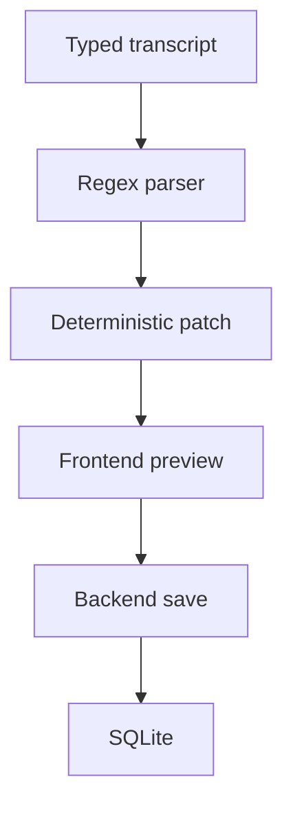
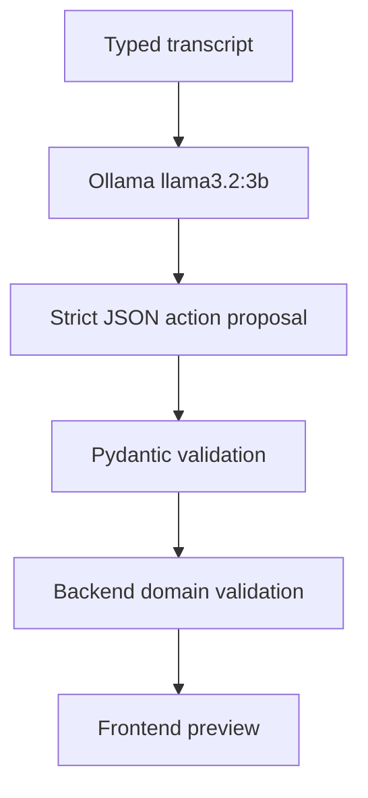
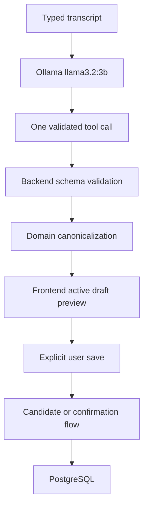
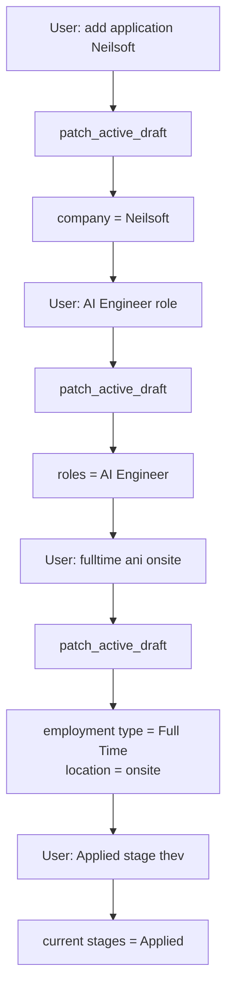
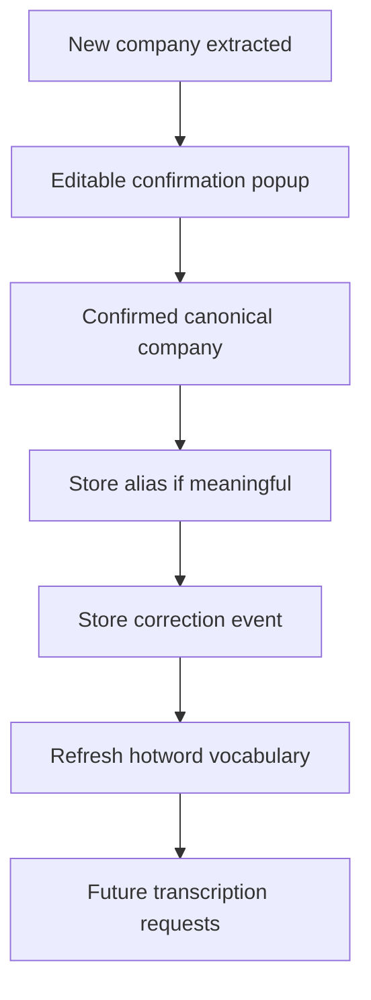

# Engineering Session Report

## 1. Session Objective

This session focused on evolving the `job_tracker` project from a SQLite-backed, regex-driven transcript command prototype into a PostgreSQL-backed, local-first conversational assistant foundation.

The work covered four closely related objectives:

1. Migrate the tracker database from SQLite to PostgreSQL without backward compatibility.
    
2. Preserve and harden the ASR company-name correction loop for future Whisper fine-tuning.
    
3. Replace the brittle regex transcript parser with a local Ollama-powered semantic layer using `llama3.2:3b`.
    
4. Improve the Transcript Command interface from a one-shot command box into a multi-turn conversational draft editor.
    

The session also surfaced several bugs and architectural mismatches:

- PostgreSQL foreign-key constraints blocked application deletion.
    
- Existing parser extensions introduced regressions in old priority parsing.
    
- The first Ollama semantic schema was still too rigid and did not align with the actual tracker form.
    
- The LLM initially overused clarification instead of accepting partial drafts.
    
- Context reuse needed stricter boundaries so saved applications were not silently modified based on conversational history alone.
    

LiveKit integration was intentionally postponed until the typed conversational workflow became reliable.

---

## 2. Starting Context

At the start of the session, the project already had a working local-first tracker prototype:

```text
jobtracker-FE
    → Next.js frontend

jobtracker-BE
    → FastAPI backend

whisper-service
    → Faster-Whisper transcription service

job_tracker-extension
    → browser-tab URL capture
```

The existing tracker supported:

```text
job applications
browser context
transcript command parsing
new-company confirmation popup
company alias persistence
ASR correction-event logging
dynamic hotword generation
correction dataset export
```

The company-name adaptation loop had already been introduced:

```text
new extracted company
    → editable confirmation popup
    → confirmed canonical company
    → optional alias
    → ASR correction event
    → refreshed hotwords
```

However, the backend still used SQLite and `Base.metadata.create_all(...)` rather than explicit migrations.

The transcript command parser was deterministic but regex-oriented. It handled a limited set of exact patterns such as field-oriented commands, but it did not understand natural variations reliably.

The initial assumption was that LiveKit integration could follow immediately after ASR adaptation hardening. That assumption changed once transcript parsing was tested with more natural user language.

---

## 3. User Goal Behind the Work

The broader product goal is to build a local-first, conversational job-tracking assistant that feels natural to use while remaining safe and predictable.

The user should eventually be able to speak naturally:

```text
I want to add an application Neilsoft.
AI Engineer role.
Full-time and onsite.
Applied stage.
Save it.
```

The assistant should progressively fill the tracker form without requiring exact phrasing.

The product must also preserve trust:

```text
LLM interprets user language
backend validates structured values
frontend shows preview
user explicitly confirms persistence
```

The user did not want a system that merely accepted rigid commands. The intended experience is closer to conversational form filling than to a command-line interface.

At the same time, the system must remain local-first:

```text
local PostgreSQL
local Ollama
local llama3.2:3b
local Faster-Whisper
no cloud APIs
no paid providers
```

---

## 4. Obstacles Encountered

### 4.1 SQLite was becoming an architectural limitation

#### Symptom

The project had accumulated additional state beyond simple applications:

```text
canonical_companies
company_aliases
asr_company_correction_events
browser_context
```

The project was still using SQLite and implicit table creation.

#### Initially suspected

SQLite could continue serving as a lightweight local MVP database.

#### Actual root cause

The system was evolving into a multi-component local assistant with:

```text
persistent learned vocabulary
correction history
future fine-tuning exports
migration requirements
future LiveKit agent integration
```

SQLite itself was not immediately broken, but continuing with SQLite would increase migration and schema-management risk.

#### Why non-obvious

The application was still local-first, so SQLite initially seemed aligned with the product philosophy. The problem was not scale alone; it was schema evolution and state reliability.

#### Boundary

Database architecture.

#### Resolution

The project moved to PostgreSQL-only persistence with:

```text
job_tracker
job_tracker_test
```

databases inside the existing `resume_tailor` PostgreSQL container.

SQLite compatibility and SQLite data migration were explicitly rejected.

---

### 4.2 Environment setup still required manual exports after PostgreSQL migration

#### Symptom

Normal startup still required commands such as:

```bash
export DATABASE_URL=...
export TEST_DATABASE_URL=...
```

#### Initially suspected

Manual export might be acceptable for local development.

#### Actual root cause

The backend had PostgreSQL support but did not yet match the smoother environment-loading pattern already used by the separate Resume Tailoring project.

#### Why non-obvious

The database migration itself succeeded, so configuration friction looked like documentation noise rather than an architectural usability issue.

#### Boundary

Infrastructure and developer experience.

#### Resolution

`jobtracker-BE/.env` is now loaded automatically using backend-root-relative resolution.

Precedence is:

```text
OS environment variable
    >
jobtracker-BE/.env
    >
clear missing-variable error
```

Optional:

```env
AUTO_MIGRATE=true
```

allows local startup to run Alembic migrations automatically.

---

### 4.3 Project naming drift

#### Symptom

The project was repeatedly referred to as `ApplicationOps` or `applicationops`, even though the user had named it:

```text
job_tracker
```

#### Initially suspected

The old name was harmless internal terminology.

#### Actual root cause

Legacy branding had spread across:

```text
README files
AGENTS.md files
frontend UI labels
extension metadata
database names
bootstrap scripts
tests
environment examples
```

#### Why non-obvious

Some names were user-facing while others were only internal identifiers. Blind renaming risked unnecessary churn.

#### Boundary

Documentation, frontend metadata, database naming and repository organization.

#### Resolution

User-facing and machine-oriented project naming was standardized to:

```text
job_tracker
```

The extension folder was renamed:

```text
applicationops-extension/
    →
job_tracker-extension/
```

Existing internal directories were intentionally retained:

```text
jobtracker-BE
jobtracker-FE
```

because renaming them would add path churn without product value.

---

### 4.4 New natural-language parser patterns introduced a regression

#### Symptom

After extending deterministic parsing, two backend tests failed:

```text
test_parse_transcript_basic_add
test_parse_transcript_arbitrary_order
```

The error was:

```text
AttributeError: 'NoneType' object has no attribute 'replace'
```

#### Initially suspected

The new natural-language grammar had only added support without breaking old commands.

#### Actual root cause

`parse_priority()` used capture groups incorrectly:

```python
match.group(1) or match.group(2)
```

For older grammar such as:

```text
Set priority to medium.
Set priority to high.
```

the relevant captured value was not present in those groups, causing `None` to flow into text normalization.

#### Why non-obvious

The parser sanity checks for new grammar passed, but old regression tests revealed that the extension changed capture-group assumptions.

#### Boundary

Backend parser implementation.

#### Resolution

A focused priority-parser regression fix was requested before further work. Shortly afterward, the entire regex language parser was replaced, making the specific parser fix temporary in architectural significance.

---

### 4.5 Application deletion failed due to a PostgreSQL foreign key

#### Symptom

Deleting an existing application returned:

```text
500 Internal Server Error
```

PostgreSQL reported:

```text
ForeignKeyViolation:
update or delete on table "job_applications"
violates foreign key constraint
"asr_company_correction_events_application_id_fkey"
```

#### Initially suspected

The delete endpoint itself was broken after PostgreSQL migration.

#### Actual root cause

An ASR correction event still referenced the application row:

```text
asr_company_correction_events.application_id
    → job_applications.id
```

PostgreSQL correctly prevented deletion.

#### Why non-obvious

The feature worked under previous assumptions because correction history had not yet been considered part of application deletion semantics.

#### Boundary

Database schema, ORM relationship and delete endpoint.

#### Resolution

The correct retention policy was defined:

```text
job_applications row
    → delete

asr_company_correction_events row
    → preserve
    → application_id = NULL

canonical_companies row
    → preserve

company_aliases row
    → preserve
```

A migration using:

```sql
ON DELETE SET NULL
```

was created separately.

`ON DELETE CASCADE` was rejected because correction history is needed for:

```text
future Whisper fine-tuning
ASR audit history
alias-learning traceability
```

---

### 4.6 The regex parser required exact commands

#### Symptom

Natural phrases failed:

```text
Add AI Engineer role for Neilsoft
```

The parser could not extract the company.

Another input:

```text
Add Neilsoft for AI Engineer, RAG roles
```

worked only when the shorthand `RAG` was expanded to `RAG Engineer`.

#### Initially suspected

More regex patterns and role aliases might solve the issue.

#### Actual root cause

The parser abstraction itself was wrong for the target UX.

The parser asked:

```text
Does this sentence match a known pattern?
```

The product needed:

```text
What does the user mean?
Which tracker fields were mentioned?
```

#### Why non-obvious

A deterministic regex parser had safety benefits and worked for a small grammar. The brittleness became visible only after realistic conversational input was tested.

#### Boundary

Backend language interpretation and UX.

#### Resolution

Regex-based transcript interpretation was removed entirely.

---

### 4.7 The first LLM semantic proposal schema was still too rigid

#### Symptom

The initial Ollama semantic interpreter improved flexible phrasing, but realistic utterances did not populate the right frontend checkboxes.

Example:

```text
yeah for neilsoft, i'm applying for AI Engineer role for full time role,
The current stage for it is applied only, and status is full time
```

Another failed case:

```text
and yeah, we're applying there for fulltime, GENAI Engineer only(nothing else),
i'll have to go onsite for that job, the current state for it is applied only
```

#### Initially suspected

The model needed better prompting or more aliases.

#### Actual root cause

The strict action proposal schema did not align with the actual tracker data model.

The initial semantic schema centered around:

```text
applications: { company, role }[]
patch:
    status
    priority
    current_stages
    next_action
    comments_append
```

But the real database schema supports:

```text
roles_json
employment_types_json
location
current_stages_json
```

The system also needed incremental draft patching, not only complete application proposals.

#### Why non-obvious

The model could understand the language, but the output contract did not offer enough expressive room to represent the intended form state.

#### Boundary

LLM contract, backend validation and frontend checkbox mapping.

#### Resolution

The rigid semantic-proposal workflow was replaced with Ollama tool calling and broader draft-oriented tool arguments.

---

### 4.8 Status and employment type were semantically confused

#### Symptom

The user said:

```text
status is full time
```

`Full Time` is not an application status. It is an employment type.

#### Initially suspected

The model should reject invalid status values.

#### Actual root cause

Users naturally use tracker terminology loosely. A conversational assistant must interpret likely meaning without silently persisting incorrect data.

#### Why non-obvious

Literal validation alone would be safe but unfriendly. Blind reinterpretation would be convenient but risky.

#### Boundary

LLM interpretation, backend canonicalization and frontend warnings.

#### Resolution

The backend now reclassifies the value safely:

```text
employment_types = [Full Time]
status remains unset
```

and surfaces a warning:

```text
Interpreted "full time" as Employment Type, not Status.
```

---

### 4.9 LLM clarification was too aggressive

#### Symptom

The input:

```text
I have a requirement. I want to add an application neilsoft
```

produced:

```text
Transcript follow-up needs attention:
What is the purpose of adding an application called neilsoft?
```

#### Initially suspected

The model did not recognize `Neilsoft` as a company.

#### Actual root cause

The tool-selection policy still assumed that a new draft needed enough information to resemble a complete application.

The intended UX allows incomplete drafts.

#### Why non-obvious

The clarification was not technically unsafe. It was a UX failure caused by an overly strict conversational policy.

#### Boundary

LLM prompt, tool descriptions and backend validation.

#### Resolution

`patch_active_draft` became the default for partial draft input.

The backend now accepts company-only draft patches:

```text
company = Neilsoft
```

Missing role or other fields no longer forces clarification.

Backend-controlled clarification templates were added for genuine gaps:

```text
Which company should I use?
Which company's application do you mean?
Multiple applications match this company. Specify the role.
There is no active draft to save.
```

---

### 4.10 Context reuse risked silently targeting saved rows

#### Symptom

Once active draft context existed, a phrase like:

```text
Make it high priority
```

could potentially be interpreted as targeting a previously mentioned saved application.

#### Initially suspected

Conversational context reuse would always improve UX.

#### Actual root cause

Unsaved draft enrichment and persisted-row mutation have different safety requirements.

#### Why non-obvious

Both flows use similar language, but the risk of incorrect persistence is much higher for saved rows.

#### Boundary

Frontend context model, backend validation and tool-selection policy.

#### Resolution

A strict context policy was defined:

```text
active_draft
    → unsaved draft enrichment only

active_application
    → explicitly selected persisted UI row only

recent_actions
    → prompt context only
    → never authorizes persisted-row mutation
```

Saved-row updates require:

```text
explicit company in the utterance
or
explicitly selected persisted row ID from the UI
```

---

## 5. Approaches Considered

### 5.1 Keep SQLite and continue incrementally

#### Why it seemed reasonable

The project is local-first and SQLite is lightweight.

#### Advantages

```text
simple deployment
no separate server dependency
easy local files
```

#### Drawbacks

```text
implicit schema management
migration limitations
future complexity around correction history
less robust test isolation
```

#### Decision

Rejected.

PostgreSQL-only persistence was adopted.

---

### 5.2 Reuse the existing PostgreSQL container

#### Why it seemed reasonable

A local PostgreSQL container named:

```text
resume_tailor
```

already existed.

#### Advantages

```text
no second Postgres container
reuse local infra
simpler startup
```

#### Risks

Mixing unrelated project tables into the Resume Tailoring database.

#### Decision

Adopted with isolated databases:

```text
job_tracker
job_tracker_test
```

The existing Resume Tailoring database remained untouched.

---

### 5.3 Continue extending regex grammar

#### Why it seemed reasonable

Regex parsing is deterministic and easy to test.

#### Advantages

```text
predictable
fast
no model dependency
easy enum validation
```

#### Drawbacks

```text
word-order brittleness
phrase explosion
poor handling of context
poor Marathi-English mixed phrasing
difficult long-term maintenance
```

#### Decision

Rejected.

Regex transcript interpretation was removed entirely.

---

### 5.4 Use a strict JSON semantic proposal from Ollama

#### Why it seemed reasonable

It separated natural-language understanding from DB mutation.

#### Advantages

```text
local LLM flexibility
Pydantic validation
safe backend authority
no direct DB writes
```

#### Drawbacks

The first schema became too narrow and hardcoded:

```text
company + singular role
limited patch fields
weak support for incremental drafts
misalignment with roles_json and employment_types_json
```

#### Decision

Modified.

The semantic layer moved from one rigid proposal object to Ollama tool calling.

---

### 5.5 Use Ollama tool calling

#### Why it seemed reasonable

Tool calling allows the LLM to choose a small number of meaningful backend capabilities without requiring one huge schema.

#### Advantages

```text
natural phrasing
context-aware draft updates
small action surface
backend validation retained
future LiveKit compatibility
```

#### Risks

```text
small model may choose the wrong tool
tool descriptions matter
clarification quality varies
exactly one tool call per utterance limits combined actions
```

#### Decision

Adopted.

---

### 5.6 Create many micro-tools

Example:

```text
set_priority
set_status
set_stage
set_role
set_location
```

#### Why it seemed reasonable

Each tool would have a small argument schema.

#### Advantages

Highly explicit operations.

#### Drawbacks

```text
tool explosion
more routing mistakes
harder maintenance
recreates schema brittleness
```

#### Decision

Rejected.

A small broad tool set was adopted.

---

### 5.7 Let the LLM write directly to the database

#### Why it seemed reasonable

It would simplify the flow and feel more conversational.

#### Advantages

Lower implementation friction.

#### Drawbacks

```text
probabilistic mutations
wrong-row risk
hallucinated fields
unsafe destructive operations
harder debugging
```

#### Decision

Rejected as a stable principle.

The LLM only proposes actions.

---

### 5.8 Use conversational history to target saved rows

#### Why it seemed reasonable

Users often say:

```text
make it high priority
```

after discussing an application.

#### Advantages

Convenient voice UX.

#### Drawbacks

Potential silent mutation of the wrong saved application.

#### Decision

Restricted.

History may enrich unsaved drafts but must not authorize persisted-row mutation.

---

### 5.9 Add transcript-driven delete immediately

#### Why it seemed reasonable

Manual delete already existed.

#### Advantages

Natural voice management.

#### Drawbacks

```text
destructive operation
ASR mishearing risk
ambiguous pronoun risk
requires explicit confirmation design
```

#### Decision

Deferred.

Manual UI/API deletion remains available. Transcript delete was intentionally not added.

---

## 6. Decisions Made

### 6.1 PostgreSQL-only persistence

#### Final decision

Use PostgreSQL only.

```text
job_tracker
job_tracker_test
```

#### Reasoning

The evolving schema, correction history and future agent integration required explicit migrations and stronger state management.

#### Rejected alternatives

```text
SQLite fallback
SQLite data migration
dual-database support
```

#### Stability

Stable architectural principle.

---

### 6.2 Alembic migrations replace implicit production table creation

#### Final decision

Use:

```bash
alembic upgrade head
```

or:

```env
AUTO_MIGRATE=true
```

for local convenience.

#### Reasoning

Schema evolution must be explicit and testable.

#### Stability

Stable architectural principle.

---

### 6.3 Preserve learned ASR vocabulary after application deletion

#### Final decision

Deleting an application must not delete:

```text
canonical company
company alias
ASR correction event
```

#### Reasoning

These rows represent learned vocabulary and future fine-tuning data, not merely tracker-row ownership.

#### Rejected alternatives

```text
ON DELETE CASCADE
manual cleanup before deletion
delete all related ASR records
```

#### Stability

Stable product principle.

---

### 6.4 Replace regex language parsing with local LLM interpretation

#### Final decision

Use local Ollama:

```text
ollama container
llama3.2:3b
```

#### Reasoning

The assistant must understand natural variations and incremental context.

#### Rejected alternatives

```text
keep adding regex patterns
cloud LLM APIs
direct LLM DB writes
```

#### Stability

Stable architectural direction.

---

### 6.5 Use tool calling instead of one rigid JSON proposal

#### Final decision

Use:

```text
POST /api/chat
tools = [...]
```

and read:

```text
message.tool_calls
```

#### Reasoning

Tool calling offers a better balance between semantic flexibility and backend control.

#### Stability

Stable semantic-layer direction.

---

### 6.6 Keep the initial tool surface small

Implemented tools:

```text
patch_active_draft
preview_existing_application_update
request_draft_save
attach_latest_browser_context
ask_clarification
```

#### Reasoning

Broad tools reduce tool explosion while keeping backend validation explicit.

#### Stability

Stable for the current phase. Additional tools may be added later.

---

### 6.7 Treat Transcript Command as a conversational form editor

#### Final decision

Each utterance may fill part of an unsaved draft.

#### Reasoning

Users will not always speak complete commands, especially in a voice-driven interface.

#### Rejected alternative

Require each turn to independently contain:

```text
company
role
employment type
stage
status
```

#### Stability

Stable UX principle.

---

### 6.8 Separate active draft context from persisted-row targeting

#### Final decision

```text
active_draft
    → draft enrichment

active_application
    → explicitly selected saved row only

recent_actions
    → prompt context only
```

#### Reasoning

Context improves UX but must not create unsafe mutations.

#### Stability

Stable safety principle.

---

## 7. Architecture Evolution

### Previous design



### Limitations

```text
exact phrasing required
poor context understanding
SQLite migration limitations
schema evolution risk
limited support for conversational draft filling
```

### Intermediate semantic design



### Limitation in intermediate design

The strict proposal schema became too narrow and misaligned with the tracker form.

### Updated architecture



### Active-draft data flow



### ASR adaptation data flow



### New abstractions introduced

```text
semantic_interpreter.py
semantic_schemas.py
semantic_validation.py
company_resolution.py
role_aliases.py
trackerState.ts
```

The system now has a clean responsibility boundary:

```text
LLM
    → interpret language and select tool

backend
    → validate and canonicalize

frontend
    → maintain draft state and preview

database
    → persist only after explicit confirmation
```

---

## 8. Implementation Progress

### 8.1 PostgreSQL migration completed

The backend moved from SQLite to PostgreSQL-only.

Databases created:

```text
job_tracker
job_tracker_test
```

inside:

```text
resume_tailor
```

The existing Resume Tailoring database remained untouched.

### 8.2 Environment auto-loading completed

Backend configuration now auto-loads:

```text
jobtracker-BE/.env
```

with OS environment precedence.

Added optional:

```env
AUTO_MIGRATE=true
```

### 8.3 Alembic added

Initial migration created:

```text
job_applications
browser_context
canonical_companies
company_aliases
asr_company_correction_events
```

A later migration was introduced for:

```sql
ON DELETE SET NULL
```

on ASR correction-event application references.

### 8.4 Exporter migrated to PostgreSQL

The ASR correction exporter now reads PostgreSQL only.

Outputs remain:

```text
corrections_review.jsonl
corrections_review.csv
training_eligible.jsonl
export_summary.json
```

### 8.5 Naming cleanup completed

Legacy `ApplicationOps` naming was removed.

The extension directory became:

```text
job_tracker-extension
```

Internal folders:

```text
jobtracker-BE
jobtracker-FE
```

were retained intentionally.

### 8.6 Regex parser removed

Deleted:

```text
jobtracker-BE/app/transcript_parser.py
```

Old strict parser-only endpoints and frontend correction-transcript workflow were removed.

### 8.7 Initial Ollama semantic interpreter added

Modules added:

```text
semantic_interpreter.py
semantic_schemas.py
semantic_validation.py
company_resolution.py
role_aliases.py
```

Health endpoint added or updated:

```text
GET /semantic-interpreter/health
```

### 8.8 Tool-calling semantic layer implemented

The backend now sends Ollama:

```json
{
  "model": "llama3.2:3b",
  "stream": false,
  "keep_alive": "10m",
  "messages": [],
  "tools": [],
  "options": {
    "temperature": 0
  }
}
```

Exactly one tool call is accepted.

Implemented tools:

```text
patch_active_draft
preview_existing_application_update
request_draft_save
attach_latest_browser_context
ask_clarification
```

### 8.9 Frontend active-draft state added

Files changed included:

```text
jobtracker-FE/app/page.tsx
jobtracker-FE/app/trackerState.ts
```

The Transcript Command UI now keeps an active unsaved draft across turns.

### 8.10 Context-policy hardening completed

The frontend no longer auto-derives:

```text
active_application
```

from transcript previews or recent saves.

It is now set only when a persisted row is explicitly selected in the UI.

---

## 9. Validation and Evidence

### PostgreSQL migration verification

Reported results:

```text
Backend tests: 67 passed
Exporter tests: 3 passed
Whisper-service tests: 11 passed
Frontend lint: passed
```

After environment auto-loading:

```text
Backend tests: 73 passed
Exporter tests: 5 passed
Whisper-service tests: 11 passed
Frontend lint: passed
```

### Parser regression evidence

Before full regex removal:

```text
84 passed
2 failed
```

Failures:

```text
test_parse_transcript_basic_add
test_parse_transcript_arbitrary_order
```

with:

```text
AttributeError: 'NoneType' object has no attribute 'replace'
```

### Ollama semantic interpreter verification

Reported smoke-test latency:

```text
Add AI Engineer role for Neilsoft
    → 2579 ms

Add Neilsoft for RAG
    → 2353 ms

Add Neilsoft for AI Engineer and RAG roles
    → 3196 ms

Neilsoft high priority kar
    → 2114 ms

Add note saying recruiter la udya ping karaycha
    → 3272 ms
```

Ollama schema validation passed in these tests.

### Tool-calling backend verification

After Phase 1 tool calling:

```text
Backend pytest: 83 passed
```

### Active-draft frontend verification

After Phase 2:

```text
Backend pytest: 84 passed
Frontend lint: passed
```

Manual smoke sequence:

```text
Neilsoft sathi application add kar
    → company = Neilsoft

GENAI Engineer only, fulltime ani onsite
    → company = Neilsoft
    → roles = [Generative AI Engineer]
    → employment_types = [Full Time]
    → location = onsite

Applied stage thev
    → current_stages = [Applied]
```

### Partial-draft policy verification

After Phase 2.1:

```text
Backend pytest: 95 passed
Frontend lint: passed
```

Expected validated flow:

```text
I have a requirement. I want to add an application neilsoft
    → company = Neilsoft

AI Engineer role
    → roles = [AI Engineer]

fulltime ani onsite
    → employment_types = [Full Time]
    → location = onsite

Applied stage thev
    → current_stages = [Applied]
```

The user manually confirmed that the revised behavior worked as intended.

### Database schema inspected

Observed schemas included:

```text
job_applications
company_aliases
canonical_companies
browser_context
asr_company_correction_events
alembic_version
```

`job_applications` fields included:

```text
id
company
roles_json
employment_types_json
job_link
location
status
current_stages_json
priority
engaged_days
next_action
comments
created_at
updated_at
```

### Deletion-retention verification

The user confirmed that ASR correction events persisted after application deletion.

It remained important to verify:

```text
application_id = NULL
canonical company retained
company alias retained
```

The design intention was clearly established, but the complete manual DB verification was not explicitly reported as completed in this session.

---

## 10. Lessons Learned

### 10.1 A deterministic parser can still be the wrong abstraction

Regex parsing was not merely missing patterns. It was structurally mismatched with conversational UX.

The correct abstraction became:

```text
semantic interpretation
    +
deterministic validation
```

rather than:

```text
more regex templates
```

### 10.2 Safety and flexibility belong in different layers

The LLM should interpret language.

The backend should validate:

```text
field names
types
enums
company resolution
alias lookup
ambiguity
write authorization
```

This separation prevents direct probabilistic writes while preserving natural interaction.

### 10.3 Structured output can also become brittle

Replacing regex with a very rigid JSON schema does not automatically solve abstraction problems.

A contract must align with the real product form:

```text
roles_json
employment_types_json
current_stages_json
```

The schema must support incremental patches, not only complete commands.

### 10.4 Conversational context requires authorization boundaries

Context improves draft-filling UX but can create unsafe saved-row mutations.

The important distinction is:

```text
context may enrich unsaved state
context must not silently authorize persisted-state mutation
```

### 10.5 Learned vocabulary is not application-owned data

Deleting a tracker row should not delete ASR knowledge.

```text
application record
    ≠
learned vocabulary
```

This insight directly shaped the foreign-key migration.

### 10.6 Small local models need strong tool descriptions

`llama3.2:3b` was sufficient for local tool selection, but tool descriptions and few-shot examples materially affected behavior.

A small model may over-clarify unless the system explicitly states:

```text
partial drafts are valid
missing fields are acceptable
```

### 10.7 Frontend preview state is part of the semantic contract

The backend can interpret values correctly, but the user experience still fails if frontend checkbox mapping is incomplete.

The semantic contract must map cleanly into:

```text
roles
employment types
location
current stages
priority
comments
```

---

## 11. Open Questions and Deferred Work

### Required next steps

#### Phase 3 hardening

Verify and harden:

```text
explicit save flow
new-company popup reuse
alias persistence regression
ASR correction retention
Ollama outage behavior
unsafe tool-call behavior
browser-context regression
exporter regression
Whisper-service regression
README cleanup
```

#### Final deletion-retention verification

Confirm manually that deleting an application leaves:

```text
asr_company_correction_events.application_id = NULL
canonical_companies row retained
company_aliases row retained
```

### Optional enhancements

#### Safe transcript-driven delete preview

Deferred design:

```text
preview_application_delete
    → explicit company or selected row required
    → confirmation mandatory
    → actual delete only after user confirmation
```

Direct destructive LLM tools remain rejected.

#### Read and list tools

Potential future tools:

```text
list_applications
show_application
list_pending_actions
```

These were intentionally not implemented yet.

#### Multi-tool utterances

Current backend accepts one actionable tool call per utterance.

Example unresolved case:

```text
Applied stage thev ani save kar
```

Possible future options:

```text
ask user to save separately
or
allow one bounded safe sequence
```

#### Browser-context enrichment

Current browser-context use remains explicit and URL-only.

Future work may decide whether:

```text
use current link
```

should patch the active draft automatically.

#### Model benchmarking

`llama3.2:3b` works, but future evaluation may compare:

```text
qwen3:4b
gemma3:4b
qwen2.5:7b-instruct
```

Metrics:

```text
tool selection accuracy
argument extraction accuracy
latency
clarification quality
VRAM usage
CPU fallback
```

### Explicitly deferred

```text
LiveKit integration
TTS integration
cloud APIs
fuzzy company matching
automatic training
audio persistence
open-ended chatbot behavior
transcript-driven destructive tools
```

### Questions requiring further investigation

```text
Should stage Applied suggest status Applied in create drafts?
Should location eventually be renamed to work_mode?
Should city/location become a separate field?
How should multiple safe tools in one utterance be handled?
Should context-based save remain UI-driven only?
```

---

## 12. Significance in the Overall Project Journey

This session was primarily:

```text
an architectural refactor
+
a debugging breakthrough
+
a UX redesign milestone
```

The project moved from:

```text
SQLite-backed tracker
+
regex command parser
```

to:

```text
PostgreSQL-backed local assistant foundation
+
learned ASR vocabulary retention
+
Ollama llama3.2:3b tool calling
+
conversational active-draft editing
+
safe backend authority
```

The most important shift was conceptual:

```text
Transcript Command
    → not a command parser

Transcript Command
    → conversational form editor
```

This milestone materially improved the feasibility of future LiveKit voice integration because the voice layer can now feed transcripts into an already context-aware, locally hosted semantic workflow.

---

## 13. Compact Timeline Entry

**Milestone:** PostgreSQL migration and Ollama tool-calling conversational draft editor  
**Problem:** SQLite schema evolution and regex transcript parsing were too brittle for a local conversational job tracker.  
**Key obstacle:** Natural user phrases, partial drafts and ASR correction retention crossed multiple boundaries: database schema, LLM contract, frontend checkbox state and saved-row safety.  
**Decision:** Move to PostgreSQL-only persistence, preserve ASR vocabulary after application deletion, remove regex language parsing, use local `llama3.2:3b` through Ollama tool calling, and allow context only for unsaved draft enrichment unless a persisted row is explicitly targeted.  
**Outcome:** PostgreSQL-backed tracker, Alembic migrations, `.env` auto-loading, local Ollama semantic tools, multi-turn active-draft form filling, safer clarification behavior and 95 passing backend tests with frontend lint passing.  
**Next step:** Run Phase 3 hardening, verify delete-retention state fully, freeze the typed Transcript Command baseline and begin a LiveKit integration audit.