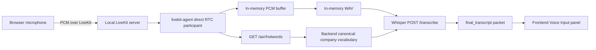
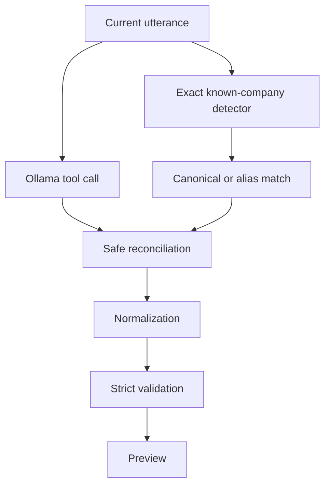
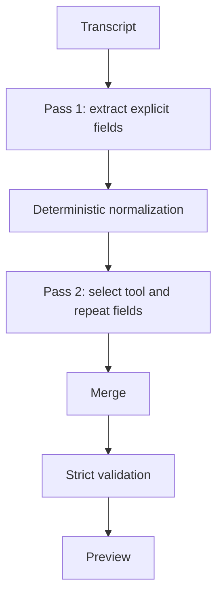
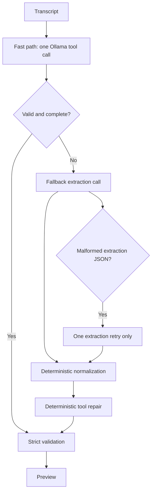

# Engineering Session Report

## 1. Session Objective

This session focused on building and debugging the first usable local voice-input path for the `job_tracker` assistant, then connecting that path to the existing conversational tracker workflow.

The work began with the LiveKit foundation and progressed through four practical stages:

1. Add backend token minting for local LiveKit browser participants.
    
2. Add a lightweight local RTC participant that receives browser microphone audio and sends it to Faster-Whisper.
    
3. Add frontend controls for manually recording voice commands and displaying transcripts.
    
4. Add an explicit reviewed handoff from the voice transcript into the existing typed Transcript Command textarea.
    

After the voice transport path worked, the session exposed a deeper limitation in the existing backend semantic interpreter. The voice feature was not the actual cause of the later failures: manually typed commands also failed. The backend could reliably detect known company names after a deterministic reconciliation layer was introduced, but it remained brittle when extracting and validating other tracker fields such as roles, employment type, location, priority, status and current stages.

The latter part of the session therefore shifted from voice transport integration to semantic-interpreter architecture. A two-pass LLM interpretation flow was introduced experimentally, but its first implementation added latency and false conflicts. By the end of the session, the next required refactor had become clear: use a one-pass fast path for normal commands and an authoritative extraction fallback only when needed, with a hard maximum of three Ollama calls per transcript.

---

## 2. Starting Context

### Existing project state

At the beginning of the session, the project already had a working typed conversational workflow:

```text
Transcript Command textarea
    → backend semantic interpretation
    → Ollama llama3.2:3b
    → deterministic backend validation
    → draft preview
    → explicit user save
```

The application was intentionally local-first. The assistant was intended for use by a single user on the same laptop, not as a hosted SaaS application.

Existing principles included:

- No automatic job applications.
    
- No hidden background mutation of tracker state.
    
- Preview before save.
    
- Explicit user confirmation before persistence.
    
- Existing tracker table remains the source of truth.
    
- Voice input is optional and must not break typed input.
    
- The assistant should support natural conversational commands, but the backend must remain deterministic and fail-safe.
    

### Trigger for the session

The immediate goal was to introduce LiveKit locally so browser microphone audio could be routed into the local Whisper service.

The first implemented pull request had already added:

```text
POST /livekit/token
```

with:

```text
url
room_name
participant_identity
access_token
expires_at
```

The endpoint generated short-lived browser JWTs with narrow room-scoped permissions.

The user clarified an important product constraint early in the session:

```text
The entire LiveKit voice flow will run locally.
It is for personal assistant use only.
Nothing will be deployed.
```

This allowed the architecture to avoid production deployment concerns such as TLS termination, cloud LiveKit configuration, Redis, public URLs, Kubernetes or multi-user scaling.

### Initial assumptions carried forward

Several assumptions were made at the beginning:

1. `livekit-server --dev` with `devkey` and `secret` was sufficient for the local-only assistant.
    
2. Browser access tokens should remain short-lived even in a local setup.
    
3. A lightweight direct RTC participant was preferable to the LiveKit Agents SDK for the first MVP.
    
4. Manual Start / Stop recording controls were acceptable as an initial integration scaffold.
    
5. The existing Faster-Whisper service could remain batch-oriented:
    
    ```text
    WAV upload → POST /transcribe → final transcript
    ```
    
6. Voice transcripts should not be auto-submitted into the tracker workflow until the transport path was proven stable.
    

These assumptions mostly remained valid, although the Whisper Docker runtime and backend semantic interpreter both required deeper changes.

---

## 3. User Goal Behind the Work

The user is building a local-first conversational job-tracking assistant, not merely a speech recorder.

The desired product experience is:

```text
User speaks naturally
    → transcript appears
    → user reviews the text
    → assistant updates a draft conversationally
    → user explicitly confirms save
```

The user wants to speak commands such as:

```text
I would like to track an application for Neilsoft.
The role is AI Engineer.
The type is full time.
The location is onsite.
```

or shorter conversational follow-ups:

```text
Set priority high.
Current stages Applied and Engaged.
Add a note saying referral received.
```

The technical work mattered because the voice layer had to preserve the existing tracker philosophy:

- speech should be an input mechanism, not a privileged mutation path;
    
- the user should remain in control;
    
- LLM output must never write directly to the database;
    
- backend validation should remain strict;
    
- voice failure must not make the typed tracker unusable.
    

The broader product objective is a local ApplicationOps-style assistant:

```text
speech
    → STT
    → reviewed text
    → LLM interpretation
    → deterministic validation
    → preview
    → explicit save
```

TTS remains a future enhancement.

---

## 4. Obstacles Encountered

## 4.1 Clarifying the purpose of `expires_at`

### Symptom or question

The backend token endpoint returned:

```text
expires_at
```

The user asked why it was needed and whether the token could simply never expire because everything runs locally.

### Initial suspicion

A short-lived token appeared unnecessary in a strictly local personal assistant.

### Root cause or resolution

The distinction was clarified:

```text
stable server credentials
    LIVEKIT_API_KEY
    LIVEKIT_API_SECRET

temporary browser room token
    short-lived JWT
```

The browser token is only used to join or reconnect to the room. It does not need to be permanent.

### Why the issue was non-obvious

Local-only systems often tempt developers to remove all security boundaries. However, token expiry still provides a clean lifecycle without meaningful complexity.

### Boundary

Backend authentication and local infrastructure.

### Outcome

The `15-minute` browser token TTL and `expires_at` field were retained. Infinite browser tokens were rejected as unnecessary.

---

## 4.2 Choosing a direct RTC participant instead of the LiveKit Agents SDK

### Symptom or design question

The project needed a local service that could join the LiveKit room, receive PCM audio frames and call Whisper.

### Initial options

Two possibilities existed:

1. Use the LiveKit Agents SDK worker lifecycle.
    
2. Use a small direct Python RTC participant.
    

### Root cause or reasoning

The immediate requirement was narrow:

```text
join room
    → subscribe to browser mic
    → buffer PCM
    → generate WAV
    → call Whisper
    → send transcript packet
```

The Agents SDK would have introduced unnecessary concepts:

```text
worker registration
dispatch lifecycle
job subprocesses
plugins
VAD integration
semantic turn detection
```

### Boundary

Voice transport architecture.

### Outcome

A lightweight standalone service was created:

```text
livekit-agent/
```

Despite the directory name, it is a direct RTC participant, not an Agents SDK worker.

---

## 4.3 Confusion between `lk` CLI and `livekit-server`

### Symptom

The installation command produced:

```text
Installing livekit-cli 2.16.4
lk is installed to /usr/local/bin
```

But the project needed:

```bash
livekit-server --dev
```

### Initial suspicion

It looked as though LiveKit had been installed successfully.

### Actual root cause

The installed `lk` CLI is not the self-hosted LiveKit media server binary.

### Why non-obvious

Both tools are distributed by LiveKit and use similar naming, but they serve different purposes.

### Boundary

Local infrastructure.

### Resolution

The self-hosted server binary had to be installed separately and run using:

```bash
livekit-server --dev
```

---

## 4.4 Whisper Docker container initially appeared not to start

### Symptom

A Docker run command printed only the NVIDIA CUDA banner:

```text
==========
== CUDA ==
==========
CUDA Version 12.3.2
```

No Uvicorn startup output followed.

### Initial suspicion

The image might not include a default command for starting the FastAPI server.

### Root cause

A different image tag was used successfully:

```text
job-tracker-whisper-cuda:latest
```

That image produced:

```text
INFO:     Application startup complete.
INFO:     Uvicorn running on http://0.0.0.0:8100
```

### Boundary

Whisper container infrastructure.

### Resolution

The correct image tag and run command were established.

---

## 4.5 Existing backend test failed because OS environment leaked into dotenv test

### Symptom

An isolated backend test failed:

```text
test_ollama_settings_are_loaded_from_backend_dotenv
```

Expected:

```text
http://127.0.0.1:22434
```

Actual:

```text
http://127.0.0.1:11434
```

### Initial suspicion

The dotenv loader was broken.

### Actual root cause

The test injected a temporary `.env`, but an existing shell-level variable had higher precedence:

```text
OS environment
    > .env file
```

The runtime behavior was correct. The test isolation was wrong.

### Why non-obvious

The failure appeared to implicate application configuration logic, but it was caused by the developer shell environment leaking into the test process.

### Boundary

Backend tests and configuration.

### Resolution

The recommended test fix was to clear relevant environment variables using:

```python
monkeypatch.delenv(key, raising=False)
```

before asserting dotenv behavior.

---

## 4.6 Frontend SDK choice: `livekit-client` versus React components

### Design question

The PR-3 prompt proposed:

```text
livekit-client
```

The user asked why the implementation should not use:

```text
@livekit/components-react
```

### Reasoning

The project was not building a video-conference UI. It needed a custom workflow:

```text
Connect voice
Start recording
Stop recording
wait for transcript
Disconnect voice
```

with custom protocol behavior:

```text
utterance_id
200 ms drain delay
utterance_end packet
processing state
stale-packet rejection
```

Prefab controls would not eliminate that logic.

### Boundary

Frontend dependency design and UX.

### Outcome

`livekit-client` was retained as the low-level RTC dependency. React remained responsible for UI and state management. React component wrappers were deferred until they offer clear value, such as remote audio playback for future TTS.

---

## 4.7 Whisper endpoint returned `422 Unprocessable Entity`

### Symptom

Whisper terminal:

```text
POST /transcribe HTTP/1.1" 422 Unprocessable Entity
```

Agent terminal:

```text
HTTP Request: POST http://127.0.0.1:8100/transcribe "HTTP/1.1 422 Unprocessable Entity"
```

Frontend:

```text
Voice error: Whisper service unavailable.
```

### Initial suspicion

The Whisper service might be down.

### Actual root cause

The Whisper service was reachable. The agent request did not match the endpoint contract.

The OpenAPI schema showed:

```text
file
    binary audio upload

hotwords
    array<string>

initial_prompt
    optional string
```

The adapter had initially sent the wrong request shape.

### Why non-obvious

The frontend displayed a generic service-unavailable message, obscuring the distinction between connection failure and schema rejection.

### Boundary

RTC agent → Whisper HTTP adapter.

### Resolution

The adapter was changed to multipart form-data:

```python
files = {
    "file": (
        "utterance.wav",
        wav_bytes,
        "audio/wav",
    )
}
```

with repeated `hotwords` form values and optional `initial_prompt`.

Error mapping was improved:

```text
422
    → Whisper service rejected the transcription request.

connection failure
    → Whisper service unavailable.
```

---

## 4.8 Custom multipart stream failed with `AsyncClient`

### Symptom

After the first multipart correction, the request still failed before reaching the Whisper service.

Exact exception:

```text
RuntimeError:
Attempted to send an sync request with an AsyncClient instance.
```

### Initial suspicion

The multipart endpoint schema was still wrong.

### Actual root cause

A custom `httpx._multipart.MultipartStream` path created a synchronous request stream while using:

```text
httpx.AsyncClient
```

### Why non-obvious

The endpoint contract was correct, but the failure occurred entirely client-side before any HTTP request reached `/transcribe`.

### Boundary

Agent HTTP client implementation.

### Resolution

The adapter returned to the standard async-compatible `httpx` call:

```python
await client.post(
    url,
    files={"file": ("utterance.wav", wav_bytes, "audio/wav")},
    data=data,
)
```

Safe internal exception logging was added:

```python
logger.warning(
    "whisper_request_failure error=%r",
    exc,
    exc_info=True,
)
```

Full agent test suite result after the fix:

```text
28 passed, 2 warnings
```

---

## 4.9 Whisper request timed out after reaching the service

### Symptom

The agent later produced:

```text
httpx.ReadTimeout
```

and:

```text
message=Whisper service request timed out.
latency_seconds=20.134
```

### Initial suspicion

The first inference might be slow because of lazy model loading and CUDA initialization.

### Actual root cause

Two issues were considered:

1. The request timeout was too short for cold local inference.
    
2. The Whisper GPU runtime itself was broken because a required cuDNN library was missing.
    

### Boundary

Whisper inference runtime and agent timeout configuration.

### Resolution

The agent gained:

```env
WHISPER_REQUEST_TIMEOUT_SECONDS=120
```

loaded from `.env`, with OS environment override and validation.

This was necessary for cold-start tolerance, but it did not solve the underlying GPU runtime failure.

---

## 4.10 Missing cuDNN runtime library

### Symptom

The Whisper CUDA terminal printed:

```text
Could not load library libcudnn_ops_infer.so.8.
Error: libcudnn_ops_infer.so.8:
cannot open shared object file
```

### Initial suspicion

The container might need a cuDNN 8 runtime base image.

### Investigation

Container inspection showed:

```text
libcudnn_ops.so.9
libcudnn_cnn.so.9
libcudnn.so.9
```

The image had system-level cuDNN 9 libraries. A partial bundled cuDNN 8 artifact also existed under:

```text
/usr/local/lib/python3.10/dist-packages/ctranslate2.libs/
```

### Actual root cause

The installed CTranslate2 runtime expected the older cuDNN 8 ABI while the container runtime provided cuDNN 9.

### Why non-obvious

CUDA appeared functional:

```text
CUDA Version 12.3.2
```

but CUDA availability does not imply cuDNN ABI compatibility.

### Boundary

Whisper Docker dependencies.

### Resolution

The Docker dependency stack was aligned to:

```text
CUDA 12.3.2
cuDNN 9
CTranslate2 4.5.0
```

Verification after rebuild:

```text
python3 import ctranslate2
    → 4.5.0

/health
    → 200

first /transcribe
    → 200

second /transcribe
    → 200

libcudnn_ops_infer.so.8 error
    → gone
```

---

## 4.11 Hugging Face cache was ephemeral

### Symptom

Whisper printed:

```text
Warning:
You are sending unauthenticated requests to the HF Hub.
Please set a HF_TOKEN to enable higher rate limits and faster downloads.
```

The first transcription took over a minute during debugging.

### Initial suspicion

The missing `HF_TOKEN` might be the main cause.

### Actual root cause

The token warning was secondary. The more important issue was that model files needed to persist across disposable Docker containers.

### Boundary

Whisper model distribution and local container lifecycle.

### Resolution

A host-mounted cache directory was added to the run command:

```bash
mkdir -p "$HOME/.cache/huggingface"

docker run --rm \
  --gpus all \
  -p 8100:8100 \
  --env-file .env \
  -v "$HOME/.cache/huggingface:/root/.cache/huggingface" \
  job-tracker-whisper-cuda:latest
```

Verification showed a reusable cache of approximately:

```text
464M
```

before and after the second request.

`HF_TOKEN` remained optional.

---

## 4.12 ASR hallucinations appeared to implicate Whisper or EasyEffects

### Symptom

The user spoke variants involving `Neilsoft`, but transcripts varied widely:

```text
Thank you
Thanks for watching!
Exactly
Next action
Lynx
Nexon
yourself
```

A longer utterance produced fabricated leading text such as:

```text
I will go ahead and do a few shots of the course...
```

### Initial suspicions

Several causes were considered:

- Whisper silence hallucination.
    
- Leading silence around the recorded word.
    
- Mic-start clipping.
    
- EasyEffects gate or VAD threshold clipping phonemes.
    
- Deep noise remover distortion.
    
- Wrong browser microphone source.
    
- Insufficient context for a rare proper noun.
    
- Hotwords biasing but not forcing recognition.
    

### Actual root cause

The user discovered that microphone placement was the primary environmental problem. The microphone had been placed in a position where fan noise interfered strongly. Moving it below the throat on the T-shirt improved results.

### Why non-obvious

The outputs resembled known Whisper hallucination patterns, and EasyEffects was already part of the local recording setup. The issue looked like model behavior or audio preprocessing, but the decisive factor was physical microphone placement relative to fan noise.

### Boundary

Physical audio capture environment.

### Resolution

The microphone placement was corrected. No speech-model architecture change was required.

### Lesson

Human-audible quality, ASR quality and physical microphone placement must be tested before changing model prompts or inference parameters.

---

## 4.13 Recording gate protocol was introduced

### Symptom

Earlier logs showed recording durations such as:

```text
first utterance
    → 6.400 seconds

second utterance
    → 27.950 seconds
```

It was uncertain whether the longer recording was intentional or whether idle frames leaked between utterances.

### Initial suspicion

The agent might buffer all mic frames from track subscription onward, including muted or idle audio between manual recordings.

### Root cause

The original protocol only had:

```json
{
  "type": "utterance_end",
  "utterance_id": "..."
}
```

The agent did not receive an explicit signal indicating when an utterance began.

### Boundary

Frontend ↔ LiveKit agent packet protocol.

### Resolution

A recording gate protocol was added:

```json
{
  "type": "utterance_start",
  "utterance_id": "..."
}
```

and:

```json
{
  "type": "utterance_end",
  "utterance_id": "..."
}
```

The agent behavior became:

```text
utterance_start
    → clear stale buffer
    → store utterance_id
    → open gate

audio frames
    → append only while gate is open

utterance_end
    → close gate
    → snapshot buffer
    → reset buffer
    → transcribe detached WAV
```

Agent tests after this enhancement:

```text
37 passed, 2 warnings
```

### Remaining observation

A later log showed:

```text
data_packet_ignored
reason=utterance_end_without_active_utterance
```

This indicated that the start packet had not reached or activated the gate in at least one runtime attempt. A narrow frontend diagnostic prompt was proposed, but the conversation did not include a final confirmed implementation report for this specific issue. This remains uncertain.

---

## 4.14 PR-4 voice handoff was initially missing

### Symptom

An audit reported that the Voice Input panel displayed the latest transcript, but had no:

```text
Use transcript
```

button.

The README still documented transcripts as display-only.

### Root cause

The reviewed voice-to-textarea handoff had not actually been implemented yet.

### Boundary

Frontend UX.

### Resolution

PR-4 added:

```text
Use transcript
```

behavior:

```text
latest voice transcript
    → user clicks Use transcript
    → existing Transcript Command textarea populated
    → user reviews or edits
    → user explicitly clicks existing submit action
```

Overwrite safety was added:

```text
textarea empty
    → copy immediately

textarea contains unsent text
    → require confirmation
```

No auto-submit path was introduced.

Frontend verification:

```text
npm run lint
    → passed

npm run build
    → passed
```

---

## 4.15 Semantic interpreter failed for manually typed commands

### Symptom

After PR-4, commands copied from voice into the typed textarea exposed failures such as:

```text
Add current stage, Applied
    → Local language interpreter returned invalid tool arguments.

AI Engineer role for Neilsoft
    → Which company should I use?

Role at Neilsoft for AI Engineer
    → Unsupported role value.
```

The user clarified that these errors also occurred when commands were manually typed directly into the Transcript Command textarea.

### Initial suspicion

The voice path might still be corrupting transcripts.

### Actual root cause

The issue was in the existing backend semantic interpreter and tool-calling contract, not in the voice layer.

### Why non-obvious

The failures were discovered immediately after voice integration, making the voice pipeline look responsible. However, manual typing reproduced the same failures.

### Boundary

Backend LLM interpretation, tool-calling contract and deterministic validation.

### Resolution status

Partially resolved through several iterations. The final semantic architecture still required simplification.

---

## 4.16 Known company names were not reliably extracted by the LLM

### Symptom

Input:

```text
AI Engineer role for Neilsoft
```

produced:

```text
Which company should I use?
```

despite `Neilsoft` being explicit.

### Initial suspicion

The prompt needed another example.

### Deeper root cause

The backend relied too heavily on the local LLM to carry company information through the tool call. Known-company extraction was not independently verified.

### Boundary

Backend semantic interpretation and deterministic reconciliation.

### Resolution

A deterministic known-company detector was introduced:

```text
current utterance
    → exact canonical company match
    → exact stored alias match
    → canonical company candidate
```

New module:

```text
app/company_resolution.py
```

Matching behavior included:

- case-insensitive comparison;
    
- collapsed whitespace;
    
- punctuation-safe boundaries;
    
- longest valid phrase first;
    
- alias resolution;
    
- deduplication;
    
- no fuzzy matching;
    
- current-utterance-only detection.
    

Safe reconciliation rules:

```text
one explicit known company
    → inject into compatible tool if omitted

conflicting company
    → clarify safely

multiple explicit companies
    → clarify safely

unknown new company
    → preserve normal LLM extraction path
```

This was an important architectural improvement: the backend gained a deterministic safety net for known entities without replacing natural-language interpretation.

---

## 4.17 Role schema shape was inconsistent

### Symptom

A plausible LLM payload used:

```json
{
  "fields": {
    "company": "Neilsoft",
    "role": "AI Engineer"
  }
}
```

but validation expected:

```json
{
  "fields": {
    "company": "Neilsoft",
    "roles": ["AI Engineer"]
  }
}
```

### Root cause

The model emitted a singular key and scalar value, while the tool schema required a plural list-valued field.

### Boundary

Tool-calling contract and semantic normalization.

### Resolution

A narrow schema-repair layer was added for `patch_active_draft`:

```text
role
    → roles

roles = "AI Engineer"
    → roles = ["AI Engineer"]

role = ["AI Engineer"]
    → roles = ["AI Engineer"]
```

Conflicting values remained fail-safe:

```text
role = "AI Engineer"
roles = ["ML Engineer"]
    → reject
```

A single bounded schema-repair retry was also introduced experimentally.

---

## 4.18 General semantic normalization was required for non-company fields

### Symptom

The system could reliably derive company names but remained brittle for:

```text
roles
employment type
location
priority
status
current stages
comments
next action
```

### Root cause

The local model often emitted semantically reasonable but schema-inconsistent values:

```text
role
    instead of roles

fulltime
    instead of Full Time

on site
    instead of onsite

high
    instead of HIGH

current_stage
    instead of current_stages
```

### Boundary

Backend semantic normalization.

### Resolution

A deterministic normalization layer was added before strict validation.

Canonical values discovered:

```text
employment_types:
    Internship
    Full Time
    Part Time

location:
    remote
    hybrid
    onsite

priority:
    LOW
    MEDIUM
    HIGH

current_stages:
    Tailored
    Applied
    Networked
    Engaged
    COLD_MAIL
    Followed up

status:
    Interested
    Applied
    Rejected
    Interview
    Offer
    Archived

roles:
    open-ended non-blank titles
```

Safe alias normalization included:

```text
fulltime
full-time
full time
    → Full Time

parttime
part-time
part time
    → Part Time

intern
internship
    → Internship

wfh
work from home
    → remote

on site
on-site
onsite
    → onsite

high
high priority
    → HIGH

current_stage
stage
    → current_stages
```

Free-form text fields were trimmed and blank-only values rejected.

### Important design correction

Roles were recognized as open-ended job titles, not bounded enums. The tracker must accept titles such as:

```text
Applied AI Engineer
AI Platform Engineer
Computer Vision Engineer Intern
Generative AI Engineer
```

---

## 4.19 One-pass semantic interpretation omitted explicitly stated fields

### Symptom

Input:

```text
I have previously worked at this company.
It's called Neilsoft.
I'd like to track AI Engineer application for this position.
```

derived the company correctly, but not the role.

### Root cause

The deterministic company detector could recover:

```text
Neilsoft
```

but the normalization layer could not recover a role field that the model omitted entirely.

### Why non-obvious

Normalization fixes malformed values, not missing facts.

### Boundary

LLM interpretation architecture.

### Resolution

A two-pass semantic interpretation architecture was introduced experimentally:

```text
Pass 1
    → explicit field extraction

Pass 2
    → tool selection
```

Pass 1 schema:

```text
company
roles
employment_types
location
priority
status
current_stages
next_action
comments
```

The intent was to reduce the burden on the small local model by separating extraction from action selection.

---

## 4.20 Two-pass flow introduced false conflicts

### Symptom

Input:

```text
I'd like to track an application for Neilsoft,
the role is for AI Engineer,
the type is full time,
the location is onsite.
```

returned:

```text
Extracted fields conflicted with selected tool arguments.
No tracker changes were saved.
```

### Root cause

Both passes still emitted field values.

Example conceptual mismatch:

```text
Pass 1:
roles = ["AI Engineer"]
employment_types = ["Full Time"]
location = "onsite"

Pass 2:
roles = ["for AI Engineer"]
employment_types = ["fulltime"]
location = "on site"
```

The meanings were equivalent after normalization, but the merge layer treated them as peer sources and could report conflicts.

### Why non-obvious

The two-pass architecture was intended to improve reliability. Instead, duplicate interpretation created a new failure mode.

### Boundary

Backend semantic merge orchestration.

### Partial resolution

A patch made Pass-1 fields more authoritative and normalized both sides before comparison.

Equivalent variants were intended to stop conflicting:

```text
Full Time vs fulltime
onsite vs on site
AI Engineer vs for AI Engineer
```

Pass-2-only invented fields were discarded when Pass 1 already extracted explicit patch fields.

However, runtime testing still showed unresolved conflicts.

---

## 4.21 Two-pass flow caused frontend timeout

### Symptom

Input:

```text
onsite location, full time role, AI Engineer role, the company is Neilsoft
```

produced:

```text
The API request timed out.
Check that the backend is running and try again.
```

### Investigation

Direct backend request to:

```text
/transcript/parse
```

returned:

```text
HTTP 200 in 15.783742 seconds
```

The frontend aborted after:

```text
10 seconds
```

### Root cause

The semantic refactor increased legitimate processing time beyond the existing generic frontend timeout.

### Boundary

Frontend timeout configuration and backend LLM latency.

### Resolution

A separate semantic-chat timeout was introduced:

```text
generic request timeout
    → 10 seconds

semantic transcript submission timeout
    → 120 seconds
```

The long timeout was scoped only to the semantic submission route.

### Important contract note

Earlier conceptual discussion referred to:

```text
POST /api/chat
```

but runtime reporting showed the actual frontend semantic submission endpoint as:

```text
/transcript/parse
```

The active implementation should be verified in source before final documentation is consolidated.

---

## 4.22 Two-pass retry design could trigger up to nine Ollama calls

### Symptom

The timeout investigation found a worst-case path of:

```text
9 sequential Ollama /api/chat calls
```

for one transcript.

### Root cause

Retry layers stacked:

```text
initial interpretation
    → up to 2 extraction attempts
    → 1 tool-selection call

explicit-company retry
    → up to 2 extraction attempts
    → 1 tool-selection call

schema-repair retry
    → up to 2 extraction attempts
    → 1 tool-selection call
```

### Why non-obvious

Each retry seemed locally reasonable when introduced, but their composition created an expensive global path.

### Boundary

LLM orchestration and performance.

### Resolution status

Not completed in this session.

The intended next refactor became:

```text
one-pass fast path
    → valid tool call accepted immediately

fallback extraction path
    → used only when fast path fails
    → one extraction retry maximum

hard cap
    → 3 Ollama calls per transcript
```

---

## 4.23 PostgreSQL test database remained unreachable

### Symptom

Multiple Codex runs reported that full backend tests could not execute because:

```text
connection to localhost:5432/job_tracker_test failed
```

Observed error counts increased as more tests were added:

```text
114 errors
123 errors
157 errors
165 errors
```

### Investigation

Docker mapping appeared correct:

```text
resume_tailor
    0.0.0.0:5432->5432/tcp
    [::]:5432->5432/tcp
```

Container logs reportedly said:

```text
database system is ready to accept connections
```

Yet backend-venv `psycopg.connect(...)` still failed for:

```text
::1
127.0.0.1
```

### Root cause

Unresolved.

Possible causes were not proven in the conversation. The issue may involve container readiness, database creation, credentials, authentication, host-network restrictions or the Codex execution environment.

### Boundary

Test infrastructure and local PostgreSQL connectivity.

### Outcome

Many semantic changes were only syntax-checked or validated with narrow sanity scripts and mocked tests. Full backend regression confidence remains incomplete until the test database issue is resolved.

---

## 5. Approaches Considered

## 5.1 Never-expiring browser LiveKit token

### Description

Set a very large or infinite JWT lifetime because the assistant is local-only.

### Why it seemed reasonable

No public exposure and no multi-user deployment.

### Advantages

- Minimal token refresh concern.
    
- Simple mental model.
    

### Drawbacks

- Unnecessary permanent credential.
    
- Less clean reconnect lifecycle.
    
- No practical benefit because the backend can mint a fresh token cheaply.
    

### Decision

Rejected.

Short-lived browser JWTs were retained.

---

## 5.2 LiveKit Agents SDK worker

### Description

Use the full LiveKit Agents SDK.

### Advantages

- Built-in agent lifecycle.
    
- Potential future VAD and turn-detection integration.
    
- Standard worker model.
    

### Drawbacks

- Too much machinery for the first MVP.
    
- Harder to debug.
    
- Introduces dispatch, subprocesses and plugin abstractions before they are needed.
    

### Decision

Rejected for the current phase.

A direct RTC participant was adopted.

---

## 5.3 Manual Start / Stop recording

### Description

Use explicit buttons to define utterance boundaries.

### Advantages

- Easy to reason about.
    
- Useful for proving browser mic → LiveKit → agent → Whisper transport.
    
- Avoids debugging VAD and RTC simultaneously.
    

### Drawbacks

- Not the desired final conversational UX.
    
- Requires user interaction for each utterance.
    

### Decision

Adopted temporarily as integration scaffolding.

---

## 5.4 Immediate VAD integration

### Description

Use local VAD so manual Start / Stop is unnecessary.

### Advantages

- More natural interaction.
    
- Closer to a hands-free assistant.
    

### Drawbacks

- Adds another source of bugs before the transport path is validated.
    
- Requires threshold tuning.
    
- Can cut speech too early during natural pauses.
    

### Decision

Deferred.

Silero VAD remains a later phase.

---

## 5.5 Semantic turn detection

### Description

Use transcript context to determine whether a spoken turn is complete.

### Advantages

- Handles natural pauses better than raw VAD.
    
- Better conversational UX.
    

### Drawbacks

- Requires interim transcripts or streaming STT.
    
- Current Whisper service is batch-based.
    
- Adds substantial complexity.
    

### Decision

Deferred.

---

## 5.6 LiveKit React component library

### Description

Use `@livekit/components-react`.

### Advantages

- Reusable UI elements.
    
- Potentially useful for remote audio playback or device selection later.
    

### Drawbacks

- Prefab conferencing abstractions do not match the custom utterance protocol.
    
- Adds dependency and styling overhead.
    
- Does not remove custom state handling.
    

### Decision

Deferred.

Plain `livekit-client` was used.

---

## 5.7 Auto-submit voice transcripts

### Description

Immediately submit final Whisper transcript to the backend.

### Advantages

- Faster interaction.
    
- Fewer clicks.
    

### Drawbacks

- ASR mistakes could mutate drafts unexpectedly.
    
- Conflicts with preview-before-save philosophy.
    
- Makes debugging harder.
    

### Decision

Rejected for now.

The reviewed `Use transcript` handoff was adopted.

---

## 5.8 Broad regex parser for natural-language commands

### Description

Parse commands deterministically using increasingly broad regular expressions.

### Advantages

- Fast.
    
- Predictable for known phrases.
    
- No LLM latency for simple patterns.
    

### Drawbacks

- Brittle.
    
- Hard to scale to natural conversational phrasing.
    
- Risks rebuilding an unmaintainable command grammar.
    

### Decision

Rejected as the primary architecture.

Narrow deterministic normalization remains acceptable.

---

## 5.9 Fuzzy matching or embedding search for companies

### Description

Use edit distance, embeddings or phonetic guessing to map transcript variants to known companies.

### Advantages

- Could recover ASR mistakes such as:
    
    ```text
    Neil soft → Neilsoft
    ```
    

### Drawbacks

- Risk of incorrect company mutation.
    
- Unsafe for unrelated hallucinations such as:
    
    ```text
    Thanks for watching
    ```
    

### Decision

Rejected for this phase.

Exact canonical and stored-alias matching were adopted.

---

## 5.10 One-pass semantic interpreter with normalization

### Description

Keep a single Ollama tool-call attempt and repair obvious schema variants deterministically.

### Advantages

- Low latency.
    
- Simple orchestration.
    
- Works for many commands.
    

### Drawbacks

- Cannot recover explicitly stated fields omitted entirely by the model.
    

### Decision

Initially used, then found insufficient for conversational sentences.

---

## 5.11 Always-on two-pass interpretation

### Description

Always run:

```text
Pass 1 field extraction
Pass 2 tool selection
```

### Advantages

- Reduces cognitive load per LLM call.
    
- Can recover fields omitted by a monolithic tool call.
    

### Drawbacks

- Increased latency.
    
- False conflicts when Pass 2 repeats fields differently.
    
- Retry composition reached up to nine sequential calls.
    

### Decision

Implemented experimentally, then judged too expensive and overcomplicated in its current form.

---

## 5.12 One-pass fast path with extraction fallback

### Description

Attempt the normal one-pass tool call first. Invoke extraction only if the fast path is malformed, incomplete or unnecessarily asks clarification.

### Advantages

- Normal commands need one Ollama call.
    
- Difficult commands use two calls.
    
- Malformed fallback extraction uses at most three calls.
    
- Avoids always-on latency penalty.
    

### Drawbacks

- Requires careful fast-path validity checks.
    
- Requires deterministic backend repair rules.
    
- Not yet implemented by the end of the session.
    

### Decision

Recommended next architecture.

---

## 6. Decisions Made

## 6.1 Local-only LiveKit architecture

### Final decision

Everything remains on one laptop:

```text
browser frontend
backend
LiveKit server
livekit-agent
Whisper container
Ollama
PostgreSQL
```

### Reasoning

The assistant is personal and local-first. Production deployment complexity would not improve the immediate product.

### Rejected alternatives

- Cloud LiveKit.
    
- Public reverse proxy.
    
- TLS setup.
    
- Redis.
    
- Kubernetes.
    
- Multi-user authentication.
    

### Stability

Stable architectural principle unless deployment requirements change.

---

## 6.2 Direct RTC participant

### Final decision

Use a lightweight Python RTC participant rather than LiveKit Agents SDK.

### Reasoning

It matches the narrow current responsibility and keeps debugging explicit.

### Stability

Stable for the current voice-input transport. May be revisited if richer realtime agent features become necessary.

---

## 6.3 Manual recording controls as temporary scaffold

### Final decision

Retain:

```text
Connect voice
Start recording
Stop recording
Disconnect voice
```

### Reasoning

The transport path needed to be validated independently of VAD.

### Stability

Temporary.

---

## 6.4 Reviewed voice transcript handoff

### Final decision

Voice transcript must be copied into the typed textarea using:

```text
Use transcript
```

before submission.

### Reasoning

Voice should reuse the validated typed flow, not create a privileged mutation path.

### Rejected alternative

Automatic transcript submission.

### Stability

Stable product principle, even if later UX reduces friction.

---

## 6.5 Persistent Hugging Face model cache

### Final decision

Mount:

```text
$HOME/.cache/huggingface
```

into the Whisper container.

### Reasoning

Disposable containers should not redownload models.

### Stability

Stable local-infrastructure practice.

---

## 6.6 Exact known-company reconciliation

### Final decision

Known companies are detected deterministically from the current utterance using canonical names and stored aliases.

### Reasoning

The local 3B model cannot be trusted to preserve known company names through every tool call.

### Rejected alternatives

- Fuzzy guessing.
    
- History-only target inference.
    
- Embedding search.
    
- Broad regex command parser.
    

### Stability

Stable architectural principle.

---

## 6.7 Roles remain open-ended strings

### Final decision

Job titles are free-form sanitized strings, not enums.

### Reasoning

Real postings contain arbitrary titles.

### Rejected alternative

Hardcoded allowed-role list.

### Stability

Stable data-model principle.

---

## 6.8 Enum-like fields use deterministic alias normalization

### Final decision

Bounded fields such as location, priority, status, current stages and employment types are normalized before strict validation.

### Reasoning

The model may emit semantically correct surface variants.

### Stability

Stable backend adapter principle.

---

## 6.9 Frontend semantic timeout is separate from fast API timeout

### Final decision

Use:

```text
generic request timeout
    → 10 seconds

semantic submission timeout
    → 120 seconds
```

### Reasoning

Local LLM inference is slower than ordinary API calls.

### Stability

Stable configuration distinction, although target latency should improve.

---

## 6.10 Replace always-on two-pass orchestration with bounded fallback

### Final decision

Recommended next refactor:

```text
one-pass fast path
    → fallback extraction only if required
    → max three Ollama calls
```

### Reasoning

Always-on two-pass flow introduced latency and false conflicts.

### Stability

Planned architectural correction, not completed in this session.

---

## 7. Architecture Evolution

## 7.1 Voice architecture before this session

Before LiveKit integration, speech recognition existed as a separate local service but was not connected to the browser assistant workflow.


## 7.2 Voice transport architecture added during this session



### New components

```text
livekit-agent/
    agent.py
    config.py
    audio_buffer.py
    whisper_adapter.py
    tests/
```

### New protocol packets

```json
{
  "type": "utterance_start",
  "utterance_id": "uuid"
}
```

```json
{
  "type": "utterance_end",
  "utterance_id": "uuid"
}
```

```json
{
  "type": "final_transcript",
  "utterance_id": "uuid",
  "text": "..."
}
```

```json
{
  "type": "transcription_error",
  "utterance_id": "uuid",
  "message": "..."
}
```

## 7.3 Reviewed voice handoff architecture


The voice flow deliberately reuses the typed pipeline.

## 7.4 Semantic backend evolution

### Previous single-pass design


### Added deterministic reconciliation



### Experimental always-on two-pass design



Limitation:

```text
Pass 2 repeated fields
    → duplicate authority
    → false conflicts
    → unnecessary retries
    → latency
```

### Recommended next design



Target call counts:

```text
normal
    → 1 Ollama call

fallback
    → 2 Ollama calls

fallback extraction repair
    → maximum 3 Ollama calls
```

---

## 8. Implementation Progress

## 8.1 Completed: PR-1 LiveKit token endpoint

Implemented in backend:

```text
POST /livekit/token
```

Behavior:

```text
optional room_name
default room = job-tracker-local
server-generated browser-<uuid> identity
short-lived JWT
expires_at
safe 503 on missing config
```

Permissions:

```text
room_join=True
can_publish=True
can_publish_sources=["microphone"]
can_publish_data=True
can_subscribe=True
```

Files reported:

```text
jobtracker-BE/app/main.py
jobtracker-BE/app/schemas.py
jobtracker-BE/app/livekit_config.py
jobtracker-BE/tests/test_livekit_token.py
jobtracker-BE/requirements.txt
jobtracker-BE/.env.example
README.md
```

Initial backend result:

```text
103 passed
```

---

## 8.2 Completed: PR-2 direct RTC participant

Files added:

```text
livekit-agent/agent.py
livekit-agent/config.py
livekit-agent/audio_buffer.py
livekit-agent/whisper_adapter.py
livekit-agent/requirements.txt
livekit-agent/.env.example
livekit-agent/README.md
livekit-agent/tests/
```

Dependencies included:

```text
livekit==1.1.8
livekit-api==1.1.0
httpx==0.28.1
python-dotenv==1.0.1
pytest==8.3.4
```

Implemented:

- agent-local JWT minting;
    
- deterministic agent identity:
    
    ```text
    job-tracker-local-agent
    ```
    
- room-scoped subscribe and data-publish permissions;
    
- browser microphone subscription;
    
- normalized mono PCM stream;
    
- in-memory audio buffering;
    
- WAV generation;
    
- hotword fetch;
    
- Whisper adapter;
    
- final transcript and safe error packets;
    
- structured logging;
    
- clean shutdown;
    
- offline tests.
    

Initial agent result:

```text
25 passed
```

After HTTP fixes:

```text
28 passed
```

After timeout and recording-gate work:

```text
37 passed
```

---

## 8.3 Completed: PR-3 frontend voice transport

Files changed:

```text
jobtracker-FE/app/page.tsx
jobtracker-FE/app/styles.css
jobtracker-FE/package.json
jobtracker-FE/package-lock.json
jobtracker-FE/README.md
README.md
```

Dependency:

```text
livekit-client@^2.19.1
```

Implemented:

```text
Connect voice
Start recording
Stop recording
Disconnect voice
connection state
recording state
processing state
voice error display
latest transcript display
```

Behavior:

```text
Connect voice
    → POST /livekit/token
    → room.connect(url, token)

Start recording
    → generate utterance_id
    → publish utterance_start
    → enable microphone

Stop recording
    → disable microphone
    → wait 200 ms
    → publish utterance_end
```

Frontend verification:

```text
npm run lint
    → passed

npm run build
    → passed
```

---

## 8.4 Completed: Whisper HTTP adapter corrections

Implemented:

```text
multipart/form-data
file = utterance.wav
content type = audio/wav
hotwords = repeated form values
initial_prompt = optional
```

Added:

- safe non-2xx logging;
    
- safe distinction between unavailable service and rejected request;
    
- async-compatible HTTPX request construction;
    
- timeout handling.
    

---

## 8.5 Completed: Whisper CUDA image correction

Updated Whisper Docker dependencies so:

```text
CTranslate2 4.5.0
```

aligned with:

```text
cuDNN 9
CUDA 12.3.2
```

Added persistent HF cache run documentation.

Verified manually:

```text
/health → 200
/transcribe → 200
second /transcribe → 200
```

---

## 8.6 Completed: PR-4 reviewed transcript handoff

Files changed:

```text
jobtracker-FE/app/page.tsx
jobtracker-FE/README.md
README.md
```

Implemented:

```text
Use transcript
```

Behavior:

```text
latest voice transcript
    → existing textarea

non-empty textarea
    → overwrite confirmation
```

No auto-submit or direct backend mutation was added.

Frontend verification:

```text
npm run lint
    → passed

npm run build
    → passed
```

---

## 8.7 Completed partially: deterministic semantic normalization

Files reported across semantic changes:

```text
jobtracker-BE/app/company_resolution.py
jobtracker-BE/app/semantic_interpreter.py
jobtracker-BE/app/semantic_validation.py
jobtracker-BE/app/semantic_schemas.py
jobtracker-BE/tests/test_semantic_interpreter.py
jobtracker-BE/tests/test_applications.py
```

Implemented:

- explicit known-company detector;
    
- alias resolution;
    
- bounded prompt context;
    
- company reconciliation;
    
- role shape normalization;
    
- general enum alias normalization;
    
- free-form role policy;
    
- two-pass extraction experiment;
    
- structured latency logs;
    
- frontend semantic timeout separation.
    

---

## 8.8 Planned, not completed: simplify semantic orchestration

Required next change:

```text
one-pass fast path
    → fallback extraction only if required
    → Pass-1 fallback values authoritative
    → remove nested full retries
    → cap at three Ollama calls
```

This was discussed and a Codex prompt was prepared, but the conversation did not include a completed implementation report for it.

---

## 9. Validation and Evidence

## 9.1 LiveKit transport evidence

Agent runtime logs confirmed:

```text
track_subscribed
audio_stream_start
utterance_end_received
audio_buffer_reset
hotword_fetch_success
whisper_request_start
```

Example:

```text
track_subscribed
remote_participant=browser-...
track_kind=1
track_source=2
```

This proved:

```text
browser mic
    → LiveKit room
    → Python RTC participant
```

was functioning.

---

## 9.2 Whisper endpoint evidence

OpenAPI inspection:

```bash
curl -s http://127.0.0.1:8100/openapi.json | head
```

confirmed:

```text
POST /transcribe
multipart/form-data
file
hotwords[]
initial_prompt
```

Direct verification after Docker fix:

```bash
curl -X POST http://127.0.0.1:8100/transcribe \
  -F 'file=@data/raw/short/1.wav;type=audio/wav'
```

returned:

```json
{
  "transcript": "Add a boot code in private limit as an intensive application for the engineer room."
}
```

This transcription was inaccurate, but it proved the GPU endpoint worked.

---

## 9.3 Whisper cache evidence

Mounted cache:

```text
/root/.cache/huggingface
```

remained approximately:

```text
464M
```

before and after the second transcription call.

---

## 9.4 Agent test counts

Reported progression:

```text
25 passed
28 passed
37 passed
```

Warnings:

```text
JWT HMAC key length warnings
```

These were expected because local dev uses:

```text
LIVEKIT_API_SECRET=secret
```

---

## 9.5 Frontend verification

Repeatedly reported:

```text
npm run lint
    → passed

npm run build
    → passed
```

---

## 9.6 Semantic timeout measurement

Direct backend timing:

```text
complex command
    → HTTP 200 in 15.783742 seconds

simple command:
Set priority high
    → HTTP 200 in 3.492967 seconds
```

The old frontend timeout:

```text
10 seconds
```

was too short for the complex local inference path.

---

## 9.7 Semantic regression examples

Commands tested or discussed:

```text
Add current stage, Applied

AI Engineer role for Neilsoft

Role at Neilsoft for AI Engineer

I'd like to track an application for Neilsoft,
the role is for AI Engineer,
the type is full time,
the location is onsite.

onsite location,
full time role,
AI Engineer role,
the company is Neilsoft
```

Observed failures included:

```text
Local language interpreter returned invalid tool arguments.

Which company should I use?

Unsupported role value.

Extracted fields conflicted with selected tool arguments.

The API request timed out.
```

---

## 9.8 Backend test limitation

Full backend pytest was repeatedly blocked before assertions by PostgreSQL connectivity.

Reported examples:

```text
114 errors
123 errors
157 errors
165 errors
```

This means the semantic changes do not yet have a trustworthy full-suite verification result.

---

## 10. Lessons Learned

## 10.1 Separate local transport debugging from semantic debugging

Voice integration exposed backend problems but did not cause them.

A key diagnostic rule emerged:

```text
reproduce with manually typed textarea input
```

before changing the voice pipeline.

---

## 10.2 Physical audio conditions can look like model failures

ASR hallucinations were initially attributed to:

```text
Whisper decoding
EasyEffects
leading silence
hotword behavior
```

but microphone placement relative to fan noise was the major practical issue.

Future audio debugging should begin with:

```text
record exact captured WAV
listen manually
compare raw and processed mic sources
check physical placement
```

before changing inference code.

---

## 10.3 CUDA availability is not enough

A container printing:

```text
CUDA Version 12.3.2
```

does not prove speech inference will work.

The stack must align:

```text
CUDA
cuDNN
CTranslate2
Faster-Whisper
```

ABI mismatch can remain hidden until the first transcription request.

---

## 10.4 Use standard HTTP client paths before custom streams

The custom multipart stream caused:

```text
Attempted to send an sync request with an AsyncClient instance.
```

The standard `httpx` multipart interface was safer and simpler.

Custom transport internals should only be used when a proven need exists.

---

## 10.5 Reviewed handoff is a strong safety boundary

Voice transcripts can be imperfect.

The `Use transcript` design preserved:

```text
speech
    → review
    → explicit submit
```

This is safer than auto-submit and aligned with the existing tracker philosophy.

---

## 10.6 Deterministic normalization is an adapter, not a parser

Safe normalization works well for:

```text
fulltime → Full Time
on site → onsite
high → HIGH
role → roles
```

It should not become a broad natural-language parser.

The LLM should remain responsible for interpretation. The backend should remain responsible for deterministic shape and enum reconciliation.

---

## 10.7 Known entities deserve deterministic reconciliation

The company detector was a useful abstraction because the system already had canonical company and alias tables.

This reduced reliance on the small model without introducing fuzzy guesses.

The same idea should only be extended where strong domain data exists.

---

## 10.8 Retry layers must be evaluated compositionally

Each retry looked reasonable in isolation.

Together they created:

```text
up to 9 Ollama calls
```

This is a general architecture lesson:

```text
local repair loops
    → can create global latency explosions
```

Call budgets should be designed explicitly.

---

## 10.9 Avoid duplicate authority

The two-pass flow failed because both passes were allowed to emit fields.

When two components own the same information:

```text
Pass 1 fields
Pass 2 fields
```

the merge layer becomes brittle.

The future design should have one authoritative source for extracted fields.

---

## 10.10 Full test infrastructure must be fixed before semantic refactors continue

Many semantic changes were compile-checked but not validated against the full backend suite.

The unresolved PostgreSQL test connection issue is now a development-process blocker.

---

## 11. Open Questions and Deferred Work

## 11.1 Required next steps

### A. Simplify semantic orchestration

Implement:

```text
one-pass fast path
    → fallback extraction only when needed
    → max 3 Ollama calls
```

Remove stacked full-flow retries.

### B. Make fallback extraction authoritative

When fallback extraction runs:

```text
normalized extracted fields
    → authoritative patch values
```

Do not let a second tool-selection response reinterpret those fields.

### C. Fix PostgreSQL test connectivity

Investigate why:

```text
resume_tailor
    → mapped to localhost:5432
    → reports ready

backend venv
    → cannot connect to job_tracker_test
```

Verify:

- exact DSN;
    
- database existence;
    
- credentials;
    
- authentication;
    
- container logs;
    
- host networking;
    
- whether the Codex execution sandbox restricts sockets.
    

### D. Run full backend pytest successfully

Semantic work should not be considered stable until the full suite passes.

### E. Confirm `utterance_start` runtime reliability

A runtime log showed:

```text
utterance_end_without_active_utterance
```

Confirm frontend start-packet publication ordering and reliable targeted delivery.

---

## 11.2 Optional enhancements

### A. Silero VAD

Replace per-command manual Start / Stop with:

```text
Connect once
    → continuous listening
    → speech start
    → speech end
    → transcript
```

Manual controls should remain as fallback.

### B. Streaming Whisper

Current Whisper endpoint is batch-based.

Streaming partial transcripts may later support lower latency and semantic turn detection.

### C. Semantic turn detection

Useful after streaming transcripts exist.

### D. TTS

Future cascaded pipeline:

```text
speech
    → Whisper
    → text
    → Ollama
    → text response
    → Coqui TTS
    → speech response
```

### E. Startup automation

The local stack currently requires several terminals. A startup script could be added later.

---

## 11.3 Explicitly deferred or rejected ideas

Deferred:

```text
LiveKit Agents SDK
React LiveKit prefab components
Silero VAD
semantic turn detection
wake word
partial transcripts
TTS
Docker Compose
cloud deployment
```

Rejected for now:

```text
never-expiring browser tokens
auto-submit voice transcripts
broad regex command parser
fuzzy company matching
history-only persisted-row mutation
unbounded LLM retries
```

---

## 11.4 Questions requiring investigation

1. Which exact semantic endpoint is canonical in current code:
    
    ```text
    /api/chat
    ```
    
    or:
    
    ```text
    /transcript/parse
    ```
    
    Runtime reporting suggests `/transcript/parse`, while earlier architecture discussion used `/api/chat`.
    
2. Can the one-pass fast path reliably identify when explicit fields were omitted, or should fallback extraction be triggered by bounded heuristics?
    
3. Should a tool-selection fallback be deterministic after extraction, or should there remain one narrow LLM intent-selection call?
    
4. Why does the PostgreSQL test DSN fail despite port mapping and ready logs?
    
5. Was the `utterance_end_without_active_utterance` event a transient frontend reload artifact or a real start-packet ordering bug?
    

---

## 12. Significance in the Overall Project Journey

This session was both a foundational voice-integration milestone and a debugging breakthrough.

The project advanced from:

```text
typed conversational tracker only
```

to:

```text
local browser microphone
    → LiveKit
    → local RTC agent
    → Faster-Whisper GPU service
    → reviewed transcript
    → existing typed workflow
```

The session also revealed an important hidden truth: voice transport was not the main remaining challenge. Once audio transport worked, the real product bottleneck became semantic robustness in the typed interpreter itself.

The session introduced several durable abstractions:

```text
direct RTC participant
recording gate protocol
persistent Hugging Face cache
exact known-company detector
semantic normalization layer
reviewed voice handoff
separate semantic timeout
```

It also ruled out an initially promising but overcomplicated architecture:

```text
always-on two-pass interpretation
    + stacked retries
    + duplicate field ownership
```

The next phase should not add more voice features immediately. The backend interpreter foundation needs to be simplified and validated first.

---

## 13. Compact Timeline Entry

**Milestone:** Local LiveKit voice transport, reviewed transcript handoff and semantic-interpreter robustness investigation.

**Problem:** Add local browser voice input without bypassing the existing preview-before-save tracker workflow, then make natural-language tracker commands reliable.

**Key obstacle:** Voice transport exposed multiple layers of hidden issues: malformed Whisper multipart requests, an async HTTP client misuse, CUDA/cuDNN/CTranslate2 incompatibility, fan-noise-induced ASR errors, brittle LLM tool arguments, false semantic conflicts and excessive retry latency.

**Decision:** Keep voice local and modular, use a direct RTC participant, retain manual recording controls temporarily, require reviewed transcript handoff, normalize safe backend field variants deterministically, detect known companies exactly from current utterances and replace the overcomplicated always-on two-pass flow with a one-pass fast path plus bounded extraction fallback.

**Outcome:** Browser microphone → LiveKit → local agent → Faster-Whisper → frontend transcript became functional. Whisper CUDA inference and cache persistence were fixed. Voice transcript review was integrated. Semantic normalization improved, but the final interpreter orchestration remains unresolved and the PostgreSQL test environment still blocks full backend regression validation.

**Next step:** Implement the one-pass fast path with authoritative fallback extraction and a maximum of three Ollama calls per transcript, then fix PostgreSQL test connectivity and run the full backend suite successfully.