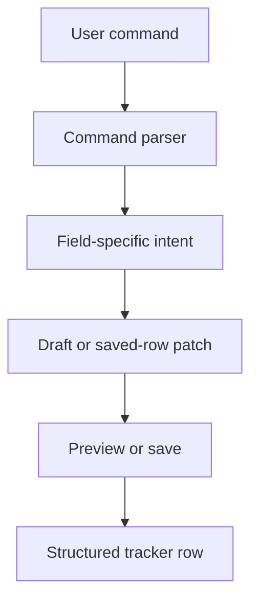
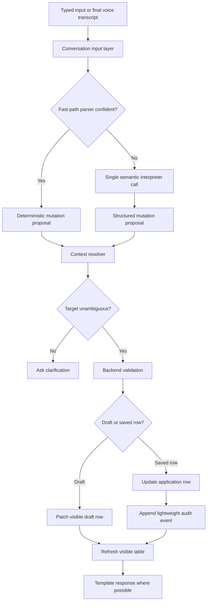
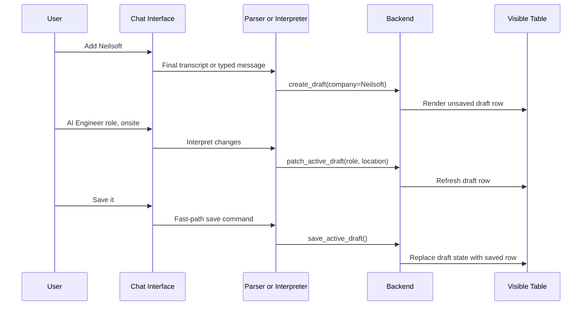
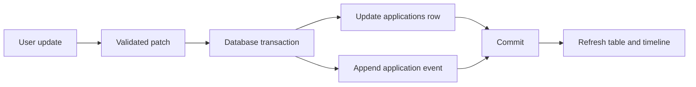

# Engineering Session Report

## 1. Session Objective

This session focused on a foundational redesign of the `job_tracker` application.

The central question was whether the application should continue treating structured tracker rows and individual columns as the primary interaction model, or whether it should move toward a conversational model similar to a normal chat interface.

The user proposed a major simplification:

> Instead of maintaining a structured representation of companies through column-oriented tool calls, store information in a more unstructured conversational form so that the system does not need to handle every possible user phrasing or invoke tools per column.

The discussion evaluated this proposal in depth and refined it into a hybrid architecture:

```text
Chat-first conversational input
        +
Explicit draft-save workflow
        +
Structured saved application rows
        +
Dedicated application notes
        +
Readable application timeline
        +
Soft delete
```

The key architectural conclusion was that the system should become conversational at the interface layer without abandoning structured state internally.

---

## 2. Starting Context

At the beginning of the session, the existing `job_tracker` was understood as a structured tracker controlled through natural-language commands.

Its current mental model was approximately:

```text
User input
   ↓
Parse supported command
   ↓
Extract tracker fields
   ↓
Patch draft or persisted row
   ↓
Preview and save
```

The tracker already revolved around structured fields such as:

```text
Company
Role
Type
Job Link
Location
Status
Current Stage
Priority
Next Action
Comments
```

The broader project goal was already voice-first and local-first. The application was expected to accept natural speech, preserve user control, avoid external job-site automation and maintain a reliable structured tracker.

### Existing assumptions carried into the session

The existing design implicitly assumed that:

1. User utterances should be converted into field-level updates as early as possible.
    
2. The structured application row should dominate both storage and interaction design.
    
3. Draft handling, preview logic and column mutation logic would remain central to the frontend and backend.
    
4. A growing list of explicit parser rules and tool-calling branches could be extended as more conversational variations appeared.
    

### Limitation that triggered the discussion

The user recognized that this architecture risked becoming increasingly brittle.

Natural conversation does not arrive in column order.

A user may say:

```text
Neilsoft ला apply केलं.
AI Engineer role आहे.
Onsite आहे.
Actually hybrid आहे.
Priority medium ठेव.
Recruiter ला resume पाठवला.
```

The system must understand:

```text
Is this a new application?
Is this an update to an active draft?
Is this an update to a saved row?
Which application is active?
Is a correction replacing a previous value?
Is a narrative statement a structured field or merely a note?
Should the system save immediately or wait for explicit confirmation?
```

The concern was not one isolated parser bug. The deeper concern was that the architecture might require increasing numbers of special cases for each new phrasing pattern and workflow branch.

---

## 3. User Goal Behind the Work

The user wants to build a local-first, conversational job-tracking assistant rather than a spreadsheet editor with voice commands attached to it.

The target product experience is:

```text
User speaks naturally
        ↓
Application draft updates progressively
        ↓
The user can visually inspect the table
        ↓
The user explicitly says "save it"
        ↓
A structured application row is persisted
```

The user should not need to remember rigid command syntax or manually specify each field in a form-like sequence.

At the same time, the product must retain the strengths of a structured tracker:

```text
Reliable filtering
Clear current state
Visible table rows
Deterministic updates
Manual control
Future dashboard support
Debuggability
```

The redesign therefore needed to preserve both sides:

```text
Natural conversational UX
        +
Structured operational reliability
```

This matters because voice input is inherently messy. Speech contains pauses, self-corrections, arbitrary field order and narrative context. A voice-first tracker must accept this flexibility without turning its internal state into an unreliable chat log.

---

## 4. Obstacles Encountered

This session was primarily a design investigation rather than an implementation or debugging session. No code-level bug was reproduced or fixed. However, several architectural obstacles were identified and analyzed.

### 4.1 Column-first interaction creates growing branch complexity

#### Symptom

A natural-language command must be classified into increasingly specific actions:

```text
create draft
patch active draft
patch saved application
preview update
save draft
discard draft
attach browser context
ask clarification
append note
```

As the assistant becomes more conversational, more branches are required.

#### Initially suspected

The initial instinct was that tool calling itself might be the problem. The user considered removing structured representations so that the assistant would not need to call tools for each tracker column.

#### Actual root cause

The deeper problem is not tool calling itself. The problem is **tool granularity and interaction modeling**.

A system with operations such as:

```text
set_company()
set_role()
set_location()
set_priority()
set_status()
append_comment()
```

forces the assistant to think like a spreadsheet editor.

A more stable abstraction is:

```text
apply one validated application patch
```

with multiple changes applied atomically.

#### Why non-obvious

Field-specific tools look simple in isolation. Each one appears easy to validate and implement. The complexity only becomes visible when natural multi-intent utterances and multi-turn conversations must be supported.

#### Boundary involved

```text
Tool-calling contract
Backend
Frontend state management
UX
```

#### Resolution

Adopt a generic mutation contract instead of per-column mutation tools.

---

### 4.2 Fully unstructured storage initially appears simpler but weakens the tracker

#### Symptom

The user proposed storing job-tracking information similarly to an ordinary chat conversation.

This would reduce immediate pressure to parse every phrase into tracker columns.

#### Initially suspected

A pure unstructured representation seemed like a possible simplification:

```text
Store chat messages
Retrieve them later
Use the LLM to infer current state when needed
```

#### Actual root cause

A pure chat-log system moves complexity from write time to every future read query.

Example history:

```text
Neilsoft priority medium ठेव.
Actually high ठेव.
Interview schedule झाला.
Interview cancel झाला.
```

A pure unstructured system must reconstruct current truth repeatedly.

That creates risk for queries such as:

```text
Show all high-priority applications.
Which applications are still active?
What is the current state of Neilsoft?
```

#### Why non-obvious

The write path becomes simpler immediately, which makes the architecture feel lighter. The hidden cost appears later in filtering, dashboard rendering, contradiction resolution and state reconstruction.

#### Boundary involved

```text
Database
LLM prompt
Read-query logic
UX
Performance
```

#### Resolution

Reject a pure chat-log tracker.

Adopt a hybrid model:

```text
Conversation as input
Structured rows as operational truth
Notes as narrative memory
Timeline events as readable history
```

---

### 4.3 Chat-first UX introduces target ambiguity

#### Symptom

A user may say:

```text
Priority high ठेव.
Save it.
Archive it.
```

without repeating the company or role.

#### Initially suspected

The active draft could simply be assumed to be the target.

#### Actual root cause

A conversational assistant needs explicit active-context rules.

Ambiguity becomes dangerous when:

```text
multiple drafts exist
the user switched applications
one company has multiple roles
the user selected a different row in the UI
speech recognition produced an uncertain company name
```

Example:

```text
Rockwell Automation — AI Intern
Rockwell Automation — GET
```

A command such as:

```text
Rockwell high priority ठेव.
```

cannot safely choose one row.

#### Why non-obvious

Short commands feel natural in conversation. Their ambiguity is invisible to the user because humans rely on conversational context automatically. The backend cannot safely do so without explicit deterministic rules.

#### Boundary involved

```text
UX
Frontend active state
Backend context resolver
Database identity model
```

#### Resolution

Define deterministic target resolution:

```text
1. Explicit company or application in current message
2. Active unsaved draft
3. Explicitly selected application in UI
4. Recently active application only when unambiguous
5. Clarification
```

Never silently update a weakly inferred target.

---

### 4.4 Structured fields and narrative information need different storage models

#### Symptom

The existing `comments` field risks becoming a large unreadable blob:

```text
Applied. Sent recruiter message. Recruiter replied. JD generic. Referral may be possible.
```

#### Initially suspected

All extra information could continue going into `comments`.

#### Actual root cause

Narrative details evolve over time and have independent timestamps. Rewriting a single comments field loses chronology and makes the application difficult to understand later.

#### Why non-obvious

A single comments field is easy to implement and initially sufficient. Its limitations appear only as the tracker becomes a long-running personal knowledge base.

#### Boundary involved

```text
Database schema
UX
Application detail view
```

#### Resolution

Introduce dedicated `application_notes` records and a timeline UI.

---

### 4.5 Timeline events are useful, but full event sourcing would overcomplicate the project

#### Symptom

Once a timeline was proposed, the discussion naturally approached event-sourcing concepts.

#### Initially suspected

A complete event-sourced design might provide history, undo support and reconstruction of previous states.

#### Actual root cause

Full event sourcing changes the source of truth:

```text
Events become primary truth
Current rows become derived projections
```

This introduces additional concerns:

```text
event replay
projection consistency
schema versioning
ordering
idempotency
snapshot strategies
```

The project does not currently need that level of complexity.

#### Why non-obvious

The timeline feature superficially resembles event sourcing. It is easy to overgeneralize from “store useful events” to “reconstruct all application state from events.”

#### Boundary involved

```text
Database architecture
Backend persistence model
Testing complexity
```

#### Resolution

Use a lightweight audit timeline:

```text
Applications table = operational source of truth
Application events table = readable audit trail
```

Update both in one transaction for saved-row mutations.

---

### 4.6 Latency can increase if every utterance invokes an LLM

#### Symptom

A voice-first interaction pipeline may involve:

```text
Audio
→ STT
→ semantic interpretation
→ context resolution
→ validation
→ database update
→ response generation
→ TTS
```

Even simple commands such as:

```text
save it
priority high ठेव
onsite आहे
discard it
```

could feel slow if each one requires a full semantic-model call and a second response-generation call.

#### Initially suspected

Using a conversational assistant might require routing all messages through an LLM.

#### Actual root cause

Different utterances require different levels of reasoning.

A rigid one-size-fits-all pipeline wastes compute and increases perceived latency.

This is especially relevant for a local-first system where STT, LLM and TTS may compete for limited compute resources.

#### Why non-obvious

The LLM provides language flexibility, so it is tempting to use it universally. However, many recurring tracker commands are deterministic and can be handled without semantic inference.

#### Boundary involved

```text
Speech pipeline
Backend parser
Local model performance
UX
Infrastructure
```

#### Resolution

Adopt a tiered interpretation strategy:

```text
Tier 1: deterministic fast path
Tier 2: one semantic interpreter call
Tier 3: clarification
```

Also use template-based responses for simple operations and never mutate state from partial STT transcripts.

---

### 4.7 Partial speech transcripts can corrupt state

#### Symptom

Streaming STT may produce evolving partial transcripts:

```text
priority...
priority low...
priority low नाही, high ठेव
```

#### Initially suspected

Streaming partials might be used to make the interface feel faster.

#### Actual root cause

Partial transcripts are unstable. Mutating application state from partial results could create incorrect or repeated updates.

#### Why non-obvious

Streaming feedback improves responsiveness visually, but it must not be confused with a finalized user command.

#### Boundary involved

```text
Speech pipeline
Frontend
Backend mutation pipeline
```

#### Resolution

Use:

```text
Partial transcript → display only
Final transcript → mutation pipeline
```

---

### 4.8 Soft deletion is safer than physical deletion

#### Symptom

A voice assistant may misunderstand a deletion command or select the wrong application.

#### Initially suspected

A standard delete operation might be sufficient.

#### Actual root cause

Hard deletion is risky in a conversational and speech-driven system because state-changing commands may occasionally be misinterpreted.

#### Why non-obvious

Deletion is easy to implement as a database removal. The need for recoverability becomes more important once voice interaction and fuzzy entity matching are introduced.

#### Boundary involved

```text
Database
UX
Backend confirmation policy
```

#### Resolution

Adopt archive-and-restore semantics rather than hard delete.

---

## 5. Approaches Considered

### 5.1 Existing column-first structured tracker

#### Description

Continue treating the tracker table as both the storage model and the primary interaction model.

Natural-language inputs would be mapped directly to tracker fields.

#### Why it seemed reasonable

The current product already has a structured tracker. This model supports filters, deterministic updates and CSV-like visibility.

#### Advantages

```text
Clear current state
Easy filtering
Simple dashboard queries
Straightforward exports
Predictable schema
```

#### Drawbacks

```text
Increasing parser branches
Rigid interaction assumptions
Too many field-specific tool calls
Complex draft-state handling
Poor fit for natural voice conversations
```

#### Decision

Modified rather than fully rejected.

The structured table remains essential, but it should no longer dominate the conversational interface.

---

### 5.2 Fully unstructured chat-log tracker

#### Description

Store the user's messages as conversational history and avoid maintaining structured application rows.

#### Why it seemed reasonable

This approach appeared to remove the need for:

```text
tool calling per column
strict input phrasing
schema-first updates
complex field extraction
```

#### Advantages

```text
Simpler initial write path
Flexible natural input
Easy storage of arbitrary narrative information
Fewer migrations when new note types appear
```

#### Drawbacks

```text
Current state must be reconstructed repeatedly
Contradictions become difficult to resolve
Structured filters become unreliable
Dashboard rendering becomes expensive
LLM inference is required for ordinary reads
Testing becomes harder
```

#### Decision

Rejected.

The system should not become a searchable notebook disguised as a tracker.

---

### 5.3 Chat-first hybrid tracker

#### Description

Use conversation as the input interface while preserving structured application rows internally.

```text
Conversation
   ↓
Validated mutation
   ↓
Draft row or saved application row
   ↓
Notes and lightweight timeline
```

#### Why it seemed reasonable

It preserves the strengths of both conversational UX and structured storage.

#### Advantages

```text
Natural voice-friendly interaction
Reliable table state
Deterministic filters
Progressive drafts
Separate narrative notes
Readable history
Incremental migration path
```

#### Drawbacks

```text
Context resolution is still required
Ambiguity handling remains necessary
Schema design still matters
Timeline noise must be managed
Backend validation remains important
```

#### Decision

Adopted as the target architecture.

---

### 5.4 Auto-save every valid mutation

#### Description

Persist new applications and edits immediately after each valid utterance.

#### Why it seemed reasonable

It reduces draft lifecycle complexity and avoids losing information if the conversation is interrupted.

#### Advantages

```text
Very natural interaction
No explicit save step
Fewer draft states
Immediate persistence
```

#### Drawbacks

```text
Accidental row creation
ASR errors can create bad data
Duplicate rows become more likely
User control is reduced
```

#### Decision

Rejected for new applications.

The user explicitly chose to retain the draft-save workflow.

---

### 5.5 Explicit draft-save workflow

#### Description

Create an unsaved draft row immediately, progressively patch it through conversation, show it in the table and persist it only when the user says:

```text
save it
```

#### Why it seemed reasonable

The user can see the table immediately and inspect the draft visually.

#### Advantages

```text
Preserves manual control
Works well with voice correction
Avoids accidental saves
Keeps preview-before-save principle
Makes incomplete drafts visible
```

#### Drawbacks

```text
Requires active-draft context
Multiple drafts may create ambiguity
Frontend must visually distinguish drafts
```

#### Decision

Adopted.

This became a core stable product principle.

---

### 5.6 Single comments blob

#### Description

Continue storing narrative details in one free-text comments field.

#### Why it seemed reasonable

It is simple and already aligned with spreadsheet-style tracking.

#### Advantages

```text
Minimal schema
Easy implementation
```

#### Drawbacks

```text
Poor readability
No chronology
Difficult to append safely
Hard to inspect application history
```

#### Decision

Superseded by dedicated notes and timeline records.

---

### 5.7 Dedicated notes and timeline UI

#### Description

Store narrative observations as separate notes and render important application activity in chronological order.

#### Why it seemed reasonable

Applications accumulate context over time, and the user reacted positively to this idea.

#### Advantages

```text
Readable history
Better application detail view
Timestamped narrative context
Cleaner structured rows
Natural fit for conversational input
```

#### Drawbacks

```text
Additional schema and UI work
Potential timeline noise
Need to distinguish internal events from user-facing summaries
```

#### Decision

Adopted.

This was identified as one of the strongest features of the redesign.

---

### 5.8 Full event sourcing

#### Description

Treat application events as the primary source of truth and derive current rows by replaying events.

#### Why it seemed reasonable

The new timeline naturally resembles an event stream. Full event sourcing could support historical reconstruction and undo.

#### Advantages

```text
Complete history
Strong auditability
Reconstructable past state
Natural event timeline
```

#### Drawbacks

```text
Replay complexity
Projection management
Schema evolution problems
Ordering and idempotency concerns
Overengineering for current scope
```

#### Decision

Rejected for now.

A lightweight audit timeline is sufficient.

---

### 5.9 Lightweight audit events

#### Description

Keep application rows as the operational source of truth while appending selected audit events.

#### Why it seemed reasonable

It enables timeline UI without introducing full event-sourcing complexity.

#### Advantages

```text
Simple direct queries
Readable history
Safer debugging
Soft-delete history
Low migration cost
```

#### Drawbacks

```text
Snapshot and event consistency must be protected
Not sufficient for perfect historical reconstruction
```

#### Decision

Adopted.

Saved-row updates and audit-event insertion should happen in one database transaction.

---

### 5.10 Route every command through an LLM

#### Description

Send all user utterances to the semantic interpreter.

#### Why it seemed reasonable

The assistant is conversational, and LLMs handle diverse language well.

#### Advantages

```text
Flexible input
Less regex logic
Fewer explicitly enumerated phrases
```

#### Drawbacks

```text
Higher latency
Unnecessary local model usage
Less predictable behavior
Potential over-inference
Slower voice interaction
```

#### Decision

Rejected.

---

### 5.11 Tiered interpretation pipeline

#### Description

Use deterministic parsing for common commands, one LLM call for complex utterances and clarification when ambiguity remains.

#### Why it seemed reasonable

Different commands require different reasoning depth.

#### Advantages

```text
Low latency for common commands
LLM flexibility for complex speech
Predictable backend behavior
Reduced local compute pressure
```

#### Drawbacks

```text
Fast-path scope must be carefully designed
Partial matches must not silently mutate data
Testing requires both deterministic and semantic paths
```

#### Decision

Adopted.

---

## 6. Decisions Made

### 6.1 Adopt a chat-first but structured-backend architecture

#### Final decision

The application should feel like a conversational assistant while preserving structured saved rows.

#### Reasoning

A pure unstructured system weakens reliable tracking. A pure column-first interaction model weakens conversational usability.

#### Rejected alternatives

```text
Pure structured command interface
Pure chat-log storage
```

#### Stability

Stable architectural principle.

---

### 6.2 Keep explicit draft-save workflow

#### Final decision

New applications remain drafts until the user explicitly saves them.

#### Reasoning

The visible table provides immediate feedback. The user can inspect the row and say:

```text
save it
discard it
change the role
change priority
```

#### Rejected alternative

Auto-save every valid application mutation.

#### Stability

Stable product principle.

---

### 6.3 Show draft rows immediately in the table

#### Final decision

Drafts should be visible in the table as unsaved rows.

#### Reasoning

This reduces reliance on conversational memory and makes the system easier to control visually.

#### Important UX requirement

Drafts must look different from persisted rows through a visible state such as:

```text
Draft
Unsaved changes
```

#### Stability

Stable UX principle.

---

### 6.4 Replace per-column tool calls with a generic mutation contract

#### Final decision

Use a patch-oriented operation:

```json
{
  "operation": "patch_active_draft",
  "target": {
    "draft_id": "draft_123"
  },
  "changes": {
    "role": "AI Engineer",
    "location_mode": "onsite",
    "status": "applied",
    "priority": "medium"
  },
  "notes_to_append": [
    "Sent recruiter my resume"
  ]
}
```

#### Reasoning

A single patch is easier to validate, test and apply atomically than multiple field-specific tool calls.

#### Rejected alternative

```text
set_company()
set_role()
set_priority()
set_location()
set_status()
```

#### Stability

Stable backend contract direction.

---

### 6.5 Introduce dedicated application notes

#### Final decision

Narrative facts should be stored as separate timestamped notes rather than merged into one comments blob.

#### Reasoning

Conversation produces contextual details that do not belong in structured columns but remain valuable later.

#### Stability

Stable feature direction.

---

### 6.6 Introduce timeline UI backed by lightweight events

#### Final decision

Applications should have a readable chronological timeline.

#### Reasoning

The timeline provides context without requiring the user to read a long comments field or scan the entire chat history.

#### Rejected alternative

Full event sourcing.

#### Stability

Stable feature direction, but exact event taxonomy remains open.

---

### 6.7 Use soft delete

#### Final decision

Archive rows and allow restore instead of physically deleting them.

#### Reasoning

Conversational and voice-driven interfaces benefit from recoverability.

#### Rejected alternative

Permanent hard delete.

#### Stability

Stable product principle.

---

### 6.8 Avoid full event sourcing

#### Final decision

Keep:

```text
Applications table = operational source of truth
Events table = audit timeline
```

#### Reasoning

The project benefits from timeline history but does not need replay-based state reconstruction.

#### Rejected alternative

```text
Events = primary truth
Rows = derived projection
```

#### Stability

Stable scope-control decision unless future requirements materially change.

---

### 6.9 Use a tiered latency strategy

#### Final decision

```text
Simple command → deterministic fast path
Complex message → one semantic interpreter call
Ambiguous message → clarification
Simple response → template response
Partial STT → display only
```

#### Reasoning

The system is local-first and voice-oriented. Avoiding unnecessary LLM calls improves responsiveness and predictability.

#### Rejected alternative

Route every utterance through the LLM and generate every response with another model call.

#### Stability

Stable performance principle.

---

### 6.10 Keep backend validation authoritative

#### Final decision

The parser or LLM may propose changes, but the backend must validate and persist them.

#### Reasoning

The system must not allow language-model interpretation to become database truth automatically.

#### Stability

Stable system-boundary principle.

---

## 7. Architecture Evolution

### Previous Design

The previous model was effectively a natural-language spreadsheet editor.



### Previous Limitation

The structured schema was useful, but the interaction layer was too tightly coupled to individual columns and workflow branches.

As conversation became more flexible, the number of special cases increased.

The system risked needing a new parser branch or tool path for every phrasing variant.

---

### Updated Design

The redesigned system separates conversational input from structured operational state.



---

### New Mental Model

```text
Chat is the interface.
Draft rows are the working state.
Saved application rows are the operational source of truth.
Notes preserve narrative information.
Timeline events preserve useful history.
```

---

### New Data Flow for Draft Creation



---

### New Data Flow for Saved-Row Updates



---

### New Abstractions Introduced

#### Generic mutation contract

```json
{
  "operation": "patch_application",
  "target": {
    "application_id": "app_12"
  },
  "changes": {
    "priority": "high"
  },
  "notes_to_append": []
}
```

#### Active context

```json
{
  "active_draft_id": "draft_123",
  "selected_application_id": null,
  "last_opened_application_id": "app_42"
}
```

#### Dedicated note records

```sql
application_notes (
    id,
    application_id,
    message_id,
    note_type,
    text,
    created_at
)
```

#### Lightweight audit events

```sql
application_events (
    id,
    application_id,
    message_id,
    event_type,
    payload_json,
    summary,
    created_at
)
```

#### Soft-delete state

Possible representation:

```sql
archived_at TEXT NULL
```

---

## 8. Implementation Progress

### Completed implementation during this session

No code changes were made during this session.

No files, modules, database migrations, tests or APIs were reported as modified.

This session was an architectural design and planning discussion.

### Planned implementation

The following incremental implementation order was proposed.

#### Phase 1: Generic mutation contract

Replace highly specific field-level branches with a patch-based contract.

```text
operation
target
changes
notes_to_append
```

#### Phase 2: Deterministic fast path

Handle common commands without an LLM:

```text
save
discard
priority updates
location-mode updates
status updates
note append
archive
restore
context switching
```

#### Phase 3: Application notes

Add a dedicated notes table and expose notes in application details.

#### Phase 4: Lightweight timeline events

Add an events table and timeline UI.

For saved-row mutations:

```text
Update application row
Append event
Commit transaction
```

#### Phase 5: Soft delete

Replace physical deletion with archive and restore.

#### Phase 6: Conversation logging

Store raw typed input and final voice transcripts for debugging and future evaluation.

#### Phase 7: Chat-first frontend refinement

Improve:

```text
conversation feed
visible draft rows
draft badge
active draft state
selected application details
notes view
timeline view
archive view
```

#### Phase 8: Voice integration

Use the same mutation pipeline for typed and voice input.

Voice must remain an input source rather than a separate business-logic path.

---

## 9. Validation and Evidence

No automated tests, manual code runs or performance benchmarks were executed during this session.

Validation was conceptual and scenario-based.

### Example draft workflow validated conceptually

```text
User: Add Neilsoft.
System: Neilsoft draft started.

User: AI Engineer role.
System: Updated.

User: onsite आहे.
System: Updated.

User: priority medium ठेव.
System: Updated.

User: save it.
System: Neilsoft application saved.
```

Expected table behavior:

|Company|Role|Location|Priority|Save State|
|---|---|---|---|---|
|Neilsoft|AI Engineer|onsite|medium|Draft|

After save:

|Company|Role|Location|Priority|Save State|
|---|---|---|---|---|
|Neilsoft|AI Engineer|onsite|medium|Saved|

---

### Example multi-intent semantic interpretation

Input:

```text
Neilsoft ला applied mark कर, onsite आहे, medium priority ठेव,
आणि note add कर की recruiter ने resume मागितला आहे.
```

Expected mutation:

```json
{
  "operation": "patch_active_draft",
  "changes": {
    "status": "applied",
    "location_mode": "onsite",
    "priority": "medium"
  },
  "notes_to_append": [
    "Recruiter asked for resume"
  ]
}
```

---

### Example fast-path command

Input:

```text
priority high ठेव
```

Expected flow:

```text
Final transcript
→ deterministic parser
→ active draft resolution
→ backend validation
→ draft patch
→ template response
```

Expected LLM calls:

```text
0
```

---

### Example ambiguity handling

Existing rows:

```text
Rockwell Automation — AI Intern
Rockwell Automation — GET
```

Input:

```text
Rockwell high priority ठेव.
```

Expected behavior:

```text
Ask which role the user means.
Do not silently patch either row.
```

---

### Example partial-ASR safety rule

Partial transcript progression:

```text
priority...
priority low...
priority low नाही, high ठेव
```

Expected behavior:

```text
Render partial text visually.
Do not mutate application state until final transcript.
```

---

### Example soft-delete flow

Input:

```text
Delete Neilsoft.
```

Expected behavior:

```text
Ask whether to archive the application.
Do not physically delete the row.
Allow restore from archive view.
```

---

### Remaining edge cases identified

```text
multiple drafts
multi-role companies
company-name aliases
ASR spelling variants
fuzzy matching
duplicate row detection
timeline summarization
undo semantics
confirmation policy for high-impact status changes
selected-row and active-draft conflicts
```

---

## 10. Lessons Learned

### 10.1 Tool calling was not the real problem

The architecture did not need to remove tools entirely.

The real issue was designing tools at the wrong abstraction level.

This:

```text
set_company
set_role
set_location
set_priority
```

creates coupling between language variation and tracker columns.

This:

```text
apply validated mutation patch
```

reduces future complexity.

---

### 10.2 Conversational input and structured storage are not opposites

The system does not need to choose between:

```text
Natural conversation
or
Reliable structured tracker
```

The correct separation is:

```text
Conversation for input
Structured rows for operational truth
Notes for narrative context
Timeline for readable history
```

---

### 10.3 A pure chat-log architecture only moves complexity

Removing schema mapping from the write path does not eliminate complexity.

It pushes complexity into:

```text
every read query
every filter
every dashboard render
every contradiction resolution
every state reconstruction
```

That trade-off is poor for a tracker.

---

### 10.4 Draft visibility is a powerful UX simplification

The user does not need the assistant to narrate every detail if the table updates immediately.

A visible unsaved row gives the user direct control:

```text
inspect
correct
save
discard
```

This reduces conversational burden while preserving safety.

---

### 10.5 Not all conversational information belongs in columns

A schema becomes brittle if every sentence creates a new structured field.

The reusable rule is:

```text
Store repeatedly filtered or workflow-relevant data as structured fields.
Store contextual narrative as notes.
```

---

### 10.6 Timeline UI does not require full event sourcing

A lightweight audit log captures most of the practical benefit.

The project can retain direct row queries while still presenting readable history.

---

### 10.7 Voice performance requires selective intelligence

An LLM should be used where semantic reasoning adds value.

It should not be used for every command merely because the interface is conversational.

Fast deterministic paths are important for:

```text
latency
predictability
local compute efficiency
testability
```

---

### 10.8 Partial transcripts are UI artifacts, not commands

Streaming STT improves responsiveness, but only finalized transcripts should reach the mutation pipeline.

---

### 10.9 Local-first design influences backend architecture

Performance strategy cannot be separated from product design.

The system must assume limited local resources and avoid unnecessary model calls.

---

## 11. Open Questions and Deferred Work

### Required next steps

#### 11.1 Design the generic mutation schema

Define the exact contract for:

```text
create_draft
patch_active_draft
save_active_draft
discard_active_draft
patch_application
append_note
archive_application
restore_application
```

Questions to resolve:

```text
Should one mutation support both draft and saved-row targets?
How should multiple notes be represented?
How should validation errors be returned?
How should frontend refresh instructions be represented?
```

---

#### 11.2 Define active-context rules precisely

The proposed resolution order needs concrete backend behavior.

Questions:

```text
Can multiple drafts exist simultaneously?
Does table selection override the active draft?
How long does recently active context remain usable?
How should a context switch be shown in the UI?
```

---

#### 11.3 Define the notes schema

Questions:

```text
Should note_type be an enum or free text?
Should notes be editable?
Should note edits create additional timeline records?
Should notes be draft-scoped before save?
```

---

#### 11.4 Define the timeline event taxonomy

Possible initial event types:

```text
draft_created
draft_updated
application_saved
application_updated
priority_changed
status_changed
location_changed
stage_added
stage_removed
note_added
application_archived
application_restored
```

Questions:

```text
Which draft events remain internal only?
Which events appear in the user-facing timeline?
Should multiple draft updates be collapsed when the draft is saved?
```

---

#### 11.5 Implement soft delete

Questions:

```text
Should the API call it delete or archive?
Should archive always require confirmation?
Should restore return the row to its previous table position?
```

---

#### 11.6 Build the deterministic fast path

Start with a deliberately limited command set.

Candidate commands:

```text
save it
discard it
priority high
priority medium
priority low
remote
hybrid
onsite
status applied
archive
restore
add note
open application
switch application
```

The fast path must fail safely when confidence is low.

---

### Optional enhancements

#### 11.7 Company alias handling

Potential schema:

```sql
companies (
    id,
    canonical_name
)

company_aliases (
    id,
    company_id,
    alias
)
```

Useful for speech-recognition variants:

```text
Neilsoft
Neil Soft
Nilsoft
Neilsoft Limited
```

Do not silently merge fuzzy matches.

---

#### 11.8 Undo support

The session recognized that event-style audit records could support inverse updates.

However, undo behavior was not fully designed.

---

#### 11.9 Timeline summarization

Internal mutation records may be more detailed than the timeline shown to the user.

A compact summary layer may be useful.

---

#### 11.10 Conversation logging and debugging records

Potential per-turn debug structure:

```json
{
  "raw_message": "...",
  "resolved_context": "...",
  "fast_path_result": "...",
  "semantic_interpreter_result": "...",
  "validation_result": "...",
  "persisted_mutation": "...",
  "snapshot_after": "..."
}
```

This remains planned rather than implemented.

---

### Explicitly rejected for now

#### Full event sourcing

Rejected because it adds architectural overhead without a current product requirement.

#### Pure chat-log storage

Rejected because the tracker still needs reliable structured operational state.

#### Universal LLM routing

Rejected because simple commands should not incur unnecessary inference latency.

#### Hard delete

Rejected in favor of archive and restore.

---

### Questions requiring further investigation

```text
How should frontend draft rows be visually distinguished?
Should low-risk saved-row updates auto-apply or require lightweight confirmation?
How should duplicate company-role drafts be handled?
How should multi-role company selection work in voice mode?
What is the smallest useful timeline event set?
Which commands should qualify for deterministic fast-path parsing?
How should draft-scoped notes move into saved application notes?
```

---

## 12. Significance in the Overall Project Journey

This session was primarily a **foundational design session** and a **UX-driven architectural redesign**.

It did not implement code, but it clarified the system's future direction before additional parser patches and frontend branches made the existing design harder to maintain.

The session moved the project from:

```text
A spreadsheet editor controlled through natural-language commands
```

toward:

```text
A conversational job-tracking assistant backed by explicit drafts,
structured saved rows, timestamped notes and a lightweight audit timeline
```

The discussion also prevented two likely overcorrections:

```text
1. Removing structured state entirely
2. Introducing full event sourcing prematurely
```

The resulting architecture is more aligned with the original local-first, voice-driven product vision while remaining incremental enough to implement without a disruptive rewrite.

---

## 13. Compact Timeline Entry

**Milestone:**  
Defined the chat-first redesign for `job_tracker`.

**Problem:**  
The existing column-oriented natural-language workflow risked accumulating parser branches, tool-calling complexity and brittle handling of natural voice input.

**Key obstacle:**  
The system needed conversational flexibility without losing structured tracker reliability or introducing unnecessary architectural complexity.

**Decision:**  
Adopt a hybrid model: visible unsaved draft rows, explicit `save it` workflow, structured saved rows as operational truth, dedicated application notes, lightweight timeline events, soft delete and tiered interpretation with deterministic fast paths.

**Outcome:**  
A clear incremental redesign plan was established. No code was changed during the session.

**Next step:**  
Design and implement the generic mutation contract, then add deterministic fast-path parsing before introducing notes, timeline and archive support.