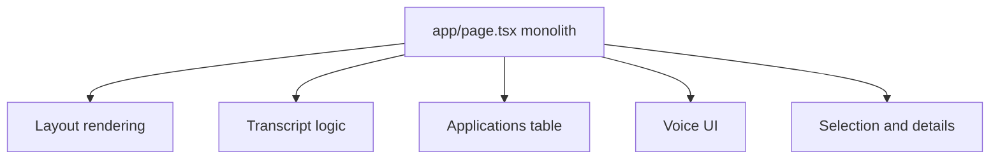
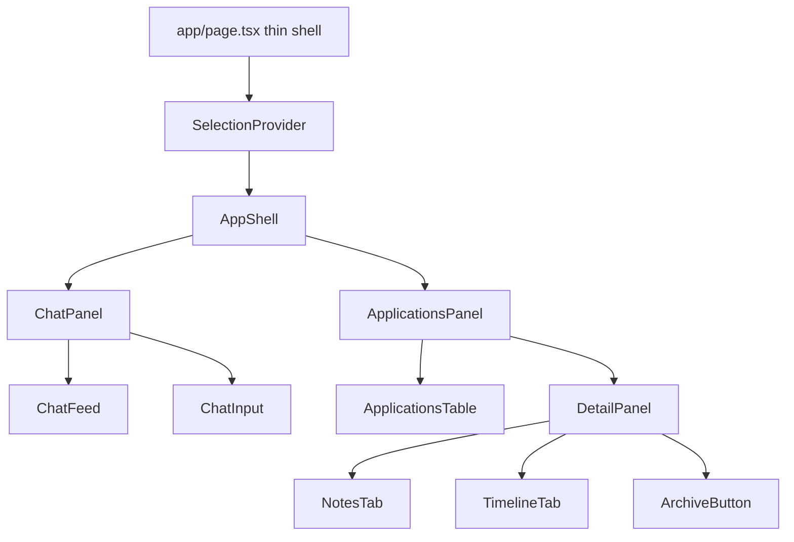
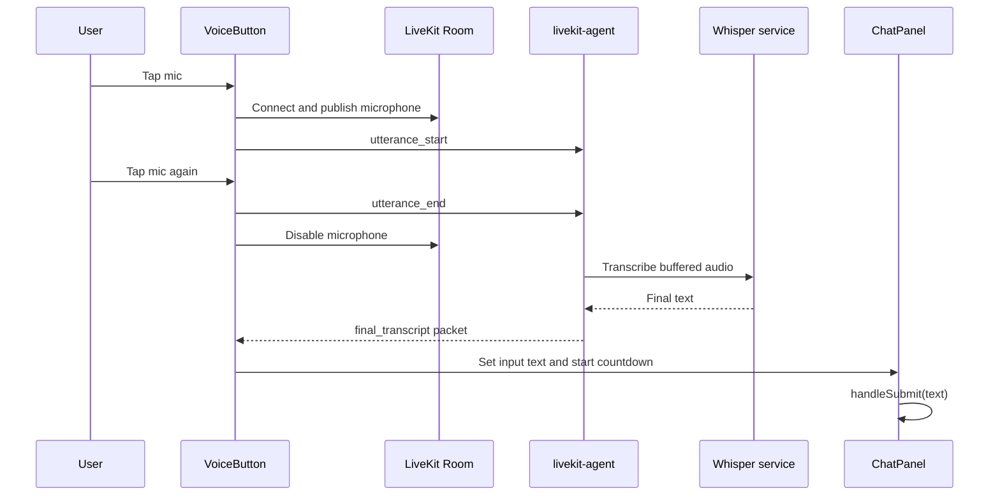
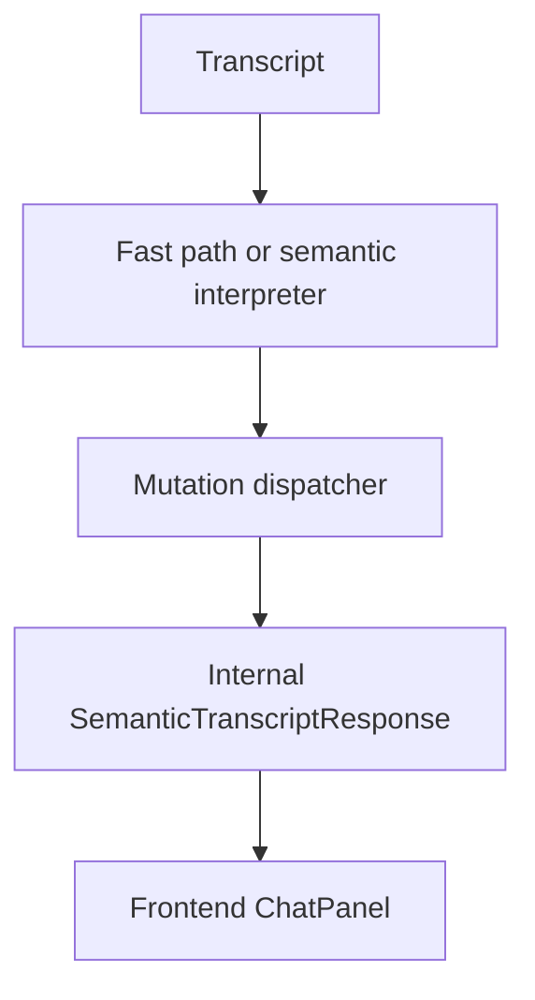
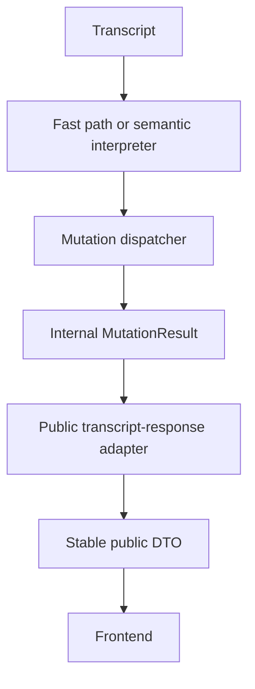

# Engineering Session Report

## 1. Session Objective

This session covered the staged frontend redesign of the local-first `job_tracker` application from Phase 3A through Phase 3F, followed by runtime debugging of a critical frontend-backend contract mismatch.

The original redesign goal was to replace a monolithic `page.tsx` frontend with a componentized split-panel interface:

```text
AppShell
├── ChatPanel
└── ApplicationsPanel
    ├── ApplicationsTable
    └── DetailPanel
```

The implementation progressed through:

```text
Phase 3A — frontend foundation and scaffolding
Phase 3B — layout shell and monolith preservation
Phase 3C — applications table
Phase 3D — detail panel
Phase 3E — text-based chat workflow
Phase 3F — LiveKit voice MVP
```

After Phase 3F, a manual runtime test exposed a deeper architectural issue: the frontend had been implemented against an assumed transcript-response contract that did not match the backend’s actual `POST /transcript/parse` response schema.

The session therefore evolved from a UI migration task into a contract-debugging and backend-architecture review task.

---

## 2. Starting Context

### Existing product

`job_tracker` is a local-first conversational job-tracking assistant with:

```text
Backend      FastAPI + PostgreSQL
Frontend     Next.js + TypeScript
Voice        LiveKit + local realtime agent + Whisper service
```

Users issue natural-language commands such as:

```text
Applied for an AI Engineer role at Neilsoft
Make it remote and high priority
Save it
Discard it
```

The backend interprets commands, manages a draft-save workflow, and persists structured application records.

The intended redesign included:

```text
left side      chat feed + input + mic
right side     active / archived applications table
bottom right   selected-application details
```

The initial design specification assumed that the frontend would receive semantic statuses such as:

```text
draft_created
draft_updated
saved
discarded
updated
clarification
```

It also assumed a flattened frontend application shape containing fields such as:

```text
role
employment_type
location_mode
current_stage
```

Those assumptions were carried into the frontend implementation.

### State before the redesign work

Phase 3A had already created:

```text
components/
  layout/
  chat/
  applications/
  detail/
  ui/

lib/
  types.ts
  api.ts
  SelectionContext.tsx
```

The original `page.tsx` remained monolithic and intentionally untouched during scaffolding.

The backend was initially treated as complete and out of scope for modification.

### Trigger for deeper investigation

After Phase 3F, the user manually submitted:

```text
Applied for an AI Engineer role at Neilsoft
```

The UI displayed:

```text
Update received.
```

No transient amber draft row appeared in the applications table.

The backend had actually understood the command and created a draft. The failure occurred at the integration boundary between backend response semantics and frontend expectations.

---

## 3. User Goal Behind the Work

The frontend redesign mattered because the product is intended to feel like a practical local-first application assistant rather than a raw developer tool.

The desired experience is:

```text
User speaks or types naturally
→ application draft appears
→ user reviews it
→ user saves or discards it
→ saved applications appear in a structured table
→ notes, timeline and archive actions remain accessible
```

The technical goals were directly tied to product experience:

- Preserve a human-controlled draft-review workflow.
    
- Avoid automatic job application submission.
    
- Keep voice and typed interaction consistent.
    
- Show draft state visually before persistence.
    
- Keep the UI local-first and lightweight.
    
- Avoid brittle coupling between frontend UI and backend implementation details.
    
- Ensure future commands and fields do not require repeated ad hoc patches.
    

The final concern raised in the session was broader than the visible bug:

```text
Is the backend genuinely a reusable mutation platform,
or is it becoming a collection of special-case command patches?
```

That question became the key unresolved architectural issue.

---

## 4. Obstacles Encountered

## 4.1 Ambiguous component ownership in the redesigned layout

### Symptom

The initial redesign plan placed:

```text
AppShell
├── ChatPanel
├── ApplicationsPanel
└── DetailPanel
```

This made `ApplicationsPanel` and `DetailPanel` siblings.

### Initial suspicion

The initial assumption was that `SelectionContext` could provide the selected application information to the detail panel.

### Actual issue

`SelectionContext` intentionally stored only:

```ts
selectedApplicationId: number | null
```

The fetched application rows belonged to `ApplicationsPanel`.

If `DetailPanel` remained a sibling, the selected application object would need to be lifted unnecessarily into `AppShell` or passed through extra callback state.

### Boundary involved

```text
Frontend component architecture
```

### Resolution

Ownership was changed and locked as:

```text
AppShell
├── ChatPanel
└── ApplicationsPanel
    ├── ApplicationsTable
    └── DetailPanel
```

`ApplicationsPanel` became the owner of the full right-side workspace.

This allowed it to:

```text
fetch rows
→ read selectedApplicationId
→ derive selectedApplication
→ pass selectedApplication directly to DetailPanel
```

---

## 4.2 Shared draft state initially placed too low in the tree

### Symptom

The draft needed to appear in both:

```text
Chat feed
Applications table pinned row
```

### Initial suspicion

The original plan suggested keeping:

```text
activeDraft
draftId
```

inside `ChatPanel`.

### Actual issue

If draft state remained in `ChatPanel`, the applications table would need imperative synchronization through a ref.

That would misuse the table-refresh ref as a general shared-state synchronization mechanism.

### Boundary involved

```text
Frontend state ownership
```

### Resolution

Draft state was lifted into `AppShell`:

```text
AppShell owns:
  activeDraft
  draftId
```

Then both panels receive it as props:

```text
AppShell
├── ChatPanel
└── ApplicationsPanel
```

The table-refresh ref remained narrowly scoped to persisted-row refreshes.

---

## 4.3 Old monolithic `page.tsx` migration ambiguity

### Symptom

The redesign instructions simultaneously required:

```text
replace page.tsx with a thin shell
```

and:

```text
preserve old page.tsx logic temporarily
```

### Initial suspicion

Git history might be sufficient.

### Actual issue

Relying only on Git history would make migration comparison less convenient during Phases 3C–3E.

Leaving the old logic commented inside `page.tsx` would clutter the new shell and risk compilation or maintenance issues.

### Boundary involved

```text
Frontend migration workflow
```

### Resolution

The monolithic implementation was mechanically moved into:

```text
components/legacy/LegacyTrackerPage.tsx
```

Only import paths changed:

```text
./trackerState → @/app/trackerState
./config       → @/app/config
```

The legacy file remained unused but available for comparison until text-chat migration was complete.

After Phase 3E verification, it was deleted.

---

## 4.4 Tailwind classes present in JSX but not applied at runtime

### Symptom

The split layout visually appeared incorrect. The applications sheet consumed the full viewport, and the left chat region did not appear visible.

The DOM contained:

```tsx
<section className="w-72 shrink-0 border-r">
```

but DevTools showed:

```text
width: 871px
flex-shrink: 1
border-right-width: 0px
```

Expected:

```text
width: 288px
flex-shrink: 0
border-right-width: 1px
```

### Initial suspicion

The `AppShell` wrapper structure might be missing or incorrect.

### Actual root cause

`AppShell.tsx` was already correct.

The actual issue was Tailwind v4 CSS initialization.

The project had been configured using Tailwind v4 packages, but the CSS entry needed:

```css
@import "tailwindcss";
```

Without the correct import, utility classes existed in JSX but were not generated or loaded correctly.

### Why non-obvious

- `npm run build` passed.
    
- The JSX class names looked correct.
    
- The failure was visible only in computed browser styles.
    
- The table still appeared partially structured due to default browser rendering and existing CSS.
    

### Boundary involved

```text
Frontend CSS infrastructure
```

### Resolution

The stylesheet was corrected to use:

```css
@import "tailwindcss";
```

This restored utilities such as:

```text
w-72
shrink-0
border-r
flex
overflow-hidden
bg-blue-50
bg-amber-50
```

---

## 4.5 Local PostgreSQL schema appeared stale

### Symptom

The backend produced:

```text
psycopg.errors.UndefinedColumn:
column job_applications.archived_at does not exist
```

### Initial suspicion

A backend schema migration had not been applied.

### Actual finding

Alembic later reported that the database was already at:

```text
20260609_0006
```

After verification, both:

```text
GET /applications
GET /applications/archived
```

returned JSON rather than HTTP 500.

### Why non-obvious

The exact transient cause was not conclusively proven.

Possible explanations discussed:

- stale backend process,
    
- migration applied after an earlier server start,
    
- temporarily different database connections,
    
- runtime environment mismatch.
    

### Boundary involved

```text
Database / backend runtime environment
```

### Resolution

The issue was verified as no longer blocking.

### Remaining uncertainty

The session did not establish a definitive root cause for why the runtime process initially queried a schema missing `archived_at` despite Alembic later reporting head revision.

---

## 4.6 Original voice specification exceeded existing agent capabilities

### Symptom

The original Phase 3F design required:

```text
partial transcripts appear in textarea while speaking
final transcript triggers 2-second countdown
```

### Initial suspicion

The existing agent might already support partial STT packets.

### Actual root cause

The voice audit confirmed:

```text
Agent buffers audio
→ waits for utterance_end
→ sends full buffer to Whisper
→ emits one final_transcript packet
```

No streaming Whisper path existed.

No partial packet type existed.

No VAD or semantic turn detection existed in the current agent.

The confirmed transport was LiveKit data channel packets:

```json
{ "type": "utterance_start", "utterance_id": "..." }
{ "type": "utterance_end",   "utterance_id": "..." }

{ "type": "final_transcript",    "utterance_id": "...", "text": "..." }
{ "type": "transcription_error", "utterance_id": "...", "message": "..." }
```

### Why non-obvious

The broader product plan referenced streaming speech behavior, but the actual repository implemented a simpler explicit recording-gate model.

### Boundary involved

```text
Speech pipeline / realtime infrastructure
```

### Resolution

Phase 3F scope was narrowed to a frontend-only voice MVP:

```text
tap mic
→ start recording
tap mic again
→ stop recording
→ wait for final transcript
→ fill textarea
→ countdown
→ auto-submit
```

Partial transcripts were deferred to a future Phase 3G.

---

## 4.7 Chat input state ownership blocked voice injection

### Symptom

`ChatInput` owned its textarea state internally.

Voice integration required external transcript injection into the same textarea.

### Initial suspicion

An imperative ref API could be added:

```ts
setText()
clear()
submit()
```

### Actual design issue

An imperative ref would work but would make state flow less transparent.

### Boundary involved

```text
Frontend component state design
```

### Resolution

Textarea state was lifted to `ChatPanel`:

```text
ChatPanel owns:
  inputText
```

`ChatInput` became controlled:

```ts
value
onValueChange
onSubmit
```

Typed and voice input now share the same state and the same `handleSubmit()` pathway.

---

## 4.8 Runtime transcript submission returned generic fallback instead of draft state

### Symptom

After Phase 3F, submitting:

```text
Applied for an AI Engineer role at Neilsoft
```

rendered:

```text
Update received.
```

No amber draft row appeared.

### Initial suspicion

Possible causes considered:

- semantic interpreter failed,
    
- voice pipeline failed,
    
- frontend table refresh did not run,
    
- draft props were not propagated,
    
- backend emitted an unexpected status.
    

### Actual root cause

The backend returned:

```json
{
  "status": "preview",
  "operation": "create",
  "proposal": {
    "tool_name": "patch_active_draft"
  },
  "draft_id": "9",
  "draft": {
    "company": "Neilsoft",
    "roles_json": ["AI Engineer"]
  }
}
```

The frontend handled:

```text
draft_created
draft_updated
saved
discarded
updated
clarification
```

There was zero overlap between backend status values and frontend branches.

The frontend fallback executed:

```ts
response.message || "Update received."
```

The backend did not provide `message`, so the fallback string appeared.

Because neither `draft_created` nor `draft_updated` executed:

```text
onDraftIdChange(...)
onActiveDraftChange(...)
```

were never called.

The draft existed in the backend response and database but never reached table state.

### Why non-obvious

- Automated frontend tests passed because they mocked the assumed contract.
    
- Backend tests passed because they asserted the existing low-level contract.
    
- Both suites were internally consistent but mutually incompatible.
    
- The bug surfaced only in a real frontend-to-backend runtime test.
    

### Boundary involved

```text
Frontend-backend API contract
```

### Resolution

No fix was implemented in this session.

A read-only contract audit was performed first.

---

## 4.9 Application DTO mismatch extended beyond transcript responses

### Symptom

Even after status normalization, draft and saved-row rendering would remain incomplete.

### Initial suspicion

The issue might only affect transcript draft payloads.

### Actual root cause

The audit found a broader field-shape mismatch.

Backend uses:

```text
roles_json
employment_types_json
location
current_stages_json
engaged_days
next_action
comments
```

Frontend assumes:

```text
role
employment_type
location_mode
current_stage
```

Comparison:

|Meaning|Backend field|Frontend field|
|---|---|---|
|Roles|`roles_json: string[]`|`role: string`|
|Employment types|`employment_types_json: string[]`|`employment_type: string`|
|Location|`location`|`location_mode`|
|Current stages|`current_stages_json: string[]`|`current_stage: string`|
|Engaged days|`engaged_days`|missing|
|Next action|`next_action`|missing|
|Comments|`comments`|missing|

The mismatch affected:

```text
POST /transcript/parse → draft
GET /applications
GET /applications/archived
```

### Boundary involved

```text
Backend public DTO / frontend domain type
```

### Resolution

No code change yet.

The proposed direction became broader:

```text
stabilize public API DTOs
not just transcript statuses
```

---

## 4.10 Backend scalability remained unproven

### Symptom

A route-layer adapter could fix the immediate UI bug, but the user questioned whether the backend itself was robust or merely functioning through accumulated patches.

### Initial suspicion

The transcript contract audit described the internal dispatcher, semantic interpreter and fast-path parser as healthy.

### Actual unresolved concern

The audit proved functional behavior but did not prove architectural scalability.

Open concern:

```text
Does each new phrasing or field require another special-case patch?
```

Potential red flags to investigate:

```text
language-specific checks inside dispatcher
fast paths required for correctness rather than optimization
duplicated validation rules
unclear draft lifecycle state transitions
new fields requiring edits across many unrelated files
```

### Boundary involved

```text
Backend mutation architecture / LLM tool-calling contract
```

### Resolution

Implementation of the public API adapter was intentionally postponed.

The next step is a read-only internal backend scalability audit.

---

## 5. Approaches Considered

## 5.1 Keep `DetailPanel` as an `AppShell` sibling

### Why it seemed reasonable

The layout visually contains three regions:

```text
chat
applications table
details
```

### Advantages

- Simple visual mapping.
    
- `AppShell` owns the complete page composition.
    

### Drawbacks

- `ApplicationsPanel` owns fetched rows.
    
- `DetailPanel` needs the selected application object.
    
- Selection context stores ID only.
    
- Extra state lifting or callbacks would be required.
    

### Decision

Rejected.

### Adopted alternative

```text
ApplicationsPanel owns the full right workspace.
```

---

## 5.2 Keep transient draft state inside `ChatPanel`

### Why it seemed reasonable

Drafts originate from chat commands.

### Advantages

- Localized chat state.
    
- Simple initial ownership model.
    

### Drawbacks

- Table also needs transient draft state.
    
- Imperative ref synchronization would couple chat and table unnecessarily.
    

### Decision

Rejected.

### Adopted alternative

Lift:

```text
activeDraft
draftId
```

into `AppShell`.

---

## 5.3 Store selected full application object in context

### Why it seemed reasonable

`DetailPanel` needs application data.

### Advantages

- Easy direct access from any component.
    

### Drawbacks

- Context becomes a second source of truth.
    
- Fetched rows can update while selected object becomes stale.
    
- Violates the intended ID-only selection boundary.
    

### Decision

Rejected.

### Adopted alternative

Store ID only and derive the selected row inside `ApplicationsPanel`.

---

## 5.4 Preserve monolithic `page.tsx` only through Git history

### Why it seemed reasonable

Git already preserves history.

### Advantages

- No extra temporary file.
    

### Drawbacks

- Harder to compare migration logic during active refactor.
    
- Less convenient for Claude Code or Codex inspection.
    

### Decision

Rejected.

### Adopted alternative

Move old code temporarily to:

```text
components/legacy/LegacyTrackerPage.tsx
```

Then remove it after Phase 3E verification.

---

## 5.5 Use shadcn Tabs for Active / Archived table switching

### Why it seemed reasonable

Active and Archived behave like tabs.

### Advantages

- Semantic tab UI abstraction.
    
- Consistent tab styling.
    

### Drawbacks

- Unnecessary complexity for a two-state table filter.
    
- shadcn Tabs were already reserved for detail-panel `Notes | Timeline`.
    

### Decision

Rejected.

### Adopted alternative

Use plain Tailwind `<button>` elements styled as tabs.

---

## 5.6 Render a clickable transient draft row

### Why it seemed reasonable

A draft row appears in the applications table and resembles saved rows.

### Advantages

- Consistent interaction model.
    

### Drawbacks

- Draft does not have meaningful saved-record details.
    
- Notes, timeline and archive actions may not be valid.
    
- Fake IDs or special-case detail handling would be required.
    

### Decision

Rejected.

### Adopted alternative

Draft rows remain:

```text
pinned
amber-tinted
non-selectable
```

---

## 5.7 Reserve empty detail-panel space during Phase 3C

### Why it seemed reasonable

The final layout includes a fixed lower detail panel.

### Advantages

- Final geometry established early.
    
- Less layout change later.
    

### Drawbacks

- Blank unusable area during table-only phase.
    
- Phase 3C UI would look incomplete.
    

### Decision

Rejected.

### Adopted alternative

Phase 3C used full-height table.

Phase 3D added the fixed lower detail workspace when it became functional.

---

## 5.8 Implement partial transcripts during Phase 3F

### Why it seemed reasonable

The original UX expected live transcript text while recording.

### Advantages

- Better perceived responsiveness.
    
- More conversational feel.
    
- Early user correction opportunity.
    

### Drawbacks

- Agent emitted only final transcript packets.
    
- No streaming STT path existed.
    
- No VAD existed.
    
- Would require agent and packet-schema changes.
    
- Would expand Phase 3F beyond frontend-only scope.
    

### Decision

Deferred.

### Adopted alternative

Voice MVP ships with:

```text
recording indicator
final transcript
2-second countdown
```

Streaming partials deferred to Phase 3G.

---

## 5.9 Push-to-talk voice interaction

### Why it seemed reasonable

The agent contract supports explicit recording start and end packets.

### Advantages

- Natural for short utterances.
    
- Microphone duration tightly bounded.
    

### Drawbacks

- Less comfortable across desktop and mobile.
    
- Hold gestures introduce pointer/touch complexity.
    

### Decision

Rejected.

### Adopted alternative

Tap-to-toggle:

```text
tap once  → record
tap again → transcribe
```

---

## 5.10 Escape clears transcript during countdown

### Why it seemed reasonable

The original UX specification said Escape cancels submission and clears input.

### Advantages

- Clean reset.
    
- Simple mental model.
    

### Drawbacks

- User loses an already-transcribed utterance.
    
- Prevents manual correction after cancellation.
    

### Decision

Modified.

### Adopted behavior

```text
Escape
→ cancel auto-submit
→ preserve transcript
→ allow editing
```

---

## 5.11 Use imperative ref methods for voice text injection

### Why it seemed reasonable

`ChatInput` originally owned local state.

Possible ref:

```ts
setText()
clear()
submit()
```

### Advantages

- Minimal parent changes.
    
- Works mechanically.
    

### Drawbacks

- Less transparent state flow.
    
- Harder to reason about countdown and typed edits.
    
- Increases imperative coupling.
    

### Decision

Rejected.

### Adopted alternative

Lift `inputText` into `ChatPanel` and make `ChatInput` controlled.

---

## 5.12 Fix contract mismatch only in the frontend

### Why it seemed reasonable

Frontend could interpret:

```text
preview + operation + proposal.tool_name
```

### Advantages

- Fastest patch.
    
- No backend response changes.
    
- Minimal risk to backend tests.
    

### Drawbacks

- Frontend becomes coupled to internal mutation semantics.
    
- Internal tool renames could break UI.
    
- Backend leaks implementation details permanently.
    
- Future clients must duplicate translation logic.
    
- Does not solve list-endpoint field mismatch cleanly.
    

### Decision

Rejected as the long-term fix.

### Temporary status

Could still be used as an emergency workaround, but not recommended.

---

## 5.13 Backend-only public DTO normalization

### Why it seemed reasonable

Backend could return fully frontend-friendly payloads.

### Advantages

- Frontend remains simple.
    
- Contract centrally controlled.
    

### Drawbacks

- Risk of coupling backend public API too tightly to current table layout.
    
- Flattening arrays could lose multi-role or multi-stage information.
    
- Requires careful domain-vs-view DTO design.
    

### Decision

Modified rather than fully rejected.

### Preferred direction

Backend should expose stable public domain DTOs, while frontend performs only normal display formatting such as:

```ts
roles.join(", ")
```

---

## 5.14 Add public response adapter immediately

### Why it seemed reasonable

The immediate runtime bug was well understood.

### Advantages

- Fixes missing draft row.
    
- Hides internal transcript semantics.
    
- Aligns frontend and backend.
    

### Drawbacks

The user raised a deeper concern:

```text
What if internal mutation architecture is itself brittle?
```

Adding a public adapter first might conceal deeper architectural debt.

### Decision

Postponed.

### Next action

Perform an internal backend mutation scalability audit first.

---

## 6. Decisions Made

## 6.1 `ApplicationsPanel` owns the complete right workspace

Stable principle:

```text
ApplicationsPanel
├── ApplicationsTable
└── DetailPanel
```

Reason:

- fetched rows and selected-row derivation stay together,
    
- context remains ID-only,
    
- no stale selected-object state.
    

---

## 6.2 `AppShell` owns UI-wide transient draft state

Stable principle:

```text
AppShell owns:
  activeDraft
  draftId
```

Reason:

- draft affects chat feed and table simultaneously,
    
- avoids imperative draft synchronization.
    

---

## 6.3 `SelectionContext` remains ID-only

Stable principle:

```text
selectedApplicationId
setSelectedApplicationId
```

Rejected alternative:

```text
store full selected Application object
```

Reason:

- avoids stale data,
    
- keeps one source of truth.
    

---

## 6.4 Refresh ref is used only for persisted-row mutations

Stable principle:

```text
ChatPanel mutation
→ AppShell callback
→ ApplicationsPanel.refresh()
```

Transient draft changes propagate through props instead of refetching.

---

## 6.5 Active / Archived switching uses plain buttons

Stable UI choice:

```text
plain Tailwind buttons
```

`Notes | Timeline` uses shadcn Tabs.

---

## 6.6 Draft rows are pinned but non-selectable

Stable UX principle:

```text
amber tint
pencil icon
top of active list
no details panel
```

---

## 6.7 Text and voice submissions share one command pipeline

Stable architectural principle:

```text
typed text
or
voice final transcript
→ ChatPanel.handleSubmit()
→ POST /transcript/parse
```

No duplicate business logic.

---

## 6.8 Voice MVP is final-transcript-only

Temporary product decision:

```text
tap-to-toggle recording
final transcript only
countdown after final packet
```

Partial streaming deferred.

---

## 6.9 Escape preserves transcript

Stable UX preference unless future testing disproves it:

```text
Escape cancels auto-submit but keeps text editable
```

---

## 6.10 Resizable chat divider deferred

Planned enhancement:

```text
default width    288px
min width        240px
max width        480px
double-click     reset
localStorage     persist
```

Deferred until after core functionality is stable.

---

## 6.11 Public API should stop exposing backend internals

Proposed stable architectural principle:

```text
internal mutation contract
≠
public API contract
```

Target architecture:

```text
MutationResult
→ route-layer public adapter
→ stable DTO
→ frontend
```

---

## 6.12 Adapter implementation postponed pending scalability audit

Stable process decision:

```text
audit internal backend architecture first
→ then choose adapter and DTO migration design
```

Reason:

The team wants confidence that the backend is generic and extensible rather than patch-driven.

---

## 7. Architecture Evolution

## 7.1 Frontend before redesign



Limitation:

```text
layout
state
fetching
mutation routing
voice
selection
details
```

were mixed in one file.

---

## 7.2 Frontend after Phase 3E



---

## 7.3 Voice architecture after Phase 3F



---

## 7.4 Current problematic backend-to-frontend architecture



Problem:

```text
Internal backend semantics leak directly into frontend.
```

---

## 7.5 Proposed architecture after future stabilization



Target separation:

```text
language understanding
≠
mutation execution
≠
public response formatting
≠
frontend presentation
```

---

## 8. Implementation Progress

## 8.1 Completed: Phase 3A — foundation

Created or configured:

```text
Tailwind v4
@tailwindcss/postcss
postcss.config.mjs
tailwind.config.ts
shadcn Dialog
shadcn Tabs
components/ui/
lib/utils.ts
lib/types.ts
lib/api.ts
lib/SelectionContext.tsx
component stubs
```

A small discrepancy was noted:

```text
prompt mentioned 14 component stubs
actual listed structure contained 15
```

All listed stubs were created.

---

## 8.2 Completed: Phase 3B — layout shell

Created:

```text
components/legacy/LegacyTrackerPage.tsx
```

Modified:

```text
app/page.tsx
components/layout/AppShell.tsx
components/chat/ChatPanel.tsx
components/applications/ApplicationsPanel.tsx
```

Implemented:

```text
thin page.tsx
SelectionProvider
AppShell topbar
split layout
left fixed w-72 chat wrapper
right flexible applications wrapper
shared draft state
ApplicationsPanel refresh ref contract
```

Validation:

```text
frontend build passing
backend 243 tests passing
```

---

## 8.3 Completed: Phase 3C — applications table

Configured:

```text
Vitest 4.1.8
jsdom
React Testing Library
```

Implemented:

```text
StatusBadge
PriorityBadge
ApplicationRow
ApplicationsTable
ApplicationsPanel fetching
active / archived switching
pinned amber draft row
blue selected-row tint
refresh() refetch behavior
```

Validation:

```text
59 frontend tests passing
frontend build passing
243 backend tests passing
```

Discovered backend values:

```text
Status:
Interested
Applied
Rejected
Interview
Offer
Archived

Priority:
LOW
MEDIUM
HIGH
```

---

## 8.4 Completed: Tailwind v4 runtime correction

Changed CSS entry to:

```css
@import "tailwindcss";
```

Result:

```text
w-72
shrink-0
border-r
```

and other utility classes began applying correctly.

---

## 8.5 Completed: Phase 3D — detail panel

Implemented:

```text
NotesTab
TimelineTab
ArchiveButton
DetailPanel
ApplicationsPanel detail integration
```

Behavior:

```text
row select
→ lower h-56 detail panel
→ Notes | Timeline
→ Archive with confirmation
→ Restore without confirmation
```

Validation:

```text
108 frontend tests passing
frontend build passing
243 backend tests passing
```

One test design changed because Radix Tabs inactive panels were not mounted in jsdom. The test verified the active Notes child rather than asserting against an unmounted Timeline child.

---

## 8.6 Completed: Phase 3E — text-chat workflow

Implemented:

```text
ChatMessage
ChatFeed
ChatInput
ChatPanel
intro card
draft summary bubbles
response routing
table-refresh callbacks
```

Deleted:

```text
components/legacy/LegacyTrackerPage.tsx
components/legacy/
```

Text input behavior:

```text
Enter          submit
Shift+Enter    newline
empty input    Send disabled
submitting     input disabled
```

Intro card:

```text
Keep your job search organised

Update applications in plain language.

✓ Add a new application
✓ Save or discard a draft
✓ Update status, priority, or job details
✓ Add notes and track what changed
✓ Archive applications you no longer need

Try something like:
Applied for an AI Engineer role at Neilsoft
```

Validation:

```text
158 frontend tests passing
frontend build passing
243 backend tests passing
```

---

## 8.7 Completed: Phase 3F — LiveKit voice MVP

Added:

```text
LiveKitTokenResponse
fetchLiveKitToken()
VoiceButton implementation
controlled ChatInput
ChatPanel inputText state
voice countdown state
```

Implemented:

```text
Room.connect()
setMicrophoneEnabled()
utterance_start
utterance_end
RoomEvent.DataReceived
final_transcript handling
transcription_error handling
unavailable state
cleanup on unmount
Escape cancellation
manual edit cancellation
manual Send override
```

Validation:

```text
Frontend tests    197 passing across 15 files
Frontend build    passing
Backend tests     243 passing
Agent tests       37 passing
```

One TypeScript note remained:

```text
publishData accepts NonSharedUint8Array
TextEncoder.encode() returns Uint8Array
implementation uses a localized as any cast
```

This was accepted as non-blocking technical debt.

---

## 8.8 Completed: voice prerequisite audit

Confirmed:

```text
POST /livekit/token exists
livekit-client installed
raw SDK sufficient
agent publishes final_transcript
no partial transcript mechanism
typed submit flow reusable
```

---

## 8.9 Completed: transcript API contract audit

Confirmed:

```text
severe frontend-backend contract drift
backend emits low-level statuses
frontend expects high-level statuses
message missing from backend response
application payload shapes mismatched
LiveKit agent does not call /transcript/parse
browser extension does not call /transcript/parse
Whisper service does not call /transcript/parse
```

---

## 8.10 Planned but not implemented

Not yet implemented:

```text
public_schemas.py
transcript_response_adapter.py
stable public TranscriptResponse
normalized public application DTOs
frontend application type alignment
frontend rendering updates for array fields
README contract update
internal backend scalability audit
resizable chat divider
streaming partial transcripts
```

---

## 9. Validation and Evidence

## Automated verification history

|Stage|Frontend tests|Backend tests|Agent tests|Build|
|---|--:|--:|--:|---|
|Phase 3C|59|243|not reported|passing|
|Phase 3D|108|243|not reported|passing|
|Phase 3E|158|243|not reported|passing|
|Phase 3F|197|243|37|passing|

## Runtime commands tested

The critical manually tested utterance was:

```text
Applied for an AI Engineer role at Neilsoft
```

Observed UI:

```text
Update received.
```

Expected UI:

```text
Draft created. Review it and save when ready.

✎ Neilsoft | AI Engineer | draft
```

## Captured runtime response

The backend returned:

```json
{
  "status": "preview",
  "operation": "create",
  "proposal": {
    "tool_name": "patch_active_draft"
  },
  "draft_id": "9",
  "draft": {
    "company": "Neilsoft",
    "roles_json": ["AI Engineer"]
  }
}
```

This proved:

```text
interpreter worked
dispatcher worked
draft persistence worked
frontend integration failed
```

## Important testing lesson

The frontend and backend test suites both passed before manual runtime testing because each encoded a different internally consistent contract:

```text
backend tests
→ assert old low-level response

frontend tests
→ mock assumed high-level response
```

Only a true integration test would have detected the mismatch earlier.

---

## 10. Lessons Learned

## 10.1 Passing isolated test suites do not prove contract compatibility

Frontend mocks can preserve incorrect assumptions indefinitely.

Backend tests can validate an API that no consumer can actually use.

Required improvement:

```text
add contract-level integration tests
```

---

## 10.2 Internal models should not automatically become public API contracts

The backend exposed:

```text
preview
operation
proposal.tool_name
raw_transcript
interpreter_metrics
roles_json
current_stages_json
```

These fields are useful internally but inappropriate as the primary frontend contract.

A public API boundary must translate internal outcomes into stable product semantics.

---

## 10.3 UI state ownership should follow shared visibility, not event origin

Drafts originate from chat but affect both chat and table.

Therefore:

```text
origin = ChatPanel
visibility = app-wide
owner = AppShell
```

This avoided imperative synchronization.

---

## 10.4 IDs belong in shared selection context; full objects do not

The selected application object is derived from fetched state.

This avoids:

```text
stale duplicated selected object state
```

---

## 10.5 Fast paths are acceptable only if they remain optional optimizations

A parser may include shortcuts for:

```text
save it
discard it
archive company
```

But future audit must verify:

```text
fast paths improve latency
not correctness
```

If the semantic fallback cannot handle equivalent phrasing, the architecture is brittle.

---

## 10.6 Product scope should follow actual infrastructure capability

Partial transcript UX was attractive but unsupported.

Rather than silently expanding scope into agent rewrites, the team shipped a final-transcript MVP and deferred streaming.

This kept Phase 3F focused and testable.

---

## 10.7 Runtime CSS inspection matters

Build success did not guarantee styling correctness.

Computed styles exposed the actual Tailwind integration failure.

---

## 10.8 A seemingly small UI bug exposed a deeper architectural question

The missing amber row initially looked like a rendering bug.

It revealed:

```text
status contract drift
payload DTO drift
internal implementation leakage
missing integration tests
possible backend patchwork risk
```

The correct response was not an immediate alias patch.

The correct response was to pause and audit architecture.

---

## 11. Open Questions and Deferred Work

## 11.1 Required next step: internal backend scalability audit

Before implementing the route-layer adapter, inspect whether the internal mutation system is genuinely generic.

Questions:

```text
Does dispatcher consume structured payloads only?
Does transcript text leak into persistence logic?
Are fast paths optional optimizations?
Are core operations finite and reusable?
Are business rules centralized?
Is draft lifecycle a clear state machine?
How many files change when adding a field?
How many files change when adding a phrasing?
How many files change when adding a workflow state?
```

---

## 11.2 Required future implementation: stable public API DTOs

Likely design:

```text
Internal MutationResult
→ transcript_response_adapter.py
→ PublicTranscriptResponse
```

Possible statuses:

```text
draft_created
draft_updated
saved
discarded
updated
clarification
no_change
error
```

---

## 11.3 Required future implementation: canonical public application DTO

Need to decide whether public API exposes:

```text
roles
employment_types
location
current_stages
```

with arrays preserved.

Frontend should perform normal display formatting:

```ts
roles.join(", ")
```

rather than depend on DB-specific `_json` fields.

---

## 11.4 Required future validation: integration tests

Add real integration coverage for:

```text
frontend submitTranscript()
→ backend /transcript/parse
→ draft_created public response
→ AppShell activeDraft update
→ amber table row
```

---

## 11.5 Deferred enhancement: streaming partial transcripts

Future Phase 3G:

```text
partial_transcript packet
utterance_id
sequence number
streaming or chunked STT
```

Requires agent changes.

---

## 11.6 Deferred enhancement: resizable chat column

Planned shell polish:

```text
drag divider
default 288px
min 240px
max 480px
double-click reset
localStorage persistence
```

---

## 11.7 Deferred cleanup: LiveKit `publishData()` cast

Current:

```ts
as any
```

Potential future improvement:

```ts
Parameters<typeof participant.publishData>[0]
```

or another localized compatibility helper.

---

## 11.8 Unresolved database-runtime question

The earlier `archived_at` missing-column error was no longer reproducible after migration verification.

The exact original cause remains uncertain.

---

## 12. Significance in the Overall Project Journey

This session was simultaneously:

```text
a frontend redesign milestone
a voice-integration milestone
a debugging breakthrough
an architectural review trigger
```

The project progressed from a monolithic frontend to a modular application with:

```text
split layout
applications table
detail workspace
text chat
voice MVP
draft-state visualization
archive / restore
notes
timeline
```

More importantly, manual runtime testing prevented the project from hiding a serious contract mismatch behind passing unit tests.

The session changed the direction from:

```text
patch the visible missing-row bug
```

to:

```text
prove backend scalability first
then establish a stable public API boundary
```

That shift is significant because it prioritizes maintainability over short-term UI repair.

---

## 13. Compact Timeline Entry

**Milestone:** Completed frontend redesign through LiveKit voice MVP and identified transcript API contract drift.

**Problem:** A real command created a backend draft but the UI displayed `Update received.` and rendered no amber draft row.

**Key obstacle:** Frontend and backend test suites were independently green while encoding incompatible contracts. Backend emitted low-level `preview` responses and DB-shaped fields; frontend expected semantic statuses and flattened UI fields.

**Decision:** Do not add a narrow frontend alias patch yet. First audit the internal mutation architecture for scalability. If healthy, add a route-layer public DTO adapter and align application payload contracts.

**Outcome:** Modular frontend, text chat and voice MVP completed; 197 frontend tests, 243 backend tests and 37 agent tests passing. Root cause of the runtime bug understood but intentionally not patched yet.

**Next step:** Perform a read-only internal backend mutation architecture scalability audit before implementing public API stabilization.