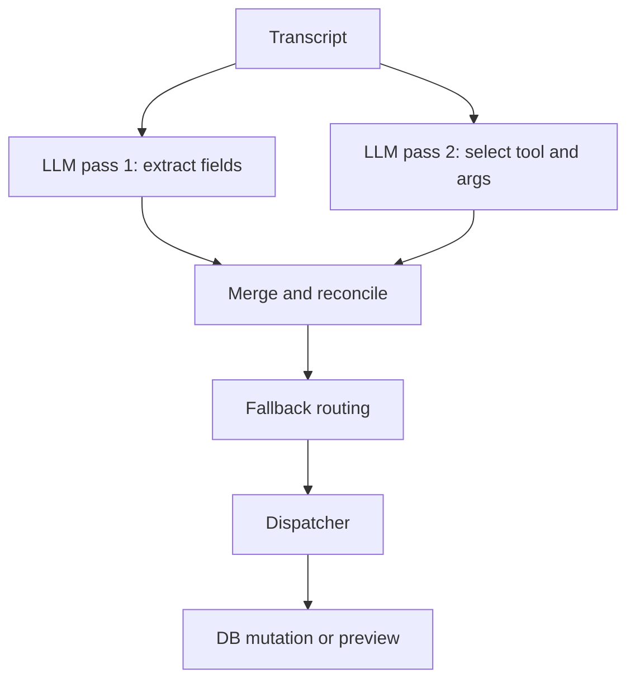
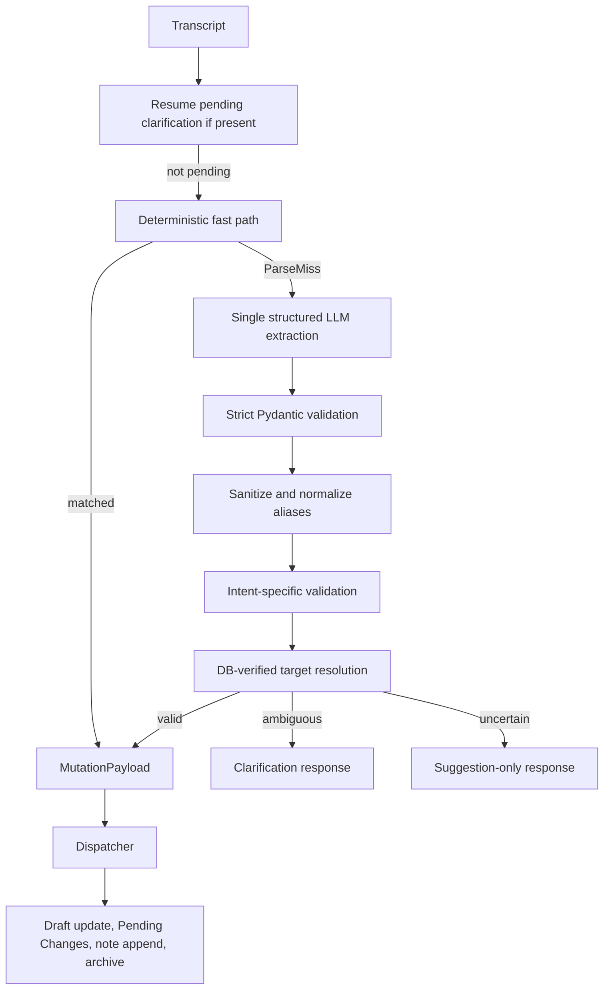

# Engineering Session Report

## 1. Session Objective

This session began as an attempt to fix a deceptively simple conversational command failure in `job_tracker`:

```text
add application for ai engineer at neilsoft
```

The initial symptom was a backend validation failure followed by the chat-panel response:

```text
No change was made.
```

However, the investigation revealed that the issue was not an isolated malformed payload. It exposed a broader architectural problem in the semantic layer: a local LLM was being asked to independently extract fields, choose backend tools, construct tool arguments, and indirectly influence mutation routing. The backend had accumulated sanitizers, canonicalizers, merge rules, fallback branches, and precedence overrides to compensate for unreliable outputs.

The session therefore evolved into a larger architectural refactor with several connected goals:

1. Stop hallucination-driven mutations.
    
2. Restore natural-language flexibility without returning to unsafe LLM tool-calling.
    
3. Support multi-field updates in one sentence.
    
4. Make notes a safe first-class operation.
    
5. Repair broken clarification continuation.
    
6. Replace the stale legacy frontend with the newer `AppShell`.
    
7. Surface persisted drafts in the UI.
    
8. Make application and draft selection URL-addressable.
    
9. Fix draft discard failures caused by frontend state desynchronization.
    

By the end of the session, the core conversational tracker flow was working end-to-end in natural language, while mutation authority remained deterministic and backend-controlled.

---

## 2. Starting Context

At the beginning of the session, the backend already had a substantial semantic-command system and a mutation dispatcher. The intended product flow was:

```text
voice / text transcript
→ semantic interpretation
→ preview or draft mutation
→ user review
→ explicit save / apply
```

Important existing product rules included:

```text
tracker table = source of truth
preview before saved-row mutation
no silent auto-apply
Current Stage remains user-controlled
Comments and Next Action remain user-controlled
overview assistant is read-only
```

The semantic interpreter had already undergone several hardening phases. It included:

```text
blank sanitization
controlled-field reconciliation
explicit field-cue reconciliation
alias normalization
strict validation
tool-envelope canonicalization
lifecycle precedence
explicit-create precedence
saved-update precedence
no-tool-call recovery
invalid-args fallback
active-draft contextual fallback
target resolution
dispatcher routing
```

The immediate trigger was a runtime trace for:

```text
add application for ai engineer at neilsoft
```

The backend logged:

```text
semantic_tool_argument_validation_failed
tool=patch_active_draft
arguments={
  'function': 'patch_active_draft',
  'parameters': {
    'fields': {
      'company': 'Neilsoft',
      'role': 'AI Engineer'
    }
  },
  'fields': {
    'company': 'Neilsoft',
    'role': 'AI Engineer'
  }
}
```

The tool argument canonicalizer accepted some wrapper shapes such as:

```text
args
arguments
fields
```

but not:

```text
parameters
```

The chat panel returned:

```text
No change was made.
```

The initial assumption was that another narrow wrapper canonicalization patch might unblock the command. That assumption was quickly challenged because the same transcript also revealed a wrong intent selection:

```text
expected:
create_draft

actual:
patch_active_draft
```

The problem was not merely malformed JSON. It was semantic instability.

---

## 3. User Goal Behind the Work

The goal was not to build a rigid command-line interface disguised as a chat box.

The intended experience was:

```text
natural conversational input
→ tracker understands the intent and fields
→ backend safely applies the correct draft or preview behavior
```

The user wanted to speak naturally:

```text
I applied for AI Engineer role at Aiden AI.
It is onsite and full-time with high priority.
Current stages are tailored and applied.
```

rather than memorize a fixed command grammar:

```text
add application for AI Engineer at Aiden AI
set location as onsite
set employment type as full-time
set priority as high
set current stages as tailored, applied
```

The broader product vision was a local-first conversational job-tracking assistant:

```text
natural voice input
+
local model
+
predictable tracker mutations
+
manual review before important persisted changes
```

The challenge was to preserve natural language while preventing the local model from corrupting tracker state.

---

## 4. Obstacles Encountered

### 4.1 Malformed tool-call envelope

#### Symptom

The local LLM returned:

```python
{
    "function": "patch_active_draft",
    "parameters": {
        "fields": {
            "company": "Neilsoft",
            "role": "AI Engineer"
        }
    },
    "fields": {
        "company": "Neilsoft",
        "role": "AI Engineer"
    }
}
```

The backend rejected the extra keys:

```text
function
parameters
```

#### Initially suspected

The immediate suspicion was a missing canonicalization branch for:

```text
parameters.fields
```

#### Actual root cause

The wrapper mismatch was real, but it was only one symptom. The same command had also been routed to the wrong tool:

```text
patch_active_draft
```

instead of:

```text
create_draft
```

The semantic system was over-reliant on LLM-generated tool envelopes.

#### Why it was non-obvious

A malformed envelope looked like a straightforward serialization problem. In reality, the backend had to compensate for a model that could vary both the operation and the payload structure.

#### Boundary involved

```text
LLM output contract
backend validation
tool-calling contract
```

#### Resolution

A small legacy safety guard for `parameters` was added temporarily, but the larger decision was to stop treating wrapper patches as the main solution.

---

### 4.2 Direct saved-row mutation bypassed Pending Changes

#### Symptom

New deterministic single-field commands such as:

```text
set status to rejected
```

correctly bypassed Ollama, but when a saved application was selected they produced:

```python
MutationPayload(
    operation="patch_application",
    target=MutationTarget(application_id=<id>),
    changes=ApplicationChanges(status="rejected"),
)
```

This directly mutated and committed the saved row.

#### Initially suspected

The new fast path appeared correct because it routed the right field and target.

#### Actual root cause

The fast-path target resolver treated:

```text
active_application_id
```

as permission for direct persisted-row mutation.

That violated an established product invariant:

```text
transcript update to saved row
→ Pending Changes preview
→ Apply / Discard
```

#### Why it was non-obvious

The dispatcher operation was valid in isolation. The bug was contextual: `patch_application` was appropriate for manual form editing but not for transcript-originated updates.

#### Boundary involved

```text
parser routing
dispatcher semantics
product workflow
```

#### Resolution

The fast path was changed to emit:

```python
operation="create_application_update_draft"
```

for selected saved applications.

The saved row now remains unchanged until explicit Apply.

---

### 4.3 Runtime response contract inconsistency

#### Symptom

A direct curl request returned:

```json
{
  "status": "no_change",
  "message": "No change was made.",
  "draft_id": "29",
  "draft": {
    "id": 0,
    "company": "Neilsoft",
    "role": "AI Engineer",
    "is_draft": true
  }
}
```

The frontend did not display the draft.

#### Initially suspected

The deterministic parser might still not be active.

#### Actual root cause

The response was internally contradictory:

```text
status = no_change
draft_id = 29
draft.id = 0
```

A draft-like object was present, but it was not a coherent persisted draft DTO.

The exact intermediate bug was not fully documented in the later reports, but the system was subsequently reworked so real persisted drafts and route-addressable draft DTOs were used consistently.

#### Why it was non-obvious

The backend appeared to return a draft while simultaneously claiming no change occurred.

#### Boundary involved

```text
backend response adapter
frontend rendering contract
draft persistence
```

#### Resolution

Later frontend and API refactors standardized persisted draft handling through:

```text
GET /drafts
GET /drafts/{id}
DELETE /drafts/{id}
```

and route-driven draft selection.

---

### 4.4 Deterministic parser became too rigid

#### Symptom

This worked:

```text
add application for AI Engineer role at virtusa software
```

but this failed:

```text
do me a favor, add application for AI Engineer role at virtusa software
```

Later, other natural variants also failed:

```text
I have applied for AI Engineer role at Aiden AI
Update location to on-site
set priority of neilsoft to medium
```

#### Initially suspected

The create regex was anchored too strictly.

#### Actual root cause

The first create issue was caused by full-string anchoring. That was fixed by searching for a known command span inside conversational prefixes.

However, the deeper problem remained: a regex-only controlled language system forced the user to memorize exact wording and could not support natural multi-field input.

#### Why it was non-obvious

Adding a few safe aliases seemed reasonable:

```text
set
change
update
please
do me a favor
```

but each fix exposed another phrasing variant. The parser was drifting toward an endless template-maintenance problem.

#### Boundary involved

```text
UX
parser grammar
voice-input tolerance
```

#### Resolution

The parser was retained only as a high-confidence fast path. Natural language was moved to a new single-call structured semantic extractor.

---

### 4.5 Note command corrupted the role field

#### Symptom

The user said:

```text
add a note saying that i have connected with previous employer from there
```

The active draft role was overwritten with note-like text.

The chat panel showed an inconsistent summary:

```text
Draft: Neilsoft · (no role specified) · on-site · MEDIUM priority · applied
```

#### Initially suspected

The note operation might be missing from the semantic tool list.

#### Actual root cause

The runtime audit confirmed:

```text
append_note
```

already existed in the dispatcher but was not exposed through the LLM semantic tool list.

The old pipeline extracted note text into:

```text
role
comments
```

and the generic active-draft fallback synthesized:

```text
patch_draft
```

from any non-empty extracted field set.

The audit confirmed that the LLM could hallucinate note prose into `role`, and the fallback would apply it.

#### Why it was non-obvious

The corruption did not come from a direct note handler. It came from the interaction of:

```text
missing note intent
+
wrong field extraction
+
generic contextual fallback
```

#### Boundary involved

```text
LLM extraction
fallback routing
dispatcher
data integrity
```

#### Resolution

The system evolved through two stages:

1. Temporary pre-LLM note safety guard.
    
2. Proper first-class note flow:
    

```text
append_note
→ notes_to_append
→ application_notes table
```

Note text is now structurally separated from mutable application fields.

---

### 4.6 Clarification responses were decorative, not stateful

#### Symptom

The assistant asked:

```text
Which company should I use?
```

The user replied:

```text
neilsoft
```

The reply was processed as a fresh unrelated transcript.

Similarly:

```text
update application for Neilsoft
→ Which role at Neilsoft should I update?

AI Engineer
→ unsupported
```

#### Initially suspected

The frontend might not be sending context.

#### Actual root cause

The frontend stored and echoed:

```text
pending_command
```

but the backend parser never consumed it.

The clarification transport existed, but continuation logic did not.

#### Why it was non-obvious

The UI appeared stateful because it showed a follow-up question. Internally, the second turn had no connection to the original command.

#### Boundary involved

```text
frontend state
request contract
backend continuation logic
```

#### Resolution

A backend continuation stage was added before normal parsing:

```text
resume_pending_command()
→ fill only missing company or role
→ resume original operation
→ dispatch or ask next clarification
```

---

### 4.7 Multi-field commands were impossible in the regex parser

#### Symptom

Commands such as:

```text
make it onsite, full-time, and priority high
```

or:

```text
set priority to medium, location to hybrid,
and stages to networked and engaged
```

either failed or updated only one field.

#### Initially suspected

The dispatcher might only support one field per payload.

#### Actual root cause

The runtime audit showed the opposite: the dispatcher was already fully multi-field capable.

`ApplicationChanges` supported optional fields, and:

```text
patch_draft
create_application_update_draft
apply_application_update_draft
```

could all process multiple fields atomically.

The bottleneck was exclusively the parser, which emitted one field at a time.

#### Why it was non-obvious

The visible UX limitation looked like a backend mutation limitation. In reality, the domain layer was already correct.

#### Boundary involved

```text
parser
semantic extraction
domain dispatcher
```

#### Resolution

The new single-call semantic extractor returns one structured object with a multi-field `changes` payload.

---

### 4.8 Weak model copied selected context into explicit create identity

#### Symptom

For:

```text
Applied for Ideas To Impact for AI Engineer role,
full time employment opportunity,
set status as applied,
priority is medium
```

the system surfaced incorrect identity data such as:

```text
company = Google
role = Ideas To Impact
```

and the user also observed a stale `Tailored` stage.

#### Initially suspected

Backend target resolution might be overwriting explicit transcript identity with selected UI context.

#### Actual root cause

The audit proved that the wrong values came from raw extractor output.

With a selected Google context, `llama3.2:3b` copied:

```text
company = Google
role = AI Engineer
```

With a clean context, it still misread the dual-`for` structure:

```text
Applied for {company}
for {role} role
```

and emitted:

```text
target.role = Ideas To Impact
```

The `Tailored` stage came from an existing orphaned draft row, not from the current extraction.

#### Why it was non-obvious

Three separate issues appeared as one:

```text
weak model extraction
+
selected-context contamination
+
stale persisted draft rendering
```

#### Boundary involved

```text
model quality
extractor prompt
context grounding
frontend draft visibility
```

#### Resolution

The user explicitly chose not to fix the ambiguous dual-`for` phrasing during this session. The operational recommendation was to prefer:

```env
OLLAMA_MODEL=qwen2.5:7b-instruct
```

because it performed better in live verification.

---

### 4.9 Legacy frontend page was stale and broken

#### Symptom

The legacy `app/page.tsx` still used:

```text
roles_json
employment_types_json
current_stages_json
```

while the current public DTO used:

```text
role
employment_types
current_stages
```

Claude Code reported roughly 39 TypeScript errors and multiple runtime risks.

#### Initially suspected

A minimal crash fix might be enough.

#### Actual root cause

The entire legacy CRUD page was stale against the new scalar-role schema.

#### Why it was non-obvious

The crash appeared local, but the stale contract existed across:

```text
form state
normalization
filters
multiselects
table rendering
draft merge logic
```

#### Boundary involved

```text
frontend schema contract
legacy UI architecture
```

#### Resolution

The legacy page was not migrated. The newer `AppShell` became the main UI route.

---

### 4.10 AppShell could not mount without `SelectionProvider`

#### Symptom

The proposed route switch to `AppShell` would crash immediately.

#### Initially suspected

`AppShell` might be ready to mount directly.

#### Actual root cause

Both:

```text
ChatPanel
ApplicationsPanel
```

called:

```text
useSelection()
```

but no `SelectionProvider` was mounted.

#### Boundary involved

```text
frontend composition
React context
routing
```

#### Resolution

The main route was changed to render:

```tsx
<SelectionProvider>
  <AppShell />
</SelectionProvider>
```

Later, the provider was lifted to the layout so it could persist across route-addressable detail pages.

---

### 4.11 Drafts existed in DB but were invisible in AppShell

#### Symptom

The user could not create:

```text
Aiden AI · AI Engineer
```

because the backend returned:

```text
An application for Aiden AI — AI Engineer already exists.
```

But Aiden AI was not visible in the application panel.

#### Initially suspected

The frontend list might be stale.

#### Actual root cause

The DB audit found persisted drafts:

```text
id=33  Aiden AI · AI Engineer
id=35  Aiden AI · Ideas To Impact
```

with:

```text
is_draft = true
```

They were excluded from:

```text
GET /applications
GET /applications/archived
```

and there was no draft-listing endpoint.

The uniqueness guard counted them, but the UI could not display, open, save, or discard them.

#### Why it was non-obvious

The backend correctly enforced uniqueness, but the UI exposed only two lifecycle states:

```text
Active
Archived
```

Draft was persisted in the DB but missing from the navigation model.

#### Boundary involved

```text
database
API filtering
frontend information architecture
```

#### Resolution

A first-class draft surface was added:

```text
GET /drafts
Active | Drafts | Archived tabs
```

Collisions now return structured metadata with recovery actions.

---

### 4.12 Some drafts could not be discarded

#### Symptom

Persisted drafts sometimes showed a disabled or non-functional discard action.

#### Initially suspected

Possible causes included:

```text
wrong draft id
string/int mismatch
backend deletion failure
FK cascade failure
notes blocking deletion
stale list refresh
```

#### Actual root cause

The backend discard path was correct.

The frontend had two independent selection systems:

```text
SelectionContext.selectedDraftId
+
AppShell local draftId / activeDraft
```

A stale drafts list could cause them to desynchronize. `DetailPanel` required both stores to match before rendering draft mode.

#### Why it was non-obvious

The UI symptom looked like a backend deletion bug. The actual problem occurred before the correct delete request was sent.

#### Boundary involved

```text
frontend state
routing
selection synchronization
```

#### Resolution

URL route parameters became the canonical selection identity.

---

## 5. Approaches Considered

### 5.1 Continue patching tool-envelope variants

#### Approach

Add support for wrapper forms such as:

```text
parameters
params
payload
input
tool_input
```

#### Why it seemed reasonable

The immediate failure was caused by `parameters.fields`.

#### Advantages

```text
small patch
low migration cost
legacy path stays alive
```

#### Drawbacks

```text
endless wrapper arms race
wrong intent still unresolved
fallback complexity continues growing
```

#### Decision

Rejected as the primary strategy.

A narrow `parameters` compatibility guard was accepted temporarily, but only as rollback hardening.

---

### 5.2 Keep dual-output LLM architecture

#### Approach

Continue using:

```text
pass 1 → extract fields
pass 2 → select tool + construct args
backend → merge
```

#### Why it seemed reasonable

It offered natural-language flexibility and already existed.

#### Advantages

```text
broad phrasing support
tool-oriented design
```

#### Drawbacks

```text
two independent failure surfaces
merge complexity
malformed wrappers
wrong tool selection
unsafe fallback synthesis
poor debuggability
```

#### Decision

Rejected.

---

### 5.3 Deterministic parser only

#### Approach

Require explicit controlled commands such as:

```text
add application for ...
set priority as ...
set location as ...
add a note saying ...
```

#### Why it seemed reasonable

It eliminated hallucinations and made mutation behavior predictable.

#### Advantages

```text
high reliability
easy testing
no LLM dependency
```

#### Drawbacks

```text
too rigid
voice-unfriendly
many phrasing variants fail
multi-field natural updates impossible
regex maintenance grows endlessly
```

#### Decision

Adopted temporarily as a safety bridge, then modified into a fast path only.

---

### 5.4 Hybrid deterministic fast path plus one semantic extractor

#### Approach

Use deterministic parsing for obvious commands, and one structured JSON LLM extraction call for natural conversation.

#### Advantages

```text
natural language support
multi-field updates
single interpretation contract
backend-controlled mutation routing
strict validation
```

#### Drawbacks

```text
model quality still matters
context grounding must be conservative
schema-valid semantic mistakes remain possible
```

#### Decision

Adopted as the stable architectural direction.

---

### 5.5 MCP as hallucination fix

#### Approach

Expose tracker operations through an MCP server.

#### Why it seemed reasonable

MCP offers standardized tool schemas and could eventually expose tracker capabilities to external clients.

#### Advantages

```text
reusable integration layer
tool discovery
read-only debugging tools
future assistant interoperability
```

#### Drawbacks

MCP does not solve semantic misclassification:

```text
wrong intent
wrong tool
wrong field mapping
```

The model can still produce semantically incorrect but schema-valid inputs.

#### Decision

Deferred.

MCP remains useful later as an integration adapter, not as the safety mechanism.

---

### 5.6 Legacy frontend migration vs minimal patch vs AppShell switch

#### Option A — Fully migrate `page.tsx`

Reasonable because it could preserve existing filters and CRUD behavior.

Rejected because it would invest effort in a 1700-line stale page with duplicated chat and voice logic.

#### Option B — Minimal crash fix

Rejected because it would leave hidden form, filter, and multiselect errors.

#### Option C — Route `/` to `AppShell`

Adopted with a hybrid migration strategy:

```text
mount SelectionProvider
route main UI to AppShell
preserve rollback temporarily
port parity gaps later
```

---

### 5.7 Global company rename vs per-application reassignment

#### Option A — Rename shared `Company.name`

Rejected because multiple applications can share a Company entity.

#### Option B — Reassign one `JobApplication.company_id`

Preferred.

The backend already supported this correctly for manual form editing.

#### Decision

Manual reassignment remains supported. Transcript-driven reassignment was deferred because the small model could not reliably distinguish source and destination company.

---

## 6. Decisions Made

### Decision 1 — Stop patching semantic wrappers as the primary strategy

#### Final decision

Treat new malformed wrappers as symptoms, not the core problem.

#### Reasoning

The architecture was over-defensive and too difficult to reason about.

#### Stable principle

```text
avoid compensating for unreliable LLM tool envelopes
```

---

### Decision 2 — LLM may interpret language but may not control mutation routing

#### Final decision

Use one strict semantic JSON contract.

#### Reasoning

The backend must remain authoritative for:

```text
intent validation
target resolution
pending-change routing
dispatcher operation
```

#### Stable principle

```text
LLM understands language
backend controls mutations
```

---

### Decision 3 — Preserve deterministic fast paths for obvious commands

Examples:

```text
save it
discard draft
apply changes
set priority as medium
```

#### Reasoning

These operations are high-confidence, low-latency, and safer without LLM involvement.

#### Stable principle

```text
simple commands should bypass the model
```

---

### Decision 4 — Support multi-field changes atomically

#### Final decision

Allow one semantic command to populate multiple `changes` fields.

#### Reasoning

The domain layer already supported this; the parser was the bottleneck.

#### Stable principle

```text
one primary intent
→ many structured field changes
```

---

### Decision 5 — Reject mixed note-plus-field mutations in one sentence

#### Example

```text
set priority to medium and add a note saying recruiter replied
```

#### Final decision

Reject safely and ask for separate messages.

#### Reasoning

Notes persist immediately, while saved-row field changes go through Pending Changes review.

#### Stable principle

```text
one transcript
→ one primary domain intent
```

---

### Decision 6 — Make notes first-class

#### Final decision

Route note text only through:

```text
append_note
→ application_notes
```

#### Reasoning

Free-form note text must never leak into:

```text
role
comments
next_action
```

#### Stable principle

```text
note text is not an application field patch
```

---

### Decision 7 — Make URL the canonical selected-record identity

#### Final decision

Use:

```text
/applications/{id}
/drafts/{id}
```

as source of truth.

#### Reasoning

Two independent frontend selection stores caused draft discard failures.

#### Stable principle

```text
URL identity
→ fetched record
→ derived SelectionContext
```

---

### Decision 8 — Surface drafts as a first-class lifecycle state

#### Final decision

Add:

```text
Active
Drafts
Archived
```

#### Reasoning

Persisted drafts can block uniqueness and must be recoverable.

#### Stable principle

```text
every persisted lifecycle state must have a UI surface
```

---

### Decision 9 — Defer transcript-driven company reassignment

#### Final decision

Keep company reassignment in the manual UI only for now.

#### Reasoning

The domain layer already supports safe relinking, but the current small model does not reliably distinguish:

```text
source company
destination company
selected context
```

#### Temporary decision

A future semantic intent may be added:

```json
{
  "intent": "reassign_application_company",
  "target": {
    "company": "Runtime Labs",
    "role": "AI Engineer"
  },
  "destination_company": "Aiden AI"
}
```

---

## 7. Architecture Evolution

### Previous semantic design



### Problems

```text
wrong tool selection
malformed tool envelopes
merge conflicts
contextual fallback corruption
note text leaking into role
difficult debugging
```

### Updated semantic design



### New semantic abstractions

```text
SemanticCommand
SemanticTarget
SemanticChanges
single-call extractor
continuation resolver
suggestion-only response
```

### Previous frontend design

```mermaid
flowchart TD
    A[/ legacy page.tsx] --> B[local CRUD state]
    B --> C[stale *_json schema]
    B --> D[inline voice/chat logic]
```

### Updated frontend design

```mermaid
flowchart TD
    A[/applications overview] --> B[AppShell]
    C[/applications/:id] --> B
    D[/drafts/:id] --> B
    B --> E[ChatPanel]
    B --> F[ApplicationsPanel]
    B --> G[DetailPanel]
    F --> H[Active tab]
    F --> I[Drafts tab]
    F --> J[Archived tab]
    D --> K[URL canonical draft identity]
    C --> L[URL canonical application identity]
    K --> M[SelectionContext derived]
    L --> M
```

---

## 8. Implementation Progress

### Completed backend work

#### Semantic architecture

New isolated modules were introduced:

```text
semantic_command_schemas.py
semantic_command_extractor.py
semantic_command_pipeline.py
semantic_command_continuation.py
```

The production transcript route now uses:

```text
pending continuation
→ deterministic fast path
→ single-call semantic extractor
→ strict backend validation
→ deterministic dispatcher
```

The legacy dual-output mutation pipeline remains in the codebase but is unreachable from the production transcript endpoint.

#### Notes

`append_note` became reachable through the semantic layer.

Notes are stored in:

```text
application_notes
```

Draft notes are allowed and cascade-delete with discarded drafts.

#### Clarification continuation

Backend continuation logic now consumes frontend-echoed `pending_command`.

#### Suggestions

The public response supports:

```text
suggested_phrasings
```

Frontend chips resend a suggested transcript only after explicit user click.

#### Draft listing and collision metadata

Added:

```text
GET /drafts
```

and structured collision metadata:

```json
{
  "collision": {
    "kind": "draft",
    "draft_id": 33,
    "application_id": null,
    "company": "Aiden AI",
    "role": "AI Engineer",
    "archived": false
  }
}
```

#### Route-addressable details

Added or verified:

```text
GET /drafts/{id}
DELETE /drafts/{id}
GET /applications/{id}
```

---

### Completed frontend work

#### AppShell migration

The main route now uses `AppShell` rather than the stale legacy CRUD page.

`SelectionProvider` was mounted at layout level.

#### Draft lifecycle UI

Added:

```text
Active
Drafts
Archived
```

Draft rows can be selected, edited, saved, and discarded.

#### URL routes

Added:

```text
/
→ redirect /applications

/applications
/applications/[id]
/drafts/[id]
```

#### Collision actions

Draft collision:

```text
Open existing draft
Discard draft
```

Active saved-row collision:

```text
Open application
```

Archived-row collision:

```text
Restore application
Open archived application
```

#### Route-driven selection

`SelectionContext` is derived from the URL route and fetched record.

---

### Known completed verification

The final route-addressable draft implementation reported:

```text
backend:
603 passed
349 skipped

frontend:
286 passed
17 files

next build:
success
```

The skipped backend tests were reported as legacy or PostgreSQL-setup-related; no shared domain test was newly skipped.

---

### Planned but not completed

```text
archived collision restore UX refinement
draft duplicate-display polish
AppShell filters
confirm-company / ASR correction flow
DB-validated structured candidate actions
transcript-driven company reassignment
semantic evaluation dataset
model comparison
```

---

## 9. Validation and Evidence

### Early runtime evidence

Malformed semantic payload:

```text
semantic_tool_argument_validation_failed
tool=patch_active_draft
arguments={
  'function': 'patch_active_draft',
  'parameters': {'fields': {'company': 'Neilsoft', 'role': 'AI Engineer'}},
  'fields': {'company': 'Neilsoft', 'role': 'AI Engineer'}
}
```

### Deterministic parser evidence

After the first fast-path change:

```text
745 passed
```

After routing saved-row updates through Pending Changes:

```text
769 passed
```

After note safety work:

```text
816 passed
```

### Hybrid semantic extractor evidence

The implementation report documented:

```text
588 passed
349 skipped
```

Frontend:

```text
264 passed
```

Live qwen-based manual verification succeeded for:

```text
natural multi-field create
note on draft + save
saved-row Pending Changes preview
Apply
mixed-intent rejection
generic unsupported suggestions
```

### Draft visibility evidence

The backend audit found orphaned drafts:

```text
id=33  Aiden AI · AI Engineer
id=35  Aiden AI · Ideas To Impact
```

Both had:

```text
is_draft=true
```

and were excluded from active and archived API lists.

After adding `GET /drafts`, the UI exposed them in a Drafts tab.

### Draft discard evidence

Manual verification reported:

```text
create draft 39
→ GET /drafts/39 200
→ attach note
→ DELETE /drafts/39 204
→ GET /drafts/39 404
→ draft removed
→ note cascaded
```

Wrong-type protection:

```text
DELETE /drafts/{saved-id}
→ 404
→ saved row survives
```

### Route verification

Verified:

```text
/
→ 307 redirect /applications

/applications
/applications/29
/drafts/38
/drafts/999999
```

with correct detail, not-found, and wrong-record behavior.

### Final user-observed outcome

The user reported that natural language was now working correctly:

```text
everything is working properly now in a natural language,
any order,
i can literally tell it anything and it works fine
```

This was the first point in the session where the conversational tracker experience matched the original intent.

---

## 10. Lessons Learned

### 10.1 Repeated local patches can hide a wrong abstraction

Adding another wrapper branch for:

```text
parameters
```

would have fixed one error but preserved the underlying instability.

The key lesson:

```text
when a simple task needs many compensating branches,
audit the contract before adding another patch
```

---

### 10.2 LLMs should not own domain mutation routing

The old architecture gave the model too much authority:

```text
extract fields
choose tool
construct args
```

The safer abstraction is:

```text
LLM
→ semantic interpretation only

backend
→ target resolution
→ validation
→ mutation routing
```

---

### 10.3 Schema validity is not semantic validity

A model can return:

```json
{
  "role": "connected with previous employer"
}
```

which is type-valid but semantically wrong.

Safety requires intent-specific boundaries, not only Pydantic types.

---

### 10.4 Persisted lifecycle states require navigable UI surfaces

Drafts were valid DB rows and participated in uniqueness rules, but they had no UI listing.

The lesson:

```text
if a persisted state can block actions,
the user must be able to inspect and recover it
```

---

### 10.5 URL state is more reliable than duplicated frontend memory state

The draft discard bug came from two independent selection stores.

The stronger pattern is:

```text
URL
→ canonical identity

context
→ derived convenience state
```

---

### 10.6 Regex-only natural-language support does not scale

A bounded parser is excellent for:

```text
save
discard
apply
```

but poor as the entire conversational interface.

The correct balance is:

```text
fast path for obvious commands
+
single structured extractor for natural language
```

---

### 10.7 Frontend migrations should follow product direction, not preserve stale code

Migrating the 1700-line legacy CRUD page would have repaired the wrong UI.

The better choice was to promote `AppShell`, which already embodied the conversational product model.

---

## 11. Open Questions and Deferred Work

### Required next steps

#### 1. Archived collision UX refinement

Current behavior:

```text
create against archived application
→ backend may auto-restore
→ UI still offers Restore
```

Desired behavior:

```text
return archived collision
→ user explicitly chooses Restore
```

#### 2. AppShell filter restoration

Legacy filters were lost during the AppShell migration:

```text
text
role
employment type
stage
status
```

These should be ported into the new application table.

#### 3. Confirm-company / ASR correction flow

Voice input can misrecognize company names. The legacy UI contained a correction flow that AppShell still lacks.

This should be restored before declaring the voice-first UX complete.

---

### Optional enhancements

#### 1. Draft double-render polish

A newly created draft may briefly appear through both transient state and the persisted Drafts list.

Potential fix:

```text
if transient draft id == persisted draft id
→ render once
```

#### 2. Route-addressable pending changes

Pending-change selection remains transient.

Potential future route:

```text
/applications/{id}/pending-changes
```

or automatically reload pending changes from `/applications/{id}`.

#### 3. Structured DB-validated candidate actions

Current suggestion chips are parser-valid but not fully DB-aware.

Potential contract:

```json
{
  "label": "Open existing Aiden AI draft",
  "transcript": "...",
  "action_kind": "open_draft",
  "validation_status": "valid",
  "target": {
    "draft_id": 33
  }
}
```

#### 4. One-shot semantic repair retry

The new extractor safely rejects malformed JSON without retry.

A single repair retry could be explored later if malformed output becomes a practical issue.

---

### Intentionally deferred

#### 1. Transcript company reassignment

Manual UI reassignment works correctly.

Transcript support is deferred until source and destination company can be represented safely.

#### 2. Dual-`for` phrase ambiguity

The user explicitly accepted that:

```text
Applied for Ideas To Impact for AI Engineer role
```

is ambiguous and does not need special handling immediately.

#### 3. MCP integration

MCP may be valuable later as an adapter for external clients, but it is not a semantic-safety solution.

---

### Model evaluation question

`llama3.2:3b` remains structurally safe under the new architecture but semantically weaker.

`qwen2.5:7b-instruct` performed better during manual verification.

A focused semantic evaluation dataset should compare:

```text
intent accuracy
field accuracy
schema-valid rate
unsafe semantic mapping rate
unsupported rate
median latency
p95 latency
```

---

## 12. Significance in the Overall Project Journey

This session was both a debugging breakthrough and a major architectural refactor.

It began with a single failing create command and uncovered deeper problems:

```text
malformed LLM payloads
wrong tool selection
unsafe contextual fallback
note corruption
rigid parser UX
missing multi-field support
decorative clarification
stale legacy frontend schema
hidden drafts
non-addressable state
discard failures
```

The final architecture is substantially cleaner:

```text
natural conversation
→ one structured semantic extraction
→ strict backend validation
→ deterministic domain routing
→ route-addressable AppShell UI
```

The session unlocked the first reliable end-to-end conversational tracker experience.

This was not merely a bug-fix session. It was the point where `job_tracker` moved from a fragile experimental semantic layer toward a usable local-first conversational product.

---

## 13. Compact Timeline Entry

**Milestone:** Conversational tracker architecture stabilized with natural-language multi-field support and route-addressable draft recovery.

**Problem:** Simple commands failed unpredictably, LLM tool outputs were malformed, notes could overwrite roles, regex-only parsing was too rigid, persisted drafts were invisible, and some drafts could not be discarded.

**Key obstacle:** Multiple issues crossed system boundaries: unreliable local-model extraction, unsafe fallback routing, stale frontend schema, hidden persisted DB state, and duplicated frontend selection state.

**Decision:** Replace dual-output LLM tool-calling with deterministic fast paths plus one structured semantic extractor; keep backend mutation routing authoritative; promote `AppShell`; surface drafts explicitly; make URL routes the canonical record identity.

**Outcome:** Natural-language commands now work in flexible order with multi-field support; notes are isolated safely; clarification resumes correctly; drafts are visible and recoverable; collision actions navigate in one click; draft discard works reliably; backend tests reached `603 passed`, frontend tests reached `286 passed`, and the production build succeeded.

**Next step:** Refine archived-collision restore UX, port AppShell filters and ASR company correction, build a semantic evaluation dataset, and revisit transcript-driven company reassignment only after a safe source/destination contract is designed.