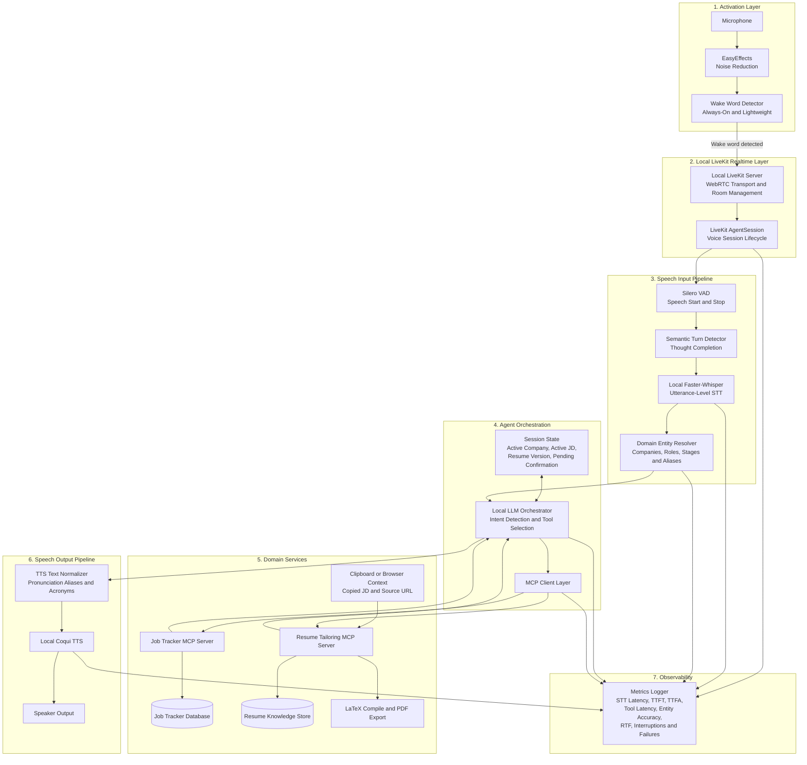

# Engineering Session Report

## 1. Session Objective

या session चा मुख्य उद्देश `job_tracker` project साठी voice-driven assistant architecture define करणे हा होता.

Discussion सुरुवातीला ASR accuracy problem पासून सुरू झाली. Existing Faster-Whisper experiments मध्ये domain-specific company names आणि technical terms चुकीचे transcribe होत होते. त्यानंतर scope मोठा झाला: assistant फक्त job tracker update करणारा voice interface नसून resume-tailoring system आणि `job_tracker` या दोन services शी MCP द्वारे connect होणारा local-first, voice-to-voice personal assistant असणार हे स्पष्ट झाले.

या session मध्ये खालील major questions address झाले:

- ChatGPT-level ASR generic Whisper-based implementation पेक्षा अधिक accurate का वाटतो?
    
- Domain-specific company names reliably capture करण्यासाठी raw ASR पुरेसा आहे का?
    
- Voice assistant साठी LiveKit योग्य orchestration layer आहे का?
    
- LiveKit स्वतः ASR आणि TTS models provide करतो का?
    
- Hosted ASR provider म्हणून Deepgram Nova-3 practical आहे का?
    
- Daily continuous usage साठी cloud metered services स्वीकारार्ह आहेत का?
    
- Fully local stack मध्ये Faster-Whisper, Silero VAD, semantic turn detection आणि Coqui TTS कसे fit होतील?
    
- LiveKit alternatives consider करावेत का?
    
- Moshi सारखा native speech-to-speech model current project साठी better alternative आहे का?
    
- Implementation कोणत्या milestone order मध्ये करावी?
    

Session चा outcome म्हणजे पूर्ण voice assistant architecture साठी एक concrete local-first blueprint तयार झाला.

---

## 2. Starting Context

### Previously established project direction

`job_tracker` हा local-first, conversational job-search assistant म्हणून evolve होत होता. Existing broader plan मध्ये:

- job applications track करणे,
    
- notes आणि stages update करणे,
    
- manual application workflow राखणे,
    
- resume-tailoring system वेगळ्या service म्हणून ठेवणे,
    
- assistant ला MCP द्वारे domain services access देणे,
    
- voice interaction eventually add करणे,
    

हे goals आधीच दिसत होते.

Resume-tailoring system personal use साठी existing resume format follow करणार होता. User browser मधून JD select किंवा copy करणार, assistant JD capture करणार, tailored resume generate आणि export करणार, user manually apply करणार, आणि नंतर voice command ने tracker update करणार.

### Existing ASR experiment context

User ने Faster-Whisper वापरून local transcription experiment केला होता. Observed issues:

- company names चुकीचे transcribe होत होते,
    
- technical keywords fail होत होते,
    
- prompt दिल्यावर काही improvement दिसला,
    
- shorter phrases longer natural utterances पेक्षा worse perform करत होते.
    

Example failure pattern:

```text
Aiden AI
→ Eden AI
```

किंवा company-name tokenization बदलणे:

```text
Supportsoft Technologies
→ Support Soft Technologies
```

Initial assumption broadly असा होता की better prompting किंवा stronger ASR model accuracy समस्या solve करू शकेल.

### Trigger for this session

User ने ChatGPT voice feature ची accuracy observe केली आणि विचारलं की local ASR system मध्ये similar reliability कशी मिळवता येईल.

त्या प्रश्नातून discussion दोन दिशांनी गेला:

1. Raw ASR quality improve करण्याचा प्रश्न.
    
2. Entire daily-use voice assistant architecture design करण्याचा प्रश्न.
    

---

## 3. User Goal Behind the Work

User चा actual product goal generic transcription tool build करणे नाही.

Goal आहे:

> A personal, local-first, voice-driven job-search assistant that can conversationally coordinate resume tailoring and job-tracker updates through MCP-connected services.

Expected user workflow:

```text
Wake word
→ assistant activates
→ user asks assistant to capture copied JD
→ assistant extracts company and role
→ user asks assistant to tailor resume
→ resume-tailoring service builds and exports resume
→ user applies manually
→ user tells assistant application was submitted
→ assistant updates tracker
→ later user updates networking, referral, interview or rejection status by voice
```

Example interactions:

```text
“Hey Tracker.”

“Capture this JD.”

“Tailor my resume for this role.”

“I applied to Aiden AI.”

“Mark Analytics Vidhya as networked.”

“Add a note that I requested a referral.”

“Which applications need a follow-up?”
```

Voice-to-voice interaction matters because the assistant is intended to become a daily-use personal workflow tool, not merely a backend API or demo UI.

The larger product principle is:

```text
Assistant prepares
User reviews
User applies manually
Assistant tracks
```

This avoids unsafe or fragile auto-application automation while still removing repetitive work.

---

## 4. Obstacles Encountered

## Obstacle 1: Domain-specific ASR failures

### Symptom

Faster-Whisper failed on uncommon company names and technical terms. Prompting improved results slightly, but did not fully solve the issue. Short phrases were worse than longer phrases.

### Initially suspected

The initial suspicion was that the base ASR model lacked enough training data for domain-specific terms and proper nouns. Better prompts or a stronger ASR model appeared to be the likely solution.

### Actual root cause

No single root cause was proven experimentally in this session, but the discussion identified multiple contributing factors:

- company names are acoustically ambiguous,
    
- short phrases provide weak linguistic context,
    
- generic ASR models prioritize common token sequences,
    
- unseen proper nouns remain difficult even when prompting is available,
    
- raw transcript accuracy and workflow success are different problems.
    

Example:

```text
“Add Stratacent.”
```

is inherently harder than:

```text
“Add Stratacent as an application for the Generative AI Engineer role.”
```

The longer utterance provides syntactic and semantic clues that the missing token is likely a company name.

### Why non-obvious

The issue looked like a pure model-quality problem. However, the more robust solution is not limited to replacing the model. The assistant has domain context unavailable to a generic ASR service:

- existing tracker companies,
    
- recently used companies,
    
- active copied JD,
    
- allowed tracker stages,
    
- recent conversation context,
    
- known aliases.
    

### System boundary

Speech pipeline and UX.

### Resolution

The session introduced a custom **domain entity resolver** after STT:

```text
Raw transcript
→ entity extraction
→ lookup against tracker DB, active JD, recent entities and aliases
→ confidence scoring
→ corrected entity or clarification
```

Unknown entities should not be rejected. They should be handled as new candidates requiring confirmation.

---

## Obstacle 2: Misunderstanding LiveKit as an ASR provider

### Symptom

The conversation initially explored whether LiveKit would solve transcription accuracy.

### Initially suspected

It was plausible to assume LiveKit included a default ASR model or that adopting LiveKit would materially improve transcription quality.

### Actual root cause

LiveKit is not an ASR model. It is a realtime voice-agent orchestration and WebRTC infrastructure layer. It coordinates audio transport, session lifecycle, turn handling, interruptions and STT–LLM–TTS components. The chosen STT model still determines raw transcription quality.

### Why non-obvious

LiveKit tutorials discuss realtime voice experiences end-to-end, which can make the framework appear responsible for the complete quality of the interaction.

### System boundary

Infrastructure and speech pipeline.

### Resolution

LiveKit was retained as the realtime nervous system, while ASR remained a separately pluggable component.

---

## Obstacle 3: Semantic turn detection was initially framed as a replacement for VAD

### Symptom

The early summary stated:

```text
use semantic turn detection instead of VAD
```

### Initially suspected

Semantic turn detection appeared to supersede basic voice activity detection.

### Actual root cause

The two mechanisms solve different problems:

```text
VAD
→ Is the user speaking?

Semantic turn detector
→ Is the user's thought complete?
```

Example:

```text
“Tailor my resume for...”
[pause]
“Analytics Vidhya.”
```

A pure VAD pipeline may treat the pause as the end of the turn. A semantic turn detector can infer that the sentence is incomplete and wait longer.

### Why non-obvious

Both components affect turn boundaries, so they can appear interchangeable.

### System boundary

Speech pipeline and UX.

### Resolution

Final design uses:

```text
Silero VAD
+
semantic turn detection
```

EasyEffects noise reduction remains upstream to reduce false detections.

---

## Obstacle 4: Faster-Whisper is not native streaming STT

### Symptom

The architecture goal included streaming everything for low latency, but Faster-Whisper does not naturally emit true streaming partial transcription in the same way as hosted streaming STT services.

### Initially suspected

It was tempting to treat all STT models as interchangeable streaming components inside LiveKit.

### Actual root cause

Whisper-style models generally work on buffered audio segments. With LiveKit, a practical adapter buffers utterance audio using VAD and transcribes after the end of the segment.

### Why non-obvious

Audio transport itself is streaming, but the ASR result may still arrive only after utterance completion. These are separate properties.

### System boundary

Speech pipeline and infrastructure.

### Resolution

The MVP accepts this compromise:

```text
Audio transport       = streaming
Faster-Whisper output = utterance-level after end-of-turn
```

This is considered acceptable for short assistant commands, pending latency validation.

---

## Obstacle 5: Hosted ASR accuracy versus recurring cost

### Symptom

Deepgram Nova-3 was considered because it offers native streaming STT and keyterm prompting, which could help company-name transcription.

### Initially suspected

Nova-3 looked like an attractive first production choice because integration would be simpler and realtime transcription quality might be better than local Faster-Whisper.

### Actual root cause

Nova-3 is a paid cloud API after trial credits. The assistant is intended for daily continuous use. A metered per-minute ASR dependency conflicts with the local-first, zero-recurring-cost goal.

### Why non-obvious

The nominal per-minute price may look small during prototype evaluation, but the product is an always-available personal assistant, not an occasional batch transcription tool.

### System boundary

Infrastructure, cost model and product architecture.

### Resolution

Nova-3 was rejected as a core runtime dependency.

It remains useful only as an optional benchmark reference:

```text
Local Faster-Whisper
vs
Deepgram Nova-3 trial benchmark
```

Final core direction:

```text
LiveKit local
+ local Faster-Whisper
```

---

## Obstacle 6: LiveKit TTS was initially assumed to possibly be free

### Symptom

The question arose whether LiveKit's TTS could be used without cost.

### Initially suspected

Because LiveKit itself can be self-hosted, it was possible to assume the full voice pipeline, including TTS, might be included.

### Actual root cause

LiveKit orchestrates TTS but does not provide a universally free built-in speech synthesis model. Hosted TTS integrations remain metered services.

### Why non-obvious

Infrastructure framework and model-provider responsibilities are easy to conflate.

### System boundary

Speech output pipeline and cost model.

### Resolution

A local TTS engine was selected.

The discussion initially considered Kokoro and Piper, but user had already tested Coqui locally and found setup easy. Coqui became the primary local TTS candidate.

---

## Obstacle 7: TTS quality means more than naturalness

### Symptom

The user asked about TTS accuracy.

### Initially suspected

TTS quality could have been reduced to naturalness or latency alone.

### Actual root cause

For this domain, TTS quality includes:

- intelligibility,
    
- pronunciation accuracy,
    
- naturalness,
    
- latency,
    
- stability,
    
- ability to pronounce company names and acronyms.
    

Company names such as `JcurveIQ`, `Aiden AI`, and technical terms such as `MCP`, `RAG`, `PDF`, and `LLM` may require explicit normalization.

### Why non-obvious

ASR errors receive more attention, but TTS mispronunciations can also reduce user trust and demo quality.

### System boundary

Speech output pipeline and UX.

### Resolution

Introduce a deterministic pronunciation normalizer before TTS:

```text
LLM response
→ TTS text normalizer
→ Coqui TTS
```

Possible record fields:

```text
company_name: "JcurveIQ"
tts_spoken_form: "J curve eye cue"
asr_aliases:
  - "J curve IQ"
  - "J curve eye cue"
```

---

## Obstacle 8: Local TTS reliability must be validated before integration

### Symptom

Coqui had been manually tested and appeared easy to set up, but full assistant suitability was still unknown.

### Initially suspected

Successful installation and a working sample might be sufficient evidence.

### Actual root cause

The final system will run STT, local LLM and TTS together. Coqui must be measured for latency, repeated stability and resource usage, not merely functional output.

### Why non-obvious

A TTS model can work correctly in isolation but still fail in a daily assistant due to:

- high warm latency,
    
- high p95 latency,
    
- GPU contention,
    
- VRAM exhaustion,
    
- memory growth over time,
    
- occasional empty output,
    
- clipping,
    
- slow cold start.
    

### System boundary

Model performance and infrastructure.

### Resolution

A dedicated Coqui benchmark was defined. Metrics include TTFA, generation time, audio duration, RTF, peak VRAM, peak RAM, p50/p95 latency, failures, clipped output and pronunciation pass rate.

---

## Obstacle 9: Whether to use a native speech-to-speech model instead of a cascaded pipeline

### Symptom

The Moshi repository was considered as a possible voice-to-voice alternative.

### Initially suspected

A speech-native model could replace VAD, STT, LLM and TTS with a lower-latency integrated solution.

### Actual root cause

Moshi is genuinely a native speech-to-speech or speech-native dialogue model, but it is not an obvious fit for the current project constraints:

- high hardware requirements,
    
- likely unsuitable for a 4 GB RTX 3050 laptop,
    
- tool-oriented reasoning and MCP workflows are easier with a modular text-LLM pipeline,
    
- modular components are easier to tune and replace.
    

### Why non-obvious

Moshi appears architecturally elegant because it collapses multiple stages and supports natural full-duplex interaction. However, hardware feasibility and tool-calling integration matter more for this project.

### System boundary

Model performance, infrastructure and agent orchestration.

### Resolution

Moshi was not adopted. It remains a research reference for future speech-native experiments.

---

## 5. Approaches Considered

## Approach 1: Raw Faster-Whisper transcription with prompts

### Description

Continue using Faster-Whisper locally and improve domain vocabulary recognition using prompts.

### Why it seemed reasonable

User had already observed slight improvement after injecting domain prompts.

### Advantages

- local and free,
    
- existing evaluation experience,
    
- simple to reuse,
    
- compatible with offline-first goal.
    

### Drawbacks

- unseen company names remain difficult,
    
- short commands remain weaker,
    
- prompting alone cannot guarantee workflow correctness.
    

### Decision

**Modified and retained.**

Faster-Whisper remains the local STT baseline, but prompt biasing is only one layer. It must be combined with entity resolution and confirmation UX.

---

## Approach 2: Use LiveKit as complete voice infrastructure

### Description

Use LiveKit for the overall voice-to-voice interaction lifecycle.

### Why it seemed reasonable

Tutorials highlighted low-latency WebRTC transport, turn detection, interruptions, streaming, async tools, model fallbacks and metrics.

### Advantages

- open-source and self-hostable,
    
- WebRTC-based realtime audio transport,
    
- AgentSession lifecycle,
    
- interruptions,
    
- semantic turn detection support,
    
- STT–LLM–TTS orchestration,
    
- MCP integration support,
    
- future browser and mobile path.
    

### Drawbacks

- does not solve ASR quality by itself,
    
- requires local adapters for Faster-Whisper and Coqui,
    
- potentially heavier than a minimal single-user loop.
    

### Decision

**Adopted as the primary realtime framework.**

---

## Approach 3: Use Deepgram Nova-3 through LiveKit

### Description

Use hosted Nova-3 streaming STT as the initial ASR provider.

### Why it seemed reasonable

- native streaming transcription,
    
- simpler LiveKit integration,
    
- low latency,
    
- keyterm prompting for company names,
    
- likely better polished realtime behavior.
    

### Advantages

- less custom adapter work,
    
- partial transcripts,
    
- useful accuracy reference,
    
- suitable for benchmarking.
    

### Drawbacks

- paid after trial credits,
    
- internet dependency,
    
- audio leaves local machine,
    
- conflicts with daily continuous-use cost constraint.
    

### Decision

**Rejected as the core runtime dependency.**

Deferred as an optional benchmark-only reference.

---

## Approach 4: Fully local LiveKit + Faster-Whisper

### Description

Use LiveKit locally while keeping STT on-device.

### Why it seemed reasonable

It preserves the local-first goal and avoids recurring usage fees.

### Advantages

- zero per-minute API billing,
    
- privacy,
    
- modular architecture,
    
- existing Faster-Whisper benchmark can be reused,
    
- suitable for personal daily use.
    

### Drawbacks

- no true native streaming partial STT initially,
    
- local adapter required,
    
- VAD segmentation quality becomes important,
    
- latency must be measured.
    

### Decision

**Adopted as the default architecture.**

---

## Approach 5: Rely on EasyEffects for initial noise reduction

### Description

Use the existing local EasyEffects configuration rather than adding a separate paid or complex noise cancellation layer.

### Why it seemed reasonable

The user had already configured EasyEffects and wanted to avoid unnecessary complexity.

### Advantages

- free,
    
- local,
    
- already familiar,
    
- immediately available.
    

### Drawbacks

- aggressive filtering may distort uncommon words,
    
- effect on ASR accuracy remains unverified.
    

### Decision

**Adopted temporarily.**

A/B testing with EasyEffects ON and OFF is required.

---

## Approach 6: Use only VAD for endpointing

### Description

Detect pauses using VAD and treat silence as turn completion.

### Why it seemed reasonable

Simple and lightweight.

### Advantages

- easy to implement,
    
- local,
    
- inexpensive,
    
- useful for initial milestone.
    

### Drawbacks

- interrupts natural pauses,
    
- may split company names and longer commands,
    
- poor UX for conversational interaction.
    

### Decision

**Accepted only for the first transcription milestone.**

Semantic turn detection will be added after baseline transcription is validated.

---

## Approach 7: Use VAD plus semantic turn detection

### Description

Combine Silero VAD with a language-aware turn detector.

### Why it seemed reasonable

The assistant needs to distinguish pauses from completed thoughts.

### Advantages

- better natural conversation,
    
- fewer premature interruptions,
    
- better handling of pause-heavy speech,
    
- aligns with LiveKit tutorial recommendations.
    

### Drawbacks

- adds one more moving part,
    
- requires transcript context,
    
- should not be introduced before baseline debugging.
    

### Decision

**Adopted for the full architecture, deferred until after the transcription baseline.**

---

## Approach 8: Use a cloud TTS provider through LiveKit

### Description

Use a managed TTS integration.

### Why it seemed reasonable

Managed TTS providers often offer polished voices and low latency.

### Advantages

- easier integration,
    
- high naturalness,
    
- likely reliable streaming.
    

### Drawbacks

- recurring character-based or usage-based cost,
    
- internet dependency,
    
- conflicts with always-on local-first product goal.
    

### Decision

**Rejected for the daily-use core system.**

---

## Approach 9: Use Kokoro as local TTS

### Description

Use Kokoro as a lightweight local English TTS baseline.

### Why it seemed reasonable

- open-weight,
    
- local,
    
- low resource footprint,
    
- suitable for English assistant responses.
    

### Advantages

- lightweight,
    
- likely fast,
    
- no API cost.
    

### Drawbacks

- unfamiliar compared with already-tested Coqui,
    
- pronunciation and streaming quality still require evaluation.
    

### Decision

**Not selected as primary.**

Retained as an optional lightweight comparison candidate.

---

## Approach 10: Use Coqui TTS locally

### Description

Use Coqui as the local speech output engine.

### Why it seemed reasonable

User had already tested it and found setup easy.

### Advantages

- local,
    
- zero API cost,
    
- familiar,
    
- faster path to integration,
    
- potentially richer voices,
    
- optional XTTS-v2 exploration.
    

### Drawbacks

- exact model not yet selected,
    
- possible GPU contention,
    
- latency and long-run reliability unknown,
    
- pronunciation normalization still required.
    

### Decision

**Adopted as the primary local TTS candidate.**

---

## Approach 11: Replace LiveKit with Pipecat

### Description

Use Pipecat as a local-first voice-agent alternative.

### Why it seemed reasonable

Pipecat offers Python-first realtime pipelines, WebRTC transport and local smart-turn capabilities.

### Advantages

- open-source,
    
- potentially simpler for a local single-user assistant,
    
- modular.
    

### Drawbacks

- user had already studied LiveKit tutorials,
    
- MCP wiring may require more custom work,
    
- framework switching would delay progress.
    

### Decision

**Rejected for now.**

LiveKit was locked as the chosen framework.

---

## Approach 12: Use Moshi as an integrated voice-to-voice model

### Description

Use a native speech-to-speech model rather than a cascaded STT–LLM–TTS pipeline.

### Why it seemed reasonable

Moshi offers direct audio-native dialogue and full-duplex interaction.

### Advantages

- low theoretical latency,
    
- natural interruptions,
    
- fewer separate components,
    
- interesting future direction.
    

### Drawbacks

- heavy hardware requirements,
    
- difficult fit for RTX 3050 laptop,
    
- less practical for MCP tool workflows,
    
- less modular.
    

### Decision

**Rejected for current implementation.**

Retained as a future research reference.

---

## 6. Decisions Made

## Decision 1: Use LiveKit as the realtime voice layer

### Final decision

Use a locally self-hosted LiveKit server and LiveKit Agent process.

### Reasoning

LiveKit solves realtime transport, streaming audio, session lifecycle, interruption handling and future extensibility without forcing a cloud provider.

### Rejected alternatives

- Pipecat,
    
- Vocode,
    
- raw `aiortc`,
    
- mediasoup,
    
- Jitsi,
    
- custom manual audio loop as final architecture.
    

### Stability

Intended as a stable architectural principle.

---

## Decision 2: Keep all core speech inference local

### Final decision

Use local STT and local TTS rather than metered cloud providers.

### Reasoning

The assistant is intended for continuous daily use. Recurring per-minute or per-character billing conflicts with the product goal.

### Rejected alternatives

- Deepgram Nova-3 as production STT,
    
- LiveKit-managed TTS providers,
    
- provider plugins requiring paid API usage.
    

### Stability

Stable architectural principle for the personal daily-use system.

---

## Decision 3: Use Faster-Whisper as the initial local STT baseline

### Final decision

Integrate Faster-Whisper first, likely starting from the previously tested `medium` model.

### Reasoning

Existing benchmark experience exists. It is local and free.

### Rejected alternatives

- Nova-3 as runtime dependency,
    
- immediate migration to native speech-to-speech,
    
- assuming a larger local model without measurement.
    

### Stability

Temporary implementation choice. Exact model remains benchmark-dependent.

---

## Decision 4: Use Silero VAD plus semantic turn detection

### Final decision

Use both mechanisms in the final interaction pipeline.

### Reasoning

VAD detects speech activity; semantic turn detection handles incomplete thoughts and natural pauses.

### Rejected alternatives

- VAD-only final architecture,
    
- semantic detector as a VAD replacement.
    

### Stability

Stable interaction principle, although thresholds remain tunable.

---

## Decision 5: Use EasyEffects initially

### Final decision

Keep local EasyEffects noise cleanup for the first implementation.

### Reasoning

It is already configured and avoids additional dependencies.

### Rejected alternatives

- immediate adoption of paid noise-cancellation service,
    
- adding more preprocessing before baseline validation.
    

### Stability

Temporary. Must be evaluated with ON/OFF benchmarks.

---

## Decision 6: Use Coqui as the primary TTS candidate

### Final decision

Use local Coqui TTS for speech output.

### Reasoning

User had already tested it successfully and found setup easy. Familiarity reduces implementation friction.

### Rejected alternatives

- cloud TTS providers,
    
- Kokoro as immediate default,
    
- Piper as primary,
    
- XTTS-specific commitment before measurement.
    

### Stability

Temporary at the exact model level, but stable at the principle level: local TTS.

---

## Decision 7: Introduce a domain entity resolver

### Final decision

Do not trust raw ASR transcripts for tracker mutations. Add a deterministic domain-aware correction layer.

### Reasoning

Company names and technical terms are the hardest ASR cases. The tracker database and active JD provide strong domain context.

### Rejected alternatives

- trusting raw transcript directly,
    
- relying only on ASR prompt biasing,
    
- rejecting all unknown names.
    

### Stability

Stable architectural principle.

---

## Decision 8: Use MCP adapters for the two domain systems

### Final decision

Expose controlled capabilities through:

```text
Job Tracker MCP Server
Resume Tailoring MCP Server
```

### Reasoning

The local LLM should not directly mutate databases or filesystem state. MCP provides a controlled tool boundary.

### Rejected alternatives

- direct database access from the LLM,
    
- exposing the entire backend internals,
    
- embedding business logic in prompts.
    

### Stability

Stable architectural principle.

---

## Decision 9: Keep application submission manual

### Final decision

The assistant prepares, exports and tracks applications, but the user submits applications manually.

### Reasoning

Manual application keeps the workflow safe and reduces browser automation complexity.

### Rejected alternatives

- automatic job application submission,
    
- browser automation-heavy scope.
    

### Stability

Stable product principle for the current project.

---

## Decision 10: Validate in layers before building the full assistant

### Final decision

Implement narrow milestones, starting with transcription-only validation.

### Reasoning

Multiple moving parts would make failures difficult to isolate.

### Rejected alternatives

- integrating wake word, STT, LLM, MCP and TTS at once,
    
- adding semantic turn detection before ASR baseline validation.
    

### Stability

Stable implementation strategy.

---

## 7. Architecture Evolution

## Previous design

Before this session, the voice feature was still loosely framed as:

```text
Microphone
→ Faster-Whisper
→ transcript
→ tracker parser
```

The broader assistant goal existed conceptually, but the realtime orchestration layer, TTS strategy, MCP boundaries and validation order were not fully settled.

### Limitation

This design did not answer:

- how wake-word activation works,
    
- how pauses and interruptions are handled,
    
- how voice responses are generated,
    
- how resume tailoring connects,
    
- how raw ASR errors are corrected,
    
- how tool calls remain safe,
    
- how latency is measured,
    
- how recurring API costs are avoided.
    

---

## Updated architecture



---

## Data flow before the change

```text
Audio
→ Faster-Whisper
→ text
→ tracker logic
```

---

## Data flow after the change

```text
Wake word
→ LiveKit realtime session
→ EasyEffects-cleaned audio
→ Silero VAD
→ semantic turn detection
→ Faster-Whisper
→ domain entity resolver
→ local LLM orchestrator
→ MCP tool call
→ Job Tracker or Resume Tailoring service
→ LLM response
→ TTS pronunciation normalizer
→ Coqui TTS
→ LiveKit audio output
```

---

## New abstractions introduced

### LiveKit realtime layer

Separates transport and session handling from business logic.

### Domain entity resolver

Separates ASR output from trusted tracker mutations.

### MCP adapter boundary

Separates conversational reasoning from deterministic service operations.

### TTS pronunciation normalizer

Separates display text from speech-friendly rendering.

### Session state

Stores temporary conversational context such as:

```text
active_company
active_jd_id
latest_resume_version_id
pending_confirmation
recent_entities
```

### Metrics logger

Makes latency and reliability measurable rather than subjective.

---

## 8. Implementation Progress

## Completed during this session

No source-code implementation was demonstrated in this conversation.

The following work was completed at the design level:

- LiveKit chosen as the realtime voice framework.
    
- Local self-hosting selected.
    
- Deepgram Nova-3 rejected as a runtime dependency due to recurring cost.
    
- Faster-Whisper retained as local STT baseline.
    
- Silero VAD plus semantic turn detection chosen for eventual turn handling.
    
- EasyEffects retained temporarily for noise cleanup.
    
- Coqui selected as the primary local TTS candidate.
    
- Entity resolver introduced as a required custom layer.
    
- MCP adapters defined for `job_tracker` and resume-tailoring services.
    
- Initial Mermaid architecture diagram created.
    
- Coqui benchmark metrics defined.
    
- Layered milestone implementation order defined.
    
- Moshi evaluated conceptually and rejected for current hardware and tool-calling constraints.
    

## Planned implementation

### Milestone 1: transcription baseline

```text
Local LiveKit server
→ microphone input
→ EasyEffects
→ Silero VAD
→ Faster-Whisper
→ transcript and latency logs
```

Goal:

> Verify whether LiveKit integration preserves acceptable transcription quality and latency.

### Milestone 2: turn handling

```text
+ semantic turn detector
+ pause-heavy utterance tests
+ interruption tests
```

### Milestone 3: local TTS validation

```text
Static text
→ Coqui
→ local audio playback
→ latency and reliability metrics
```

### Milestone 4: voice-to-voice loop

```text
Faster-Whisper
→ local LLM
→ Coqui
```

### Milestone 5: Job Tracker MCP

```text
+ update stage
+ add note
+ list follow-ups
```

### Milestone 6: Resume Tailoring MCP

```text
+ capture copied JD
+ tailor resume
+ export PDF
+ link generated resume version
```

### Milestone 7: wake-word lifecycle

```text
+ always-on lightweight detector
+ active and idle modes
```

### Milestone 8: observability

```text
+ local metrics collection
+ latency logs
+ reliability tracking
```

---

## 9. Validation and Evidence

## Existing evidence from prior ASR experiments discussed in this session

Observed patterns:

- domain prompts improved Faster-Whisper transcription slightly,
    
- company names remained difficult,
    
- technical keywords remained a concern,
    
- short phrases performed worse than longer utterances,
    
- context-rich commands were easier than isolated names.
    

Representative commands discussed:

```text
“Mark Aiden AI as applied.”

“Reject Stratacent.”

“Follow up with JcurveIQ.”

“Tailor my resume for Analytics Vidhya.”

“Mark Supportsoft Technologies as rejected.”
```

Pause-heavy test pattern:

```text
“Tailor my resume for...”
[pause]
“Analytics Vidhya...”
[pause]
“for the Generative AI Engineer role.”
```

---

## Planned LiveKit STT validation

Compare:

```text
A. Existing direct Faster-Whisper path
B. LiveKit mic → VAD segmentation → Faster-Whisper adapter
```

Log:

```text
raw transcript
entity accuracy
intent accuracy
segment duration
end-of-speech delay
STT latency
user-stop → transcript-ready latency
first-word clipping
last-word clipping
over-segmentation count
under-segmentation count
```

Suggested acceptance criteria:

```text
LiveKit path entity accuracy ≈ direct Faster-Whisper baseline
No frequent first-word clipping
No frequent premature segmentation
Transcript-ready latency acceptable for short commands
```

The exact acceptable latency remains to be measured.

---

## Planned EasyEffects validation

A/B compare:

```text
EasyEffects OFF
vs
EasyEffects ON
```

Test conditions:

```text
quiet room
fan noise
keyboard noise
slightly distant microphone
short company-name utterances
```

Goal:

> Verify that cleaner perceived audio actually improves ASR rather than distorting uncommon words.

---

## Planned Coqui validation

The immediate Coqui goal is:

> Confirm that local TTS runs reliably with acceptable latency before integrating it into the full assistant.

Required metrics:

|Metric|Purpose|
|---|---|
|TTFA|Time from text input to first playable audio|
|Total generation time|Full synthesis duration|
|Audio duration|Required for speed comparison|
|RTF|`generation_time / audio_duration`|
|p50 TTFA|Typical latency|
|p95 TTFA|Slow-tail behavior|
|Peak VRAM|GPU coexistence feasibility|
|Peak RAM|Long-session stability|
|Failure count|Reliability|
|Empty output count|Silent failure detection|
|Clipped output count|Audio correctness|
|Pronunciation pass rate|Domain-term quality|

RTF interpretation:

```text
RTF < 0.5   → good
RTF < 1.0   → realtime-capable
RTF > 1.0   → synthesis slower than playback
```

Suggested benchmark corpus:

```text
“Done.”

“I marked Aiden AI as applied.”

“Your tailored resume for Analytics Vidhya is ready.”

“The MCP server returned an error.”

“Follow up with JcurveIQ after four days.”

“You have twelve active applications and three pending follow-ups.”

“I found the copied job description and exported the tailored resume successfully.”
```

Suggested reliability sequence:

```text
1. Load Coqui once.
2. Run warm-up generations.
3. Run 50–100 benchmark sentences.
4. Save WAV outputs.
5. Log latency, RTF, RAM and VRAM.
6. Review pronunciation failures manually.
7. Repeat after continuous usage to detect leaks or hangs.
```

Suggested go/no-go conditions:

```text
Warm TTFA < 1 second
p95 TTFA preferably < 1.5 seconds
RTF < 1.0
No frequent crashes
No empty outputs
No clipped audio
Enough VRAM remains for STT + local LLM
Pronunciation issues are fixable with aliases
```

These thresholds were proposed, not validated.

---

## 10. Lessons Learned

## Lesson 1: Workflow reliability matters more than perfect raw transcription

A voice assistant does not need flawless ASR output if it can resolve domain entities safely.

```text
Raw ASR:
“Eden AI”

Domain context:
“Aiden AI” exists in tracker

Resolved entity:
“Aiden AI”
```

The product metric should be final workflow correctness, not raw WER alone.

---

## Lesson 2: Domain context is a major advantage

Unlike generic ASR, the assistant knows:

- current tracker records,
    
- copied JD,
    
- active company,
    
- recent entities,
    
- allowed actions,
    
- conversation state.
    

This context should be explicitly exploited.

---

## Lesson 3: VAD and semantic turn detection are complementary

VAD solves acoustic activity detection. Semantic turn detection solves conversational completeness. Confusing them would lead to brittle UX.

---

## Lesson 4: Realtime transport and realtime inference are different

Using WebRTC and streaming audio does not automatically make Faster-Whisper a streaming STT model. Each stage has its own latency behavior.

---

## Lesson 5: A local-first product must treat recurring inference cost as an architectural constraint

Cloud APIs can be excellent benchmark references, but a daily assistant must avoid hidden cost accumulation if zero recurring cost is a core requirement.

---

## Lesson 6: Familiar tools can be better than theoretically optimal tools

Coqui was preferred over immediately adopting a newer TTS option because the user had already tested it successfully. Reduced integration risk matters.

---

## Lesson 7: Pronunciation should be treated as deterministic preprocessing where possible

TTS domain-word problems are easier than ASR problems because correct text already exists. A pronunciation alias layer can solve many cases without retraining.

---

## Lesson 8: Tool-driven assistants benefit from modular cascaded pipelines

Native speech-to-speech models are attractive for natural conversation, but modular STT–LLM–TTS pipelines are easier to debug, measure, replace and connect to MCP tools.

---

## Lesson 9: Build one layer at a time

Trying to add wake word, VAD, turn detection, STT, LLM, MCP and TTS at once would make debugging difficult. Baseline validation must precede architecture expansion.

---

## 11. Open Questions and Deferred Work

## Required next steps

### 1. Validate LiveKit transcription baseline

Build:

```text
Mic
→ EasyEffects
→ LiveKit
→ Silero VAD
→ Faster-Whisper
→ transcript logs
```

Measure whether LiveKit integration preserves ASR quality.

### 2. Tune VAD segmentation

Investigate:

```text
first-word clipping
last-word clipping
premature segmentation
overly long buffering
pause handling
```

### 3. Benchmark Coqui locally

Measure:

```text
TTFA
RTF
p50 and p95 latency
peak VRAM
peak RAM
repeated reliability
pronunciation quality
```

### 4. Choose exact local models

Still open:

```text
Faster-Whisper model variant
Coqui model variant
local LLM model
wake-word engine
```

### 5. Measure GPU contention

Final local system may run:

```text
Faster-Whisper
+ local LLM
+ Coqui TTS
```

The combined resource profile is unknown.

---

## Optional enhancements

### 1. Benchmark Nova-3 as a reference

Use limited trial credits only for comparison:

```text
Faster-Whisper local
vs
Deepgram Nova-3
```

Goal: quantify the accuracy gap and determine how much entity resolution recovers locally.

### 2. Compare Kokoro or Piper

Possible fallback or low-resource TTS candidates.

### 3. Add model fallbacks

After the baseline is stable:

```text
primary STT
→ fallback STT

primary TTS
→ fallback TTS
```

### 4. Add browser context integration

Potential local context source:

```text
copied JD
source URL
selection timestamp
```

### 5. Add richer session state

Potential fields:

```text
active_company
active_jd_id
latest_resume_version_id
pending_confirmation
recent_entities
last_tool_result
```

### 6. Add metrics dashboard

Track:

```text
EOU latency
STT latency
LLM TTFT
TTS TTFA
tool latency
workflow success
entity accuracy
false interruptions
fallback activations
```

---

## Ideas explicitly rejected for now

### 1. Nova-3 as a permanent STT dependency

Rejected because of recurring cost and internet dependency.

### 2. Cloud TTS as the default

Rejected because the assistant is expected to run daily.

### 3. Moshi as the current core model

Rejected due to hardware requirements and weaker fit for MCP-heavy workflows.

### 4. Framework switching from LiveKit to Pipecat

Rejected to avoid losing momentum after studying LiveKit.

### 5. Full autonomous job application submission

Rejected to preserve manual review and keep scope controlled.

### 6. Implementing the full system in one pass

Rejected because debugging would become difficult.

---

## Questions requiring further investigation

```text
Can Faster-Whisper provide acceptable latency after LiveKit VAD segmentation?

Does EasyEffects improve or hurt uncommon company-name transcription?

Which Faster-Whisper model variant fits the RTX 3050 resource budget?

Which Coqui model gives the best latency–quality trade-off locally?

Can Coqui stream phrase-level output smoothly enough for natural assistant responses?

How much VRAM remains when Faster-Whisper, local LLM and Coqui are loaded together?

Which wake-word detector is lightweight and reliable enough for daily use?

How should entity-resolution confidence thresholds be tuned?

Should the resolver modify transcripts before the LLM or provide structured candidate metadata alongside raw text?

How should async acknowledgement work for long-running resume-tailoring operations?
```

---

## 12. Significance in the Overall Project Journey

This was primarily a **foundational architecture design session**.

The session moved the project from:

```text
local Faster-Whisper experiment
```

to:

```text
modular local-first voice assistant architecture
```

The most important architectural shift was recognizing that the final system does not depend on achieving ChatGPT-level universal ASR accuracy.

Instead, the project can achieve reliable behavior through:

```text
local STT
+ domain-aware entity resolution
+ controlled MCP tools
+ confirmation UX
+ measurable latency
```

The session also prevented a likely architecture mistake: adopting hosted metered services that conflict with the intended daily-use local-first experience.

It established a clear development path where each layer can be validated independently before the full assistant is assembled.

---

## 13. Compact Timeline Entry

**Milestone:** Defined the local-first voice-assistant architecture for `job_tracker` and resume-tailoring integration.

**Problem:** Existing Faster-Whisper experiments struggled with domain-specific company names, technical terms and short commands. The system needed a realtime, voice-to-voice architecture without recurring API cost.

**Key obstacle:** LiveKit, STT, turn detection and TTS responsibilities initially overlapped conceptually. Hosted Nova-3 looked attractive but conflicted with the daily-use zero-cost goal. Native speech-to-speech models such as Moshi were not practical for the available hardware and MCP-heavy workflow.

**Decision:** Use local self-hosted LiveKit as the realtime layer, Silero VAD plus semantic turn detection for input timing, Faster-Whisper as the initial local STT, a custom domain entity resolver for company-name reliability, a local LLM with MCP adapters for `job_tracker` and resume tailoring, and Coqui as the primary local TTS candidate.

**Outcome:** Produced a modular architecture, defined component boundaries, rejected cloud-runtime dependencies, identified local TTS benchmark metrics and established a layered milestone plan.

**Next step:** Implement the narrow transcription baseline: `Mic → EasyEffects → Local LiveKit → Silero VAD → Faster-Whisper → transcript and latency logs`.