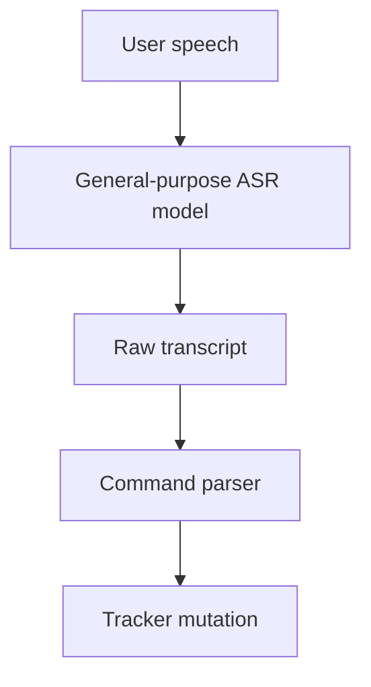
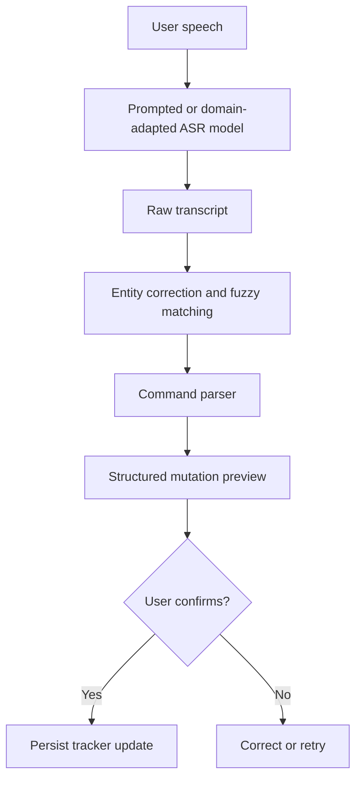
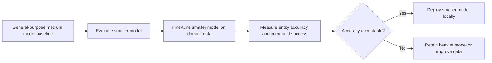

# Engineering Session Report

## 1. Session Objective

This session evaluated whether speech-recognition fine-tuning is necessary for the local-first `job_tracker` assistant and clarified what kind of benefit it can realistically provide.

The discussion focused on two related questions:

1. Why would the speech-to-text model require fine-tuning if a general-purpose Whisper model already works?
    
2. Can fine-tuning improve runtime performance, or does it only improve transcription accuracy?
    

The central outcome was a more precise understanding of fine-tuning: it is primarily a **domain-adaptation mechanism**, not a direct inference-speed optimization. However, it may indirectly improve deployment performance if it allows the project to replace a heavier general-purpose model with a smaller domain-adapted model while preserving acceptable accuracy.

---

## 2. Starting Context

### Existing system direction

The `job_tracker` project is intended to become a local-first, conversational assistant. Users should be able to update and query their job-application tracker through natural voice commands rather than manually editing rows.

The speech pipeline is expected to convert spoken commands into text before downstream parsing and application updates occur.

A simplified version of the existing conceptual flow was:

```text
User speech
  ↓
General-purpose ASR model
  ↓
Transcript
  ↓
Command parser
  ↓
Job-tracker action
```

The conversation assumed that Whisper or Faster-Whisper was already being considered or used for automatic speech recognition. A current decoding configuration using `beam_size=5` was referenced during the discussion.

### Limitation that triggered the discussion

The general-purpose speech-recognition model could transcribe ordinary English reasonably well, but it struggled with domain-specific terms, especially company names and role names.

A representative failure discussed in the session was:

```text
Expected:
"Bootcoding Private Limited ... AI Engineer role"

Observed:
"boot code in private limit ... engineer room"
```

This raised an architectural question:

> Should the project rely on prompting and correction layers, or does it eventually require domain-specific model fine-tuning?

### Initial assumptions requiring clarification

Several assumptions needed to be corrected or refined:

- Fine-tuning might make the same model run faster.
    
- A prompt or hotword list might be sufficient to solve company-name errors.
    
- A post-processing dictionary might fully replace model adaptation.
    
- Fine-tuning a large model might be the obvious next step.
    
- LoRA might automatically reduce inference-time VRAM usage or latency.
    

The session clarified that these assumptions are only partially correct or incorrect depending on the exact deployment strategy.

---

## 3. User Goal Behind the Work

The product goal is not merely to obtain readable transcripts. The assistant must interpret spoken job-tracking commands reliably enough that users can trust it with structured application data.

For example, a command such as:

```text
Add Bootcoding Private Limited as an internship application for the AI Engineer role.
```

contains information that may affect multiple structured fields:

- company name,
    
- employment type,
    
- role,
    
- workflow intent.
    

A transcription error in ordinary conversational text may be tolerable. The same error inside a job-tracking workflow can create an incorrect record or force the user to repeatedly correct the assistant.

The user experience therefore depends on:

- accurate recognition of rare company names,
    
- accurate recognition of role names,
    
- reliable handling of short commands,
    
- robustness to accent variation,
    
- tolerance for pauses and imperfect recording conditions,
    
- low enough latency for natural voice interaction,
    
- limited hardware requirements for local deployment.
    

The broader product requirement is a system that feels conversational while remaining dependable and lightweight enough to run locally.

---

## 4. Obstacles Encountered

No implementation bug was debugged during this session. The obstacles were architectural uncertainties and model-performance limitations.

### Obstacle 1: Rare entity names are distorted by general-purpose transcription

**Observed symptom**

The speech model produced semantically plausible but factually incorrect words when transcribing rare company names and role-related phrases.

Example:

```text
"Bootcoding Private Limited"
→ "boot code in private limit"
```

Another example discussed:

```text
"AI Engineer role"
→ "engineer room"
```

**Initially suspected cause**

The model may simply need vocabulary hints through an initial prompt or hotword list.

**Actual root cause**

The deeper issue is domain mismatch. A general-purpose ASR model is trained to decode common speech across broad contexts. Rare company names, specialized role names and application-management phrases are less likely under its learned language distribution.

When the audio is ambiguous, the model may choose common words that sound similar instead of the correct domain-specific entity.

**Why the issue is non-obvious**

The transcript can appear linguistically reasonable even when it is operationally wrong. `"boot code in private limit"` resembles ordinary English, but it corrupts a critical structured field.

A generic metric such as overall word error rate may understate the product impact. A single entity error can break an otherwise correct command.

**Boundary involved**

- Speech pipeline
    
- Model performance
    
- UX reliability
    

**Resolution or status**

Fine-tuning was identified as a possible later-stage solution, but not as the immediate first intervention. Prompting, hotwords, entity correction and better segmentation should be evaluated before committing to training.

---

### Obstacle 2: Confusion between transcription quality and inference speed

**Observed symptom**

It was unclear whether fine-tuning would make the ASR pipeline faster.

**Initially suspected cause**

A model that is better adapted to the domain might decode speech more efficiently and therefore reduce latency automatically.

**Actual root cause**

Fine-tuning changes learned weights or adapter parameters, but it does not inherently reduce the base architecture, parameter count or computational graph.

For the same model size:

```text
Fine-tuned Whisper medium
≈ same base VRAM requirement
≈ similar inference latency
≈ similar model-loading time
```

**Why the issue is non-obvious**

The word “performance” can refer to multiple dimensions:

- accuracy,
    
- latency,
    
- throughput,
    
- VRAM usage,
    
- number of user corrections,
    
- end-to-end workflow completion time.
    

Fine-tuning improves some of these directly and others only indirectly.

**Boundary involved**

- Model performance
    
- Infrastructure
    
- UX
    

**Resolution or status**

The distinction was clarified:

- Direct benefit: improved domain accuracy and reliability.
    
- Possible indirect benefit: a smaller fine-tuned model may replace a larger general-purpose model.
    

---

### Obstacle 3: Prompting can help, but may not be sufficient

**Observed symptom**

A general ASR model may still misrecognize entities even when likely company names and job roles are supplied as hints.

**Initially suspected cause**

An initial prompt containing words such as `"Bootcoding"`, `"Analytics Vidhya"` or `"Generative AI Engineer"` might fully solve the vocabulary problem.

**Actual root cause**

Prompting adjusts the decoding context but does not permanently change the model’s learned acoustic and language patterns.

If pronunciation is unclear, the recording is noisy, the company name is absent from the prompt or the transcript diverges too far from the intended entity, the model may still fail.

**Why the issue is non-obvious**

Prompts often improve outputs noticeably during initial experiments. This can create the impression that training is unnecessary. However, prompt-based improvements may not generalize across new companies, accents and recording conditions.

**Boundary involved**

- Speech pipeline
    
- Model prompting
    
- Model performance
    

**Resolution or status**

Prompting remains part of the recommended near-term pipeline, but it should not be treated as a complete replacement for domain adaptation.

---

### Obstacle 4: Lookup correction is useful but incomplete

**Observed symptom**

Known entities can potentially be corrected after transcription, but new or heavily distorted names remain difficult.

Example:

```text
"boot coding private limited"
→ "Bootcoding Private Limited"
```

**Initially suspected cause**

A dictionary or fuzzy matching layer might solve entity errors without requiring fine-tuning.

**Actual root cause**

A correction dictionary only works reliably when:

- the intended entity is already known,
    
- the ASR output remains sufficiently close to the target,
    
- the candidate set is not ambiguous.
    

It becomes weaker when:

- a new company is mentioned,
    
- multiple entities sound similar,
    
- the transcript diverges significantly,
    
- the model corrupts multiple parts of the phrase.
    

**Why the issue is non-obvious**

Entity correction performs well on curated examples and can provide fast improvements. Its limitations emerge when the vocabulary changes dynamically, as it will in a job tracker.

**Boundary involved**

- Speech pipeline
    
- Post-processing layer
    
- UX
    

**Resolution or status**

The correction layer was retained as part of a hybrid architecture rather than adopted as a standalone solution.

---

### Obstacle 5: LoRA benefits can be misunderstood

**Observed symptom**

It was unclear whether parameter-efficient fine-tuning with LoRA would automatically reduce inference cost.

**Initially suspected cause**

Since LoRA trains smaller adapter matrices rather than updating the entire model, it may appear that the deployed model should also become much smaller or faster.

**Actual root cause**

LoRA primarily reduces the cost of training. It does not inherently shrink the base model required during inference.

A merged LoRA adapter may avoid additional adapter-related latency, but the underlying base model still determines most inference-time compute and memory usage.

**Why the issue is non-obvious**

Training efficiency and inference efficiency are related but distinct concerns. LoRA improves one directly, while the other depends on the chosen base model and deployment method.

**Boundary involved**

- Model training
    
- Infrastructure
    
- Model deployment
    

**Resolution or status**

LoRA remains a reasonable candidate for future experiments because it can make fine-tuning cheaper. It should not be presented as an automatic inference-speed optimization.

---

## 5. Approaches Considered

### Approach 1: Continue using a general-purpose Whisper model without adaptation

**Description**

Use the existing general-purpose ASR checkpoint as-is.

**Why it seemed reasonable**

Whisper models are already capable general-purpose speech recognizers. Avoiding additional training reduces complexity.

**Advantages**

- Simplest deployment path.
    
- No training dataset required.
    
- No additional fine-tuning infrastructure.
    
- Fastest way to continue prototyping.
    

**Drawbacks**

- Rare company names may remain unreliable.
    
- Job-role names may be distorted.
    
- Short commands may be fragile.
    
- User corrections may become frequent.
    
- Structured tracker updates could be incorrect.
    

**Decision**

Retained as the baseline, but not considered sufficient as the final reliability strategy.

---

### Approach 2: Use prompting and hotwords

**Description**

Supply domain vocabulary during decoding, including likely company names, role names and job-tracker terminology.

Example vocabulary:

```text
Bootcoding
Analytics Vidhya
Generative AI Engineer
mark as rejected
set priority to medium
ask for referral
```

**Why it seemed reasonable**

It is inexpensive and can improve decoding without model training.

**Advantages**

- Easy to implement.
    
- No training cost.
    
- Useful for known entities.
    
- Suitable as an early optimization.
    
- Preserves the current model checkpoint.
    

**Drawbacks**

- Does not permanently adapt the model.
    
- Weakens for unseen companies.
    
- May fail when pronunciation or audio quality is poor.
    
- Does not solve all acoustic mismatch issues.
    

**Decision**

Adopted as an early-stage strategy and retained even if fine-tuning is introduced later.

---

### Approach 3: Add an entity correction layer

**Description**

After transcription, use known company names and role names to correct likely ASR errors through dictionary lookup or fuzzy matching.

Example:

```text
Raw ASR:
"boot coding private limited"

Correction:
"Bootcoding Private Limited"
```

**Why it seemed reasonable**

Job trackers already contain a finite set of known companies and common role names. A correction layer can exploit this domain context.

**Advantages**

- Lightweight.
    
- Works locally.
    
- Easy to inspect and debug.
    
- Useful even with a fine-tuned model.
    
- Can reduce error rates quickly.
    

**Drawbacks**

- Cannot reliably correct all unseen entities.
    
- Fuzzy matching can produce incorrect substitutions.
    
- Severe transcript corruption may leave no usable candidate.
    
- Requires careful UX for ambiguous corrections.
    

**Decision**

Adopted conceptually as a complementary layer, not a replacement for model adaptation.

---

### Approach 4: Fine-tune the existing medium model

**Description**

Fine-tune the same heavier ASR model already considered accurate enough for general transcription.

**Why it seemed reasonable**

A larger model provides a strong accuracy baseline and may improve further when adapted to the job-tracker domain.

**Advantages**

- Potentially strong domain accuracy.
    
- Better recognition of recurring terminology.
    
- Can adapt to accent, pauses and recording conditions.
    

**Drawbacks**

- Similar inference VRAM requirement as the original medium model.
    
- Similar runtime latency as the original medium model.
    
- More expensive training.
    
- Does not solve low-VRAM deployment constraints by itself.
    

**Decision**

Not selected as the first optimization target. It remains a possible benchmark or later experiment.

---

### Approach 5: Fine-tune a smaller model and attempt to replace the medium model

**Description**

Use a smaller checkpoint such as Whisper `small`, adapt it to the project domain and evaluate whether it can achieve acceptable domain accuracy.

**Why it seemed reasonable**

The smaller model is faster and lighter. Fine-tuning may recover enough domain-specific accuracy to make it suitable for local real-time use.

**Advantages**

- Lower inference latency.
    
- Lower VRAM usage.
    
- More practical local deployment.
    
- Better fit for a conversational interface.
    
- Could preserve acceptable entity recognition after adaptation.
    

**Drawbacks**

- Fine-tuning may not close the accuracy gap sufficiently.
    
- Requires a representative training dataset.
    
- Needs careful benchmark comparison.
    
- Generic transcription quality may remain weaker than the medium model.
    

**Decision**

Identified as the most promising performance experiment.

The expected performance gain is indirect:

```text
Fine-tuning
  ↓
smaller model becomes accurate enough
  ↓
smaller model replaces heavier model
  ↓
lower VRAM and lower latency
```

---

### Approach 6: Reduce decoding beam size after fine-tuning

**Description**

Evaluate whether a domain-adapted model remains reliable with a smaller beam size.

Current referenced baseline:

```text
beam_size = 5
```

Potential experiments:

```text
beam_size = 5 → 3 → 1
```

**Why it seemed reasonable**

A fine-tuned model may require less decoding search to select the correct transcript.

**Advantages**

- Potentially faster decoding.
    
- No architecture change.
    
- Easy to benchmark.
    

**Drawbacks**

- Accuracy may decline.
    
- Benefits are not guaranteed.
    
- Requires controlled evaluation with identical audio samples.
    

**Decision**

Deferred as an experiment after establishing an accurate fine-tuned baseline.

---

### Approach 7: Use LoRA for parameter-efficient fine-tuning

**Description**

Train lightweight adapter parameters rather than fully updating the base model.

**Why it seemed reasonable**

LoRA can reduce training-time memory and compute cost.

**Advantages**

- Lower fine-tuning cost.
    
- Fewer trainable parameters.
    
- Small adapter artifacts.
    
- Practical for experimentation.
    

**Drawbacks**

- Does not automatically reduce base-model inference VRAM.
    
- Does not automatically make inference faster.
    
- Deployment details such as adapter merging still need evaluation.
    

**Decision**

Retained as a possible training method. Its value is training efficiency, not guaranteed runtime acceleration.

---

## 6. Decisions Made

### Decision 1: Treat fine-tuning as a reliability optimization first

**Final decision**

Fine-tuning should primarily be justified by improved transcription accuracy, particularly for domain-specific entities and commands.

**Reasoning**

The same checkpoint remains computationally similar after fine-tuning. The strongest direct benefit is improved recognition quality.

**Rejected alternative**

The assumption that fine-tuning automatically makes the same ASR model faster.

**Architectural status**

Stable principle.

---

### Decision 2: Use a hybrid speech pipeline rather than relying on one technique

**Final decision**

The recommended pipeline should combine model output with domain-aware correction and safety checks.

```text
Audio
  ↓
ASR model
  ↓
Entity correction / fuzzy matching
  ↓
Command parser
  ↓
Preview before save
```

**Reasoning**

No single technique is sufficient:

- general ASR may misrecognize rare words,
    
- prompting does not fully adapt the model,
    
- lookup correction fails on unseen or severely distorted entities,
    
- fine-tuning cannot guarantee perfect output.
    

**Rejected alternative**

Treating prompting, correction or fine-tuning as a complete standalone solution.

**Architectural status**

Intended to become a stable architectural principle.

---

### Decision 3: Optimize for a smaller deployable model rather than only improving the heavier baseline

**Final decision**

The most valuable future experiment is to test whether a fine-tuned smaller model can achieve domain accuracy close enough to the current heavier model.

**Reasoning**

This is the path that can improve both local deployment feasibility and conversational latency.

**Rejected alternative**

Fine-tuning only the medium model and expecting a runtime-speed improvement.

**Architectural status**

Experimental until benchmarked.

---

### Decision 4: Measure entity-level and workflow-level metrics

**Final decision**

Generic transcription metrics should not be the only evaluation criteria.

Recommended metrics:

```text
WER
CER
Company-name Entity Error Rate
Role-name Entity Error Rate
Command Success Rate
RTF
p50 transcription latency
p95 transcription latency
VRAM usage
```

**Reasoning**

A transcript can have a low overall error rate but still corrupt a critical company name or role. Workflow success matters more than readability alone.

**Rejected alternative**

Relying only on overall WER.

**Architectural status**

Stable evaluation principle.

---

### Decision 5: Delay fine-tuning until lower-cost interventions are measured

**Final decision**

The project should evaluate the following sequence before investing in training:

```text
Prompting
  ↓
Hotwords
  ↓
Entity correction
  ↓
Better segmentation
  ↓
Error analysis
  ↓
Fine-tuning, if systematic failures remain
```

**Reasoning**

Fine-tuning requires dataset preparation, training infrastructure and evaluation. Simpler interventions may solve a meaningful portion of the problem.

**Rejected alternative**

Starting model training immediately without first understanding the remaining error distribution.

**Architectural status**

Near-term implementation strategy.

---

## 7. Architecture Evolution

### Previous conceptual design



### Limitation

This design assumes the raw ASR transcript is sufficiently reliable for structured operations.

That assumption is fragile because a plausible-looking transcript can still corrupt critical entities:

```text
Bootcoding Private Limited
→ boot code in private limit
```

### Updated recommended design



### Future optimization branch



### New boundaries introduced conceptually

This session clarified the need for explicit separation between:

1. **ASR decoding**  
    Converts speech into text.
    
2. **Domain-aware correction**  
    Repairs likely company-name and role-name mistakes.
    
3. **Semantic command parsing**  
    Extracts the intended tracker action.
    
4. **Preview-before-save UX**  
    Prevents silent corruption of tracker data.
    
5. **Evaluation layer**  
    Measures not only generic text quality but also entity and workflow accuracy.
    

No code-level adapter, API contract or module was implemented during this session. The change was architectural reasoning and experiment planning.

---

## 8. Implementation Progress

### Completed during this session

No source-code implementation, file modification or test update was reported.

The session completed the following design work:

- Defined the role of ASR fine-tuning in the `job_tracker` architecture.
    
- Distinguished direct accuracy gains from indirect speed gains.
    
- Identified vocabulary adaptation and acoustic adaptation as separate benefits.
    
- Clarified that prompting and entity correction remain useful even after fine-tuning.
    
- Clarified the limits of LoRA for inference optimization.
    
- Proposed a benchmark matrix for future experiments.
    
- Proposed a layered speech-processing architecture with preview-before-save protection.
    

### Planned work

The proposed experiment matrix is:

|Variant|Purpose|
|---|---|
|`medium`, current configuration|Accuracy and runtime baseline|
|`small`, current configuration|Speed and VRAM baseline|
|`small`, prompt plus entity correction|Low-cost improvement baseline|
|`small`, domain fine-tuned|Test whether it can replace `medium`|
|`small`, domain fine-tuned with lower beam size|Evaluate further latency optimization|

### Files and modules

No file paths, modules or APIs were discussed in enough detail to document concrete implementation changes.

### Tests

No automated tests were added or executed during this session.

---

## 9. Validation and Evidence

### Existing observed evidence discussed

The conversation referenced a representative domain-specific recognition failure:

```text
Expected:
"Bootcoding Private Limited ... AI Engineer role"

Observed:
"boot code in private limit ... engineer room"
```

This supports the claim that general-purpose transcription can produce operationally significant entity errors.

### Proposed validation metrics

Future experiments should measure:

|Metric|Why it matters|
|---|---|
|Word Error Rate (`WER`)|General transcription quality|
|Character Error Rate (`CER`)|Useful for spelling-sensitive entity errors|
|Company-name Entity Error Rate|Measures critical company-name failures|
|Role-name Entity Error Rate|Measures critical job-role failures|
|Command Success Rate|Measures whether the intended tracker action succeeds|
|Real-Time Factor (`RTF`)|Measures transcription speed relative to audio duration|
|`p50` latency|Typical response time|
|`p95` latency|Slow-path user experience|
|VRAM usage|Local deployment feasibility|

### Proposed manual utterances

The following command pattern should be included in testing:

```text
Add Bootcoding Private Limited as an internship application for the AI Engineer role.
```

Additional company names, role names, short commands, noisy recordings and accent variations should be added later. Specific additional utterances were not defined in this session.

### Remaining edge cases

The following cases still require investigation:

- unseen company names,
    
- similar-sounding company names,
    
- severe ASR distortions that fuzzy matching cannot repair,
    
- short commands with limited context,
    
- accent variation,
    
- pauses and segmentation errors,
    
- noisy audio,
    
- the accuracy impact of reducing beam size,
    
- whether a fine-tuned small model can match the domain reliability of the medium baseline.
    

---

## 10. Lessons Learned

### Lesson 1: ASR quality must be evaluated at the product level

A readable transcript is not automatically a usable transcript.

For structured assistants, a single incorrect company name can matter more than several minor grammatical errors. Entity accuracy and command success rate are therefore more meaningful than generic WER alone.

### Lesson 2: Fine-tuning is not synonymous with acceleration

Training a model on domain-specific examples does not automatically reduce its computational cost.

To obtain a real speed benefit, the architecture must change indirectly:

```text
Adapt a smaller model
→ preserve acceptable domain accuracy
→ replace the larger model
→ reduce runtime cost
```

### Lesson 3: Layered reliability is stronger than a single-model solution

The most robust design combines:

- prompting,
    
- hotwords,
    
- model adaptation where justified,
    
- correction layers,
    
- semantic parsing,
    
- preview-before-save UX.
    

Speech recognition should not be treated as a perfect upstream dependency.

### Lesson 4: Training-time efficiency and inference-time efficiency are separate

LoRA may reduce the cost of fine-tuning, but it does not inherently reduce the cost of running the base model.

This distinction should remain explicit in future planning.

### Lesson 5: Fine-tuning should follow error analysis

Before training, the project should determine whether remaining failures are:

- systematic vocabulary errors,
    
- acoustic mismatch,
    
- segmentation issues,
    
- decoding issues,
    
- correction-layer limitations.
    

Training without this diagnosis risks solving the wrong problem.

---

## 11. Open Questions and Deferred Work

### Required next steps

1. Benchmark the current `medium` model as the accuracy baseline.
    
2. Benchmark the current `small` model as the speed and VRAM baseline.
    
3. Add or evaluate prompting, hotwords and entity correction.
    
4. Build an evaluation set containing company names, role names, short commands and realistic recording conditions.
    
5. Compare results using entity-level and workflow-level metrics.
    
6. Determine whether systematic errors remain after low-cost improvements.
    

### Questions requiring further investigation

- Can a domain-adapted `small` model achieve acceptable company-name and role-name accuracy?
    
- How much latency and VRAM can be saved by replacing `medium` with `small`?
    
- Does reducing `beam_size` from `5` to `3` or `1` preserve command success rate?
    
- How much training data is required?
    
- Should the training dataset prioritize vocabulary coverage, accent coverage, acoustic variation or all three?
    
- Is LoRA sufficient for the intended domain adaptation, or would full fine-tuning be necessary?
    
- How should fuzzy-match ambiguity be surfaced to the user?
    
- Which failure cases should force explicit confirmation rather than automatic correction?
    

### Optional enhancements

- Dynamic vocabulary injection from the user’s tracker database.
    
- Confidence-aware correction.
    
- Manual entity override.
    
- Comparison of adapter-based and fully fine-tuned checkpoints.
    
- Separate evaluation of vocabulary adaptation and acoustic adaptation.
    

### Explicitly postponed ideas

- Immediate fine-tuning of the medium model.
    
- Treating LoRA as an inference-speed optimization.
    
- Reducing beam size before establishing an accuracy baseline.
    
- Relying entirely on a correction dictionary.
    

---

## 12. Significance in the Overall Project Journey

This session was primarily a **foundational model-performance planning session**.

It did not introduce a code change, but it prevented a likely architectural mistake: investing in fine-tuning under the assumption that the same ASR model would become inherently faster.

The discussion reframed the optimization objective:

```text
Not:
Fine-tune medium to make medium faster

Instead:
Use fine-tuning to make a smaller model reliable enough for deployment
```

It also moved the speech pipeline toward a layered reliability design rather than a single-model dependency.

This is significant for the local-first objective because local deployment requires balancing:

- transcription quality,
    
- latency,
    
- VRAM constraints,
    
- correction overhead,
    
- user trust.
    

The session established the benchmark strategy needed before deciding whether domain-specific training is worth the implementation cost.

---

## 13. Compact Timeline Entry

**Milestone:** Defined the role of ASR fine-tuning in the local-first voice pipeline.  
**Problem:** General-purpose Whisper transcription can distort rare company names and role names, creating unreliable structured tracker updates.  
**Key obstacle:** Fine-tuning benefits were initially ambiguous: improved accuracy was being conflated with lower inference latency and VRAM usage.  
**Decision:** Use prompting, hotwords, entity correction and error analysis first; then evaluate whether a fine-tuned smaller model can replace the heavier baseline.  
**Outcome:** Established a layered speech architecture and a benchmark plan covering WER, CER, entity error rate, command success rate, latency, RTF and VRAM usage.  
**Next step:** Compare `medium`, `small`, corrected `small`, fine-tuned `small` and lower-beam fine-tuned `small` variants on a representative job-tracker speech dataset.