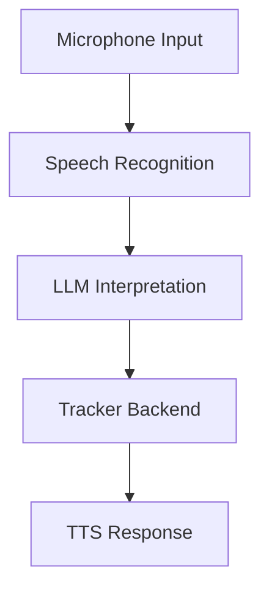
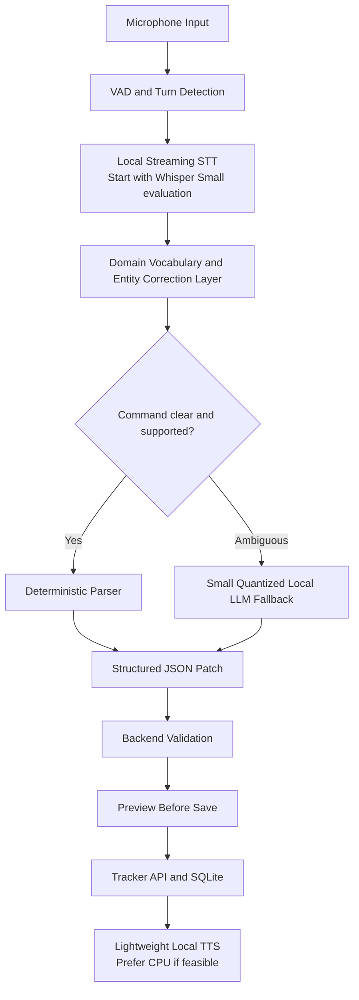
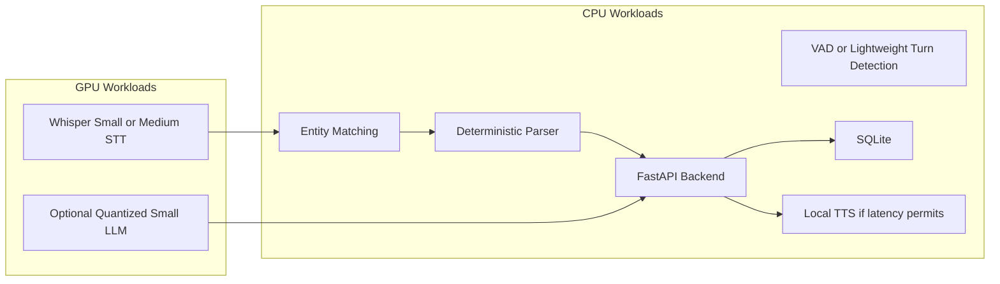

# Engineering Session Report

## 1. Session Objective

This session evaluated whether the `job_tracker` voice assistant could adopt an **Unmute-style modular speech pipeline** while remaining practical on a low-VRAM local machine.

The central question was:

> If Whisper Medium is accurate but relatively heavy, and Whisper Small is faster but more error-prone for company names, can domain-specific fine-tuning of smaller STT, LLM and TTS models remove the performance bottleneck?

The discussion focused on separating two ideas that initially appeared closely related:

1. **Improving task-specific accuracy using fine-tuning.**
    
2. **Reducing runtime memory usage and latency on constrained hardware.**
    

The key outcome was a refined architectural direction: smaller domain-adapted models may help the local-first assistant, but **fine-tuning alone does not solve VRAM constraints**. A practical design must combine smaller base models with quantization, CPU/GPU workload placement, deterministic parsing and resource-aware inference scheduling.

---

## 2. Starting Context

### Existing project direction

The `job_tracker` project is intended to become a local-first, conversational job-tracking assistant. Its voice interface must support natural-language commands such as:

```text
Add an application for Bootcoding.
Set the priority for Aiden AI to high.
Add a note that I should ask Vivek for a referral.
Summarize my progress with Neilsoft.
```

The broader system already had a strong preference for:

- local or offline execution where practical,
    
- low hardware requirements,
    
- conversational interaction,
    
- reliable structured updates,
    
- preview-before-save behaviour,
    
- deterministic validation around database mutations,
    
- avoiding unnecessary dependence on large cloud models.
    

### Speech-recognition context

Previous experiments had established an important STT trade-off:

```text
Whisper Medium → more accurate but heavier
Whisper Small  → faster but more company-name errors
```

The company-name issue matters because the assistant is not merely transcribing speech for display. The transcript is used to select and update records in a job-application database.

A small transcription error can therefore create a semantic error:

```text
Spoken company: Bootcoding
Incorrect transcript: boot code in
Possible consequence: wrong company match or failed application update
```

The discussion began with the possibility that an **Unmute-style pipeline** could permit smaller models to be used effectively.

### Initial assumption under examination

The initial hypothesis was approximately:

> If smaller STT, LLM and TTS models are fine-tuned for the `job_tracker` domain, they may become accurate enough that the low-VRAM bottleneck disappears.

This hypothesis was directionally useful but needed refinement. Fine-tuning can improve specialised performance, but it does not automatically reduce the inference cost of the underlying base model.

---

## 3. User Goal Behind the Work

The purpose of this exploration was not merely to choose an STT model. It was to determine whether the assistant can become a genuinely usable local conversational interface on available consumer hardware.

The desired product experience is:

```text
User speaks naturally
        ↓
Assistant understands job-tracker-specific entities and intent
        ↓
Assistant proposes or performs a safe structured action
        ↓
User receives a spoken response with low perceived latency
```

For this experience to work well, the system must balance:

- company-name recognition accuracy,
    
- role-name recognition accuracy,
    
- natural-language flexibility,
    
- low response latency,
    
- limited GPU memory,
    
- local inference feasibility,
    
- safety around unintended tracker modifications.
    

A heavyweight model may improve accuracy but become impractical when STT, LLM and TTS are active in the same assistant. A lightweight model may fit the hardware but misrecognize exactly the entities that matter most.

The engineering problem was therefore to find a **resource-aware architecture**, rather than merely selecting the most accurate individual model.

---

## 4. Obstacles Encountered

This was a design-analysis session rather than a debugging session. No runtime bug was reproduced or fixed. However, several architectural obstacles were identified.

### Obstacle 1: Fine-tuning was initially conflated with VRAM reduction

#### Symptom

The initial idea suggested that fine-tuned versions of small STT, TTS and LLM models could remove the performance bottleneck.

#### What was initially suspected?

It appeared that fine-tuning could serve two purposes simultaneously:

- improve domain accuracy,
    
- lower runtime hardware requirements.
    

#### Actual root cause

The two concerns are related but distinct.

Fine-tuning generally changes model behaviour, not the fundamental cost of loading and executing the base model. A fine-tuned large model remains a large model unless additional compression or architecture changes are applied.

For example:

```text
Large base model + LoRA adapter
```

does not become equivalent to:

```text
Small base model
```

The adapter may be lightweight, but the base model must still be loaded for inference.

#### Why was the issue non-obvious?

In this project, the practical reason to fine-tune is precisely to make a smaller model viable. This creates an indirect relationship:

```text
Fine-tuning
   ↓
Small model becomes sufficiently accurate
   ↓
Small model can replace large model
   ↓
Runtime resource usage decreases
```

The memory reduction comes from replacing the base model, not from fine-tuning by itself.

#### System boundary

- Model performance
    
- Infrastructure
    
- Speech pipeline
    

#### Resolution

The hypothesis was refined rather than rejected:

> Domain adaptation can enable smaller models to replace larger generic models, but the actual VRAM reduction must come from smaller base models, quantization, offloading and inference scheduling.

---

### Obstacle 2: Whisper Small may fail on the most important entities

#### Symptom

Whisper Small is faster, but company-name errors are more frequent.

Examples discussed conceptually included uncommon or domain-specific terms such as:

```text
Bootcoding Private Limited
Analytics Vidhya
Coastal Seven Consulting
Generative AI Engineer
Referral
Current Stage
Next Action
```

#### What was initially suspected?

A lightweight STT model might be sufficient because the assistant operates in a limited domain.

#### Actual root cause

The limited domain helps only if the system actively exploits it. Generic STT inference may still misrecognize uncommon company names, role titles and tracker vocabulary.

The issue is not adequately captured by general word error rate alone. The assistant needs high accuracy on **high-impact entities**.

#### Why was the issue non-obvious?

A transcript can appear mostly correct while still being unusable for database operations.

For example:

```text
“Set Bootcoding priority to high”
```

may have a low overall word error rate even if the company name is transcribed incorrectly. From a tracker perspective, that single entity error is more important than several minor grammatical mistakes.

#### System boundary

- Speech pipeline
    
- Model performance
    
- Backend entity resolution
    
- UX safety
    

#### Resolution

A future benchmark must measure entity-sensitive outcomes:

```text
Company-name accuracy
Role-name accuracy
Intent classification accuracy
Structured patch accuracy
Command execution success rate
False-update rate
```

Overall WER should remain a supporting metric, not the only acceptance criterion.

---

### Obstacle 3: Running STT, LLM and TTS together may exceed local hardware limits

#### Symptom

Even if each component is usable independently, a full conversational assistant may become too heavy when multiple inference services are active.

#### What was initially suspected?

The pipeline might require STT, LLM and TTS models to remain loaded on the GPU simultaneously.

#### Actual root cause

A naive deployment can create unnecessary peak memory usage. However, the workloads are not always equally active at the same moment.

Typical interaction flow:

```text
User speaking       → STT workload is dominant
User stops speaking → parser or LLM workload begins
Assistant speaking  → TTS workload becomes active
```

There may also be a smaller always-on interruption-detection workload.

#### Why was the issue non-obvious?

A modular pipeline can be interpreted in two different ways:

1. All modules remain permanently GPU-resident.
    
2. Modules are scheduled across GPU and CPU according to the interaction phase.
    

The second design is more compatible with low-VRAM systems.

#### System boundary

- Infrastructure
    
- Speech pipeline
    
- Runtime scheduling
    

#### Resolution

A resource-aware split was proposed:

```text
GPU:
  Faster-Whisper Small
  or Whisper Medium when required

CPU:
  TTS where feasible
  deterministic parser
  SQLite
  FastAPI
  tracker tools

GPU or CPU with quantization:
  small fallback LLM
```

This requires benchmarking before it can be treated as a confirmed production design.

---

### Obstacle 4: A fully LLM-driven command pipeline would be unnecessarily expensive and risky

#### Symptom

Using a conversational LLM for every tracker command could increase latency, memory usage and mutation risk.

#### What was initially suspected?

A fine-tuned small LLM might become the primary command interpreter.

#### Actual root cause

Many tracker commands are constrained and can be handled more safely with deterministic logic:

```text
Set status to applied.
Mark Neilsoft priority as high.
Add a note for Bootcoding.
Save the current draft.
```

An LLM is more valuable when the user request is ambiguous, multi-step or recommendation-oriented.

#### Why was the issue non-obvious?

The product is conversational, which can make an LLM-first design appear natural. However, conversational UX does not require every step to be probabilistic.

#### System boundary

- LLM prompt
    
- Tool-calling contract
    
- Backend
    
- UX safety
    

#### Resolution

The preferred design became:

```text
Transcript
   ↓
Deterministic parser first
   ↓
Small LLM only for ambiguous input
   ↓
Structured JSON patch
   ↓
Validation
   ↓
Preview-before-save
```

---

### Obstacle 5: TTS fine-tuning was not aligned with the immediate bottleneck

#### Symptom

The initial proposal included fine-tuning STT, TTS and LLM models together.

#### What was initially suspected?

Fine-tuning every module might be necessary to create a lightweight, responsive assistant.

#### Actual root cause

The immediate project bottleneck is reliable understanding of domain-specific speech and efficient orchestration. TTS fine-tuning primarily improves voice identity, style, accent or pronunciation behaviour. It does not inherently reduce inference cost.

#### Why was the issue non-obvious?

The assistant is voice-powered, so improving every voice-related module appears useful. However, module optimisation must be prioritised according to product impact.

#### System boundary

- Speech pipeline
    
- Model performance
    
- Product prioritisation
    

#### Resolution

TTS fine-tuning was deferred. The initial recommendation was to use a lightweight local TTS system, potentially on CPU, and optimise it only after the core conversational workflow is reliable.

---

### Obstacle 6: Third-party reference architectures may not fit the target hardware unchanged

#### Symptom

The user asked whether an Unmute-style setup could be adopted.

#### What was initially suspected?

The third-party system might provide a ready-made blueprint for running the complete assistant locally.

#### Actual root cause

The useful part of the reference architecture is the **modular cascaded design**, not necessarily its exact implementation or default models.

The discussion stated that the official Unmute-style setup uses heavier components and may target substantially more VRAM than the project’s available consumer GPU. Exact hardware numbers and current defaults require independent verification before implementation.

#### Why was the issue non-obvious?

A repository can be architecturally relevant even when its default deployment is not hardware-compatible.

#### System boundary

- Infrastructure
    
- Model selection
    
- External dependency evaluation
    

#### Resolution

Adopt the architectural philosophy selectively:

```text
Use:
  modular streaming pipeline
  turn detection
  incremental processing
  streaming TTS concept
  interchangeable models

Do not assume:
  exact third-party model stack
  exact deployment topology
  default VRAM requirements are suitable locally
```

---

## 5. Approaches Considered

### Approach 1: Continue using Whisper Medium as the default STT model

#### Description

Keep the more accurate Whisper Medium model as the primary transcription model.

#### Why it seemed reasonable

Earlier measurements indicated that Whisper Medium performed well enough in speed terms for offline or batch transcription. The previously recorded experiment was:

```text
Approximately 605 seconds of audio
Approximately 33.7 seconds transcription time
RTF ≈ 0.056
```

#### Advantages

- Better generic transcription accuracy than smaller variants.
    
- Lower risk of company-name errors.
    
- Already tested in the project environment.
    
- Good baseline for comparison.
    

#### Drawbacks

- Higher GPU-memory footprint.
    
- May compete with the LLM or TTS in a live assistant.
    
- Could limit the feasibility of running the entire assistant locally on constrained hardware.
    

#### Decision

**Retained as a benchmark and possible fallback**, not selected as the only long-term solution.

---

### Approach 2: Replace Whisper Medium with generic Whisper Small

#### Description

Use Whisper Small directly for faster and lighter transcription.

#### Why it seemed reasonable

The smaller model should reduce memory use and increase inference speed.

#### Advantages

- Lower VRAM requirements.
    
- More suitable for continuous local execution.
    
- Leaves more headroom for other assistant components.
    

#### Drawbacks

- Increased company-name recognition errors.
    
- Potentially unsafe for database-linked voice commands.
    
- Generic speed gains may not justify semantic failures.
    

#### Decision

**Not adopted without validation.**

Whisper Small must be evaluated with domain-aware metrics before it can replace Medium.

---

### Approach 3: Use domain-adapted or fine-tuned Whisper Small

#### Description

Fine-tune or otherwise adapt Whisper Small to job-tracker vocabulary and speech patterns.

#### Why it seemed reasonable

The assistant operates in a constrained domain. A smaller specialised model may approach the useful accuracy of a larger generic model.

#### Advantages

- Potentially improves company-name and role-name recognition.
    
- Retains the lower runtime footprint of the smaller base model.
    
- Aligns well with the local-first requirement.
    
- Can focus optimisation on high-impact entities.
    

#### Drawbacks

- Requires an appropriate labelled dataset.
    
- Fine-tuning effort may be non-trivial.
    
- Improvement is not guaranteed.
    
- Must be compared against cheaper interventions first.
    
- Risk of overfitting to known companies or command phrasings.
    

#### Decision

**Promising but deferred until baseline evaluation.**

The proposed order is:

```text
Whisper Small baseline
        ↓
Whisper Small with vocabulary prompting
        ↓
Entity correction layer
        ↓
Fine-tuning only if the remaining gap is unacceptable
```

---

### Approach 4: Use vocabulary prompting and entity correction before fine-tuning

#### Description

Provide job-specific vocabulary hints and resolve transcripts against tracker data.

Potential flow:

```text
Raw STT transcript
        ↓
Vocabulary-aware decoding or prompting
        ↓
Known-company dictionary
        ↓
Fuzzy matching
        ↓
Manual confirmation when confidence is low
```

#### Why it seemed reasonable

The tracker already contains relevant company names and role titles. It may be possible to improve effective accuracy without training a new model.

#### Advantages

- Lower engineering cost than fine-tuning.
    
- Faster to benchmark.
    
- Uses live tracker data.
    
- Can adapt immediately when a new company is added.
    
- Reduces the need to retrain the model for every new entity.
    

#### Drawbacks

- Fuzzy matching can create false positives.
    
- Requires careful confidence thresholds.
    
- New or phonetically similar companies may remain ambiguous.
    
- Must integrate with preview-before-save safeguards.
    

#### Decision

**Recommended as an early intervention.**

This is important because the system should not require a new model fine-tune whenever the user adds a new job application.

---

### Approach 5: Fine-tune a small LLM for structured tracker commands

#### Description

Train a small local instruct model using examples of:

```text
User utterance → expected structured JSON patch
```

Example:

```json
{
  "intent": "update_application",
  "company": "Aiden AI",
  "changes": {
    "priority": "HIGH",
    "next_action": "Ask Vivek for a referral"
  }
}
```

#### Why it seemed reasonable

The command domain is narrow enough that a smaller model may perform adequately.

#### Advantages

- Potentially better natural-language coverage than pure rules.
    
- Can handle paraphrases and multi-field commands.
    
- Suitable for local inference if the base model is sufficiently small and quantized.
    

#### Drawbacks

- Fine-tuning does not eliminate the need to load the base model.
    
- Probabilistic parsing introduces mutation risk.
    
- Dataset collection and evaluation are required.
    
- A deterministic parser may already handle common cases.
    
- Structured output must still be validated.
    

#### Decision

**Deferred as a fallback-layer optimisation.**

The recommended initial architecture uses deterministic parsing first and a small local LLM only for ambiguity or advanced conversational behaviour.

---

### Approach 6: Fine-tune TTS early

#### Description

Train or adapt the TTS model for a custom voice, accent or style.

#### Why it seemed reasonable

A voice assistant benefits from a natural and consistent spoken response.

#### Advantages

- Better voice identity.
    
- Potentially improved pronunciation for domain terms.
    
- More polished UX.
    

#### Drawbacks

- Does not directly solve the current STT reliability problem.
    
- Does not inherently reduce VRAM usage.
    
- Adds complexity before the core assistant loop is validated.
    

#### Decision

**Deferred.**

Use an existing lightweight local TTS model first.

---

### Approach 7: Use an Unmute-style modular pipeline without copying the exact stack

#### Description

Adopt the architectural pattern:

```text
Streaming STT
   ↓
Text reasoning or command interpretation
   ↓
Streaming TTS
```

Potentially add VAD and turn detection at the input boundary.

#### Why it seemed reasonable

It keeps each component replaceable and permits independent optimisation.

#### Advantages

- Easier to fit within low-VRAM constraints.
    
- Enables CPU/GPU separation.
    
- Allows STT, LLM and TTS to evolve independently.
    
- Easier to debug than a single end-to-end speech model.
    
- Compatible with deterministic tracker tools and validation.
    
- Better fit for domain-specific command execution.
    

#### Drawbacks

- Requires orchestration.
    
- Latency can accumulate across pipeline stages.
    
- Turn detection and interruption handling need careful design.
    
- Streaming behaviour increases system complexity.
    

#### Decision

**Adopted as the preferred architectural direction.**

---

### Approach 8: Use a heavier end-to-end speech model such as Moshi

#### Description

Use a speech-native model intended for direct conversational speech interaction.

#### Why it seemed reasonable

An end-to-end speech model could provide a more natural conversational experience.

#### Advantages

- Potentially more fluid speech-to-speech interaction.
    
- May reduce the conceptual separation between transcription, language reasoning and synthesis.
    

#### Drawbacks

- High hardware requirements were discussed as a major concern.
    
- Low-VRAM deployment appears less practical.
    
- Harder to integrate with deterministic tracker mutation rules.
    
- Harder to inspect intermediate transcripts and structured actions.
    
- May be excessive for a constrained job-tracker domain.
    

#### Decision

**Not selected for the current phase.**

The modular cascaded design is more practical for the available hardware and safer for structured tracker updates.

---

## 6. Decisions Made

### Decision 1: Treat fine-tuning as an accuracy tool, not a direct VRAM optimisation

#### Final decision

Fine-tuning may make smaller models useful, but VRAM savings must come from the smaller base model and runtime design.

#### Reasoning

The base model determines most inference resource requirements. A fine-tuned adapter does not remove the underlying model cost.

#### Rejected alternative

Assuming that a fine-tuned large model automatically becomes lightweight.

#### Stability

**Stable architectural principle.**

---

### Decision 2: Prefer a modular cascaded voice pipeline

#### Final decision

Use an Unmute-like architecture pattern, but customise the models and deployment for the local machine.

#### Reasoning

A modular pipeline supports incremental optimisation and better resource allocation.

#### Rejected alternative

Copying a heavyweight third-party stack unchanged or immediately adopting an end-to-end speech model.

#### Stability

**Likely stable architectural principle.**

Specific model choices remain temporary.

---

### Decision 3: Prioritise Whisper Small evaluation before STT fine-tuning

#### Final decision

Benchmark Whisper Small systematically before committing to a fine-tuning effort.

#### Reasoning

Fine-tuning should be justified by measured failures after cheaper interventions are tested.

#### Rejected alternative

Immediately launching a training effort based only on the assumption that generic Small is inadequate.

#### Stability

**Temporary experiment plan.**

---

### Decision 4: Evaluate STT using entity-aware metrics

#### Final decision

Measure company and role recognition separately from general transcription accuracy.

#### Reasoning

A single company-name error can cause a failed or unsafe tracker action even if the transcript is otherwise accurate.

#### Rejected alternative

Using only overall WER or CER as the success metric.

#### Stability

**Stable evaluation principle.**

---

### Decision 5: Introduce an entity correction layer

#### Final decision

Use tracker-aware vocabulary prompting, known-company resolution and manual confirmation for uncertain matches.

#### Reasoning

The tracker database already contains valuable domain context. The system should exploit it before retraining the model.

#### Rejected alternative

Expecting STT to resolve every company name perfectly in isolation.

#### Stability

**Likely stable architectural principle.**

Implementation details remain open.

---

### Decision 6: Keep deterministic parsing in the primary command path

#### Final decision

Route common commands through deterministic parsing and structured validation. Use a small LLM as a fallback for ambiguous requests.

#### Reasoning

This reduces latency, GPU demand and accidental mutations.

#### Rejected alternative

Passing every voice command directly through an LLM.

#### Stability

**Stable architectural principle.**

---

### Decision 7: Defer TTS fine-tuning

#### Final decision

Use an existing lightweight local TTS model initially, preferably on CPU if latency remains acceptable.

#### Reasoning

TTS fine-tuning does not address the immediate bottleneck.

#### Rejected alternative

Fine-tuning every pipeline component simultaneously.

#### Stability

**Temporary prioritisation decision.**

---

### Decision 8: Design for resource-aware inference scheduling

#### Final decision

Avoid assuming that all models need full GPU residency at all times.

#### Reasoning

Different pipeline stages dominate at different points in the conversational turn.

#### Rejected alternative

Naively loading and actively running STT, LLM and TTS together on the GPU.

#### Stability

**Likely stable runtime principle**, subject to profiling.

---

## 7. Architecture Evolution

### Previous conceptual design

The earlier mental model was a straightforward voice assistant pipeline:



This model did not yet explicitly describe:

- GPU allocation,
    
- CPU offloading,
    
- confidence-aware company resolution,
    
- deterministic parser priority,
    
- model scheduling,
    
- fallback behaviour,
    
- when fine-tuning should occur.
    

### Limitation in the previous design

The initial design treated model choice primarily as an accuracy-versus-speed question:

```text
Medium = accurate but heavy
Small  = fast but less reliable
```

That framing was insufficient because live operation involves multiple modules and database-side safety concerns.

### Updated design

The updated design introduces a layered, resource-aware cascaded architecture:



### Resource allocation view



### New abstractions introduced conceptually

#### 1. Domain entity correction layer

Responsible for resolving STT output against known tracker entities.

Potential responsibilities:

```text
Known-company dictionary
Role-title vocabulary
Fuzzy matching
Confidence score
Manual override
Confirmation for uncertain matches
```

#### 2. Deterministic-first interpretation boundary

Common commands should not require an LLM round trip.

```text
Supported direct command
        ↓
Deterministic structured patch
        ↓
Validation
```

#### 3. LLM fallback boundary

A small LLM should be used only where it adds value:

```text
Ambiguous instruction
Multi-field update
Open-ended query
Recommendation request
Conversational explanation
```

#### 4. Runtime resource scheduler

The system should allocate work according to the current interaction stage:

```text
Listening phase → STT priority
Interpretation phase → parser or LLM priority
Speaking phase → TTS priority
```

This abstraction was discussed conceptually. No scheduler was implemented in this session.

---

## 8. Implementation Progress

### Completed implementation

No source-code changes were made during this session.

No APIs, schemas, tests or runtime services were modified.

No new model was trained.

No local Unmute deployment was attempted.

### Existing implementation context referenced during the discussion

The following previously known project elements influenced the reasoning:

- Faster-Whisper had already been evaluated.
    
- Whisper Medium had demonstrated a strong real-time factor in a prior benchmark.
    
- Company-name transcription errors had already been observed with smaller speech models.
    
- A lightweight local TTS setup had previously been tested successfully.
    
- The backend already followed a safer structured-update philosophy with preview-before-save behaviour.
    
- The assistant was intended to support deterministic parsing where possible.
    

### Planned implementation work

The proposed next experiment sequence is:

```text
1. Run Whisper Small baseline evaluation.
2. Compare against the existing Whisper Medium baseline.
3. Add vocabulary prompting or decoding hints.
4. Add tracker-aware entity correction.
5. Measure entity-level command reliability.
6. Fine-tune Whisper Small only if the remaining gap is unacceptable.
7. Profile TTS on CPU.
8. Introduce a small quantized LLM only as a fallback path.
9. Measure end-to-end latency and peak VRAM usage.
```

---

## 9. Validation and Evidence

### Previously recorded performance evidence

A prior Whisper Medium inference run was referenced:

```text
Total audio duration ≈ 604.9 seconds
Total transcription time ≈ 33.7 seconds
Overall RTF ≈ 0.0557
Mean transcription time per file ≈ 1.09 seconds
```

This suggested that Whisper Medium transcription speed alone was not the main problem.

The unresolved concern is **combined runtime feasibility** once STT, LLM and TTS are integrated into a live assistant.

### Previously observed accuracy pattern

Earlier project tests had indicated:

```text
Whisper Small → faster but more company-name errors
Whisper Medium → more accurate but heavier
```

An earlier example from the project context illustrated the class of failure:

```text
Expected:
Bootcoding Private Limited ... AI Engineer role

Observed approximation:
boot code in private limit ... engineer room
```

This example is relevant because it demonstrates that generic speech accuracy and tracker-command reliability are not identical.

### Validation plan created in this session

The next evaluation should compare:

```text
A. Whisper Small baseline
B. Whisper Small with vocabulary prompting
C. Whisper Small with tracker-aware entity correction
D. Whisper Small with domain fine-tuning, if needed
E. Existing Whisper Medium baseline
```

### Metrics required

#### Speech-level metrics

```text
WER
CER
Latency
RTF
Peak VRAM
CPU usage
```

#### Domain-level metrics

```text
Company-name exact-match accuracy
Company-name normalized-match accuracy
Role-name accuracy
Intent accuracy
Field extraction accuracy
Structured JSON patch accuracy
Draft-preview correctness
False update rate
Manual correction rate
```

#### End-to-end UX metrics

```text
Time from speech end to preview
Time from speech end to first spoken response
Percentage of commands resolved without manual correction
Interruption handling behaviour
Behaviour when company match confidence is low
```

### Remaining edge cases

The following cases still require investigation:

```text
New company names not present in the dictionary
Similar-sounding company names
Mixed Marathi-English commands
Long narratives containing multiple updates
Corrections during the same speech turn
User interruption while TTS is active
Ambiguous commands without a selected application
LLM-generated patches containing unsupported fields
```

---

## 10. Lessons Learned

### Lesson 1: Fine-tuning and optimisation are not interchangeable

A model may become more useful after fine-tuning without becoming cheaper to execute.

The correct reasoning is:

```text
Use fine-tuning to preserve quality while moving to a smaller model.
Use compression and scheduling to reduce resource consumption.
```

### Lesson 2: Domain-level correctness matters more than generic benchmark performance

For a database-linked assistant, uncommon entity recognition is often more important than average transcription quality.

A company-name error is not a cosmetic issue. It can change application state.

### Lesson 3: The tracker database itself is a valuable inference resource

Known company names, roles and statuses should not remain passive data. They can guide transcript correction and reduce model burden.

### Lesson 4: Conversational UX does not imply an LLM-first backend

A system can feel natural while still using deterministic processing for common operations.

This is especially important when the assistant is allowed to mutate structured data.

### Lesson 5: Model modularity is valuable under hardware constraints

A cascaded architecture permits the system to:

- replace STT independently,
    
- run TTS on CPU,
    
- quantize the LLM separately,
    
- benchmark each stage,
    
- preserve structured validation,
    
- diagnose errors more easily.
    

### Lesson 6: Optimisation should follow measured bottlenecks

The next step is not to fine-tune every model. The correct order is:

```text
Measure
        ↓
Use cheaper interventions
        ↓
Identify residual failure
        ↓
Fine-tune only the component that needs it
```

### Lesson 7: Reference projects should be mined for patterns, not copied blindly

A third-party voice assistant architecture can be highly relevant even if its default model stack exceeds the available hardware budget.

---

## 11. Open Questions and Deferred Work

### Required next steps

#### 1. Benchmark Whisper Small

Evaluate generic Whisper Small on the existing job-tracker speech dataset.

#### 2. Add entity-sensitive scoring

Extend evaluation beyond WER and CER.

#### 3. Test vocabulary prompting

Measure whether domain hints reduce company-name failures sufficiently.

#### 4. Prototype entity correction

Resolve STT output against known companies and role titles stored in the tracker.

#### 5. Profile end-to-end hardware usage

Measure peak VRAM and latency when STT, parser or LLM, backend and TTS are integrated.

---

### Optional enhancements

#### 1. Fine-tune Whisper Small

Proceed only if prompting and entity correction do not close the gap.

#### 2. Train a small command-focused LLM adapter

Use pairs of:

```text
Natural-language command → structured tracker patch
```

This may improve handling of ambiguous or conversational requests.

#### 3. Add adaptive STT routing

Potential future option:

```text
Use Whisper Small by default
        ↓
Escalate uncertain transcript to Whisper Medium
```

This idea was not fully explored in the session but follows naturally from the resource-aware design. It requires evaluation before adoption.

#### 4. Fine-tune TTS later

Consider this only after functionality and latency are acceptable.

---

### Explicitly rejected for now

#### 1. Fine-tuning all components immediately

This would add complexity before the actual bottleneck is measured.

#### 2. Assuming fine-tuning directly reduces VRAM usage

This is technically inaccurate.

#### 3. Using a large LLM for every command

This is unnecessary for constrained tracker operations.

#### 4. Copying a heavyweight third-party deployment unchanged

The architecture may be useful, but the default model stack may not fit the target device.

#### 5. Moving directly to a heavyweight end-to-end speech model

This appears misaligned with current hardware constraints and the need for inspectable, validated tracker mutations.

---

### Questions requiring further investigation

```text
How accurate is Whisper Small on the full existing dataset?

How much do vocabulary prompts improve company-name recognition?

Can fuzzy company matching remain safe without creating false positives?

Should uncertain STT output trigger manual confirmation or a second-pass model?

Can local TTS remain on CPU without hurting perceived responsiveness?

Which small quantized LLM is adequate for fallback interpretation?

How much VRAM is required by the integrated pipeline in practice?

Should models remain loaded or be swapped dynamically?

What interruption-handling strategy is needed while the assistant is speaking?

Which claims about Unmute and Moshi hardware requirements remain accurate
for the currently available versions?
```

---

## 12. Significance in the Overall Project Journey

This session was primarily a **foundational architecture refinement** and a **performance-planning session**.

It did not deliver code, but it clarified a crucial misconception before implementation:

```text
Fine-tuning is not the same as runtime optimisation.
```

The session moved the project away from a simplistic model-selection question:

```text
Should we use Whisper Small or Medium?
```

toward a more scalable systems question:

```text
How should a local conversational assistant distribute work across
specialised models, deterministic logic, validation layers and limited hardware?
```

This created a practical path forward:

- use modular speech components,
    
- benchmark before fine-tuning,
    
- prioritise STT entity accuracy,
    
- exploit tracker data for correction,
    
- keep common mutations deterministic,
    
- use an LLM selectively,
    
- treat GPU memory as a system-level scheduling problem.
    

The result is a clearer architecture for building the voice layer without prematurely committing to heavyweight models or unnecessary training work.

---

## 13. Compact Timeline Entry

**Milestone:** Refined the low-VRAM voice-assistant architecture for `job_tracker`.

**Problem:** Whisper Medium is more accurate but heavier, while Whisper Small is faster but more prone to company-name errors. The user wanted to know whether fine-tuned small STT, LLM and TTS models could remove the bottleneck.

**Key obstacle:** Fine-tuning was initially being treated as a direct VRAM optimisation, although it mainly improves task-specific behaviour. The runtime footprint still depends on the underlying model, quantization and deployment strategy.

**Decision:** Adopt an Unmute-style modular cascaded pipeline conceptually, but use locally appropriate components: evaluate Whisper Small first, add tracker-aware entity correction, retain deterministic parsing for common commands, use a small quantized LLM only as a fallback, keep TTS lightweight and defer TTS fine-tuning.

**Outcome:** No code was changed, but the architecture was clarified. The project now has a structured experiment plan for balancing entity accuracy, latency and low-VRAM deployment.

**Next step:** Benchmark Whisper Small against the existing Medium baseline using company-name accuracy, structured-command success rate, latency and peak VRAM metrics.