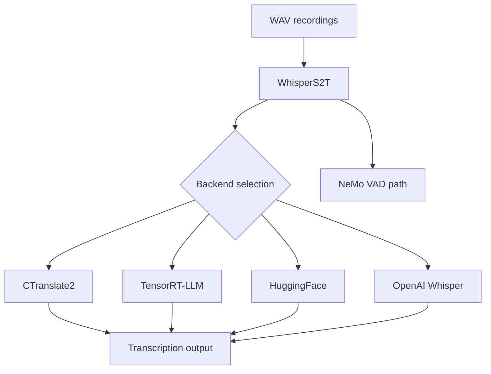
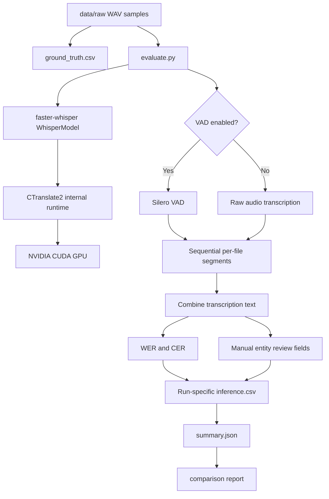
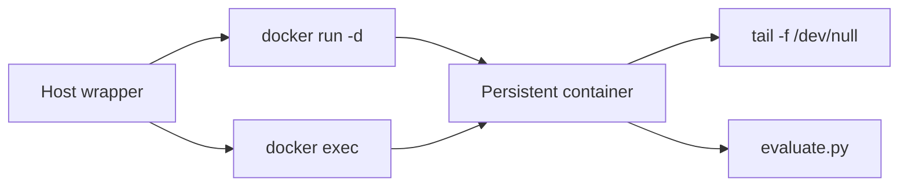
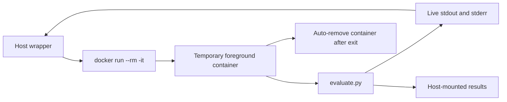

# Engineering Session Report

## 1. Session Objective

This session focused on designing and validating a reproducible speech-to-text evaluation workflow for the local-first `job_tracker` assistant.

The immediate engineering goal was to answer:

```text
Can a local Whisper-based model reliably transcribe job-tracking commands?
```

The evaluation needed to measure more than generic transcription quality. The assistant must preserve domain-critical fields such as:

```text
company names
role names
job types
application statuses
priorities
notes
next actions
speech after pauses
```

The session evolved through multiple stages:

1. Investigating whether the Dockerized WhisperS2T library could support CUDA inference without TensorRT-LLM.
    
2. Rejecting WhisperS2T after setup errors and uncertainty around its multi-backend complexity.
    
3. Switching to `faster-whisper`, which uses CTranslate2 internally.
    
4. Building a Dockerized GPU evaluation pipeline.
    
5. Designing ground-truth and inference-result CSV schemas.
    
6. Running `small` model experiments across VAD and prompt configurations.
    
7. Beginning `medium` model experiments.
    
8. Improving experiment-storage organization and Docker command usability.
    

---

## 2. Starting Context

### Existing project direction

The broader `job_tracker` project was already intended to become a local-first, conversational job-application assistant.

The user had recorded WAV samples under:

```text
data/raw/
├── company/
├── difficult-company-mix-vocab/
├── long-narrative-pauses/
├── long-narratives/
├── medium-narratives/
├── natural-voice/
├── role-jobtype/
└── short/
```

The dataset included 31 WAV files covering:

```text
short commands
company-name-heavy utterances
role and job-type utterances
medium narratives
long narratives
pause-heavy narratives
natural speech
difficult mixed vocabulary
```

The user wanted a batch evaluation workflow with two principal CSV files:

```text
ground_truth.csv
inference_runs.csv
```

### Initial technical assumption

The initial assumption was that the pulled image:

```text
shashikg/whisper_s2t:dev-trtllm
```

could serve as the basis for evaluation.

The user initially wanted to compare:

```text
VAD ON + prompt OFF
VAD ON + prompt ON
```

and potentially add:

```text
VAD OFF
```

if supported.

The early evaluation draft assumed a CTranslate2-like workflow, but the pulled image name suggested TensorRT-LLM support. This triggered a deeper examination of backend boundaries.

### Trigger for the discussion

The session began because the user had:

```text
a pulled Docker image
raw recordings
an evaluation idea
no working batch-inference workflow
```

The user needed a practical implementation plan rather than an abstract explanation.

---

## 3. User Goal Behind the Work

The actual product goal was not generic speech recognition.

The assistant must allow natural commands such as:

```text
Add Bootcoding Private Limited as an internship application for the AI Engineer role.
```

and longer conversational updates such as:

```text
I applied for an AI Engineer opportunity at Aiden AI.
The job was posted through a LinkedIn post.
I sent my resume by email, connected with employees, followed up,
and engaged with their posts.
My next action is to ask for referrals.
```

The user wants to interact with the application tracker conversationally without manually editing structured records.

This creates a stricter requirement than ordinary transcription:

```text
A grammatically readable transcript is not sufficient.
Critical entities and actions must remain usable.
```

For example:

```text
Bootcoding Private Limited
→ boot code in private limit
```

is a major product failure even if the surrounding sentence remains understandable.

The evaluation workflow therefore needed to support:

```text
automatic speed metrics
automatic WER and CER
category-wise comparisons
prompt experiments
VAD experiments
manual entity-level review
repeatable future model comparisons
```

---

## 4. Obstacles Encountered

### 4.1 Backend ambiguity in WhisperS2T

#### Symptom

The initial Docker image was named:

```text
shashikg/whisper_s2t:dev-trtllm
```

while the evaluation plan referenced:

```text
backend=CTranslate2
```

The user needed to know whether the image was TensorRT-only, CTranslate2-only, or multi-backend.

#### Initially suspected

It was initially unclear whether:

```text
TensorRT image = only TensorRT backend
```

or:

```text
TensorRT image = regular WhisperS2T installation plus TensorRT extras
```

#### Root cause

The inspected Dockerfile contained:

```dockerfile
ARG SKIP_TENSORRT_LLM

RUN if [[ -z "$SKIP_TENSORRT_LLM" ]]; then /bin/bash install_tensorrt.sh; fi
```

The core package installation occurred earlier:

```dockerfile
pip3 install --no-cache-dir \
  git+https://github.com/shashikg/WhisperS2T.git@${WHISPER_S2T_VER}
```

TensorRT-LLM installation was therefore optional.

#### Why non-obvious

The image tag emphasized TensorRT-LLM, while the library documentation emphasized multi-backend support. Image naming and runtime backend selection were separate concerns.

#### Boundary involved

```text
Infrastructure
Dependency management
Inference backend selection
```

#### Resolution

The session concluded that WhisperS2T could be built with:

```bash
--build-arg SKIP_TENSORRT_LLM=1
```

while retaining a CUDA-capable base image.

However, this plan was later abandoned because WhisperS2T produced setup errors during experimentation and introduced unnecessary backend complexity for the immediate evaluation goal.

---

### 4.2 WhisperS2T was over-complex for the immediate task

#### Symptom

The user reported errors while trying to use WhisperS2T and proposed switching to `faster-whisper`.

#### Initially suspected

The initial assumption was that WhisperS2T would provide a useful multi-backend pipeline and allow direct CTranslate2-based evaluation.

#### Root cause

The immediate task did not require a complex multi-backend abstraction. The user needed:

```text
CUDA inference
optional VAD
optional initial prompt
per-file metrics
simple batch evaluation
```

`faster-whisper` already provided these capabilities while internally using CTranslate2.

#### Why non-obvious

WhisperS2T initially appeared attractive because it exposed multiple backends, VAD integration and TensorRT-related optimization paths. These appeared useful before the actual setup cost was experienced.

#### Boundary involved

```text
Speech pipeline
Infrastructure
Dependency complexity
```

#### Resolution

WhisperS2T was rejected for the first evaluation iteration.

The chosen baseline became:

```text
faster-whisper
+ CTranslate2 internally
+ CUDA
+ float16 initially
+ Silero VAD optional
+ initial_prompt optional
```

TensorRT-LLM benchmarking was deferred.

---

### 4.3 Incorrect repository bind mount

#### Symptom

The first Docker smoke-test command failed with:

```text
python3: can't open file '/workspace/evaluation/smoke_test.py':
[Errno 2] No such file or directory
```

#### Initially suspected

A missing script or incorrect container build could have caused the failure.

#### Root cause

The command was executed from:

```text
~/dev-work/job_tracker_assistant/data
```

while using:

```bash
-v "$PWD:/workspace"
```

This mounted only the `data/` directory into `/workspace`, not the repository root.

The container therefore could not see:

```text
/workspace/evaluation/smoke_test.py
```

#### Why non-obvious

The Docker image started successfully and displayed the CUDA banner. The failure appeared to be inside the container, but the actual issue was the host working directory used when resolving `$PWD`.

#### Boundary involved

```text
Infrastructure
Host-container filesystem boundary
```

#### Resolution

The command was rerun from:

```bash
cd ~/dev-work/job_tracker_assistant
```

so that the repository root was mounted into `/workspace`.

---

### 4.4 First model load appeared slow

#### Symptom

The first successful `small` model smoke test reported:

```text
Model load seconds: 108.1207
Transcription seconds: 1.3503
```

It also displayed:

```text
Warning: You are sending unauthenticated requests to the HF Hub.
```

#### Initially suspected

The long model-load time could have indicated a performance issue.

#### Root cause

The model was being downloaded from Hugging Face Hub on first use.

The Docker command mounted:

```bash
-v "$HOME/.cache/huggingface:/root/.cache/huggingface"
```

so the cache persisted on the host.

#### Why non-obvious

The model-load metric combined:

```text
first-time download
model initialization
```

rather than measuring only cached load time.

#### Boundary involved

```text
Infrastructure
Model distribution
Caching
```

#### Resolution

The Hugging Face cache mount was retained. Subsequent runs reused cached models.

The warning about unauthenticated requests was treated as non-blocking unless rate limiting or slow downloads became a real issue.

---

### 4.5 Initial smoke transcript looked truncated

#### Symptom

The first smoke test returned:

```text
for the AI engineer role.
```

instead of the expected longer command.

#### Initially suspected

Silero VAD may have removed the start of the spoken command.

#### Root cause

The user clarified that recordings intentionally contained approximately five seconds of muted audio at the beginning for possible post-processing.

This made VAD behavior an important variable.

A later VAD-off transcription captured a fuller utterance:

```text
Add a boot code in private limit as an intensive application for the engineer room.
```

The transcript was still inaccurate, but it showed that speech was not entirely absent from the source recording.

#### Why non-obvious

Two issues overlapped:

```text
segment truncation caused by VAD behavior
domain-vocabulary transcription errors caused by model quality
```

The truncated VAD-on transcript initially obscured the underlying entity-recognition problem.

#### Boundary involved

```text
Speech pipeline
VAD configuration
Model performance
```

#### Resolution

The evaluation matrix retained explicit comparisons for:

```text
VAD ON
VAD OFF
```

Leading silence and pause-heavy samples were documented in `ground_truth.csv` notes.

---

### 4.6 `small` model preserved sentence shape but corrupted critical entities

#### Symptom

Expected:

```text
Add Bootcoding Private Limited as an internship application
for the AI Engineer role.
```

Actual:

```text
Add a boot code in private limit as an intensive application
for the engineer room.
```

#### Initially suspected

The issue might be limited to VAD trimming.

#### Root cause

The `small` model itself struggled with domain vocabulary.

Observed error classes included:

```text
Bootcoding → boot code in
Private Limited → private limit
internship → intensive
role → room
```

#### Why non-obvious

The sentence structure remained recognizable. A superficial review could conclude that transcription was acceptable.

For `job_tracker`, however, the corrupted tokens were precisely the important structured fields.

#### Boundary involved

```text
Model performance
Domain vocabulary
Product correctness
```

#### Resolution

`small` was retained as a baseline but not treated as production-ready.

The next experiment moved to:

```text
medium
```

with controlled comparisons across VAD and prompt settings.

---

### 4.7 Ground-truth CSV initially contained blank expected transcripts

#### Symptom

The smoke-run row in `inference_runs.csv` contained blank values for:

```text
wer
cer
```

#### Initially suspected

The evaluator might not be calculating metrics correctly.

#### Root cause

`ground_truth.csv` had generated rows, but `expected_text` values had not yet been manually filled.

#### Why non-obvious

The CSV structure existed and the evaluator successfully appended inference rows, making the pipeline appear fully populated.

However:

```text
generated dataset structure
≠
manually labelled ground truth
```

#### Boundary involved

```text
Evaluation data
Human-labelling workflow
Metrics validity
```

#### Resolution

The user manually filled all 31 expected transcriptions.

Pause markers were excluded from `expected_text` and preserved in the optional `notes` column.

Example notes format:

```text
3–4 second pause after "Analytics Vidhya";
around 5 second pause after "Haryana";
3 second pause after "engaged with their posts";
6 second pause before the final phrase "suitable for me"
```

---

### 4.8 Ground-truth formatting required cleanup

#### Symptom

Some manually labelled transcripts omitted spaces after sentence boundaries, such as:

```text
Haryana.I tailored
```

#### Initially suspected

The effect might be negligible.

#### Root cause

Manual labelling introduced minor formatting inconsistencies.

#### Why non-obvious

The spoken content was correct, but WER and CER can be slightly distorted by inconsistent reference formatting.

#### Boundary involved

```text
Evaluation data quality
Metric correctness
```

#### Resolution

Spacing normalization was identified as a required cleanup step before relying on fine-grained metric differences.

The large model-quality conclusions remained valid because the errors were much larger than the formatting noise.

---

### 4.9 Host-side Python environment lacked inference dependencies

#### Symptom

The user ran:

```bash
python3 evaluation/evaluate.py \
  --model medium \
  --device cuda \
  --compute-type float16 \
  --vad off \
  --beam-size 5 \
  --run-label fw_medium_fp16_vad_off_prompt_off
```

and received:

```text
ModuleNotFoundError: No module named 'ctranslate2'
```

followed by:

```text
RuntimeError:
faster-whisper dependencies are unavailable.
Run this command inside the faster-whisper environment.
```

#### Initially suspected

The medium model configuration itself might be invalid.

#### Root cause

The command ran using host Python.

The required dependencies were installed inside the Docker image, not in the host Python environment.

#### Why non-obvious

The evaluation script existed on the host because the repository was bind-mounted. It was therefore easy to assume it could be run directly.

#### Boundary involved

```text
Infrastructure
Host-container Python environment
Dependency isolation
```

#### Resolution

A helper script was introduced to forward evaluation commands into Docker.

---

### 4.10 Persistent Docker container workflow created UX confusion

#### Symptom

A wrapper script was implemented around:

```text
persistent named container
docker run -d
tail -f /dev/null
docker exec
```

The user later clarified that this was not the desired UX.

The user wanted Docker communication to remain visibly attached to the current terminal rather than appearing to work silently in the background.

#### Initially suspected

The primary issue was thought to be missing heartbeat logs during model loading.

#### Root cause

The deeper UX mismatch was architectural:

```text
The wrapper used a detached persistent-container model,
while the user wanted foreground temporary containers.
```

#### Why non-obvious

`docker exec -it` could still forward evaluator logs, so technically the system was functional. The problem was not merely missing logs; the execution model itself felt opaque.

#### Boundary involved

```text
Infrastructure UX
Developer ergonomics
Process lifecycle
```

#### Resolution

The desired wrapper design was changed to:

```text
fresh temporary container per command
foreground docker run
attached current terminal
live stdout and stderr
Ctrl+C propagation
automatic container removal
host-mounted persistent repository and model cache
```

A Codex prompt was prepared to replace the persistent workflow.

Implementation of the final foreground-only wrapper was requested, but completion was not confirmed within this session.

---

### 4.11 Experiment outputs would become difficult to manage

#### Symptom

The initial evaluation directory stored:

```text
one global inference_runs.csv
multiple summary JSON files under results/
```

This was manageable for the first three `small` runs but would become cluttered as additional models and configurations were introduced.

#### Initially suspected

Appending all rows to one global CSV appeared simple and sufficient.

#### Root cause

Future experiments would introduce many combinations:

```text
small
medium
large-v3-turbo
float16
int8_float16
VAD ON
VAD OFF
prompt versions
```

A single global CSV risked:

```text
stale rows
duplicate rows
overwrite confusion
difficulty reproducing configurations
```

#### Why non-obvious

The original approach worked correctly for the first 94 rows.

The maintainability problem emerged only when planning additional model experiments.

#### Boundary involved

```text
Evaluation architecture
Experiment tracking
Reproducibility
```

#### Resolution

A run-directory model was proposed:

```text
evaluation/runs/<run-label>/
├── config.json
├── inference.csv
└── summary.json
```

with global comparison reports under:

```text
evaluation/reports/
```

Prompt files would be versioned:

```text
job_tracker_vocab_v1.txt
job_tracker_vocab_v2.txt
```

Subsequent wrapper validation output referenced:

```text
evaluation/reports/comparison_summary.csv
evaluation/reports/comparison_summary.md
```

which indicates at least part of this refactor was implemented.

The full migration details were not independently verified in this session.

---

## 5. Approaches Considered

### 5.1 WhisperS2T with TensorRT-LLM

#### Approach

Use the pulled image:

```text
shashikg/whisper_s2t:dev-trtllm
```

and evaluate the TensorRT-LLM backend.

#### Why it seemed reasonable

TensorRT-LLM promised NVIDIA-specific optimization and potentially higher throughput.

#### Advantages

```text
potential speed improvements
GPU-specific optimization
future performance benchmarking value
```

#### Drawbacks

```text
heavier dependencies
CUDA and TensorRT compatibility risk
backend feature ambiguity
more difficult setup
prompt-support uncertainty
```

#### Decision

Deferred.

TensorRT-LLM became an optional future performance experiment, not a prerequisite.

---

### 5.2 WhisperS2T with CTranslate2 and TensorRT disabled

#### Approach

Build WhisperS2T with:

```bash
--build-arg SKIP_TENSORRT_LLM=1
```

while retaining the CUDA base image.

#### Why it seemed reasonable

It preserved WhisperS2T's multi-backend interface while avoiding TensorRT complexity.

#### Advantages

```text
CUDA support retained
TensorRT dependencies avoided
potential prompt and VAD experiments
```

#### Drawbacks

```text
WhisperS2T still introduced wrapper complexity
setup errors were encountered
multi-backend abstraction was unnecessary for immediate goals
```

#### Decision

Rejected for the first evaluation pipeline.

---

### 5.3 `faster-whisper` as the direct inference engine

#### Approach

Use:

```text
faster-whisper
+ CTranslate2 internally
+ CUDA
```

#### Why it seemed reasonable

It exposed exactly the features required for the evaluation:

```text
WhisperModel
CUDA execution
float16
int8_float16
initial_prompt
Silero VAD
segment output
```

#### Advantages

```text
simpler dependency surface
direct API
clearer evaluation logic
sufficient functionality
less backend confusion
```

#### Drawbacks

```text
still requires domain-specific accuracy evaluation
VAD behavior needs tuning
model-size trade-offs remain
```

#### Decision

Adopted.

This became the primary speech-evaluation architecture.

---

### 5.4 Sequential per-file evaluation

#### Approach

Load the model once and call:

```python
model.transcribe(...)
```

separately for every WAV file.

#### Why it seemed reasonable

The user needed:

```text
per-file latency
sample-level debugging
category-wise comparison
clear failure inspection
```

#### Advantages

```text
simple
inspectable
reproducible
easy to compare failures
```

#### Drawbacks

```text
not a maximum-throughput benchmark
does not evaluate batching optimizations
```

#### Decision

Adopted for the baseline.

`BatchedInferencePipeline` was deferred.

---

### 5.5 Silero VAD ON and OFF comparison

#### Approach

Compare:

```text
vad_filter=True
vad_filter=False
```

#### Why it seemed reasonable

Some recordings intentionally contained leading silence and long pauses.

#### Advantages

```text
detect truncation
measure latency impact
evaluate pause-heavy realism
```

#### Drawbacks

```text
VAD-off may process more silence
aggregate WER alone may hide sample-specific trade-offs
```

#### Decision

Adopted as a required experiment dimension.

---

### 5.6 Prompt ON and OFF comparison

#### Approach

Use an editable domain-vocabulary file passed through:

```python
initial_prompt=...
```

#### Why it seemed reasonable

Many target company names are uncommon and phonetically ambiguous.

#### Advantages

```text
low implementation cost
potential spelling improvement
editable domain vocabulary
```

#### Drawbacks

```text
not consistently beneficial
may distort some transcriptions
not sufficient as the only correction layer
```

#### Decision

Adopted as an experiment, not as an assumed final solution.

---

### 5.7 Persistent background Docker container

#### Approach

Use:

```text
docker run -d
tail -f /dev/null
docker exec
```

#### Why it seemed reasonable

It shortened repeated commands and reused one container.

#### Advantages

```text
reduced command verbosity
fast repeated access
convenient shell and summary execution
```

#### Drawbacks

```text
opaque process lifecycle
background execution felt confusing
did not match desired visible terminal workflow
```

#### Decision

Rejected after UX clarification.

---

### 5.8 Foreground temporary Docker container

#### Approach

Use:

```bash
docker run --rm -it ...
```

for every evaluation command.

#### Why it seemed reasonable

It keeps the active process visible in the terminal where the script was launched.

#### Advantages

```text
transparent lifecycle
live stdout and stderr
Ctrl+C works naturally
temporary container removed automatically
host-mounted data and model cache persist
```

#### Drawbacks

```text
container startup repeated per command
still requires model-load logging if the library is quiet
```

#### Decision

Selected as the desired wrapper design.

Implementation completion remained unconfirmed at the end of the session.

---

## 6. Decisions Made

### Decision 1: Use `faster-whisper`, not WhisperS2T

#### Final decision

Adopt:

```text
faster-whisper
+ CUDA
+ CTranslate2 internally
```

#### Reasoning

The immediate problem required a reliable, understandable evaluation pipeline rather than multi-backend flexibility.

#### Rejected alternatives

```text
WhisperS2T + TensorRT-LLM
WhisperS2T + CTranslate2 with TensorRT disabled
```

#### Stability

Intended as the stable baseline inference layer for evaluation.

Future runtime replacement remains possible if evidence justifies it.

---

### Decision 2: Treat transcription quality as entity preservation, not only WER

#### Final decision

Track:

```text
WER
CER
company_names_correct
role_names_correct
important_fields_correct
hallucination_detected
speech_after_pauses_captured
observed_errors
```

#### Reasoning

The product fails when entities are corrupted even if sentences remain understandable.

#### Rejected alternative

Using only generic WER/CER.

#### Stability

Stable evaluation principle.

---

### Decision 3: Preserve pauses in notes, not in expected transcripts

#### Final decision

Write only spoken words in:

```text
expected_text
```

and preserve timing details in:

```text
notes
```

#### Reasoning

Pause markers are not spoken text and should not affect WER/CER.

#### Stability

Stable annotation rule.

---

### Decision 4: Start with sequential per-file evaluation

#### Final decision

Load the model once, transcribe files one-by-one and log each attempt.

#### Reasoning

This preserves debuggability and per-file latency.

#### Deferred alternative

Batched throughput evaluation.

#### Stability

Stable for accuracy evaluation; batching may be added later as a separate experiment.

---

### Decision 5: Keep model comparisons controlled

#### Final decision

Change one variable at a time.

For `medium`, the planned sequence was:

```text
medium + fp16 + VAD OFF + prompt OFF
medium + fp16 + VAD OFF + prompt ON
medium + fp16 + VAD ON + prompt OFF
```

Optional fallback:

```text
medium + int8_float16
```

#### Reasoning

Simultaneously changing model, VAD, prompt and quantization would make conclusions ambiguous.

#### Stability

Stable experiment-design principle.

---

### Decision 6: Improve experiment storage

#### Final decision

Move toward:

```text
evaluation/runs/<run-label>/
├── config.json
├── inference.csv
└── summary.json
```

#### Reasoning

A single append-only CSV would become difficult to manage across many experiments.

#### Stability

Intended as a stable experiment-tracking structure.

---

### Decision 7: Prefer foreground Docker execution

#### Final decision

Use a wrapper around:

```bash
docker run --rm -it
```

rather than a persistent detached container.

#### Reasoning

The user explicitly wants Docker execution and logs to remain visible in the current terminal.

#### Rejected alternative

Persistent named container with `docker exec`.

#### Stability

Intended as the preferred developer UX.

---

## 7. Architecture Evolution

### Previous concept: WhisperS2T multi-backend pipeline



### Limitation

This architecture introduced unnecessary complexity before the simplest baseline had been validated.

The user encountered WhisperS2T setup errors and did not yet need multi-backend optimization.

---

### Updated speech-evaluation architecture



### Updated Docker execution design

#### Temporary persistent-container design



#### Desired final design



---

## 8. Implementation Progress

### Completed implementation

The following files were created or modified during the session:

```text
docker/faster-whisper.Dockerfile

evaluation/
├── README.md
├── create_ground_truth_template.py
├── evaluate.py
├── ground_truth.csv
├── inference_runs.csv
├── smoke_test.py
├── summarize_results.py
├── prompts/
│   └── job_tracker_vocab.txt
└── results/
    ├── comparison_summary.md
    ├── fw_small_fp16_vad_off_prompt_off_summary.json
    ├── fw_small_fp16_vad_on_prompt_off_smoke_summary.json
    ├── fw_small_fp16_vad_on_prompt_off_summary.json
    └── fw_small_fp16_vad_on_prompt_on_summary.json
```

A helper script was later created:

```text
evaluation/fw_container.sh
```

### Docker image

A CUDA image was built:

```text
job-tracker-faster-whisper:cuda
```

using a CUDA 12.3.2 and cuDNN 9 runtime base image.

### Ground-truth generation

`create_ground_truth_template.py`:

```text
recursively discovers WAV files
generates stable test IDs
preserves manually labelled expected text
preserves notes
stores paths relative to data/
```

### Evaluator

`evaluate.py` supports:

```text
--model
--device
--compute-type
--vad
--beam-size
--run-label
--prompt-file
--category
--limit
--allow-cpu-fallback
--overwrite-existing-run
```

It records:

```text
model load time
audio duration
transcription latency
RTF
raw transcription
WER
CER
first-request flag
manual-review placeholders
```

### Summary generator

`summarize_results.py` produces:

```text
terminal summaries
comparison_summary.md
```

Later output also showed:

```text
evaluation/reports/comparison_summary.csv
evaluation/reports/comparison_summary.md
```

which suggests the run-directory refactor was at least partially implemented.

### Completed small-model runs

Three complete `small` model runs were executed:

```text
fw_small_fp16_vad_on_prompt_off
fw_small_fp16_vad_on_prompt_on
fw_small_fp16_vad_off_prompt_off
```

One smoke run was also preserved:

```text
fw_small_fp16_vad_on_prompt_off_smoke
```

### Medium-model progress

The user began `medium` model experimentation.

A row-level CSV for:

```text
fw_medium_fp16_vad_off_prompt_on_vocab_v1
```

was uploaded.

The raw evidence shows that the medium model can produce materially better outputs on some samples:

```text
role_jobtype_01:
WER = 0.000000
CER = 0.000000

medium_narratives_03:
WER = 0.023256
CER = 0.004115

short_05:
WER = 0.071429
CER = 0.011765
```

However, difficult samples remain:

```text
short_02:
WER = 1.142857
CER = 0.310345

short_03:
WER = 1.000000
CER = 0.211268

difficult_company_mix_vocab_02:
WER = 0.857143
CER = 0.269663
```

The aggregate `medium` summary was not provided in the session.

### Planned but not confirmed complete

The following were requested but not fully confirmed as implemented:

```text
final foreground-only fw_container.sh wrapper
complete run-folder migration details
prompt file rename to job_tracker_vocab_v1.txt
aggregate medium-model comparison summary
```

---

## 9. Validation and Evidence

### Docker GPU validation

Validated package versions:

```text
faster-whisper: 1.2.1
ctranslate2: 4.7.2
CUDA devices: 1
```

### Initial smoke test

The first successful smoke test reported:

```text
Model load seconds: 108.1207
Transcription seconds: 1.3503
Detected language: en
Segments: 1
Transcription: for the AI engineer role.
```

The long initial load was consistent with first-time model download.

### Evaluator smoke validation

Later evaluator validation reported:

```text
[1/1] short_01
audio=10.665s
inference=1.449s
RTF=0.1359
```

Generated:

```text
evaluation/inference_runs.csv
evaluation/results/fw_small_fp16_vad_on_prompt_off_smoke_summary.json
```

### Small-model aggregate results

After correcting `ground_truth.csv`, Codex reran all three complete small-model experiments.

|Run|Mean WER|Mean CER|Mean latency|Overall RTF|
|---|--:|--:|--:|--:|
|`fw_small_fp16_vad_on_prompt_off`|0.454866|0.202862|0.596127 s|0.030552|
|`fw_small_fp16_vad_on_prompt_on`|0.427795|0.175065|0.625794 s|0.032073|
|`fw_small_fp16_vad_off_prompt_off`|**0.422550**|0.192139|**0.536590 s**|**0.027501**|

### Small-model interpretation

Prompting improved quality:

```text
WER:
0.454866 → 0.427795

CER:
0.202862 → 0.175065
```

The improvement came with a small latency increase.

VAD OFF performed better overall than VAD ON in the small-model dataset:

```text
WER:
0.454866 → 0.422550

Latency:
0.596127s → 0.536590s
```

This does not prove that VAD should be permanently disabled. It only proves that the default VAD settings were not optimal for this dataset.

### Manual review status

The CSV manual-review fields remained blank:

```text
full_audio_transcribed
final_sentence_present
company_names_correct
role_names_correct
important_fields_correct
hallucination_detected
speech_after_pauses_captured
observed_errors
notes
```

Therefore, summary counts such as:

```text
company_names_correct=false: 0
```

must be interpreted as:

```text
not manually reviewed yet
```

not:

```text
all company names were correct
```

### Medium-model row-level evidence

The uploaded medium prompt-on rows show mixed performance.

Strong examples:

```text
role_jobtype_01:
"I applied for the generative AI engineer internship at analytics Vidhya."
WER = 0.000000
CER = 0.000000
```

```text
medium_narratives_03:
"I applied for an AI engineer opportunity at Aiden AI..."
WER = 0.023256
CER = 0.004115
```

Weak examples:

```text
short_02:
"Mark, please support soft technology application as we get there."
WER = 1.142857
```

```text
difficult_company_mix_vocab_03:
"I applied for roles at BootcodingPriorityLimited"
WER = 0.705882
CER = 0.653226
```

This suggests:

```text
medium improves some natural and role-focused utterances significantly
but difficult company vocabulary and some short commands remain unresolved
```

Aggregate medium conclusions require summary-level comparison.

---

## 10. Lessons Learned

### Lesson 1: Do not optimize before establishing a stable baseline

TensorRT-LLM initially looked attractive because of potential speed gains.

The actual bottleneck was not speed.

The small-model runs showed:

```text
RTF around 0.03
```

which is already fast.

The real problem was entity accuracy.

Future work should prioritize:

```text
model quality
domain correction
entity extraction robustness
```

before backend micro-optimization.

---

### Lesson 2: A readable transcript can still be product-invalid

The transcript:

```text
Add a boot code in private limit as an intensive application
for the engineer room.
```

is understandable to a human.

It is not safe input for a structured job tracker.

Evaluation must include semantic field correctness, not only global WER.

---

### Lesson 3: VAD is not a universally beneficial preprocessing step

VAD can improve efficiency, but leading silence and long pauses can interact badly with default settings.

The presence of intentionally muted initial audio exposed this issue early.

Future VAD work should be evaluated separately from model-size comparisons.

---

### Lesson 4: Generated CSV structure is not labelled ground truth

A generated row inventory is only the evaluation skeleton.

Metrics are meaningful only after:

```text
expected_text
```

is manually filled and cleaned.

---

### Lesson 5: Containerized dependencies need containerized commands

The host-side `ModuleNotFoundError` was a useful reminder:

```text
repository files may be visible on the host
while runtime dependencies remain container-local
```

Developer tooling should make the correct execution path obvious.

---

### Lesson 6: Developer UX matters even for internal scripts

A technically valid persistent container workflow was still rejected because it obscured process lifecycle.

The chosen workflow should make it obvious:

```text
what is running
where it is running
when it exits
where results are written
```

---

### Lesson 7: Experiment storage must scale before experiments multiply

A single append-only CSV is easy to start with but becomes hard to reason about once models, prompts, VAD settings and quantization variants multiply.

Run-level folders and config snapshots reduce ambiguity.

---

## 11. Open Questions and Deferred Work

### Required next steps

1. Complete or confirm the foreground-only Docker wrapper:
    
    ```text
    docker run --rm -it
    ```
    
2. Generate an aggregate summary for:
    
    ```text
    fw_medium_fp16_vad_off_prompt_on_vocab_v1
    ```
    
3. Run the remaining controlled medium configurations:
    
    ```text
    medium + fp16 + VAD OFF + prompt OFF
    medium + fp16 + VAD ON + prompt OFF
    ```
    
4. Compare medium against the small baseline.
    
5. Perform targeted manual entity review on high-value categories:
    
    ```text
    company
    difficult-company-mix-vocab
    short
    role-jobtype
    long-narrative-pauses
    ```
    
6. Clean minor ground-truth spacing inconsistencies.
    

---

### Optional enhancements

1. Add:
    
    ```text
    medium + int8_float16
    ```
    
    if VRAM or speed trade-offs need evaluation.
    
2. Evaluate:
    
    ```text
    large-v3-turbo
    ```
    
    after medium-model analysis.
    
3. Add a post-processing layer:
    
    ```text
    known company dictionary
    fuzzy matching
    structured extraction validation
    manual confirmation for low-confidence entities
    ```
    
4. Tune Silero VAD parameters separately.
    
5. Evaluate batched inference only after single-file accuracy is understood.
    
6. Add aggregate entity-level metrics after manual review.
    

---

### Explicitly rejected for now

```text
TensorRT-LLM optimization
WhisperS2T multi-backend pipeline
persistent detached evaluation container
throughput-first batching experiments
```

These may be revisited only if the stable faster-whisper baseline proves insufficient.

---

### Questions requiring investigation

1. Does `medium + prompt ON` materially reduce company-name failures overall?
    
2. Does VAD OFF remain superior for medium, or was the small-model result specific to the current model?
    
3. Can post-processing recover split or fused company names such as:
    
    ```text
    BootcodingPrivateLimited
    BootcodingPriorityLimited
    ```
    
4. Would `large-v3-turbo` provide a better accuracy-latency trade-off than `medium` on a 4 GB RTX 3050 laptop GPU?
    
5. How much of the remaining error rate is caused by:
    
    ```text
    model capacity
    accent mismatch
    recording quality
    domain vocabulary rarity
    VAD segmentation
    ```
    
6. Should the production assistant use a fallback strategy:
    
    ```text
    transcribe with VAD
    → validate required entities
    → retry without VAD if transcript appears truncated
    ```
    

---

## 12. Significance in the Overall Project Journey

This session was primarily:

```text
an experimental foundation
a speech-pipeline simplification
an infrastructure-debugging session
a developer-UX refinement
```

It moved the project from:

```text
an idea for evaluating local speech recognition
```

to:

```text
a functioning CUDA-backed faster-whisper evaluation system
with labelled data, repeatable experiments and measurable quality trade-offs
```

It also ruled out an unnecessarily complex early path:

```text
WhisperS2T + TensorRT-first evaluation
```

and established an evidence-driven workflow for model selection.

The most important insight was that local inference speed is already promising, while entity-level transcription quality remains the core engineering challenge.

---

## 13. Compact Timeline Entry

**Milestone:**  
Built and validated the first CUDA-backed speech-to-text evaluation pipeline for the local-first `job_tracker` assistant.

**Problem:**  
The assistant needed reliable transcription of company names, roles, statuses, priorities and next actions from recorded job-tracking commands.

**Key obstacle:**  
The initial WhisperS2T and TensorRT-oriented path introduced backend ambiguity and setup complexity. After switching to `faster-whisper`, the pipeline revealed that the `small` model was fast but frequently corrupted critical entities. Docker host/container boundaries and detached-container UX also caused confusion.

**Decision:**  
Adopt `faster-whisper + CTranslate2 + CUDA` as the baseline. Evaluate sequentially per file, compare VAD and prompt settings, store ground truth separately, move toward run-specific experiment folders, and use foreground Docker execution.

**Outcome:**  
Three complete `small` model runs were measured. The fastest and most accurate small-model aggregate was `VAD OFF + prompt OFF`, but accuracy remained insufficient. Medium-model testing began and showed promising improvements on some samples while difficult company vocabulary remained unresolved.

**Next step:**  
Complete the controlled medium-model matrix, generate aggregate medium summaries, perform targeted entity-level review and decide whether to test `large-v3-turbo` or add domain-aware correction.