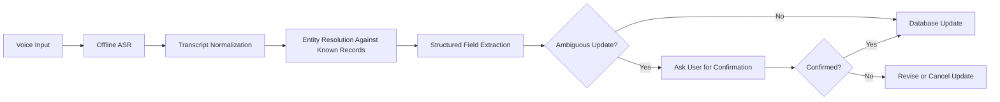
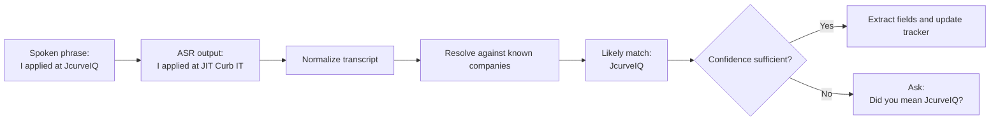

# Engineering Session Report

## 1. Session Objective

This session focused on extracting and documenting a key engineering lesson from an offline speech-recognition experiment for the `job_tracker` project:

> Raw ASR accuracy is not the same as end-to-end workflow reliability.

The experiment evaluated whether a local Faster-Whisper setup could serve as a practical speech-input layer for a conversational, offline-first job-tracking assistant.

The discussion also covered the conceptual architecture behind Whisper, including:

- log-Mel spectrogram extraction,
    
- Transformer encoder processing,
    
- hidden-state representations,
    
- autoregressive decoding,
    
- self-attention,
    
- cross-attention,
    
- and the distinction between a raw transcript and a reliable structured update.
    

A secondary objective was to convert the engineering insight into portfolio-friendly communication artifacts:

- a concise LinkedIn post,
    
- a Whisper architecture diagram,
    
- and a simplified infographic comparing a fragile ASR pipeline with a reliable workflow.
    

---

## 2. Starting Context

### Existing Project Direction

The broader project goal was already established: build a local-first, conversational `job_tracker` assistant that can accept natural spoken updates and translate them into structured application-tracking changes.

The intended user experience was conceptually simple:

```text
User speaks naturally
→ speech is transcribed locally
→ relevant application fields are extracted
→ the tracker is updated
```

The assistant was expected to handle utterances such as:

```text
I applied for the Generative AI Engineer internship at Analytics Vidhya.
```

or:

```text
Mark the Supportsoft Technologies application as rejected.
```

### Experiment Already Conducted

Before this session, a Faster-Whisper feasibility experiment had been run using:

```text
Backend: faster-whisper
Model: medium
Device: CUDA
Compute Type: float16
Beam Size: 5
VAD: Disabled
Initial Prompt: Enabled
Dataset Size: 31 samples
Total Audio Duration: ~605 seconds
```

The initial prompt included domain vocabulary relevant to job tracking:

- company names,
    
- AI-related roles,
    
- application stages,
    
- referral requests,
    
- follow-up actions,
    
- and priority-update phrases.
    

### Initial Assumption

The working assumption was:

```text
Voice Command
→ Whisper Transcript
→ Job Tracker Update
```

This assumed that a transcript that sounded coherent would generally be safe to convert into a structured database action.

The evaluation showed that this assumption was too fragile for entity-critical workflows.

---

## 3. User Goal Behind the Work

The goal was not merely to add speech-to-text functionality.

The intended product experience was a conversational job-tracking assistant that reduces the user’s cognitive load while managing applications.

The assistant should allow the user to speak naturally instead of manually editing tracker rows.

Examples of the intended workflow include:

```text
I applied for an AI Engineer internship at Aiden AI.
The role was shared through a LinkedIn post.
I emailed my resume and connected with employees.
My next action is to ask for referrals.
```

The system should convert this into structured application data while preserving correctness.

This creates a stricter reliability requirement than generic dictation software.

A generic dictation tool may tolerate a slightly incorrect company name.

A job-tracking assistant cannot safely update the wrong application record.

The work therefore mattered because speech recognition was not an isolated feature. It was an upstream dependency for persistent structured mutations.

---

## 4. Obstacles Encountered

### 4.1 Rare Company Names Were Frequently Misrecognized

#### Symptom

Common phrases and role names were often transcribed acceptably, but uncommon organization names were mutated into plausible alternatives.

Observed examples:

```text
Abstrabit Technologies
→ Axtrabit Technologies
→ ExtraBit Technologies

JcurveIQ
→ JIT Curb IT

SVS International
→ SPS International

Immverse AI
→ unrelated phrase fragments
```

#### Initially Suspected

The initial suspicion was that general transcription accuracy might be insufficient for the workflow.

It would have been easy to interpret the issue as a broad ASR-model limitation and respond by trying a larger model or relying on cloud APIs.

#### Actual Root Cause

The problem was more specific:

> Rare domain entities were the primary failure point, even when the surrounding sentence structure remained correct.

The model often generated text that was grammatically coherent but operationally wrong.

For example:

```text
I applied for an AI Engineer internship at JIT Curb IT.
```

This sounds valid as ordinary English, but it is incorrect if the intended company was `JcurveIQ`.

#### Why the Issue Was Non-Obvious

Ordinary transcript review can create false confidence.

A human reader may see a syntactically valid sentence and assume that the ASR performed well.

However, the field with the highest product importance may still be incorrect.

The failure was therefore not only a model-quality issue. It was a reliability issue at the boundary between unstructured transcription and structured database mutation.

#### Boundary Involved

```text
Speech pipeline
→ model performance
→ entity resolution
→ backend mutation safety
→ UX confirmation flow
```

#### Resolution Status

The issue was not fully resolved in code during this session.

The architectural response was to treat raw ASR output as a noisy intermediate representation and introduce downstream normalization, entity matching and ambiguity validation before database updates.

---

### 4.2 Short Commands Were Less Reliable Than Longer Narratives

#### Symptom

Short imperative utterances were sometimes harder to transcribe correctly than longer natural-language descriptions.

Observed example:

```text
Mark the Supportsoft Technologies application as rejected.
```

was transcribed as:

```text
Mark, please support soft technology application as we get there.
```

A short priority-update command was also reported to collapse into a merged-token sequence.

#### Initially Suspected

A reasonable assumption would be that shorter commands should be easier because they contain fewer words.

#### Actual Root Cause

The shorter utterances provided less semantic redundancy.

When a rare entity was misheard, the model had fewer surrounding clues from which to recover the intended phrase.

Longer narratives often gave the ASR more contextual evidence:

```text
I applied for an AI Engineer opportunity at Aiden AI.
The role was shared through a LinkedIn post.
I sent my resume by email, connected with employees, followed up,
and started engaging with their posts.
My next action is to ask for referrals.
```

Even when some words were imperfect, the downstream system retained more usable information.

#### Why the Issue Was Non-Obvious

A command-driven UX initially appears easier to implement and easier for users to learn.

However, highly compressed commands can be harder for ASR models when they contain uncommon company names, technical roles or domain-specific actions.

#### Boundary Involved

```text
UX input style
→ speech pipeline
→ semantic context availability
→ structured extraction reliability
```

#### Resolution Status

No final UX policy was implemented during the session.

The experiment suggested that the system should support conversational narratives rather than forcing users into minimal command syntax.

---

### 4.3 Fast Transcription Did Not Automatically Mean a Reliable Product

#### Symptom

Runtime results were strong:

```text
Total Audio Duration: ~604.9 seconds
Total Transcription Time: ~33.7 seconds
Overall Real-Time Factor: 0.056
Mean Transcription Time per File: ~1.09 seconds
Mean WER: 39.36%
Mean CER: 16.53%
```

The model processed audio roughly 18 times faster than real time.

#### Initially Suspected

Latency was initially one of the major feasibility concerns for a fully local workflow.

#### Actual Root Cause

Latency was not the primary bottleneck.

Accuracy around critical entities was the more important problem.

#### Why the Issue Was Non-Obvious

Performance metrics can encourage an implementation-first mindset:

```text
The local model is fast enough
→ therefore the architecture is ready
```

But a fast incorrect update is still a broken workflow.

#### Boundary Involved

```text
Infrastructure performance
→ model evaluation
→ product reliability
```

#### Resolution Status

The experiment confirmed the feasibility of local inference while ruling out direct transcript-to-database mutation as a safe default.

---

### 4.4 Vocabulary Prompting Helped, but Did Not Eliminate Entity Errors

#### Symptom

The Faster-Whisper run used an initial prompt containing job-tracking vocabulary.

Common technical phrases and some realistic sentences were handled well.

For example:

```text
I applied for the Generative AI Engineer internship at Analytics Vidhya.
```

was transcribed correctly.

However, rare company-name failures still remained.

#### Initially Suspected

Vocabulary prompting could have been treated as the primary fix for domain-specific recognition problems.

#### Actual Root Cause

Prompting improved contextual guidance but did not guarantee exact entity recovery.

The ASR model still generated plausible but incorrect variants for unfamiliar names.

#### Why the Issue Was Non-Obvious

Prompting is inexpensive and easy to add. It therefore appears attractive as a complete solution.

However, entity-critical systems require a deterministic or validated layer after transcription.

#### Boundary Involved

```text
ASR prompt configuration
→ model decoding
→ entity accuracy
```

#### Resolution Status

Vocabulary prompting remained useful, but it was reframed as one layer in a broader reliability strategy rather than a sufficient solution on its own.

---

### 4.5 Conceptual Misunderstanding Risk Around Whisper Architecture

#### Symptom

The initial architecture explanation included simplified ideas such as a “context vector” and “deep fusion.”

#### Initially Suspected

A simplified encoder-decoder explanation seemed sufficient for communicating how Whisper works.

#### Actual Root Cause

Some terminology risked conflating older sequence-to-sequence architectures with modern Transformer behavior.

Whisper should not be explained as compressing the full audio into one fixed-size context vector.

A more accurate explanation is:

```text
Audio
→ log-Mel spectrogram
→ Transformer encoder
→ sequence of context-rich hidden representations
→ autoregressive decoder
→ cross-attention over encoder outputs
→ output tokens
```

The decoder dynamically accesses encoder outputs rather than relying on a single fixed-size bottleneck.

#### Why the Issue Was Non-Obvious

Simplified educational explanations often reuse terminology from traditional encoder-decoder systems.

That terminology is intuitive but can become misleading when discussing Transformers.

#### Boundary Involved

```text
Technical communication
→ architecture understanding
→ portfolio documentation
```

#### Resolution Status

The explanation was refined and represented visually in a generated Whisper workflow diagram.

---

## 5. Approaches Considered

### 5.1 Direct Transcript-to-Database Update

#### Approach

```text
Voice Input
→ Offline ASR
→ Transcript
→ Job Tracker Update
```

#### Why It Seemed Reasonable

The flow is simple, low-latency and easy to implement.

If the transcript appears grammatically correct, the system could extract the fields and immediately persist the update.

#### Advantages

- Minimal architecture.
    
- Low implementation complexity.
    
- Low interaction overhead.
    
- Fast response time.
    
- Fewer intermediate components.
    

#### Drawbacks

- A plausible transcript may contain an incorrect company name.
    
- The system may update the wrong application record.
    
- Entity-level errors can silently corrupt structured data.
    
- Short commands may fail without sufficient contextual evidence.
    

#### Decision

Rejected as a safe default.

The experiment demonstrated that direct persistence is too fragile for entity-critical updates.

---

### 5.2 Use a Larger or Cloud-Based Speech Model

#### Approach

Respond to recognition errors by switching to a larger model or a cloud ASR API.

#### Why It Seemed Reasonable

Larger or hosted systems may improve recognition quality, particularly for difficult accents, unusual entities or noisy recordings.

#### Advantages

- Potentially better transcription accuracy.
    
- Lower local hardware burden.
    
- May reduce some error cases.
    

#### Drawbacks

- Weakens the local-first requirement.
    
- May introduce cost, privacy and internet-dependency concerns.
    
- Does not remove the need for downstream validation.
    
- A more accurate model can still produce plausible entity hallucinations.
    

#### Decision

Not adopted in this session.

The local Faster-Whisper setup was fast enough to continue using as a feasible foundation.

The stronger architectural response was to add reliability layers after ASR rather than assume a better model would eliminate the problem.

---

### 5.3 Vocabulary Prompting

#### Approach

Provide an initial prompt containing expected domain terms:

- company names,
    
- technical roles,
    
- application stages,
    
- follow-up actions,
    
- referral vocabulary,
    
- and priority-update terms.
    

#### Why It Seemed Reasonable

The model can use the prompt as contextual guidance while decoding.

#### Advantages

- Easy to add.
    
- Low runtime complexity.
    
- Compatible with offline inference.
    
- Useful for common job-tracking vocabulary.
    

#### Drawbacks

- Does not guarantee exact rare-entity recognition.
    
- May still generate plausible incorrect names.
    
- Cannot replace validation or entity resolution.
    

#### Decision

Adopted as a supporting technique.

It should remain part of the ASR configuration, but not be treated as the final reliability layer.

---

### 5.4 Entity Resolution Against Known Tracker Records

#### Approach

After transcription, compare extracted entity candidates against known companies and applications already present in the tracker.

Example:

```text
ASR transcript:
JIT Curb IT

Known tracker record:
JcurveIQ

Resolution:
Likely intended company = JcurveIQ
```

#### Why It Seemed Reasonable

The job tracker has domain context that the ASR model does not fully possess.

Known records can constrain the search space and recover likely intended entities.

#### Advantages

- Uses existing application data.
    
- Improves reliability without requiring cloud inference.
    
- Converts fuzzy ASR output into domain-aware structured input.
    
- Reduces the risk of creating or updating the wrong company record.
    

#### Drawbacks

- Fuzzy matching thresholds must be tuned.
    
- Similar company names may create ambiguity.
    
- The system should not silently guess when confidence is low.
    
- New companies may not yet exist in the tracker.
    

#### Decision

Adopted as a planned architectural layer.

Implementation details were not completed during this session.

---

### 5.5 Confirmation for Ambiguous Updates

#### Approach

Ask the user for confirmation when the system cannot confidently resolve a company name or structured action.

Example:

```text
Did you mean JcurveIQ?
```

#### Why It Seemed Reasonable

A short confirmation prevents silent database corruption while preserving conversational usability.

#### Advantages

- Makes uncertainty explicit.
    
- Keeps the user in control.
    
- Prevents incorrect persistent updates.
    
- Fits naturally with a conversational assistant.
    

#### Drawbacks

- Adds interaction friction.
    
- Confidence thresholds require careful design.
    
- Excessive confirmation prompts could make the assistant annoying.
    

#### Decision

Adopted as a planned safeguard.

The confirmation flow should be used selectively for ambiguous updates.

---

### 5.6 Encourage Natural Narratives Instead of Only Short Commands

#### Approach

Allow users to provide longer conversational application updates instead of requiring terse imperative commands.

#### Why It Seemed Reasonable

Longer narratives provide redundancy and context.

#### Advantages

- More natural interaction style.
    
- More context for ASR recovery.
    
- Better downstream extraction opportunities.
    
- Aligns with the broader conversational-assistant goal.
    

#### Drawbacks

- Requires robust structured extraction.
    
- Longer transcripts may contain irrelevant information.
    
- More complex updates need careful preview and validation.
    

#### Decision

Supported as a product direction.

The system should not force users into rigid short-command syntax.

---

### 5.7 Build an Intuition-First Deep Learning Learning Path

#### Approach

Use project-driven concepts such as Whisper as anchor points for learning deep learning fundamentals.

The proposed learning order was:

```text
Forward propagation
→ Loss
→ Gradient descent
→ Backpropagation
→ Hidden representations
→ Sequence-to-sequence models
→ Attention
→ Self-attention vs cross-attention
→ Transformer encoder and decoder
→ Autoregressive decoding
→ Whisper end-to-end workflow
```

#### Why It Seemed Reasonable

The user already understood neurons, weights, biases and activation functions, but wanted sufficient conceptual depth for engineering work and interviews without becoming blocked by heavy mathematical derivations.

#### Advantages

- Practical and motivation-driven.
    
- Directly connected to the active project.
    
- Supports portfolio storytelling.
    
- Builds interview-ready explanations.
    

#### Drawbacks

- Requires disciplined progression.
    
- Risk of oversimplification if mathematical intuition is skipped entirely.
    
- Not a substitute for deeper theory when advanced model work is required.
    

#### Decision

Adopted as a learning strategy.

This was not a code-level implementation decision, but it supports future technical decision-making.

---

## 6. Decisions Made

### Decision 1: Treat ASR Output as a Noisy Intermediate Representation

#### Final Decision

The raw ASR transcript must not be treated as final truth.

#### Reasoning

A transcript can be grammatically correct while containing the wrong company name.

#### Rejected Alternative

```text
ASR Transcript
→ Immediate Database Update
```

#### Stability

This should become a stable architectural principle.

---

### Decision 2: Insert Entity Resolution Before Structured Persistence

#### Final Decision

Use known tracker records to resolve likely company names and other domain entities before applying an update.

#### Reasoning

The tracker already contains context that can reduce ambiguity.

#### Rejected Alternative

Rely solely on the ASR model or vocabulary prompt to emit the exact company name.

#### Stability

Intended to become a stable component of the conversational update pipeline.

---

### Decision 3: Validate Ambiguous Updates Instead of Silently Guessing

#### Final Decision

When entity resolution confidence is insufficient, request user confirmation.

#### Reasoning

The cost of one brief confirmation is lower than the cost of corrupting persistent application data.

#### Rejected Alternative

Automatically choose the closest fuzzy match in every case.

#### Stability

Stable safety principle, although the exact confidence thresholds remain unresolved.

---

### Decision 4: Retain Offline Faster-Whisper as a Feasible Foundation

#### Final Decision

Continue treating the local Faster-Whisper setup as viable for the project.

#### Reasoning

The measured runtime was sufficiently fast:

```text
~605 seconds of audio
→ ~33.7 seconds of total transcription time
→ RTF ~0.056
→ roughly 18× faster than real time
```

Latency was not the main bottleneck.

#### Rejected Alternative

Abandon local inference solely because of recognition errors.

#### Stability

Provisionally stable, subject to future experiments on real-time streaming behavior and entity-recovery performance.

---

### Decision 5: Retain Prompting as a Supporting Layer, Not a Complete Fix

#### Final Decision

Continue using vocabulary prompts, but combine them with normalization, entity resolution and validation.

#### Reasoning

Prompting improved contextual handling but did not eliminate rare-entity failures.

#### Rejected Alternative

Assume prompting alone is sufficient.

#### Stability

Stable layered-design principle.

---

### Decision 6: Prefer Conversational Flexibility Over Strict Short Commands

#### Final Decision

Design the product to accept longer, natural spoken updates.

#### Reasoning

Longer narratives often provided more context and redundancy than short commands.

#### Rejected Alternative

Force every operation into a minimal command grammar.

#### Stability

Likely to remain an important UX principle.

---

## 7. Architecture Evolution

### Previous Design


### Limitation

The previous design assumed that a coherent-looking transcript was sufficiently reliable for persistence.

It did not distinguish between:

- transcription quality,
    
- semantic plausibility,
    
- entity correctness,
    
- and safe structured mutation.
    

The experiment showed that these are separate concerns.

### Updated Design



### New Boundaries Introduced

The revised design separates the speech layer from the persistence layer.

#### ASR Layer

Responsible for:

- audio transcription,
    
- local inference,
    
- vocabulary prompting,
    
- and model-level decoding.
    

#### Normalization Layer

Responsible for:

- cleaning obvious transcript variation,
    
- standardizing textual candidates,
    
- and preparing the transcript for downstream interpretation.
    

#### Entity-Resolution Layer

Responsible for:

- matching noisy transcript candidates against known tracker records,
    
- identifying likely intended companies,
    
- and flagging low-confidence matches.
    

#### Structured Extraction Layer

Responsible for:

- mapping the conversational transcript into application fields and actions.
    

#### Validation Layer

Responsible for:

- identifying uncertainty,
    
- asking for confirmation when needed,
    
- and preventing unsafe persistent mutations.
    

#### Persistence Layer

Responsible for:

- applying validated updates to the job-tracker database.
    

### Example Data Flow



---

## 8. Implementation Progress

### Completed During the Underlying Experiment

The following experiment configuration had already been executed before this reporting session:

```text
Backend: faster-whisper
Model: medium
Device: CUDA
Compute Type: float16
Beam Size: 5
VAD: Disabled
Initial Prompt: Enabled
Dataset Size: 31 samples
```

Performance and accuracy metrics were recorded.

The experiment included vocabulary prompting for the job-tracking domain.

### Completed During This Session

No backend, frontend, database or ASR-pipeline code changes were implemented during this conversation.

The session produced documentation and communication artifacts:

1. A refined conceptual explanation of Whisper architecture.
    
2. A LinkedIn post explaining the distinction between ASR accuracy and workflow reliability.
    
3. A shortened LinkedIn version.
    
4. A Whisper transcription workflow diagram.
    
5. A simplified visual infographic contrasting:
    
    - a naive pipeline,
        
    - and a reliable entity-aware pipeline.
        
6. A learning roadmap for understanding deep-learning concepts relevant to Whisper and interview preparation.
    

### Planned but Not Implemented

The following changes were proposed but not implemented during the session:

- transcript normalization,
    
- entity resolution against tracker records,
    
- confidence scoring,
    
- ambiguity detection,
    
- confirmation UX,
    
- fuzzy-match threshold tuning,
    
- handling of new companies absent from existing records,
    
- and integration with structured extraction and persistence logic.
    

---

## 9. Validation and Evidence

### Experiment Measurements

```text
Total Audio Duration: ~604.9 seconds
Total Transcription Time: ~33.7 seconds
Overall Real-Time Factor: 0.056
Mean Transcription Time per File: ~1.09 seconds
Mean WER: 39.36%
Mean CER: 16.53%
```

### Performance Interpretation

An RTF of approximately `0.056` means that the model processed the evaluation audio roughly 18 times faster than real time on the local GPU.

This supports the feasibility of local transcription for interactive workflows.

### Positive Example

The model correctly transcribed:

```text
I applied for the Generative AI Engineer internship at Analytics Vidhya.
```

### Entity-Failure Examples

```text
Abstrabit Technologies
→ Axtrabit Technologies
→ ExtraBit Technologies

JcurveIQ
→ JIT Curb IT

SVS International
→ SPS International

Immverse AI
→ unrelated phrase fragments
```

### Short-Command Failure Example

Expected:

```text
Mark the Supportsoft Technologies application as rejected.
```

Observed:

```text
Mark, please support soft technology application as we get there.
```

### Remaining Edge Cases

The following edge cases still require investigation:

- Multiple known companies with similar names.
    
- New companies absent from the tracker.
    
- Very short utterances containing only one rare entity.
    
- Confidence scoring for fuzzy entity matches.
    
- Whether confirmation should happen before or after structured extraction.
    
- Whether VAD, hotwords or post-processing improve results enough to reduce confirmation frequency.
    
- How entity resolution interacts with multi-company narratives.
    
- Whether role names, locations and application-stage labels require similar resolution logic.
    

---

## 10. Lessons Learned

### 10.1 Model Accuracy and Product Reliability Are Different Metrics

A model may produce readable text while still causing an incorrect database mutation.

Reliability must be evaluated at the workflow level, not only through WER or CER.

### 10.2 Entity Errors Matter More Than Uniform Transcript Errors

Not every transcription mistake has the same product cost.

An incorrect filler word may be harmless.

An incorrect company name may update the wrong record.

Evaluation should therefore include field-level and entity-level metrics, not only aggregate transcription accuracy.

### 10.3 Local Inference Was Not the Main Constraint

The local CUDA-based Faster-Whisper setup was sufficiently fast.

The more difficult challenge was converting imperfect transcripts into safe structured actions.

This moved the engineering focus from infrastructure optimization to robust system design.

### 10.4 Prompting Is Helpful but Not Sufficient

Initial prompts can guide decoding, but they cannot guarantee exact recognition of rare names.

Prompting should be one part of a layered architecture.

### 10.5 Domain Context Should Be Used Explicitly

The tracker database is not merely an output target.

It is also a source of context.

Known application records can help resolve noisy entities before mutation.

### 10.6 A Conversational Assistant Should Exploit Redundancy

Longer natural-language updates can contain more recovery signals than short commands.

The product should not assume that terse input is always more reliable.

### 10.7 AI Components Should Be Wrapped in Reliability Boundaries

A model output should not directly control a critical state-changing operation without:

- normalization,
    
- validation,
    
- contextual grounding,
    
- and selective human confirmation.
    

### 10.8 Technical Communication Requires Precise Simplification

When documenting Whisper architecture, simplified explanations should remain accurate.

The Transformer decoder accesses a sequence of encoder hidden representations through cross-attention.

It should not be described as depending only on a single compressed context vector.

---

## 11. Open Questions and Deferred Work

### Required Next Steps

1. Design the transcript-normalization layer.
    
2. Define entity-resolution logic against known job-tracker records.
    
3. Determine a confidence-scoring strategy.
    
4. Add ambiguity detection.
    
5. Introduce confirmation before unsafe database updates.
    
6. Evaluate reliability using field-level and entity-level metrics.
    
7. Test whether company-name resolution should happen before or after broader semantic extraction.
    

### Optional Enhancements

- Add hotword support where supported by the runtime.
    
- Expand initial-prompt vocabulary dynamically from tracker records.
    
- Add post-processing dictionaries for common company and role names.
    
- Evaluate VAD for real-time usage.
    
- Test longer narrative utterances under streaming conditions.
    
- Measure confirmation frequency as a UX metric.
    
- Explore phonetic matching in addition to string similarity.
    
- Add user-correctable entity aliases.
    

### Explicitly Rejected for Now

```text
Raw ASR Transcript
→ Immediate Database Mutation
```

This approach was ruled out as unsafe for entity-critical operations.

### Questions Requiring Investigation

- How should confidence thresholds be selected?
    
- Should known-record matching use edit distance, phonetic similarity, embeddings, LLM reasoning or a hybrid?
    
- How should the system behave when a spoken company is genuinely new?
    
- How should the system distinguish a new company from a corrupted version of an existing company?
    
- What confirmation UX feels natural without becoming repetitive?
    
- Which errors are best corrected by ASR prompting and which should be handled downstream?
    
- Should entity resolution apply only to companies or also to roles, stages, locations and priorities?
    
- How should multi-intent utterances be validated before persistence?
    

---

## 12. Significance in the Overall Project Journey

This session was primarily:

- an experiment that ruled out an overly simple approach,
    
- an architectural-design refinement,
    
- and a product-reliability milestone.
    

The local ASR experiment confirmed an important positive result:

> Offline voice transcription is fast enough to remain viable.

At the same time, it exposed a deeper architectural requirement:

> Speech recognition cannot be treated as a trusted direct input to the database.

The project therefore advanced from a simple voice-command prototype mindset toward a more robust conversational-assistant architecture.

The important shift was:

```text
Use the ASR model as a transcription engine
```

to:

```text
Treat the ASR model as one fallible component inside a validated workflow
```

This is a meaningful milestone because it clarifies what must be built next:

- domain-aware normalization,
    
- entity resolution,
    
- confidence handling,
    
- and safe confirmation flows.
    

The session also produced portfolio-ready artifacts that communicate the engineering reasoning rather than merely showcasing a model integration.

---

## 13. Compact Timeline Entry

**Milestone:** Evaluated Faster-Whisper Medium for offline voice-input feasibility and identified the need for entity-aware validation.

**Problem:** A local speech-to-text model needed to support conversational job-tracker updates without cloud APIs or unsafe database mutations.

**Key obstacle:** Rare company names were frequently transcribed into plausible but incorrect alternatives, and short commands often provided insufficient semantic context for recovery.

**Decision:** Treat ASR output as a noisy intermediate representation. Add normalization, entity resolution against known tracker records, structured extraction and confirmation for ambiguous updates before persistence.

**Outcome:** Local inference was confirmed as fast enough for interactive use, but direct transcript-to-database updates were ruled out as unreliable.

**Next step:** Design and implement the entity-resolution and ambiguity-validation layers, then evaluate field-level workflow reliability.