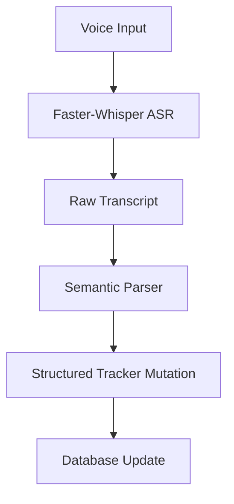
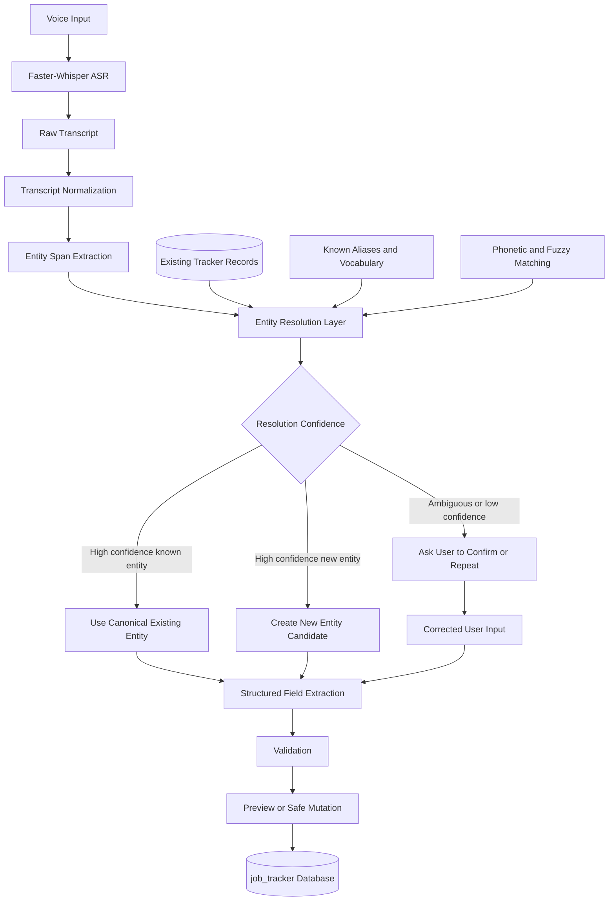

# Engineering Session Report

## 1. Session Objective

This session analyzed the first meaningful Faster-Whisper evaluation run for the voice layer of `job_tracker` and used the results to refine the system architecture.

The immediate goal was to determine whether a locally hosted speech-to-text model could reliably support conversational job-tracker updates while remaining fast enough for an interactive experience.

The tested configuration was:

```text
Backend: faster-whisper
Model: medium
Device: CUDA
Compute type: float16
Beam size: 5
VAD: disabled
Initial vocabulary prompt: enabled
Dataset size: 31 audio samples
Total audio duration: ~604.9 seconds
```

The evaluation produced an important architectural learning:

> Fast offline transcription alone is not sufficient for reliable voice-driven job tracking. The ASR output must be treated as a noisy intermediate representation rather than a trusted command payload.

The session then examined whether a post-ASR entity-resolution layer could improve reliability without preventing the system from handling previously unseen companies and roles.

---

## 2. Starting Context

### Existing project direction

`job_tracker` is intended to become a local-first, conversational assistant for managing job applications through natural voice input.

The desired interaction model is not limited to rigid commands. The user should be able to speak naturally, for example:

```text
I applied to Aiden AI through their LinkedIn post.
I emailed my resume and connected with a few employees.
My next step is to ask for referrals.
```

The assistant should extract structured information and update the tracker safely.

The broader system direction already assumed:

```text
Voice input
    ↓
Speech-to-text
    ↓
Semantic interpretation
    ↓
Structured tracker mutation
```

### Evaluation state at the beginning of the session

A Faster-Whisper batch inference run had been completed using the `medium` model with FP16 CUDA inference, vocabulary prompting enabled, and VAD disabled.

The supplied summary reported:

```text
Total samples: 31
Total audio duration: ~604.9 seconds
Total transcription time: ~33.7 seconds
Overall real-time factor: ~0.056
Mean transcription time per file: ~1.09 seconds
Mean WER: ~39.36%
Mean CER: ~16.53%
```

### Initial assumption being carried forward

The initial working assumption was that an offline ASR model, assisted by a domain vocabulary prompt, might be accurate enough to produce transcripts that could be passed directly into the downstream semantic parser.

The evaluation challenged that assumption.

The primary issue was not latency. It was the reliability of entity-heavy transcription, particularly for company names and short tracker commands.

---

## 3. User Goal Behind the Work

The voice interface is not being developed as a generic dictation feature.

Its purpose is to reduce the mental overhead of maintaining a job-application tracker.

A job seeker may need to remember:

- which companies were contacted,
    
- which applications were submitted,
    
- whether employees were approached for referrals,
    
- whether follow-ups were sent,
    
- which opportunities deserve attention,
    
- and what the next practical action should be.
    

The intended product experience is conversational:

```text
I applied to Coastal Seven Consulting.
I tailored my resume and connected with a few employees.
Keep the priority as medium for now.
```

The assistant should understand the update, identify the relevant application, extract the intended changes, and preserve the information safely.

For this workflow, a transcription that is grammatically plausible but identifies the wrong company is not a minor error. It can update the wrong database row or create incorrect tracker history.

This made the ASR evaluation important at a product-design level, not only at a model-benchmarking level.

---

## 4. Obstacles Encountered

### Obstacle 1: Strong runtime performance masked weak workflow reliability

#### Symptom observed

The model transcribed approximately 605 seconds of audio in about 33.7 seconds, producing an overall real-time factor of roughly `0.056`.

This indicated that the model was processing audio approximately 18 times faster than real time.

At first glance, the configuration appeared highly suitable for a local assistant.

#### What was initially suspected

The main concern before evaluation was whether the `medium` model would be too slow for interactive local usage.

#### Actual root cause

Latency was not the limiting factor.

The actual issue was transcription reliability for domain-specific entities and short commands.

#### Why the issue was non-obvious

A generic ASR benchmark could make the configuration look successful because many transcripts retained semantic meaning. However, `job_tracker` depends heavily on exact entity resolution.

A single incorrect company name can invalidate an otherwise understandable transcript.

#### System boundary involved

```text
Model performance
Speech pipeline
Product reliability
```

#### Resolution status

The speed result was accepted as a positive validation of local inference feasibility.

The reliability problem was not resolved in this session. It triggered an architectural redesign proposal.

---

### Obstacle 2: Rare company names were frequently mutated

#### Symptom observed

The model often converted uncommon company names into plausible but incorrect alternatives.

Examples included:

```text
Abstrabit Technologies
→ Axtrabit Technologies
→ ExtraBit Technologies

JcurveIQ
→ JIT Curb IT

SVS International
→ SPS International

Immverse AI
→ unrelated phrase fragments
```

Additional transcripts showed company names being split, merged, partially dropped, or replaced by normal English words.

#### What was initially suspected

The vocabulary prompt was expected to improve domain recognition enough to preserve important entity names.

#### Actual root cause

The model remained weak at recognizing rare, low-frequency proper nouns, particularly startup names and names whose pronunciations could be mapped to more common token sequences.

Prompt priming improved some outputs but did not guarantee exact entity preservation.

#### Why the issue was non-obvious

The transcript often remained grammatically coherent.

For example, a corrupted company name could still appear inside a sentence that looked structurally correct:

```text
I applied for an AI Engineer internship at JIT Curb IT.
```

The sentence is readable, but operationally incorrect if the intended company is `JcurveIQ`.

#### System boundary involved

```text
Speech pipeline
ASR model performance
Domain vocabulary handling
Entity-resolution boundary
```

#### Resolution status

A post-ASR entity-resolution layer was proposed.

The idea was later refined to avoid treating the tracker database as a closed vocabulary.

---

### Obstacle 3: Short commands were less reliable than longer narratives

#### Symptom observed

Several short commands produced disproportionately poor transcripts.

Examples:

```text
Mark the Supportsoft Technologies application as rejected.
```

became:

```text
Mark, please support soft technology application as we get there.
```

A short priority-update command for Coastal Seven Consulting collapsed into a merged token sequence.

Another short phrase involving a full email address became:

```text
to check whether a full dbl address is available
```

#### What was initially suspected

Short commands might have been expected to work better because they contain fewer words and simpler syntax.

#### Actual root cause

Short commands offer the ASR model less semantic context.

When a rare entity or unusual phrase is misheard, there are fewer surrounding words to help the decoder recover the intended meaning.

Longer narratives naturally contain redundancy and contextual clues.

#### Why the issue was non-obvious

Command-style interfaces are commonly assumed to be easier to implement because the user speaks in a constrained format.

In this case, strict short commands may reduce ASR accuracy even though they simplify downstream parsing.

#### System boundary involved

```text
Speech pipeline
UX design
Semantic parsing strategy
```

#### Resolution status

The session moved toward a conversational narration model rather than a rigid command-only interface.

This is a design direction, not a completed implementation.

---

### Obstacle 4: Raw WER did not accurately represent product usefulness

#### Symptom observed

The evaluation reported:

```text
Mean WER: ~39.36%
Mean CER: ~16.53%
```

These metrics indicated substantial transcription errors.

However, some high-WER outputs remained semantically understandable, while some lower-error outputs could still be unusable if the company name was wrong.

#### What was initially suspected

WER and CER were useful starting metrics for evaluating ASR configurations.

#### Actual root cause

Generic transcription metrics do not reflect the business-critical semantics of the `job_tracker` workflow.

Not every word has equal importance.

For example:

```text
I tailored my resume and applied for the role
```

can tolerate minor wording changes.

But:

```text
Company: JcurveIQ
```

cannot safely tolerate incorrect entity mapping.

#### Why the issue was non-obvious

WER is a standard ASR metric and is useful for comparing models. However, a voice-driven tracker requires task-specific correctness, not merely transcript similarity.

#### System boundary involved

```text
Evaluation methodology
Product validation
Semantic extraction layer
```

#### Resolution status

The session proposed adding entity-aware and workflow-aware metrics.

These were not yet implemented.

---

### Obstacle 5: A naive database-lookup strategy would fail for unseen entities

#### Symptom observed

The initial architectural suggestion was to add post-ASR correction using the existing tracker database.

A concern was raised immediately:

> If ASR relies on a lookup against existing tracker records, what happens when the user applies to a new company or encounters a new role?

#### What was initially suspected

A database-backed correction layer might solve the company-name problem by matching noisy ASR output to known tracker records.

#### Actual root cause

The initial explanation was incomplete.

A tracker-database lookup is useful for recovering known entities, but it cannot be treated as the exclusive source of valid entities.

If forced matching is used, a new company could be silently mapped to an unrelated existing company.

#### Why the issue was non-obvious

Entity correction sounds straightforward when examples involve known companies.

The failure mode only becomes clear when considering real usage: job applications frequently introduce new companies and unfamiliar role titles.

#### System boundary involved

```text
Entity-resolution layer
Database boundary
UX confirmation flow
Safety of tracker mutations
```

#### Resolution status

The design was refined.

The entity-resolution component should support three outcomes:

```text
Known entity
New entity
Ambiguous entity
```

A low-confidence candidate must never be silently forced onto an existing tracker record.

---

### Obstacle 6: Some ASR errors may be unrecoverable after transcription

#### Symptom observed

Certain company names were corrupted so severely that simple fuzzy matching may not recover them.

Example:

```text
Immverse AI
→ in the course of the AI
```

#### What was initially suspected

Fuzzy matching or phonetic similarity could resolve most entity errors.

#### Actual root cause

Some errors lose too much of the original phonetic or lexical structure.

A post-processing layer cannot reliably reconstruct information that is no longer present in the transcript.

#### Why the issue was non-obvious

Many errors look recoverable when manually inspected. However, a production system needs confidence thresholds and safe fallbacks rather than optimistic matching.

#### System boundary involved

```text
Speech pipeline
Entity resolution
UX fallback
```

#### Resolution status

The proposed fallback is to ask the user to repeat or confirm the entity when confidence is low.

No implementation was completed during this session.

---

## 5. Approaches Considered

### Approach 1: Pass raw ASR transcript directly into the job-tracker update pipeline

#### What the approach was

Use the following flow:

```text
Audio
    ↓
Whisper transcript
    ↓
Semantic parser
    ↓
Tracker update
```

#### Why it initially seemed reasonable

The model was fast enough for interactive use.

The initial prompt included relevant vocabulary.

Longer transcripts often retained the overall meaning of the spoken update.

#### Advantages

- Simple architecture.
    
- Low implementation complexity.
    
- Minimal latency overhead.
    
- Easy to prototype.
    

#### Drawbacks and risks

- Incorrect company names could update the wrong application.
    
- Rare roles and company names could be silently corrupted.
    
- Short commands were particularly unreliable.
    
- The downstream parser could receive grammatically plausible but semantically unsafe text.
    

#### Decision

Rejected as a reliable long-term architecture.

It may still be useful as an early prototype path, but it should not be treated as safe for automated mutations.

---

### Approach 2: Improve ASR using vocabulary prompting alone

#### What the approach was

Provide Faster-Whisper with an initial prompt containing:

- known company names,
    
- common AI roles,
    
- job-tracker vocabulary,
    
- application-stage terms,
    
- and common workflow actions.
    

#### Why it initially seemed reasonable

Prompt priming is low-cost and easy to integrate.

It can bias the decoder toward domain-relevant vocabulary without requiring fine-tuning.

#### Advantages

- Minimal architectural complexity.
    
- No separate model required.
    
- No training pipeline required.
    
- Useful for common terms.
    

#### Drawbacks and risks

- Prompting did not guarantee exact recognition of rare company names.
    
- It may help familiar domain phrases while still failing on unseen entities.
    
- It is not a substitute for downstream validation.
    
- The precise improvement cannot be isolated without a prompt-off comparison run.
    

#### Decision

Retained as a useful optimization, but rejected as the sole reliability mechanism.

The session explicitly identified the need to compare prompt-on and prompt-off configurations using the same dataset.

---

### Approach 3: Add a post-ASR correction layer backed by existing tracker records

#### What the approach was

After transcription, compare candidate company names and roles against known entities in the tracker.

Example:

```text
Raw transcript:
I applied to JIT Curb IT

Known tracker entities:
- JcurveIQ
- Rockwell Automation
- Analytics Vidhya

Likely resolution:
JcurveIQ
```

#### Why it initially seemed reasonable

The tracker already contains many of the entities the user is likely to reference again.

The database can provide a personalized vocabulary source.

#### Advantages

- Recoverable errors can be corrected locally.
    
- Existing tracker records provide high-value context.
    
- The approach remains compatible with an offline-first architecture.
    
- It can reduce practical error rates without requiring perfect ASR.
    

#### Drawbacks and risks

- A naive implementation could incorrectly force new entities onto existing records.
    
- Similar-sounding companies could produce ambiguous matches.
    
- Severe ASR corruption may not be recoverable.
    
- Silent autocorrection could be dangerous if confidence handling is weak.
    

#### Decision

Modified and adopted as a design direction.

The refined version is not a simple database lookup. It is a confidence-aware entity-resolution pipeline.

---

### Approach 4: Treat the tracker database as a closed vocabulary

#### What the approach was

Allow the system to resolve company and role names only against previously known tracker records.

#### Why it initially seemed reasonable

It simplifies entity matching and reduces the search space.

#### Advantages

- Easier matching.
    
- Fewer hallucinated entities.
    
- Clear canonical values for existing records.
    

#### Drawbacks and risks

- New companies would fail.
    
- New role titles would fail.
    
- Forced matching could silently corrupt data.
    
- The design does not reflect real job-search behaviour, where new entities appear frequently.
    

#### Decision

Rejected.

The database should help resolve known entities, not restrict valid user input.

---

### Approach 5: Support new, known, and ambiguous entities explicitly

#### What the approach was

Introduce three entity-resolution outcomes:

```text
High-confidence known entity
→ normalize to canonical tracker value

High-confidence new entity
→ preserve and create a candidate new entity

Ambiguous or low-confidence entity
→ request confirmation or repetition
```

#### Why it initially seemed reasonable

It balances automation with safety.

It uses existing tracker context without preventing new applications from being added.

#### Advantages

- Compatible with real-world tracker growth.
    
- Avoids forced incorrect matches.
    
- Supports unseen companies and role names.
    
- Preserves a conversational UX.
    
- Makes confidence handling explicit.
    

#### Drawbacks and risks

- Requires careful confidence calibration.
    
- Adds UX complexity.
    
- Requires entity extraction before database mutation.
    
- Needs a repeat-or-confirm flow for uncertain cases.
    

#### Decision

Adopted as the preferred architecture direction.

Implementation remains pending.

---

### Approach 6: Prefer natural narratives over strict short commands

#### What the approach was

Encourage users to speak naturally instead of memorizing terse commands.

Example:

```text
I applied to Aiden AI through their LinkedIn post.
I sent my resume by email and connected with a few employees.
My next action is to ask for referrals.
```

rather than:

```text
Set Aiden AI stage to applied, networked, followed up, engaged.
```

#### Why it initially seemed reasonable

The evaluation showed that longer narratives often preserved more useful meaning than short commands.

#### Advantages

- Better aligned with ASR strengths.
    
- More natural user experience.
    
- More semantic redundancy.
    
- May improve downstream extraction.
    
- Reduces the burden of remembering syntax.
    

#### Drawbacks and risks

- Downstream semantic parsing becomes more complex.
    
- Narratives may include irrelevant details.
    
- The system must distinguish explicit updates from general commentary.
    
- The claim still needs dedicated evaluation across more samples.
    

#### Decision

Adopted as a product direction, subject to further validation.

Rigid commands can remain supported, but they should not be the only interaction style.

---

### Approach 7: Evaluate success using workflow-specific metrics

#### What the approach was

Add task-oriented metrics alongside WER and CER.

Proposed metrics:

```text
Company-name accuracy
Role-name accuracy
Priority extraction accuracy
Application-stage accuracy
Next-action extraction accuracy
Hallucination rate
Structured mutation accuracy
Confirmation-trigger precision
```

#### Why it initially seemed reasonable

The downstream product does not require a perfect transcript. It requires a correct and safe tracker update.

#### Advantages

- Better aligned with actual user value.
    
- Makes ASR comparison more meaningful.
    
- Exposes entity-critical failures.
    
- Supports future architectural experiments.
    

#### Drawbacks and risks

- Requires annotation effort.
    
- Some metrics need precise definitions.
    
- Structured mutation accuracy depends on downstream parser behaviour, not ASR alone.
    

#### Decision

Adopted as a required next step.

Not implemented during this session.

---

## 6. Decisions Made

### Decision 1: Treat ASR output as a noisy intermediate representation

#### Final decision

Do not treat the raw transcript as a trusted command payload.

#### Reasoning

The ASR model is fast enough for local interaction but unreliable for rare entities.

A transcript can sound reasonable while containing the wrong company name.

#### Rejected alternative

```text
Raw transcript → direct semantic mutation
```

#### Architectural status

Stable design principle.

---

### Decision 2: Add an entity-resolution boundary after transcription

#### Final decision

Introduce a post-ASR resolution layer before structured database mutation.

#### Reasoning

Known tracker records can recover many ASR errors.

However, resolution must remain confidence-aware and must preserve support for new entities.

#### Rejected alternative

Use only raw ASR output or use a forced lookup against existing database values.

#### Architectural status

Intended to become a stable architectural component.

Implementation remains pending.

---

### Decision 3: Do not treat the tracker database as a closed vocabulary

#### Final decision

Known records are matching candidates, not the complete set of valid entities.

#### Reasoning

New companies and roles appear continuously during a job search.

A closed-vocabulary design would fail in normal usage.

#### Rejected alternative

Force every company or role to resolve to an existing record.

#### Architectural status

Stable design principle.

---

### Decision 4: Use confidence bands for entity handling

#### Final decision

Use three resolution paths:

```text
High confidence
→ apply canonical resolution

Medium confidence
→ request confirmation

Low confidence
→ ask the user to repeat, spell, or manually correct the entity
```

#### Reasoning

Silent autocorrection is unsafe for database mutations.

Some ASR errors are recoverable; others are not.

#### Rejected alternative

Always autocorrect to the nearest candidate.

#### Architectural status

Stable principle, with thresholds still requiring experimentation.

---

### Decision 5: Optimize for conversational narration, not only command syntax

#### Final decision

The voice assistant should accept natural spoken updates.

Short commands may remain supported, but the primary experience should not require memorized phrasing.

#### Reasoning

Longer narratives frequently retained more usable context than terse commands.

This interaction style also fits the broader goal of a conversational assistant.

#### Rejected alternative

Design the voice UX primarily around rigid commands.

#### Architectural status

Product direction requiring further evaluation.

---

### Decision 6: Expand evaluation beyond WER and CER

#### Final decision

Use entity-aware and workflow-aware metrics in future evaluations.

#### Reasoning

A generic transcript metric does not capture whether the assistant understood and safely applied the intended tracker mutation.

#### Rejected alternative

Compare ASR configurations using only WER and CER.

#### Architectural status

Required evaluation principle.

---

## 7. Architecture Evolution

### Previous design

The initial conceptual flow was:



### Limitation in the previous design

The transcript was implicitly treated as reliable enough for downstream interpretation.

This fails when the model mutates a company name into a plausible but incorrect phrase.

For example:

```text
JcurveIQ
→ JIT Curb IT
```

The semantic parser may still produce a structurally valid mutation, but the entity can be wrong.

### Updated design

The revised architecture introduces a distinct entity-resolution boundary:



### New abstraction introduced

The proposed new abstraction is an **entity-resolution layer**.

Its responsibility is not transcription.

Its responsibility is to determine whether an entity candidate should be interpreted as:

```text
1. an existing tracker record,
2. a new entity,
3. or an ambiguous entity requiring user confirmation.
```

### Important boundary clarification

The database lookup does not happen before transcription.

The ASR model still produces an initial transcript first.

The tracker database is then used as contextual evidence for post-ASR recovery.

### Before-and-after data flow

#### Before

```text
Audio
→ transcript
→ parser
→ database mutation
```

#### After

```text
Audio
→ transcript
→ entity extraction
→ known/new/ambiguous resolution
→ structured parsing
→ validation
→ confirmation when required
→ database mutation
```

---

## 8. Implementation Progress

### Completed during this session

No production code changes were implemented during this session.

The completed work consisted of:

1. Reviewing the Faster-Whisper evaluation summary.
    
2. Analyzing the 31-sample inference CSV.
    
3. Identifying category-level ASR behaviour.
    
4. Distinguishing runtime feasibility from workflow reliability.
    
5. Refining the proposed system architecture.
    
6. Rejecting the assumption that database-backed correction should behave like a closed vocabulary.
    
7. Defining the need for confidence-based resolution paths.
    

### Existing verified experiment configuration

```text
Run label:
fw_medium_fp16_vad_off_prompt_on_vocab_v1

Model:
medium

Backend:
faster-whisper

Device:
cuda

Compute type:
float16

Beam size:
5

VAD:
disabled

Initial prompt:
enabled

Prompt file:
evaluation/prompts/job_tracker_vocab_v1.txt
```

### Planned implementation

The following components were discussed but not implemented:

```text
Transcript normalization layer
Entity span extraction
Known-entity lookup
Fuzzy string matching
Phonetic matching
Alias handling
Confidence scoring
New-entity candidate creation
Ambiguity confirmation flow
Entity-aware evaluation metrics
Structured mutation accuracy evaluation
```

### Unknown or unverified

The session did not establish:

- the exact fuzzy-matching algorithm,
    
- the exact phonetic-matching algorithm,
    
- the confidence thresholds,
    
- whether the semantic parser already has partial entity handling,
    
- the final UI format for confirmation,
    
- the exact behaviour for auto-creating new companies,
    
- or whether role normalization should use the same resolution path as company matching.
    

These remain design questions.

---

## 9. Validation and Evidence

### Performance evidence

The shared summary reported:

```text
Total samples: 31
Total audio duration: ~604.9 seconds
Total transcription time: ~33.7 seconds
Overall real-time factor: ~0.0557
Mean file RTF including first request: ~0.0583
Mean file RTF excluding first request: ~0.0580
Mean transcription time including first request: ~1.086 seconds
Mean transcription time excluding first request: ~1.093 seconds
Mean WER: ~0.3936
Mean CER: ~0.1653
```

### Evidence that latency is acceptable

Examples from the inference CSV included:

```text
~75.2 seconds of audio
→ ~4.34 seconds transcription time

~45.1 seconds of audio
→ ~1.58 seconds transcription time

~24.4 seconds of audio
→ ~0.95 seconds transcription time
```

This supports the conclusion that local inference speed is sufficient for further prototyping.

### Evidence that common technical phrases can work well

A role-focused utterance was transcribed correctly:

```text
I applied for the generative AI engineer internship at analytics Vidhya.
```

with:

```text
WER: 0.0
CER: 0.0
```

Another medium narrative about Aiden AI achieved very low error:

```text
WER: ~0.023
CER: ~0.004
```

### Evidence of rare-entity failures

Examples from company-name and difficult-vocabulary samples included:

```text
Bootcoding Private Limited
→ BootcodingPriorityLimited

JcurveIQ
→ JIT Curb IT

SVS International
→ SPS International

Abstrabit Technologies
→ Axtrabit Technologies
→ ExtraBit Technologies

Immverse AI
→ unrelated phrase fragments
```

### Evidence of short-command failures

Examples included:

```text
Mark the Supportsoft Technologies application as rejected.
→ Mark, please support soft technology application as we get there.
```

and:

```text
Set the priority of Coastal Seven Consulting application to medium.
→ setthepriorityofcoastalseventhconsultingapplicationtomedium
```

### Evidence that longer narratives remain promising

Several medium and long narratives preserved enough meaning to remain useful for structured extraction, even when individual words were imperfect.

This supports further investigation into narrative-style voice input.

### Remaining edge cases

The current experiment leaves several unresolved cases:

- severe entity corruption,
    
- closely related company names,
    
- new company creation,
    
- new role creation,
    
- alias handling,
    
- mixed known and unknown entities,
    
- confirmation fatigue,
    
- and whether VAD changes the behaviour of long pauses or short commands.
    

---

## 10. Lessons Learned

### Lesson 1: Offline feasibility and workflow safety are separate questions

The experiment successfully validated local inference speed.

It did not validate safe direct automation.

A system can be fast enough for real-time use while still being too unreliable for unattended database mutations.

---

### Lesson 2: ASR should not be the final authority

The transcript is not the source of truth.

It is evidence that must be interpreted, normalized, and validated.

This is particularly important in entity-heavy applications.

---

### Lesson 3: Rare entities matter more than average transcript quality

Company names are disproportionately important in `job_tracker`.

A small error in a common sentence may be harmless.

A small error in a company name can corrupt the workflow.

Evaluation must reflect this asymmetry.

---

### Lesson 4: Domain prompting is useful but insufficient

Vocabulary prompting appears promising, but it does not eliminate rare-entity errors.

It should be combined with downstream resolution rather than treated as the final fix.

---

### Lesson 5: Personalized databases can improve ASR workflows without restricting them

Existing tracker records are valuable because they provide user-specific context.

However, they should act as candidate evidence, not as a closed vocabulary.

The architecture must preserve support for unseen entities.

---

### Lesson 6: Safe automation requires explicit uncertainty handling

A nearest-match strategy is not enough.

The system needs confidence thresholds and a user-confirmation path.

It is better to ask a brief clarification than to silently modify the wrong application.

---

### Lesson 7: Natural conversation may outperform terse commands

Short commands are not automatically easier for speech models.

Natural narration provides semantic redundancy and may be more robust.

This finding supports the broader product vision: a conversational assistant rather than a voice-operated form.

---

### Lesson 8: Product-level evaluation must follow the real workflow

WER and CER are useful diagnostics, but they are not sufficient success metrics.

The key question is:

> Did the assistant understand the intended application update and handle uncertainty safely?

---

## 11. Open Questions and Deferred Work

### Required next steps

#### 1. Run a prompt-off comparison

Use the same:

```text
model
dataset
device
compute type
beam size
VAD setting
```

but disable the initial vocabulary prompt.

This will isolate the actual effect of prompt priming.

#### 2. Run a VAD-on comparison

Compare VAD enabled and disabled using the same dataset.

This is especially important for:

- long pauses,
    
- short commands,
    
- filler words,
    
- and incomplete sentence capture.
    

#### 3. Add entity-level metrics

At minimum:

```text
Company-name accuracy
Role-name accuracy
Important-field accuracy
Hallucination detection
Speech-after-pause capture
```

The current CSV already appears to contain placeholders for several of these fields, but they were not populated in the supplied run.

#### 4. Define entity-resolution contracts

The resolution layer needs explicit outputs such as:

```json
{
  "raw_candidate": "JIT Curb IT",
  "canonical_value": "JcurveIQ",
  "resolution_type": "existing_entity",
  "confidence": 0.92,
  "requires_confirmation": false
}
```

For unseen companies:

```json
{
  "raw_candidate": "NeuralForge Labs",
  "canonical_value": "NeuralForge Labs",
  "resolution_type": "new_entity_candidate",
  "confidence": 0.84,
  "requires_confirmation": true
}
```

#### 5. Define confirmation UX

The system needs a lightweight way to ask:

```text
Did you mean JcurveIQ?
```

or:

```text
I could not confidently identify the company.
Please repeat only the company name.
```

#### 6. Evaluate structured extraction separately

The future benchmark should distinguish:

```text
ASR accuracy
Entity-resolution accuracy
Semantic extraction accuracy
Final safe-mutation accuracy
```

---

### Optional enhancements

These may be useful after the basic entity-resolution path is validated:

```text
Alias dictionary
Phonetic matching
User-corrected vocabulary memory
Role-title normalization
Dynamic prompt generation from current tracker records
Manual spell-out mode for difficult entities
UI-based edit and confirm chips
```

---

### Ideas explicitly rejected for now

#### Treating the database as a closed vocabulary

Rejected because new companies and roles must remain valid.

#### Silently selecting the nearest database match

Rejected because incorrect autocorrection can mutate the wrong tracker record.

#### Relying on WER alone

Rejected because it does not measure workflow correctness.

#### Assuming short commands are inherently more reliable

Rejected based on observed results.

---

### Questions requiring further investigation

1. How should confidence thresholds be calibrated?
    
2. Should company names and role names use separate matching strategies?
    
3. Should new entities be auto-created or always confirmed first?
    
4. Can corrected entities be fed back into a user-specific vocabulary store?
    
5. How much does the initial vocabulary prompt actually improve accuracy?
    
6. Does VAD improve short-command handling or damage long-pause capture?
    
7. Should the realtime pipeline dynamically inject known company names into the prompt?
    
8. At what point would fine-tuning become worthwhile?
    
9. How should the system behave when two existing companies have similar names?
    
10. How frequently would confirmation prompts appear during realistic usage?
    

---

## 12. Significance in the Overall Project Journey

This session was primarily an **experiment-driven architectural correction**.

The Faster-Whisper run validated an important part of the project:

> A local GPU can transcribe job-tracking audio fast enough for an interactive assistant.

However, the experiment also ruled out an oversimplified architecture:

```text
Voice input
→ raw ASR transcript
→ direct tracker mutation
```

The session established a more robust principle:

```text
Reliable voice automation does not require perfect transcription.
It requires a system that detects uncertainty, resolves recoverable errors,
and prevents unsafe mutations when the transcript is ambiguous.
```

This moved the project forward from basic ASR benchmarking toward a realistic production-oriented speech architecture.

It also reinforced the intended product identity of `job_tracker`:

- local-first,
    
- conversational,
    
- domain-aware,
    
- safe by default,
    
- and capable of handling both known and new job opportunities.
    

---

## 13. Compact Timeline Entry

**Milestone:** Evaluated Faster-Whisper Medium FP16 with vocabulary prompting and refined the voice-pipeline architecture.

**Problem:** Local ASR was fast, but raw transcripts were unreliable for rare company names and short tracker commands.

**Key obstacle:** A transcript could remain grammatically plausible while identifying the wrong company, making direct database mutation unsafe. A naive database lookup would also fail for unseen companies and roles.

**Decision:** Treat ASR output as a noisy intermediate representation. Add a confidence-aware entity-resolution layer that distinguishes known entities, new entities, and ambiguous entities requiring confirmation.

**Outcome:** Local inference feasibility was validated at approximately 18× realtime speed. The session ruled out raw transcript-to-mutation flow as a safe final architecture and identified entity-aware evaluation as the next priority.

**Next step:** Run prompt-off and VAD-on comparison experiments, populate entity-level metrics, and define the entity-resolution contract before implementation.