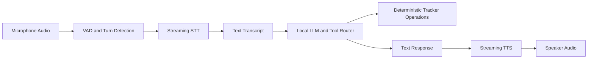
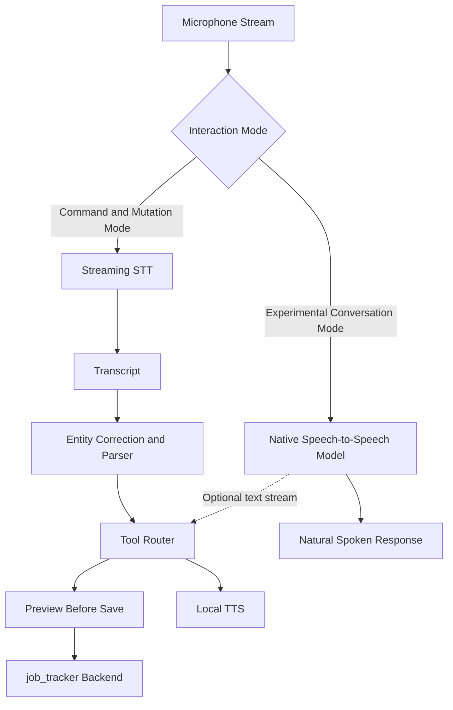
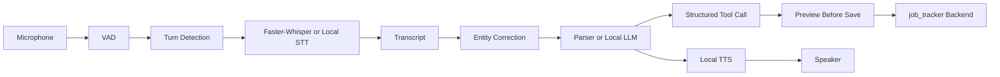
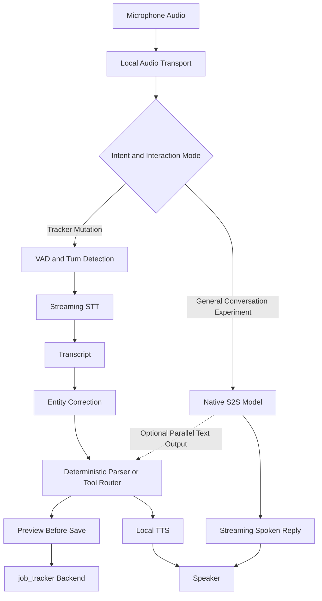

# Engineering Session Report

## 1. Session Objective

The objective of this session was to evaluate whether newly emerging **speech-to-speech models** could improve the voice interface of the local-first `job_tracker` assistant.

The discussion focused on answering four engineering questions:

1. What does “speech-to-speech” actually mean in current open-source systems?
    
2. How does native speech-to-speech differ from the existing modular voice architecture based on speech recognition, text reasoning and text-to-speech synthesis?
    
3. Which open-source speech-to-speech models could run entirely locally, without cloud dependencies?
    
4. Should the existing `job_tracker` voice pipeline be replaced, augmented or left unchanged?
    

The session did not attempt to implement a model integration. Its purpose was to identify a realistic experimentation strategy while preserving the reliability requirements of a transactional job-tracking assistant.

---

## 2. Starting Context

### Existing project direction

At the start of the session, the `job_tracker` project was already being designed as a **local-first, voice-driven conversational assistant**.

The assistant was intended to support natural-language interactions such as:

```text
Add Bootcoding Private Limited as an internship application
for the AI Engineer role and set the priority to medium.
```

The system needed to convert this request into structured tracker changes such as:

```json
{
  "company": "Bootcoding Private Limited",
  "role": "AI Engineer",
  "type": "internship",
  "priority": "MEDIUM"
}
```

The existing architectural direction was a modular pipeline:



The broader project already emphasized:

- local execution where possible,
    
- no cloud dependency for the final assistant,
    
- deterministic tracker updates,
    
- preview-before-save behaviour,
    
- auditable transcripts,
    
- structured tool calls,
    
- conversational interaction rather than rigid command syntax.
    

### Trigger for the discussion

The user noticed that newer models were being described as **speech-to-speech models** and asked whether they were relevant to the project, especially in fully offline open-source form.

The initial uncertainty was not caused by a bug. It was an architectural question:

> Could a native speech-to-speech model simplify the pipeline or provide a more natural assistant experience than the current STT → LLM → TTS design?

### Assumptions being carried forward

Several assumptions were implicitly present at the beginning:

1. A newer speech-to-speech model might reduce latency by removing separate STT and TTS stages.
    
2. A native model might make the assistant feel more natural and conversational.
    
3. Open-source versions might already be usable locally.
    
4. A speech-to-speech model might replace the existing voice stack.
    

The discussion refined these assumptions. Some were partially correct, while others were too optimistic for the specific requirements of `job_tracker`.

---

## 3. User Goal Behind the Work

The user is not building a generic voice chatbot. The goal is a **local-first conversational job-tracking assistant** that can understand natural spoken requests while safely updating a structured tracker database.

The ideal interaction should feel fluid:

```text
User:
Add Neilsoft as an AI Engineer application.

Assistant:
I found the company and role. Should I save this application?

User:
Yes, and mark it high priority.

Assistant:
Done.
```

The assistant should also support higher-level queries:

```text
Summarize my progress with Neilsoft.

Which application should I prioritize next?

What should I do next for this company?
```

Speech-to-speech models are relevant because they may improve:

- perceived response speed,
    
- natural conversational timing,
    
- interruption handling,
    
- emotional nuance,
    
- fluid back-and-forth interaction,
    
- the experience of speaking to the assistant as a technical or career-planning companion.
    

However, the product cannot sacrifice the correctness of database mutations merely to sound more natural.

The session therefore explored a central product trade-off:

> How can the assistant become more conversational without weakening deterministic tracker operations?

---

## 4. Obstacles Encountered

This session did not include code debugging. The obstacles were architectural and model-selection problems.

### Obstacle 1: The term “speech-to-speech” is ambiguous

#### Symptom observed

The phrase “speech-to-speech model” sounds as though it refers to a single unified architecture, but it is used for multiple kinds of systems.

#### Initial suspicion

It was initially reasonable to assume that speech-to-speech always meant a model directly consuming speech and directly producing speech without separate STT or TTS components.

#### Actual root cause

The term is used for at least two distinct categories:

1. **Modular speech pipelines**
    
    ```text
    VAD → STT → text LLM → TTS
    ```
    
2. **Native audio-token or omni-modal models**
    
    ```text
    speech tokens → multimodal language model → speech tokens
    ```
    

Some projects labelled “speech-to-speech” are still modular orchestration frameworks. Others use native speech token generation.

#### Why it was non-obvious

Both categories can expose the same visible user experience: the user speaks and the assistant responds aloud. The difference becomes visible only when examining internal architecture, latency characteristics, transcript availability and integration boundaries.

#### System boundary involved

- speech pipeline,
    
- model architecture,
    
- infrastructure.
    

#### Resolution

The discussion established a strict distinction between:

- **cascaded local voice systems**, and
    
- **native speech-language models**.
    

This distinction became the basis for evaluating models and choosing an experiment strategy.

---

### Obstacle 2: Native speech interaction does not automatically guarantee structured reliability

#### Symptom observed

A native speech-to-speech model may respond naturally, but the `job_tracker` system needs exact structured actions.

For example:

```text
Add Bootcoding Private Limited as an internship application.
```

must reliably produce:

```json
{
  "action": "create_application",
  "company": "Bootcoding Private Limited",
  "type": "internship"
}
```

#### Initial suspicion

It could be tempting to assume that a newer end-to-end model would automatically improve every part of the voice workflow, including entity recognition and tool calling.

#### Actual root cause

Natural spoken output and reliable structured database mutations are different optimization goals.

A native model may improve:

- speech naturalness,
    
- interruption handling,
    
- conversational timing,
    
- tone awareness.
    

It does not inherently guarantee:

- exact company-name transcription,
    
- deterministic tool-call structure,
    
- stable JSON generation,
    
- correction-friendly intermediate output,
    
- database-safe state transitions,
    
- auditable mutation history.
    

#### Why it was non-obvious

The same model can appear more intelligent during casual dialogue while still being less suitable for transactional commands. A natural voice response can hide uncertainty or misheard entities.

#### System boundary involved

- speech pipeline,
    
- LLM tool-calling contract,
    
- backend mutation safety,
    
- UX.
    

#### Resolution

The discussion rejected the idea of immediately replacing the deterministic command path.

The planned principle became:

> Use natural speech models for conversation experiments, but keep a deterministic text-visible path for database mutations until reliability is proven.

---

### Obstacle 3: Open weights do not imply practical local deployment

#### Symptom observed

Several open-source speech-to-speech or omni-modal models exist, but many are too large for the available hardware.

#### Initial suspicion

Because the models are open source or openly released, it might appear that they are suitable for entirely local laptop execution.

#### Actual root cause

Voice-capable models often combine multiple expensive components:

- audio encoder,
    
- speech tokenizer or codec,
    
- language model,
    
- streaming decoder,
    
- speech generator,
    
- KV cache,
    
- optional vision encoder,
    
- concurrent input and output processing.
    

As a result, VRAM requirements can be much larger than parameter counts alone suggest.

#### Why it was non-obvious

A model described as “3B”, “9B” or mixture-of-experts may still require significantly more memory during real-time inference than expected from the core model size.

#### System boundary involved

- infrastructure,
    
- GPU memory,
    
- model performance,
    
- runtime feasibility.
    

#### Resolution

The discussion separated models into:

1. **Laptop-feasible experiments**
    
    - LLaMA-Omni2 0.5B
        
    - LLaMA-Omni2 1.5B
        
    - Mini-Omni
        
2. **Potentially useful but hardware-uncertain experiments**
    
    - Qwen2.5-Omni 3B
        
3. **Architecture references rather than laptop deployment targets**
    
    - GLM-4-Voice 9B
        
    - Moshi
        
    - MiniCPM-o 4.5
        
    - Qwen3-Omni 30B-A3B
        

---

### Obstacle 4: Existing speech recognition errors remain relevant

#### Symptom observed

Earlier speech experiments had shown failures with job-specific entities. One example referenced during the discussion was:

```text
Bootcoding Private Limited
→ boot code in private limit
```

#### Initial suspicion

A native speech-language model might solve these errors simply because it understands speech more holistically.

#### Actual root cause

Company names, role titles and uncommon entities remain difficult recognition targets. Native speech processing may help in some cases, but it does not remove the need for:

- entity dictionaries,
    
- hotwords,
    
- correction layers,
    
- transcript visibility,
    
- manual override,
    
- tracker-aware validation.
    

#### Why it was non-obvious

A model capable of natural dialogue may still fail on rare named entities. Generic conversational quality and domain-specific transcription accuracy are not equivalent.

#### System boundary involved

- speech pipeline,
    
- entity extraction,
    
- model performance,
    
- UX.
    

#### Resolution

The session preserved the importance of the existing correction-friendly architecture.

Native speech-to-speech testing was proposed as a measured experiment rather than a shortcut around entity handling.

---

### Obstacle 5: Full-duplex conversation introduces new complexity

#### Symptom observed

Models such as Moshi and MiniCPM-o advertise the ability to listen while speaking and handle interruptions.

#### Initial suspicion

Full-duplex support initially appears to be an unqualified improvement over turn-based interaction.

#### Actual root cause

Full-duplex systems introduce additional engineering questions:

- When should assistant speech stop?
    
- How quickly should interruption be detected?
    
- Should partial user speech cancel a pending tool action?
    
- What happens if the user corrects a company name mid-response?
    
- Should the assistant speak while a database preview is still unresolved?
    
- How should conflicting simultaneous audio streams be logged?
    

#### Why it was non-obvious

A full-duplex demo can sound natural, but transactional systems require clear state transitions. Interruptibility increases UX quality while also increasing orchestration complexity.

#### System boundary involved

- speech pipeline,
    
- UX,
    
- tool-calling state machine,
    
- infrastructure.
    

#### Resolution

Full-duplex behaviour was treated as a future experiment, not an immediate requirement for tracker mutation flows.

---

## 5. Approaches Considered

### Approach 1: Keep the existing modular voice pipeline

#### Description

Continue using a cascaded system:

```text
Microphone
→ VAD and turn detection
→ streaming STT
→ text transcript
→ deterministic parser or local LLM
→ preview-before-save
→ backend mutation
→ local TTS
```

#### Why it seemed reasonable

This architecture aligns well with the existing `job_tracker` design philosophy:

- observable state,
    
- debuggable intermediate representations,
    
- explicit transcript,
    
- deterministic backend changes,
    
- replaceable components.
    

#### Advantages

- Easy to inspect transcripts.
    
- Easier to debug entity recognition failures.
    
- Clear separation between speech understanding and backend mutations.
    
- Existing tracker-safe workflows can remain unchanged.
    
- STT, LLM and TTS can be benchmarked independently.
    
- Suitable for preview-before-save behaviour.
    
- Compatible with future hotword and correction layers.
    

#### Drawbacks

- Latency accumulates across sequential stages.
    
- Speech responses may feel less fluid.
    
- Tone and hesitation can be lost in the text representation.
    
- Full-duplex interaction is harder to achieve naturally.
    
- More components need orchestration.
    

#### Decision

**Adopted as the stable product path.**

The modular pipeline remains the reliable baseline for daily tracker usage.

---

### Approach 2: Replace the entire pipeline with a native speech-to-speech model

#### Description

Use a single native speech-language model to consume speech and directly produce speech.

```text
User speech
→ audio tokenizer
→ speech-language model
→ generated audio tokens
→ decoder
→ assistant speech
```

#### Why it initially seemed reasonable

This approach could reduce perceived latency and make the assistant feel more like a real-time conversational companion.

#### Advantages

- Potentially faster time-to-first-audio.
    
- More natural prosody.
    
- Better retention of tone, pauses and speaking style.
    
- Possible full-duplex conversation.
    
- Fewer visibly separate stages.
    

#### Drawbacks

- Tool-call reliability is uncertain.
    
- Transcript visibility may be weaker.
    
- Entity errors may become harder to debug.
    
- Database mutation safety becomes harder to reason about.
    
- Hardware requirements may exceed the user’s laptop.
    
- Smaller open models may have limited quality.
    
- Model integration maturity varies widely.
    
- Benchmarking becomes more complex.
    

#### Decision

**Rejected as an immediate replacement strategy.**

The approach remains interesting for experimentation, but it was not considered safe enough to become the default transactional architecture.

---

### Approach 3: Introduce a hybrid conversational-control architecture

#### Description

Keep deterministic tracker operations on the existing modular path while adding a native speech-to-speech model as a parallel experimental mode.



#### Why it seemed reasonable

It preserves the reliability of the existing system while allowing exploration of newer models.

#### Advantages

- Safe migration path.
    
- Clear A/B comparison.
    
- Native S2S can be evaluated without destabilizing the product.
    
- Database writes remain deterministic.
    
- The assistant can become more natural for non-mutating conversation.
    
- Optional text output from a native model can later be routed into tool handling.
    

#### Drawbacks

- Two interaction paths increase architectural complexity.
    
- User experience needs clear state handling.
    
- It may be unclear when to choose native mode versus command mode.
    
- Shared context between modes must be designed carefully.
    
- Voice switching or response-style inconsistency may occur.
    

#### Decision

**Adopted as the recommended future architecture.**

This was the primary architectural outcome of the session.

---

### Approach 4: Start experimentation with smaller native models

#### Description

Evaluate small models first:

```text
LLaMA-Omni2-0.5B
LLaMA-Omni2-1.5B
Mini-Omni
```

Potentially test:

```text
Qwen2.5-Omni-3B
```

only after initial feasibility checks.

#### Why it seemed reasonable

The available laptop GPU is constrained. A feasibility experiment should answer architectural questions before attempting large models.

#### Advantages

- More likely to run locally.
    
- Faster model-loading experiments.
    
- Lower risk of spending time on unusable models.
    
- Suitable for measuring basic speech latency and transcript behaviour.
    
- Useful for validating the integration boundary.
    

#### Drawbacks

- Small models may underperform on conversation quality.
    
- Results may not represent the potential of larger models.
    
- Poor quality could lead to prematurely dismissing the architecture.
    
- Some repositories may still require non-trivial setup.
    

#### Decision

**Adopted as the first experiment path.**

The session recommended starting with LLaMA-Omni2 0.5B, then 1.5B, then Mini-Omni.

---

### Approach 5: Use larger models as immediate deployment targets

#### Models considered

- Moshi
    
- GLM-4-Voice 9B
    
- MiniCPM-o 4.5
    
- Qwen3-Omni 30B-A3B
    

#### Why they seemed reasonable

These models demonstrate advanced capabilities:

- full-duplex speech,
    
- interruption handling,
    
- omni-modal input,
    
- speech-token generation,
    
- better naturalness,
    
- simultaneous text and speech output.
    

#### Advantages

- Useful architectural references.
    
- Demonstrate the direction of modern voice-agent systems.
    
- Potentially stronger conversational quality.
    
- Valuable for long-term planning.
    

#### Drawbacks

- VRAM requirements are too high for the current laptop.
    
- Some official implementations target workstation-class GPUs.
    
- Real-time performance cannot be assumed locally.
    
- Integration complexity is significantly higher.
    
- Running them would not be a sensible first milestone.
    

#### Decision

**Deferred.**

These models should be studied conceptually, but not treated as immediate implementation candidates.

---

## 6. Decisions Made

### Decision 1: Preserve the modular pipeline as the stable architecture

#### Final decision

Continue treating the STT → transcript → parser or LLM → tool call → preview → backend → TTS pipeline as the production-oriented architecture.

#### Reasoning

The `job_tracker` assistant performs structured mutations. Reliability, auditability and correction handling are more important than conversational naturalness alone.

#### Rejected alternative

Immediate replacement with a native speech-to-speech model.

#### Stability

**Stable architectural principle**, unless future experiments demonstrate equivalent or better reliability.

---

### Decision 2: Treat native speech-to-speech as an experimental branch

#### Final decision

Add a separate experimentation track for native S2S models.

#### Reasoning

The technology is relevant and may eventually improve:

- latency,
    
- turn-taking,
    
- naturalness,
    
- interruption handling,
    
- conversational quality.
    

However, it should first be benchmarked independently.

#### Rejected alternative

Ignoring native S2S completely because it is not yet production-ready.

#### Stability

**Temporary experiment strategy**, with the possibility of becoming a long-term hybrid design.

---

### Decision 3: Use a hybrid conversational-control model

#### Final decision

Separate conversational interaction from reliable tracker mutation paths.

#### Reasoning

Different user intents have different risk profiles.

Examples:

```text
What is MCP?
```

is low risk.

```text
Mark Neilsoft as rejected and save it.
```

is high risk.

The low-risk path can tolerate more generative flexibility. The high-risk path requires structured validation and preview-before-save.

#### Rejected alternative

Use one undifferentiated voice pipeline for all interactions.

#### Stability

**Likely stable architectural principle.**

---

### Decision 4: Start with small local models

#### Final decision

Prioritize:

```text
LLaMA-Omni2-0.5B
LLaMA-Omni2-1.5B
Mini-Omni
```

Evaluate Qwen2.5-Omni 3B only after feasibility testing.

#### Reasoning

The goal of the first experiment is not maximum quality. It is to answer:

- Can the model load locally?
    
- Can it stream audio?
    
- What is time-to-first-audio?
    
- Is text output available?
    
- Can company names be handled?
    
- Can its output connect to the existing tracker flow?
    

#### Rejected alternative

Begin with Moshi, MiniCPM-o or Qwen3-Omni.

#### Stability

**Temporary experimental priority.**

---

### Decision 5: Retain transcript visibility for transactional actions

#### Final decision

Database mutations should continue to rely on a visible or inspectable text representation until native models prove reliable.

#### Reasoning

The transcript is useful for:

- debugging,
    
- correction,
    
- entity normalization,
    
- tool-call validation,
    
- user confirmation,
    
- auditability.
    

#### Rejected alternative

Allow opaque audio-to-audio reasoning to mutate the tracker directly.

#### Stability

**Stable safety and debugging principle.**

---

## 7. Architecture Evolution

### Previous design

Before this discussion, the assumed architecture was fully modular:



### Limitation in the previous design

The modular architecture is reliable but may have limitations:

- sequential latency,
    
- robotic interaction,
    
- delayed responses,
    
- limited prosody preservation,
    
- weaker interruption handling,
    
- text bottleneck between speech input and speech output.
    

### Updated design

The session did not replace the existing flow. Instead, it proposed a **parallel experimental speech-to-speech path**.



### New conceptual abstractions introduced

#### 1. Interaction mode boundary

The system should distinguish between:

- mutation-sensitive commands,
    
- read-only tracker queries,
    
- open-ended conversation,
    
- experimental natural dialogue.
    

#### 2. Conversational-control split

Natural voice interaction and deterministic backend operations should not be treated as the same problem.

#### 3. Native S2S experiment adapter

A future adapter could expose:

```text
audio input stream
text transcript or semantic output
generated audio stream
interruption events
latency metrics
```

This adapter would make native models testable without changing backend contracts.

#### 4. Evaluation boundary

Native models should first be evaluated as independent speech systems before being trusted with tool execution.

---

## 8. Implementation Progress

### Completed implementation

No code changes were made during this session.

No backend modules, frontend components, database schemas, APIs or tests were modified.

No model repository was cloned or executed during the discussion.

No benchmark results were produced.

### Planned work

The session produced a concrete experimental plan.

#### Candidate models for local testing

First priority:

```text
LLaMA-Omni2-0.5B
LLaMA-Omni2-1.5B
Mini-Omni
```

Second-stage experiment:

```text
Qwen2.5-Omni-3B
```

Architecture-study references:

```text
Moshi
GLM-4-Voice
MiniCPM-o 4.5
Qwen3-Omni
```

#### Baseline architecture to retain

```text
LiveKit self-hosted or local audio transport
VAD and semantic turn detection
Faster-Whisper initially
Local LLM
Existing deterministic parser
Existing job_tracker backend
Local TTS
```

#### Suggested future STT and TTS comparisons

Potential STT comparisons:

```text
Faster-Whisper
Parakeet TDT
Qwen3-ASR 0.6B
```

Potential TTS comparisons:

```text
Coqui TTS
Kyutai Pocket TTS
Qwen3-TTS
```

These were mentioned as possible future experiments, not adopted implementation decisions.

---

## 9. Validation and Evidence

### Existing evidence referenced

The discussion used prior speech-recognition evidence from the project:

```text
Expected:
Bootcoding Private Limited

Observed:
boot code in private limit
```

This example demonstrated why transcript visibility, entity correction and tracker-aware validation still matter.

### Proposed benchmark dataset

The existing collection of 31 WAV samples was identified as a reusable benchmark dataset.

The dataset can be used to compare:

- the current Faster-Whisper baseline,
    
- small native speech-to-speech models,
    
- time-to-first-audio,
    
- entity recognition,
    
- spoken response naturalness,
    
- transcript availability,
    
- runtime stability.
    

### Proposed metrics

|Metric|Purpose|
|---|---|
|Model load time|Measure startup overhead|
|Idle VRAM|Understand baseline memory footprint|
|Peak VRAM|Determine whether the model fits safely|
|Time to first audio|Measure perceived responsiveness|
|End-to-end latency|Measure full response time|
|Real-time factor|Compare generation speed against audio duration|
|Interruption latency|Measure how quickly the assistant stops speaking|
|Transcript availability|Determine whether tool routing is practical|
|Entity accuracy|Measure company-name and role-title handling|
|Tool-call reliability|Assess structured mutation suitability|
|Audio naturalness|Evaluate conversational quality|
|Session stability|Detect crashes or long-session degradation|

### Validation status

No experiment was executed during this session.

The proposed claims remain hypotheses until benchmarked locally.

### Remaining edge cases

The session identified several areas requiring future testing:

- uncommon company names,
    
- Indian-accented English,
    
- mid-response user interruption,
    
- partial correction utterances,
    
- ambiguous company names,
    
- tool calls generated from parallel text output,
    
- context retention across command and conversation modes,
    
- CPU fallback,
    
- quantized inference quality,
    
- long-session GPU stability.
    

---

## 10. Lessons Learned

### Lesson 1: User-visible similarity does not imply architectural similarity

Two systems can both appear to support voice conversation while having completely different internal properties.

A modular STT → LLM → TTS pipeline and a native speech-token model may look similar from the outside, but they differ in:

- latency,
    
- debuggability,
    
- transcript visibility,
    
- entity correction,
    
- tool integration,
    
- infrastructure requirements.
    

Architecture must be evaluated below the demo layer.

---

### Lesson 2: Conversational quality and transactional reliability are separate dimensions

A model can sound natural while still being unsafe for database mutations.

For `job_tracker`, reliability includes:

- correct entity extraction,
    
- deterministic action selection,
    
- preview-before-save,
    
- auditable state changes,
    
- correction handling.
    

The system should not trade these guarantees away for smoother speech.

---

### Lesson 3: A visible transcript is an engineering asset

Intermediate text is not merely a workaround. It provides a valuable debugging and safety boundary.

The transcript enables:

- reproduction of errors,
    
- correction of rare entity names,
    
- prompt evaluation,
    
- backend contract testing,
    
- user confirmation,
    
- deterministic parsing.
    

Removing this layer makes some problems harder, not easier.

---

### Lesson 4: Local-first architecture requires hardware-aware model selection

Open-source availability is only the first filter.

A useful local model must also satisfy:

- VRAM limits,
    
- acceptable latency,
    
- stable streaming inference,
    
- manageable setup complexity,
    
- offline model loading,
    
- realistic CPU or GPU fallback.
    

Larger omni models are valuable references but not necessarily practical deployment targets.

---

### Lesson 5: Full-duplex voice is a product feature and a state-management challenge

Listening while speaking sounds like a UX improvement, but it changes system behaviour.

A transactional assistant must define:

- interruption rules,
    
- cancellation rules,
    
- preview state handling,
    
- tool-call commitment boundaries,
    
- correction behaviour,
    
- audio logging semantics.
    

This should be designed explicitly rather than added casually.

---

### Lesson 6: Hybrid architecture is often safer than replacement

Emerging models do not need to replace the existing system immediately.

A better strategy is:

```text
Preserve the reliable core.
Add an experimental adapter.
Benchmark locally.
Promote capabilities only when validated.
```

This reduces risk while keeping the project open to future improvements.

---

## 11. Open Questions and Deferred Work

### Required next steps

#### 1. Build a native S2S feasibility benchmark

Run at least:

```text
LLaMA-Omni2-0.5B
LLaMA-Omni2-1.5B
Mini-Omni
```

Measure:

- loading feasibility,
    
- VRAM,
    
- latency,
    
- audio quality,
    
- transcript output,
    
- entity handling,
    
- stability.
    

#### 2. Reuse the existing 31-WAV benchmark set

Compare native models against the existing Faster-Whisper baseline.

#### 3. Define a native S2S adapter contract

A future adapter should likely expose:

```text
start_session()
submit_audio_chunk()
receive_partial_text()
receive_audio_chunk()
receive_interruption_event()
end_session()
collect_metrics()
```

The exact interface remains unresolved.

#### 4. Define mode-routing rules

The system needs a policy for choosing:

- mutation-safe command mode,
    
- read-only tracker query mode,
    
- general conversational mode,
    
- experimental native S2S mode.
    

---

### Optional enhancements

#### 1. Compare alternative STT systems

Potential candidates:

```text
Parakeet TDT
Qwen3-ASR 0.6B
```

#### 2. Compare lightweight local TTS systems

Potential candidates:

```text
Kyutai Pocket TTS
Qwen3-TTS
```

#### 3. Explore parallel text output from native models

If a model generates text and speech simultaneously, the text stream could potentially feed the existing tool-routing layer.

#### 4. Add interruption metrics

Measure whether full-duplex interaction provides a meaningful product improvement.

---

### Ideas explicitly rejected for now

#### 1. Replacing the deterministic mutation pipeline immediately

Rejected because native model reliability has not been validated.

#### 2. Running large omni models as the first experiment

Deferred because hardware requirements are likely too high.

#### 3. Allowing opaque speech-to-speech output to mutate the database directly

Rejected because it weakens auditability, correction handling and safety.

---

### Questions requiring further investigation

1. Can LLaMA-Omni2 0.5B or 1.5B run with acceptable latency on the available RTX 3050 laptop?
    
2. Does Mini-Omni provide a usable parallel transcript?
    
3. Can Qwen2.5-Omni 3B fit with quantization or partial CPU offloading?
    
4. Are native models better than Faster-Whisper for uncommon company names?
    
5. How should user interruptions affect pending previews?
    
6. Should general technical-assistant conversation and job-tracker actions use separate models?
    
7. How much latency reduction is meaningful enough to justify architectural complexity?
    
8. Can one model handle both conversational responses and structured tool calls reliably?
    
9. Is the hybrid mode visible to the user, or should routing remain transparent?
    
10. How should context be synchronized between the modular and native paths?
    

---

## 12. Significance in the Overall Project Journey

This session was primarily a **foundational architecture exploration** and **experiment-planning milestone**.

It did not produce implementation changes, but it prevented a premature architectural replacement.

The key contribution was identifying that native speech-to-speech models are promising but should not be treated as drop-in replacements for the existing pipeline.

The discussion clarified that the `job_tracker` voice assistant has two distinct needs:

1. **Natural conversational interaction**
    
2. **Reliable structured tracker control**
    

The session established that these needs may require different execution paths.

This moved the project forward by introducing a controlled experimentation strategy:

```text
Reliable modular pipeline remains the product baseline.
Native speech-to-speech models become a benchmarked experimental branch.
```

The result is a safer and more extensible roadmap.

---

## 13. Compact Timeline Entry

**Milestone:** Evaluated native speech-to-speech models for the local-first `job_tracker` assistant.

**Problem:** Determine whether newer open-source speech-to-speech models should replace the existing STT → LLM → TTS voice pipeline.

**Key obstacle:** Native conversational quality does not automatically provide deterministic entity extraction, auditable transcripts or safe database mutations. Many open models also exceed laptop GPU limits.

**Decision:** Preserve the modular voice pipeline as the stable transactional path. Add a parallel native speech-to-speech experiment branch using smaller local candidates such as LLaMA-Omni2 0.5B, LLaMA-Omni2 1.5B and Mini-Omni.

**Outcome:** Established a hybrid conversational-control architecture and a benchmark plan without changing implementation.

**Next step:** Run local feasibility tests using the existing 31-WAV dataset and compare VRAM usage, latency, transcript availability, entity accuracy, interruption behaviour and tool-call suitability.