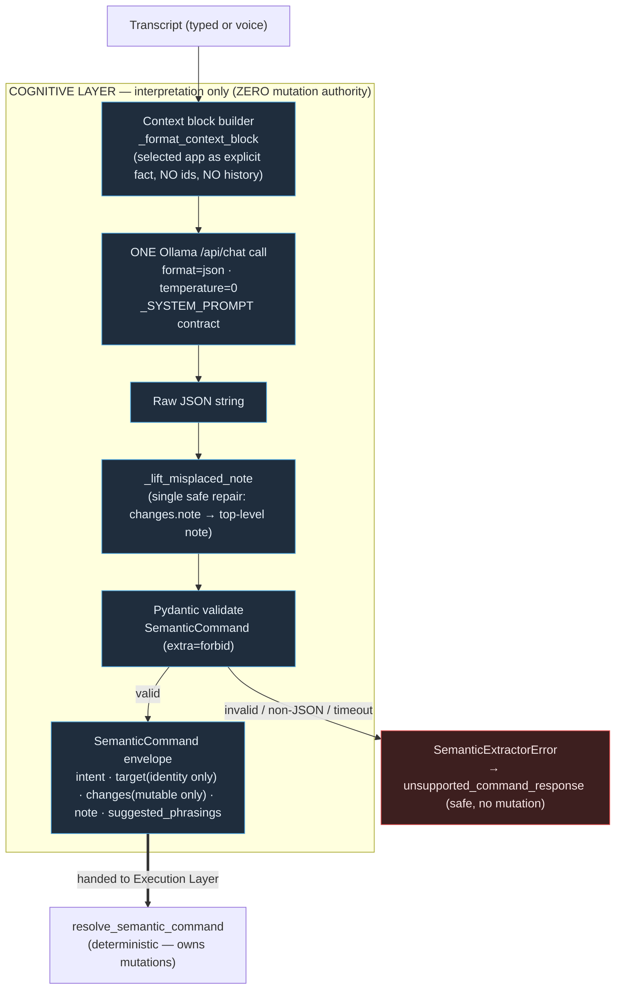
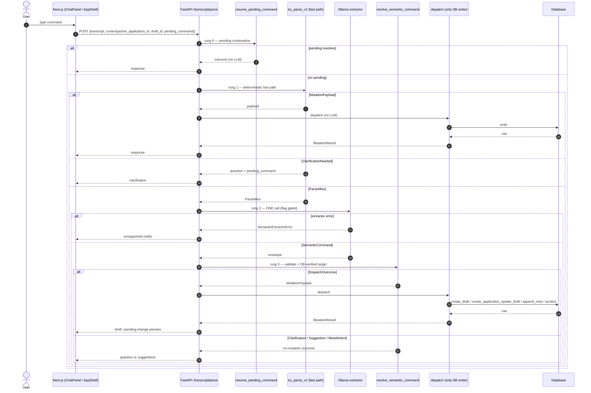
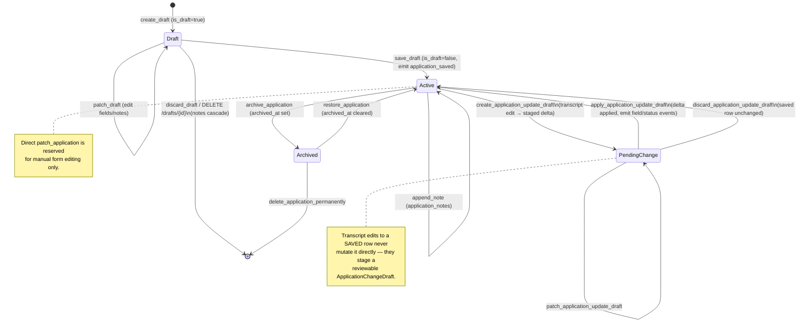
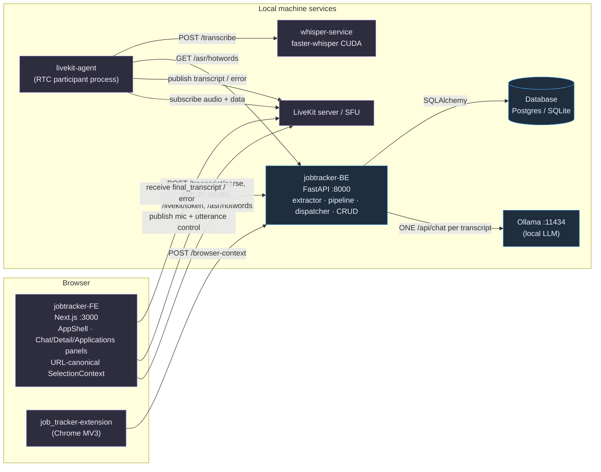

# Architecture Diagrams — `job_tracker`

Mermaid-only. Each diagram reflects **real** dependencies and behavior in the repo, not a generic "frontend → backend → db" sketch. Companion prose: `runtime_flows.md`, `system_design_deep_dive.md`.

---

## 1. Cognitive Architecture (LLM reasoning layer)

How interpretation is isolated from mutation. The model produces understanding; everything downstream is deterministic backend authority.



---

## 2. Runtime Sequence Diagram (text flow)

The short-circuiting ladder of `POST /transcript/parse`, including the cheap rungs that never touch the model.



---

## 3. Voice Pipeline Deep Flow

Browser mic to transcript, with the utterance gate, buffering, serialized Whisper call, and convergence back onto the text endpoint.

```mermaid
flowchart TD
    MIC["Browser mic"] -->|WebRTC Opus track| SFU["LiveKit SFU / room"]
    FE["VoiceButton (FE)"] -->|POST /livekit/token| BE1["Backend mints JWT"]
    FE -->|reliable data: utterance_start{uuid}| SFU
    FE -->|reliable data: utterance_end{uuid}| SFU
    SFU -->|track_subscribed (audio+mic only)| AG["livekit-agent (separate process)"]
    SFU -->|data_received| AG

    subgraph AG_INTERNAL["Agent — utterance gating & buffering"]
        GATE{"recording_gate_open?<br/>active_utterance_id match?"}
        BUF["AudioBuffer<br/>append 16-bit PCM frames<br/>(drops frames when gate closed)"]
        SNAP["snapshot_and_reset → BufferedUtterance.to_wav_bytes()"]
        LOCK["_transcription_lock<br/>(serialize: one utterance at a time)"]
    end

    AG --> GATE
    GATE -->|start: open gate, reset| BUF
    GATE -->|frame & open| BUF
    GATE -->|end & id match: close gate| SNAP
    GATE -->|duplicate start / stale end / no audio| WARN["structured warning<br/>(or transcription_error if no audio)"]
    SNAP --> LOCK

    LOCK -->|GET /asr/hotwords (best-effort)| BE2["Backend hotwords"]
    LOCK -->|POST /transcribe (WAV + hotwords)| WH["whisper-service<br/>faster-whisper CUDA<br/>(lazy locked model load)"]
    WH -->|transcript| OK["publish final_transcript{uuid,text}"]
    WH -->|timeout / 422 / down| ERRP["publish transcription_error{message}"]
    BE2 -. failure → proceed without hotwords .-> WH

    OK -->|reliable data → browser| FE2["FE copies text to command area"]
    FE2 ==>|explicit submit → SAME endpoint| TXT["POST /transcript/parse (see Diagram 2)"]

    classDef proc fill:#1f3d2d,stroke:#4adf8f,color:#e6faf0;
    classDef danger fill:#3d1f1f,stroke:#df4a4a,color:#fae6e6;
    class GATE,BUF,SNAP,LOCK proc;
    class WARN,ERRP danger;
```

---

## 4. State Machine (job application lifecycle)

Every state below is a real persisted condition (`is_draft`, `archived_at`, `ApplicationChangeDraft` existence) with a navigable UI surface. Transitions are labeled with the operation that performs them.



---

## 5. Component Dependency Graph (real dependencies)

Actual runtime/network dependencies between the four submodules, the extension, and external local services.



> **Note on coupling:** the agent depends on the backend *only* for hotwords (best-effort, non-fatal) and on the SFU + Whisper for its core job. The FE talks to the backend for all semantics and to the SFU for media. There is no direct FE↔agent or FE↔Whisper link — voice transcripts arrive via the SFU data channel. *[observed]*
