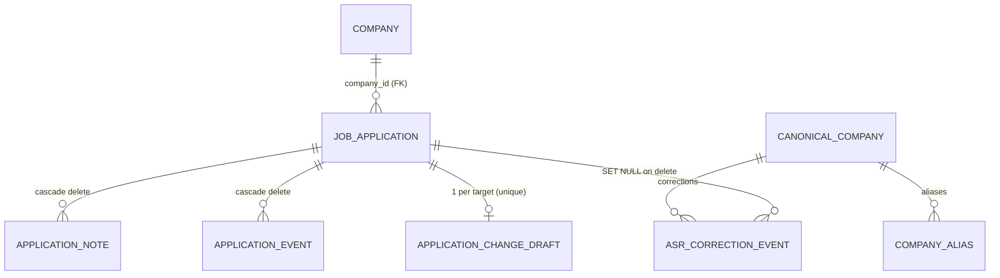

# Data Model — `job_tracker`

Grounded in `jobtracker-BE/app/models.py`, `public_schemas.py`, `semantic_command_schemas.py`, `constants.py`, and Alembic migrations `0001`–`0010`. Tags: **[observed in code]** / **[inferred]**.

---

## 1. Entity Overview



| Table | Role |
|---|---|
| `companies` | Canonical company entity; `normalized_name` unique. Applications FK to it. |
| `job_applications` | The core record. Carries lifecycle flags (`is_draft`, `archived_at`). |
| `application_change_drafts` | A *staged delta* (`changes_json`) for one saved application — the Pending-Change preview. One per target. |
| `application_notes` | First-class, immutable note prose. Cascade-deletes with parent. |
| `application_events` | Timeline (saved / field_changed / note_added / status_changed / archived / restored). |
| `canonical_companies` + `company_aliases` | ASR/alias normalization vocabulary. |
| `asr_company_correction_events` | Audit of voice company-name corrections. |
| `browser_context` | Latest captured tab URL/title from the Chrome extension. |

---

## 2. `JobApplication` Schema (the central entity)

`app/models.py` — `JobApplication` *[observed]*:

| Column | Type | Notes |
|---|---|---|
| `id` | int PK | |
| `company_id` | bigint FK → `companies.id` | required, indexed |
| `role` | str | **free-form**; never enum-validated |
| `normalized_role` | text | normalized for the uniqueness constraint |
| `employment_types_json` | JSON list | canonical values: `Internship` / `Full Time` / `Part Time` |
| `job_link` | str | |
| `location` | str | canonical: `remote` / `hybrid` / `on-site` |
| `status` | str | canonical: `in_touch` / `applied` / `accepted` / `rejected` |
| `current_stages_json` | JSON list | `Tailored` / `Applied` / `Networked` / `Engaged` / `COLD_MAIL` / `Followed up` |
| `priority` | str | `LOW` / `MEDIUM` / `HIGH` |
| `engaged_days` | int | ≥ 0 |
| `next_action` | str | user-controlled |
| `comments` | str | user-controlled |
| `is_draft` | bool | draft vs. saved application |
| `draft_created_at` | datetime? | |
| `archived_at` | datetime? | null = active; set = archived |
| `created_at` / `updated_at` | datetime | |

**Constraint:** `uq_job_applications_company_role (company_id, normalized_role)` — one application per (company, role). *[observed]* `company` is a read-only property returning `company_rel.name`. *[observed]*

### Public DTO (`PublicApplicationDTO`)
The API exposes a flattened, scalar-role DTO (no `*_json` suffixes — that legacy contract was retired in migration `0007`): `company` (string), `role` (scalar string), `employment_types`/`current_stages` (lists), `location`, `status`, `priority`, `engaged_days`, `next_action`, `comments`, `is_draft`, `archived_at`, timestamps. `created_at`/`updated_at` are nullable **only** for an unpersisted preview draft (no DB row yet). *[observed: `public_schemas.py`]*

---

## 3. User / Session Model

There is **no user or auth model** in the schema — this is a **single-user, local-first** application. *[observed: no user table in `models.py`]* "Session" state is **not** persisted server-side; instead:

- **Selection state** lives in the URL route (`/applications/[id]`, `/drafts/[id]`) and is mirrored into a client-side `SelectionContext`. The URL is the canonical identity; context is derived. *[observed: `AppShell.tsx`, `SelectionContext.tsx`]*
- **Conversational state** is stateless at the model; the only carried state between turns is the `pending_command` echoed by the frontend for clarification continuation. *[observed: `PendingCommand` in `public_schemas.py`]*
- The LiveKit room/identity is the only ephemeral "session" — minted per voice activation via `POST /livekit/token`. *[observed]*

```jsonc
// pending_command — the entire cross-turn state the system carries
{
  "operation": "update_application",
  "target":   { "company": "Neilsoft", "role": null, "application_id": null },
  "changes":  { "priority": "MEDIUM" },
  "note":     null,
  "missing_field": "role"      // what the clarification asked for
}
```

---

## 4. State Transitions

The lifecycle and the operation performing each transition (full diagram in `architecture_diagrams.md §4`):

```
(new) ──create_draft──▶ Draft ──save_draft──▶ Active ──archive_application──▶ Archived
          │ patch_draft ↺          │                                   │ restore_application
          │ discard_draft → ✗       │ append_note ↺                     ▼
                                    │ patch_application ↺ (manual)   delete_application_permanently → ✗
                                    │
                                    └─create_application_update_draft──▶ PendingChange
                                          apply_application_update_draft ──▶ Active (delta applied + events)
                                          discard_application_update_draft ─▶ Active (unchanged)
```

**Invariant:** a transcript-driven edit to a saved row **always** goes through `PendingChange` (`create_application_update_draft`), never a direct write. Direct `patch_application` is reserved for the manual edit form. *[observed: `_resolve_update_target`, dispatcher]*

`TranscriptStatus` enumerates every response state the FE renders: `draft_created`, `draft_updated`, `saved`, `discarded`, `updated`, `clarification`, `no_change`, `error`, `pending_changes_created/updated`, `changes_applied/discarded`, `note_added`, `application_archived/restored`, `context_updated`, `unsupported`. *[observed]*

---

## 5. Validation Rules

| Field | Rule | Source |
|---|---|---|
| `role` | any non-blank string accepted; never rejected | `constants.py` comment, `_SYSTEM_PROMPT` |
| `status` | must normalize to `in_touch`/`applied`/`accepted`/`rejected` (aliases: `declined`→`rejected`, `selected`→`accepted`, …) | `normalize_status_value` |
| `priority` | `low/medium/high` → `LOW/MEDIUM/HIGH` | `normalize_priority_value` |
| `location_mode` | `wfh`/`work from home`/`remote`→`remote`; `onsite`/`on site`→`on-site`; `hybrid` | `normalize_location_value` |
| `employment_types[]` | `intern`→`Internship`, `fulltime`→`Full Time`, … | `normalize_employment_type_value` |
| `current_stages[]` | case/separator-insensitive match to the six canonical stages | `normalize_current_stage_value` |
| `engaged_days` | int ≥ 0 | pipeline |
| `company`/`role` in `changes` | **forbidden** — identity never travels in `changes` | `SemanticChanges` `extra="forbid"` |
| Extractor envelope | unknown keys reject the whole command | `SemanticCommand` `extra="forbid"` |
| Alias tables | every alias must map to a canonical enum value | import-time `assert` guards in `constants.py` |

**Atomicity:** if *any* `changes` field is invalid, the entire command is downgraded to a suggestion — no partial application. *[observed: `_normalize_and_validate_changes` + handlers]*

---

## 6. Example JSON Objects

### 6.1 Extractor output (`SemanticCommand`) — interpretation, no authority
```jsonc
{
  "intent": "create_application",
  "target":  { "company": "Aiden AI", "role": "AI Engineer", "application_id": null },
  "changes": { "status": "applied", "priority": "HIGH", "location_mode": "on-site",
               "employment_types": ["Full Time"], "current_stages": null,
               "job_link": null, "engaged_days": null, "next_action": null, "comments": null },
  "note": null,
  "clarification": null,
  "suggested_phrasings": null
}
```

### 6.2 Transcript response — new draft created
```jsonc
{
  "status": "draft_created",
  "message": "Draft created for Aiden AI — AI Engineer.",
  "draft_id": "41",
  "draft": {
    "id": 41, "company": "Aiden AI", "role": "AI Engineer",
    "employment_types": ["Full Time"], "location": "on-site", "status": "applied",
    "current_stages": [], "priority": "HIGH", "engaged_days": 0,
    "next_action": "", "comments": "", "is_draft": true,
    "archived_at": null, "created_at": "2026-06-13T10:00:00Z", "updated_at": "2026-06-13T10:00:00Z"
  },
  "warnings": [], "suggested_phrasings": []
}
```

### 6.3 Transcript response — collision (recovery actions)
```jsonc
{
  "status": "no_change",
  "message": "An application for Aiden AI — AI Engineer already exists.",
  "collision": { "kind": "draft", "draft_id": 33, "application_id": null,
                 "company": "Aiden AI", "role": "AI Engineer", "archived": false }
}
```

### 6.4 Transcript response — clarification (carries pending_command)
```jsonc
{
  "status": "clarification",
  "message": "Which role at Neilsoft should I update? (AI Engineer, Data Scientist)",
  "clarification_question": "Which role at Neilsoft should I update? (AI Engineer, Data Scientist)",
  "pending_command": {
    "operation": "update_application",
    "target": { "company": "Neilsoft", "role": null, "application_id": null },
    "changes": { "priority": "MEDIUM" },
    "missing_field": "role"
  }
}
```

### 6.5 Pending change (`PublicApplicationChangeDraftDTO`) — staged delta on a saved row
```jsonc
{
  "id": 7, "kind": "update", "target_application_id": 29,
  "original": { "id": 29, "company": "Neilsoft", "role": "AI Engineer", "priority": "LOW", "...": "..." },
  "preview":  { "id": 29, "company": "Neilsoft", "role": "AI Engineer", "priority": "HIGH", "...": "..." },
  "changed_fields": ["priority"],
  "created_at": "2026-06-13T10:05:00Z", "updated_at": "2026-06-13T10:05:00Z"
}
```
